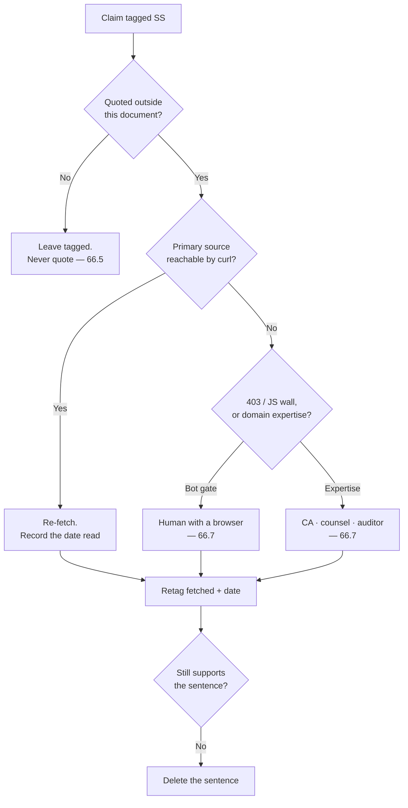

## 66. What we still do not know

### 66.1 The count, measured here

| Measurement | Value | How |
|---|---|---|
| Document size | **5,092 lines · 100,114 words** | `wc -lw` [measured] |
| `[SS…]` tags, whole file | **81** | `grep -o '\[SS[^]]*\]'` [measured] |
| — in the body, lines 1–4898 | **64** | [measured] |
| — inside §55 itself, lines 4899–4963 | 15 | [measured] |
| — after §56 (§58 row, closing line) | 2 | [measured] |
| Body tags that are *references to the tag*, not claims | 6 | lines 80, 100, 955, 1192, 1347, 4676 [measured] |
| **Claim-bearing `[SS]` tags** | **58** | 64 − 6 = 58 [derived] |
| Tag variants beyond bare `[SS]` | 8 | `[SS/fetched]` · `[SS, vendor-sourced]` · `[SS, unverified]` ×2 · `[SS, August 2026]` · `[SS 2026-08-29]` · `[SS — must not be published as fact]` · `[SS — the CBIC notification page was not opened…]` [measured] |
| Full live census | `[fetched]` 874 · `[measured]` 465 · `[derived]` 198 · `[inference]` 144 · `[SS]` 81 | [measured] |

All 58 claim-bearing tags were read and classified; no sampling was necessary [measured].

**This document gives three different answers for its own `[SS]` count — §55 says 52, §58 says 47, and the file contains 58 — and none of the three is the one a reader would arrive at.** Deltas: 58 − 52 = 6, 58 − 47 = 11 [derived].

The 52 is traceable. §55's opening census — `[fetched]` 86 · `[SS]` 52 · `[measured]` 50 · `[derived]` 9 · `[inference]` 1 — is the census recorded at `docs/research/agent-reports-2026-08-29-r11/c1-research-gap-audit.md` line 8, which measured a PRD of **1,551 lines / 20,174 words** [measured]. This document is **3.28× the lines and 4.96× the words** of the one that census describes [derived: 5,092 ÷ 1,551; 100,114 ÷ 20,174]. The row was inherited, not re-derived — the exact failure §41 and §57 exist to prevent.

---

### 66.2 The existing register describes a document that no longer exists

| §55 claim | Status in the v2 body (lines 1–4898) | Evidence |
|---|---|---|
| §55.2 #1 Princeton GEO "25–40% visibility lift" | **Absent.** `Princeton` = 0 hits | [measured] |
| §55.2 #9 "Perplexity Pro free via Airtel to ~400M, worth ₹17,000/yr" | **Absent.** `400M` = 0, `17,000` = 0 | [measured] |
| §55.2 #11 Dataview "~30s past 3,000 notes" | **Absent.** `3,000 notes` = 0 | [measured] |
| §55.2 #12 r/ObsidianMD ~344,000 / Discord ~195,000 | **Live and still untagged**, §26 line 2519 | [measured] |
| §55.3 "never researched": accessibility, DR, sync, API, roles, i18n, desktop, analytics | **Mostly closed by R12.** `RPO` 35 · `RTO` 24 · `WCAG` 22 · `rate limit` 9 · `PostHog` 5 · `takedown` 4 · `moderation` 4 · `screen reader` 3 · `service worker` 2 · `privacy policy` 2 · `schema version` 1 | [measured] |

The register is stale in both directions: it warns about three claims that were deleted and under-counts the live ones by six, while its "never researched" list names fourteen areas that now carry their own sections. Treat §55 as a historical artefact of PRD v1.1 and this section as the live one.

- **Anti-recommendation:** do not delete §55. It is the record of what was true on 2026-08-29 and deleting it destroys the audit trail that makes this drift visible. Mark it superseded, keep it, and point §55's header at §66.

---

### 66.3 The closure ladder

The ladder's only non-obvious rung is the last one. A claim that survives re-fetching may still fail to support the sentence it was written into — the Pimentel notebook figure carries a specific reproducibility definition, and the sentence in §5 does not state which one [inference].

---

### 66.4 Load-bearing, ranked by risk if wrong

Rank = (money or legal exposure) × (irreversibility) × (would be quoted). Costs are [inference] unless tagged otherwise.

| # | Claim | § | Why it matters | What would close it | Cost | Risk if wrong |
|---|---|---|---|---|---|---|
| 1 | Export-of-services zero-rating · LUT vs pay-and-refund · "convertible foreign exchange" · reverse charge on imported services (LLM APIs, hosting, MoR fees) | §51.2, L4756–4758 | Decides whether every export invoice is zero-rated or carries IGST. `cbic-gst.gov.in` **failed TLS and 404'd on every IGST-Act path** [measured] | A chartered accountant's written opinion **with the MoR contract in front of them** | ₹15,000–₹50,000 + one meeting | Retrospective IGST + interest + penalty on every invoice since the first. It also changes the MoR choice, which §53 makes a hard gate before the first paid signup |
| 2 | E-invoicing threshold AATO > ₹5 crore, sticky across FYs · ₹20 lakh services registration threshold · FEMA/EDPMS closure and FIRC/BRC per remittance | §45, L4287 · L4314 · L4293 | §45 derives the crossing at ₹5,000/customer/year ≈ ₹417/month [derived]. The CBIC notification page was never opened | Same CA engagement; ask for it in the same sitting | Included above | Missed e-invoicing is a penalty regime, not a correction. Missed EDPMS closure blocks future inward remittance |
| 3 | India IT Rules 2021: the "50 lakh" significant-social-media-intermediary threshold | §44, L4119 | The Rules defer to a Central Government notification that **is not in the Rules** (Rule 2(1)(v)) [fetched]. Whether a one-to-many publishing tool is a "social media intermediary" at all is [inference] | Indian counsel, one written note covering Rule 2(1)(v), 2(1)(w) and the 24-hour acknowledgement duty | ₹40,000–₹1,20,000 (itself `[SS, unverified]`, §44 L4194) | D15 ships publish either under obligations that do not apply, or without ones that do |
| 4 | EU Art. 13 representative €200–€500/month · Indian counsel ₹40,000–₹1,20,000 | §44, L4194 | §53 makes the EU representative a **date-gate before the first EU free signup**, not an effort-gate | Two written quotes | One week of email; free | A recurring cost line that gates launch, budgeted from a search summary |
| 5 | "International gateways without UPI lose 30–40% of Indian checkouts" `[SS, vendor-sourced]` | §24, L2441 | Chooses Razorpay over Paddle / Lemon Squeezy. §53: migrating billing counterparties mid-flight **breaks the FEMA paper trail** | Razorpay's or NPCI's own published funnel data; failing that, decide the rail on the FEMA/MoR question and demote this to a prior | 1 hour | An irreversible rail chosen on a vendor's own marketing number |
| 6 | "By month 24 the median solo B2B founder's revenue is more than 4× the median solo B2C founder's" | §21, L2221 | The two-motion strategy — D2C acquisition, B2B monetisation — rests on this one sentence. **No study is named** | Name the study and its n, or delete the sentence and keep the reasoning | 20 minutes, or free | The first investor or HN commenter asks for the source and there is none |
| 7 | "21.9M India GitHub contributors, +5.2M in a year, +35% YoY consumer app spend" | §24, L2439 | Underwrites India-first distribution and the ₹299 anchor — against §24's own [derived] finding that ₹299 needs **59.5% more paying humans** than $5 for identical revenue | GitHub Octoverse, one page | 20 minutes | The single most checkable number in the document, in the section where being wrong costs the most |
| 8 | "Zero category-specific willingness-to-pay evidence for markdown tools in India" · "India's markdown community is greenfield" · moat #1 "does not exist yet" | §24 L2439 · §24 L2339 · §27 L2546 | Three absence claims from one source. They rank the moats and sequence the market | An absence claim cannot be closed by searching. State the searches run, the date, and the languages — bound it instead of asserting it | 1 hour | Highest social blowback per word: one reply from someone who runs the thing you said does not exist |
| 9 | Support deflection "18% median, 40–60% with AI, $25–35/ticket" | §21, L2227 | Prices ICP #3 at $99–249 per knowledge base | Open Zendesk's, Intercom's and Document360's own published benchmarks | 1–2 hours | Goes into B2B collateral aimed at three vendors who publish their own, different numbers |
| 10 | "Vanta and Drata charge $7,000–$30,000/yr for continuous audit trails" | §21, L2235 | The ROI headline of the audit-trail wedge | Two pricing pages | 15 minutes | Two named vendors' prices, misquoted in a sales deck |
| 11 | Code-signing: hardware-token surcharge +50–150 USD, DigiCert token +120 · max validity drops to **460 days from 2026-03-01** · DigiCert stops 2- and 3-year code-signing certs **from Feb 2026** | §39, L3734 · L3749 | §39 already records that all Windows cert prices are reseller quotes and SSL.com's product pages **404'd through curl** [measured]. If the two deadlines are real, multi-year prepayment is no longer a lever | A CA's own pricing page plus the CA/Browser Forum ballot record | 1 hour | Budgeting a cost lever that has already expired |
| 12 | "561 of 3,220 HN comments" — sync silently destroys data | §2 #2, L174 | Problem #2, the headline pain, and the justification for T0 being the first customer-visible lane. The cell carries **`[SS]` and `[fetched]` simultaneously** [measured] | Resolve to one tag; publish the query, the date window and the classifier | 2 hours | The product's stated reason to exist is tagged two ways in one table cell |
| 13 | CommonMark "0.31.2, released 2024-01-28; still the current release as of 2026-08" | §8, L445 | The spec floor the entire substrate is defined against | `commonmark.org`, one fetch | 5 minutes | Building the floor against a superseded version |
| 14 | "Under 4% of GitHub notebooks reproduce" (Pimentel 2019) | §2 #5 and §5 (3 body occurrences) | §5's survivors-and-traps table — the projection law's clearest external evidence | Open the paper; quote its reproducibility definition alongside the figure | 30 minutes | LR#72's exact class: a specific figure, a specific paper, a specific definition, never opened |
| 15 | "OpenAI **removed** Canvas in May 2026" | §3.1, L205 | §3.3's structural hedge against chat-to-artifact rests on it | OpenAI's changelog or release notes | 15 minutes | A falsifiable claim about a named company carrying a structural argument |
| 16 | "Notion cut free AI to 20 responses *for life* and raised Business ~20%; Microsoft's +43% Copilot bundling drew a CMA probe" | §2 #8, L180 | §24.8's pricing-promise section | Notion's pricing page and the CMA case page | 30 minutes | Names a regulator and two competitors' pricing, inside a section whose argument is that *they* misstate things |
| 17 | "Relay proved the path with 172,544 downloads of a commercial service's bridge plugin" | §26, L2525 | The "Open in frontmatter" plugin is named the **primary distribution play** | Obsidian's community-plugin stats JSON | 10 minutes | The distribution thesis rests on one competitor's download count |
| 18 | "GitBook's dominant complaint cluster is reliability and lost work — the gap is real today" | §27, L2547 | Moat #2's only fresh external evidence that the 18–36-month window is real | GitBook's public issue tracker and community, with counts and a date window | 2 hours | The moat duration argument loses its evidence and keeps its number |
| 19 | ADA Title III "no technical standard promulgated" · axe "covers roughly a third of WCAG issues" | §35, L3339 · L3414 | A US legal posture and the (correct) anti-recommendation against an axe CI threshold | Counsel for the first; Deque's own published coverage claim for the second | 20 min + counsel time | A legal posture stated as fact in a procurement conversation |
| 20 | `blocksToMarkdownLossy()` "is a real API name" | §6 L111, §6.2 L328 | Principle #3's entire published justification — "the market's own confession" | **Nothing.** §36 line 3463 already tags the identical fact `[fetched]`. Retag | 5 minutes | Publishing the flagship line under `[SS]` when the fetched evidence is three sections away |
| 21 | r/ObsidianMD ~344,000 / Discord ~195,000 — **untagged** | §26, L2519 | Channel sizing for the whole GTM plan | Read the subreddit header and the Discord landing page | 5 minutes | An untagged number reads as measured, which is worse than an honest `[SS]` |

- **Recommendation:** close rows 13, 15, 16, 17, 20 and 21 first. Six rows, under two hours, no professional required, and they remove the six most publicly checkable exposures.
- **Anti-recommendation:** do not close rows 1–4 by reading more. Tax and intermediary law is not a research problem with a better search query; the primary hosts already refused, and an agent's confident summary of a paywalled clause is exactly the artefact §51 exists to forbid.

---

### 66.5 Decorative — may stay unverified, may never be quoted

Each of these can be deleted without changing a single decision. Keep them as texture; never move them into a slide, a landing page, or an investor answer.

- org-mode's agenda "running since 2003, computed on the fly from date tags" (§5) — illustrative; the projection law does not depend on it.
- Obsidian Bases: "the `.base` file saves only how you want to look" (§5) — a contrast, not evidence.
- "Notion formulas cannot aggregate across rows" (§2 #5, §5, twice) — colour on a point Coda's export already carries.
- "Coda's export loses formulas, buttons, canvas properties" (§5) — same point, second vendor.
- "Notion users write ad-blocker rules against AI buttons" (§6.2) — an anecdote decorating an already-settled non-goal.
- "VS Code's own wiki names extensions the #1 performance suspect; Typora's most-requested feature has 251 votes" (§6.2) — the no-marketplace decision is settled on blast radius, not on these.
- "Granola: $1.5B valuation on template-typed capture" (§12) — a valuation is not evidence that typing at capture works.
- "Litmus at $500/mo proves the testing layer monetises" (§3) — supports an argument, not a plan.
- Lex's review loop "in development" (§3) — a competitor's roadmap; the same row's other two cells are `[fetched]`.
- "Writing editors have nothing" for byte-anchored provenance (§3) — keep as reasoning; §58 already narrows the publishable form.
- "The view IS the data; export lossy by architecture" (§3) — a category summary; the load-bearing instance is row 20 above.
- "Provenance evaporates at accept" for Cursor / Windsurf / Lex / Grammarly (§3, §2 #4) — one instance is enough and it is already triaged.
- Prince and Typst footnote support and repeating table headers (§9, two cells) — our own column is `[measured]`; theirs is decoration.
- "No PRD standard exists; the circulating SRS clause list is `[SS]` from a secondary encyclopedia page" (§14) — already fenced by §14's own refusal to publish a clause list.
- The ACM row (§42.2) — already labelled "do not cite as verified". Correct as written.
- Failed-payment recovery, 47.6% vs 12.7% (§45) — already fenced with "do not set a target from either". Correct as written.
- "No primary source for a competitor's activation threshold was opened" (§47) and "no invite-to-activation figure was reachable" (§37) — self-cancelling tags. Correct as written; these are the model.
- ₹95.4/USD (§36) — superseded by §57's live ₹95.39 / ₹95.59 [measured]. Retag or delete, do not re-verify.
- DPDP Gazette number G.S.R. 846(E) (§47) — the date (14 Nov 2025) is `[fetched, PIB]`; the number is decoration on top of it. Open the Gazette or drop the number.
- Cowlishaw's 1977 STET editor and *Stet* public-commenting software (§52) — historical colour. The collision that actually decides the name is `elberacasa/stet` shipping `stetmark` on 2026-08-05 at 5,753 dl/mo, and that is `[measured]`.

---

### 66.6 Researched by nobody

R12's fourteen agents closed most of §55.3. What remains at or near zero in this document [measured, word-boundary counts over 100,114 words]:

| Gap | Evidence | Consequence |
|---|---|---|
| **SEO for published pages** | `open graph` 0 · `meta tag` 0 · `robots.txt` 0 · `Core Web Vitals` 0 · `sitemap` 1 | Publish is half the Power tier and its discoverability surface is undesigned |
| **Transactional email and deliverability** | `SPF` 0 · `DKIM` 0 · `unsubscribe` 0 · `transactional email` 0 · `DMARC` 1 (and that hit is GitLab's backup-alarm postmortem, not our sender config) | The review surface and the conflict inbox are inert without notification; §32's own dead-man switch depends on mail arriving |
| **Browser consent surface** | `cookie` 0 · `cookie banner` 0 (`consent` 10 hits are DPDP-side) | §47's funnel is unobservable without a lawful basis stated in a banner |
| **Platform AI-disclosure norms** | §55.1: the YouTube help page returned 1,420,253 bytes of navigation chrome and no policy body | §42 cannot state what any platform requires of published AI-assisted content |
| **PRC 强制性国家标准 label syntax** | Not opened | The exact mandated text-label form is unknown; §42 must not assert one |
| **Digital Omnibus effective date** | The amending act URL returned a 404 page | The 2 Aug vs 2 Dec 2027 disagreement in §42.1 stands unresolved |

- **Anti-recommendation:** do not open a research round for these. Five of the six are configuration decisions a builder makes in an afternoon once a surface exists; only the last three need a source, and two of those need a human (§66.7).

---

### 66.7 What only a human can close

| # | Need | Why no agent closes it | Gate |
|---|---|---|---|
| 1 | **Bot-gated: ACM publications policy** | HTTP 403 to an agent, 200 to a browser [PRD §55.1] | Before §42.2's ACM row is repeated to any academic customer |
| 2 | **Bot-gated: OpenAI classifier-withdrawal post** | HTTP 403 **plus a JS wall** [PRD §55.1] | Before any claim about detector retirement appears anywhere |
| 3 | **The visual design pass — never run** | §7.4's defect is read out of `src/app/globals.css`, not seen on a screen. Browser verification was **BLOCKED**: the Next 16 + Turbopack dev server reproducibly crashed compiling the heavy workspace route across 4+ attempts over 2 sessions [measured, project memory via `research/frontmatter-raw-corpus.json`]. In the r7 naming session both WebFetch and the browser pane were session-gate-refused [measured, `agent-reports-2026-08-29-r7/x4-external-frontier-importer-naming.md:133`] | **R0.10 cannot be marked done without it.** A shipped `--accent: #18181b` with 6/8/12px radii, and a `body-faint` token failing AA, have never been looked at |
| 4 | **GST position** — export test, LUT vs pay-and-refund, convertible-foreign-exchange, reverse charge, e-invoicing, EDPMS | Chartered accountant, with the MoR contract | Before the first paid invoice (§53) |
| 5 | **DPDP + IT Rules 2021** — data-fiduciary duties, SSMI threshold, grievance officer, 24-hour acknowledgement, DMCA agent | Indian counsel + a US agent of record | Before one-toggle publish reaches the public internet |
| 6 | **Trademark clearance** | USPTO TESS, EUIPO, IP India/TMR, WIPO Madrid, unregistered common-law rights — **UNCHECKED and not checkable here** (§52.4). Handle availability is a different question in kind | Before any spend on domains, logo or launch copy, and before choosing between a qualified "frontmatter" and a coinage |
| 7 | **Domain availability, all of §52** | No registrar or RDAP host is in the sandbox allowlist — **every domain in §52 is UNCHECKED** (§55.1) | Re-run on the day of registration; nothing reserves them |
| 8 | **WCAG 2.2 AA conformance + ACR/VPAT** | Accessibility auditor | Before any B2B procurement conversation |
| 9 | **Whether an EU AI Act obligation is discharged** | The customer's own counsel. A solo founder in India must never be the party asserting EU compliance (§42.6) | Before any EU compliance language ships |
| 10 | **PRC labelling conformance** | A PRC-qualified adviser who can read the incorporated standard | Before any China-facing export claim |
| 11 | **Independent adversarial review of the engine's own verifiers** | A reviewer who did not write them — LR#60 | Before the corpus gate is cited as proof of anything |
| 12 | **The M3 two-device run** | §28.5 already assigns it to the founder: "watched by a human, recorded" | M3 |
| 13 | **D5, the two unrotated PATs** | §54: "Only you. Today" | Today |
| 14 | **Whether a stranger will pay** | §66.8 | — |

The distinction in rows 1–2 versus row 7 matters because the fixes differ: a bot gate needs a human with a browser and five minutes; the registrar block needs network access the agent does not have and cannot request. Rows 4, 5, 8, 9 and 10 need a person who carries professional liability for the answer, which is the only real reason to pay for one.

---

### 66.8 The single most dangerous unverified assumption

**That anyone outside this building will pay for byte-fidelity.**

| Test | Result |
|---|---|
| `interview` in 100,114 words | **1** — and it is Ink & Switch's Upwelling interviewees from March 2023, other people's research (§34, L3274) [measured] |
| `interviews` · `design partner` · `waitlist` · `beta tester` · `pre-order` · `landing page` · `user test` · `focus group` · `willingness to pay` | **0 each** [measured] |
| `customer discovery` · `design partner`, across all 105 reports and 374,866 words | **0 each** [measured] |
| Where a paying non-founder first appears in the plan | **M7**, the final gate: "M0–M6 green + MoR live + EU rep appointed + ToS published + one paying non-founder account" (§28.4) |
| M7 calendar date | **2027-04-28**, a Wednesday — **241 days from today** [measured: `date`; derived] |

Everything else in this register is a number that might be wrong. This one is a number that does not exist. The document contains 105 reports, seven markdown engines, 8,513 pinned third-party files, a foreign-corpus gate, a degradation certificate, three merchant-of-record analyses, an Indian tax position and an EU representative — and not one conversation with a person who might hand over ₹299. Section 24 argues at length about ₹299 versus $5 and derives that the rupee price needs 59.5% more paying humans for identical revenue [derived]. Both figures assume a numerator nobody has observed.

**Cost of being wrong:** 241 days of solo build to 2027-04-28, plus the R0 lane that §53 calls "a multi-month lane before any customer-visible feature", plus the non-recoverable spend the plan front-loads by design — the MoR before the first paid signup, the EU Art. 27 representative before the first EU *free* signup, the CA, the lawyer, the trademark attorney, the accessibility auditor. The sequencing in §53 is correct for a product with demand and is the most expensive possible ordering for one without it: every irreversible commitment lands *before* the first signal.

- **Recommendation:** put one falsifiable demand test in front of R0, not after M6. The cheapest form consistent with §58's publication ban is a page that shows the *refusal contract* — "here is what this tool will refuse to do to your file, and why" — with a paid-waitlist button, no fidelity percentage, no engine number, nothing tagged `[SS]`. That is publishable today under §58's own rules, because it markets a behaviour rather than a measurement.
- **Anti-recommendation:** do not build the demand test into the product, and do not let it reorder R0. NF-1, NF-3 and CI are correctness work that must happen regardless of what the test says, and §28.3 already puts R0.5 in the first 48 hours. A landing page that delays the engine has converted one unverified assumption into two.
- **What would falsify the recommendation:** if fewer than 20 people leave an email against the refusal-contract page in 30 days, the answer is not "market harder" — it is that the wedge is wrong and §21's two-motion strategy needs rewriting before month four, not month nine. If the test cannot be run without publishing a fidelity number, do not run it; §58's ban outranks this section.
