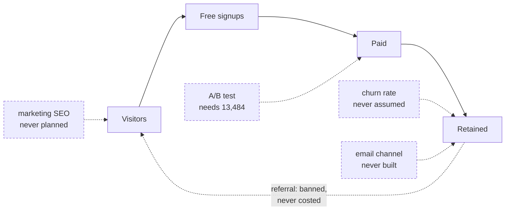

## 2. What is still unresearched

The corpus is **105 agent reports across 13 rounds**, plus 16 PRD section drafts and 5 standing analyses — 126 `.md` files under `docs/research/` `[measured 2026-08-30: agent-reports-2026-08-28 35 · -r7 16 · -r8to10 29 · -r11 11 · -r12 14]`. Round 11's `c1-research-gap-audit.md` named 15 build-blocking gaps; Round 12's `k1`–`k14` closed fourteen of them. The one it did not close is gap #9, email and notifications `[measured: no `k` report covers it; PRD hits — `SPF` 0, `DKIM` 0, `DMARC` 1 (a GitLab DR anecdote), `transactional email` 0, `lifecycle email` 0]`. Everything below was found by grepping the PRD and the corpus for the vocabulary a topic cannot be discussed without, then reading the hits.

### 2.1 Coverage table

Status is assigned against the standard the corpus sets for itself elsewhere: a topic is COVERED when a named report or PRD section reaches a decision with dated primary sources and an anti-recommendation.

| # | Topic | Status | What exists | What is absent |
|---|---|---|---|---|
| 1 | Positioning, category naming | COVERED | §52, `e6`, `r4` | — |
| 2 | Launch channels | COVERED | §26, two funnels, channel-discipline rule | — |
| 3 | Content strategy **beyond launch** | PARTIAL | `i1`, `x1` describe the content *engine*; §26 sets cadence | No editorial map past week 8; no evergreen/pillar plan; no content→signup attribution. §26's own `[measured]` admission: two posts have ever shipped |
| 4 | SEO — **marketing site** | MISSING | `SEO` 4 hits in PRD, all naming-risk or AEO `[measured]` | No keyword map. Compounded by §27: `gray-matter` alone does 35.78M npm downloads/month `[fetched, per PRD]`, so the brand term is the substrate's generic name |
| 5 | SEO — published pages | MISSING | Named in §55.3 as never researched `[fetched]` | Sitemap, canonical, OG tags, custom-domain indexing policy. r11 ranked it #14 and R12 did not take it |
| 6 | AEO / GEO | PARTIAL | §13 L4 | Rests on the Princeton "25–40%" figure, `[SS]`, ranked the #1 public-embarrassment risk in §55.2 |
| 7 | Referral mechanics | MISSING | 1 hit in PRD, 2 files in corpus — both the ban `[measured]` | "No referral loop" appears in a banned-patterns list beside streaks and XP. Never costed against the 1.26M-visitor requirement |
| 8 | Affiliate / creator program | MISSING | `affiliate` 0 hits, PRD and corpus `[measured]` | — |
| 9 | Partnerships and integrations | MISSING | `partnership` 0 hits in PRD, 2 files in corpus `[measured]` | The "Open in frontmatter" bridge plugin is the named distribution play and gets one paragraph. No integration surface beyond it |
| 10 | The plugin/extension ban | PARTIAL | §46.2 quantifies the *saving*: 22.79% of Obsidian-equivalent forum traffic `[derived from measured]` | The cost is never quantified. §27 ranks community/ecosystem as **moat #1**; Obsidian's ecosystem *is* its plugin ecosystem. That tension is unexamined |
| 11 | Community | COVERED | §49.4, `k13` | — |
| 12 | Price levels, FX, rails | COVERED | §24, `c4`, `k14` | — |
| 13 | Pricing **experimentation** | MISSING | §24.2 says "A/B ₹249 and ₹399"; §24.3 says "Test ₹299 against ₹399" `[fetched]` | `sample size` 0, `significance` 0 in PRD; `A/B test` 0 files in corpus `[measured]`. No power analysis, no exposure unit, no stopping rule |
| 14 | Pricing page as a conversion surface | MISSING | 24 corpus files mention competitors' pricing pages `[measured]` | Our own is never designed: no tier-comparison layout, no annual toggle default, no FAQ, no objection handling |
| 15 | Trial vs freemium | PARTIAL | §25.2's benchmark table gives free-trial 8–12% vs freemium 3–5% `[fetched]` | The harder-converting model was chosen; no decision record explains why, and no reverse-trial variant was considered |
| 16 | In-product messaging | MISSING | §17 bans weekly digest, What's-New modal, trial countdown `[fetched]` | With no email field and no in-app channel, there is **no route to tell a user about a breaking change, a price change, or a security incident** |
| 17 | Refunds, EU right of withdrawal | MISSING | `refund policy` 0, `right of withdrawal` 0 `[measured]` | Directive 2011/83/EU Art. 16(m) removes withdrawal for digital content only where performance began with prior express consent *and* acknowledged loss of the right `[fetched 2026-08-30, EUR-Lex CELEX:32011L0083]`. That is a checkout-flow requirement, not a policy page |
| 18 | Retention definition | COVERED | §47.3, return-with-a-file | — |
| 19 | **Churn rate and steady state** | MISSING | §25.3: "Zero churn assumed" `[fetched]` | Every milestone in the plan is a gross-additions figure. No monthly-churn assumption exists anywhere |
| 20 | Cancel, downgrade, win-back | MISSING | §46.3 promises self-serve cancel as a *deflector*; `win-back` 0 hits `[measured]` | No exit survey, no pause option, no reactivation path |
| 21 | Expansion revenue | MISSING | `expansion revenue` 0 files, `net revenue retention` 0 files `[measured]` | Seat growth inside 2–20-person teams is the only compounding revenue mechanic in the B2B lane |
| 22 | Email infrastructure and deliverability | MISSING | r11 gap #9, never closed `[measured]` | Gmail requires SPF+DKIM+DMARC alignment, spam rate < 0.30% in Postmaster Tools, and one-click unsubscribe on subscribed mail; the 5,000/day tier adds DMARC as mandatory `[fetched 2026-08-30, support.google.com/a/answer/81126]`. Invites (§37.4), dunning (§45.5) and DSA Art. 17 statements of reasons (§44.1) are all email-delivered |
| 23 | ICP definition | COVERED | §21, `c3` | — |
| 24 | Self-serve B2B **motion** | PARTIAL | `c3` picks the 2–20 band and refuses enterprise | No team signup flow, no seat-add billing, no team trial, no first-week-of-a-team activation definition |
| 25 | Enterprise procurement | COVERED-as-refusal | `c3`; §55.4 sets the ACR/VPAT gate before any procurement conversation | Deliberate. The gate is stated |
| 26 | Security questionnaires / SOC 2 | PARTIAL | Vanta/Drata "$7,000–$30,000/yr" `[SS]`, flagged in §55.2 #8 | No plan for answering a questionnaire without a SOC 2, which is the actual solo-founder path |
| 27 | Contracts — ToS, DPA, MSA, SLA | PARTIAL | §51 is an issue list for counsel | No template source, no cost, no sequencing against first paid signup |
| 28 | Support tooling and deflection | COVERED | §46, `r6` — deflection plan, hire trigger, tooling priced | — |
| 29 | Billing operations, India | COVERED | §45, `k14` — RBI framework read paragraph by paragraph | — |
| 30 | Accounting and bookkeeping | MISSING | `bookkeep` 0, `accounting` 0 in PRD `[measured]` | §45.10 buys CA *hours*; no ledger system, no revenue recognition for annual plans, no MoR-payout-to-books reconciliation design |
| 31 | Insurance and liability transfer | MISSING | `insurance` 1 hit, and it is RBI's carve-out list `[measured]` | No professional indemnity, no cyber liability, no tech E&O, against a DPDP s.8(5) ceiling of ₹250 crore `[fetched, per §51.1]` |
| 32 | Hiring and contractor management | PARTIAL | §46.5 prices the hire and derives the trigger `[derived]` | `contractor` 0 hits `[measured]`. No IP-assignment clause, no PF/ESI, no appointment letter, no access-revocation runbook |
| 33 | **Founder time budget, aggregate** | MISSING | §53 gives throughput; §46 gives 23.97 h; §45.10 gives 28.3 h | Nobody has added them up |
| 34 | FX exposure | MISSING | `FX risk` 0, `hedge` 6 hits all unrelated `[measured]` | Revenue is INR-denominated at fixed price points; Cloudflare, Anthropic, Help Scout, Apple and the MoR all bill USD |
| 35 | Model-vendor concentration | PARTIAL | §50.1 has a risk row; §23.3 prices six models `[fetched]` | No second-source runbook, no contractual terms review, no plan for a mid-quarter price move |
| 36 | App-store distribution tax | MISSING | `App Store` 6 hits, all competitor context `[measured]` | Apple takes 15% under $1M/yr proceeds via the Small Business Program, 30% above, and 10% on EU alternative terms after year one `[fetched 2026-08-30, developer.apple.com/app-store/small-business-program]`. On ₹299 that is ₹44.85 against a ₹193.55 contribution `[derived]` |
| 37 | Competitive war-game | MISSING | `competitive response` 0, `war-game` 0 `[measured]` | §27 lists what erodes each moat and stops there |
| 38 | PPP pricing beyond India | MISSING | `PPP` 0, `purchasing power` 0 `[measured]` | One India tier, one world tier. Brazil, Indonesia, Nigeria, Vietnam are priced as the US |

### 2.2 MISSING, ranked by what it costs to discover late

Ranked by (irreversibility of the retrofit) × (months of work already committed when the truth arrives).

| Rank | Gap | Cost of late discovery | Cost of answering now |
|---|---|---|---|
| 1 | **Churn** | At 5% monthly churn, holding 5,675 paid users requires 284 paid additions/month, 5,675 free signups/month, **63,056 visitors/month, forever** `[derived: N = a/c; a = 0.05 × 5,675; free = a ÷ 0.05 conv; visitors = free ÷ 0.09]` — within 0.01% of the PRD's *cumulative* visitor requirement for the ₹1L/mo milestone. Discovered at month 12, it invalidates §25.3 and the roadmap it justifies | One afternoon of derivation, plus a decision to lead with annual |
| 2 | Email infrastructure | A cold sending domain warms over weeks. Discovered the day invites, dunning or a DSA statement of reasons must go out, it is an outage | Resend is $0/mo to 3,000 emails/month at 100/day, $20/mo to 50,000, $90/mo to 100,000 `[fetched 2026-08-30, resend.com/pricing]`. DNS records cost nothing |
| 3 | Founder time, aggregate | Post-deflection support 23.97 h + billing-ops 28.3 h at 10,000 users = **52.27 h/month, 32.7% of a 160-hour month, before engineering, content or incidents** `[derived from §46.3 and §45.10]`. Pre-deflection it is 108.75 h, 68% `[derived]` | Arithmetic already done above |
| 4 | Pricing experimentation feasibility | Detecting ₹299 vs ₹399 at a 4%→5% conversion difference needs **6,742 exposures per arm, 13,484 total** at α=0.05, 80% power `[derived, two-proportion z-test]` — more than the entire free-signup base at the ₹1L/mo milestone (5,675). A quarter spent waiting for significance that cannot arrive | Decide by price-sensitivity interview and cohort switch instead; cost is admitting the test is impossible |
| 5 | Partnership surface | The bridge plugin is the distribution play and lives under someone else's rules: commercial plugins are permitted **with README disclosure** of payment, account, network use and server-side telemetry, but **client-side telemetry is banned outright** and the Obsidian trademark may not be used confusingly `[fetched 2026-08-30, docs.obsidian.md/Developer+policies]` | One read, now done. The consequence — the acquisition channel cannot instrument its own funnel — is a measurement-design input, not a launch-day surprise |
| 6 | Refunds and withdrawal | Sits in the checkout flow and the ToS, both written once and referenced by every payment | One clause, drafted before the first paid signup |
| 7 | Insurance | Cover is not retroactive. Both India sources probed refused: icicilombard.com **HTTP 403**, godigit.com **HTTP 404** `[measured 2026-08-30]` — this remains verification debt, not a finding | A broker conversation |
| 8 | Incident and breaking-change channel | §17's no-email-field decision and §38's "status page within 15 min" obligation are in direct conflict. Retrofitting an email field after promising there is none is a trust event | Decide now that operational mail is a separate, consented channel from marketing mail |
| 9 | Accounting and revenue recognition | Annual plans create deferred revenue in year one; correcting the books afterwards is a CA-billed cleanup | Engage the CA before 1,000 customers, as §45.10 already recommends |
| 10 | App-store tax | Decides whether the mobile lane is a PWA or a native app, which is an architecture decision | One arithmetic pass against §23.2 |
| 11–14 | Marketing-site SEO · competitive war-game · PPP tiers · affiliate and referral | Each costs months of misallocated content or pricing work, none is irreversible | Days each |

- **Do this:** answer #1, #3 and #4 with arithmetic this week — all three are derivations over numbers the PRD already contains, and none needs a customer.
- **Anti-recommendation:** do not research #11–#14 before R0 ships. They are real gaps and they are all reversible; committing engine weeks to them is the failure mode this audit could easily cause.

### 2.3 Where the corpus is thin rather than absent

§55.2 already ranks 21 unverified claims by public embarrassment, and that list stands. These are different: places where a decision rests on a single un-adversarial source, and the PRD does not flag it.

| Claim | Weakness | What it is load-bearing for |
|---|---|---|
| "Median solo B2B founder revenue >4× B2C by month 24" | `[SS]`, no named study `[fetched, §55.2 #7]` | The entire two-motion strategy |
| Support deflection 18% / 40–60% / $25–35 per ticket | `[SS]`, single source `[fetched, §55.2 #6]` | B2B pricing at $99–249 |
| Vendor AI-deflection rates 73–76% | All `[fetched]` and all vendor self-reported; §46.4 already halves them to 38% | The $94.60/mo support-stack decision |
| Obsidian forum tag histogram as our ticket-mix prior | `[measured]` on the right corpus, but it is a *forum topic* distribution standing in for a *support ticket* distribution, and §46.2 says so | The entire 80.45 h/month wall |
| Relay's "172,544 downloads" as bridge-plugin precedent | `[SS]` `[fetched, §26]` | The primary distribution play |
| Craft India pricing ₹526.7–658.3 | `[fetched]` but single-IP, single-moment geo-price `[fetched, r11 c1]` | The "₹299 leaves money on the table" argument |
| §21.1's 0.02/0.10 tickets per user-month | Assumption stated once, then quoted as a conclusion twice `[fetched, §55.2 #13]` | Every founder-hour figure, including #3 above |
| WPSD north-star | Single-author construct, no external precedent opened, and §47.2 argues against it in its own text | The measurement plan |

### 2.4 The three questions that waste the most months

| # | Question | Why it dominates | How to answer without building |
|---|---|---|---|
| **Q1** | Does anyone pay for fidelity? | §50.2 already names it as a 4×5 risk `[fetched]`. What is unresearched is the *test*. R0 is ~9 weeks `[fetched, §28]` and everything downstream assumes the answer is yes | A priced landing page with the corpus result and a real checkout, run against HN and r/ObsidianMD, before R0 finishes. Cost: days |
| **Q2** | What monthly churn does the model survive? | The plan's spine is gross additions with churn set to zero `[fetched, §25.3]`. At 3% the ₹20L/mo milestone needs 37,833 visitors/month in perpetuity; at 7%, 88,278 `[derived]` | Derivation, then a structural response: lead annual, price the Work licence hard (90.3% contribution, no monthly churn surface `[fetched, §23.2]`) |
| **Q3** | Is any acquisition channel one we control? | HN is a one-shot; the Obsidian plugin is governed by another company's policy and forbids client-side telemetry `[fetched 2026-08-30]`; the brand term is the substrate's generic name `[fetched, §27]`. If all three are borrowed, the 1.26M cumulative visitors never arrive `[fetched, §25.3]` | Read the policies (done), then build one owned surface — docs and published-page SEO — into R0's scope rather than after it |

**Answering Q1 wrong is the only one of the three that cannot be recovered by working harder.**

### 2.5 What was checked and found genuinely complete

This audit went looking for holes in the following and did not find ones worth reporting. Each was opened and read, not inferred from the table of contents.

| Area | Why it passes | Adversarial check applied |
|---|---|---|
| Sync engine (§31, `k2`) | Three independent disqualifications for CRDTs, a convergence oracle, and a named failure-mode list | Looked for the missing offline story: §31.4 has it, and r11's `service worker` 0-hit complaint is closed |
| Backup and DR (§32, `k1`) | Leads with the finding that inverts the standard recipe — R2 has no object versioning — and states what each layer does *not* cover | Looked for an untested restore: §32.4 is a drill, not a policy |
| Support economics (§46, `r6`) | Rebuilds the PRD's own 46.4-hour figure to 80.45 and says the flat 12-minute assumption was the error | Looked for vendor-claim laundering: §46.4 halves the vendor rates explicitly |
| India billing (§45, `k14`) | RBI framework read by paragraph; the ₹15,000 ceiling treated as an architectural constant, not a price input | Looked for a US retry ladder copied into the India path: §45.5 forbids it by name |
| Observability (§38, `k6`) | A denylist of what may never enter telemetry, and a "never alert on" list with the source's own critique quoted | Looked for alert-fatigue design: §38.5 has the net-alert-count rule |
| Accessibility (§35, `k4`) | A measured live failure — `body-faint #b8b8b8` at 2.14:1 — not a checklist | Looked for a VPAT promise without a cost: §55.4 gates it behind an auditor |
| Evidence discipline itself | §0.1 tag definitions, §55 verification debt, §57 contradictions ledger, §58 a publication denylist | Looked for untagged numbers presented as measured: §55.2 #12 catches its own |

Three things this audit did **not** verify and is therefore not asserting: the India insurance market (both sources refused, above); whether any competitor has published churn for a markdown editor (not searched); and whether the 105 reports contain a partnerships discussion under vocabulary I did not grep for — the search was `partnership`, `integration`, `affiliate`, `referral`, `alliance` and the finding is an absence of those terms, which is weaker evidence than reading all 105.
