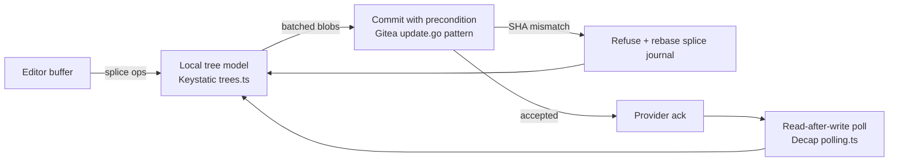

## 22. Reference implementations — the codebases to read

### 22.1 How to read a licence before you read the code

All repository metadata in this section was read from `api.github.com` on **2026-08-30** [fetched]. Star counts and push dates move; the licence text moves rarely, and it is the field that decides whether a repo is a teacher or a trap.

Three contagion tiers apply to us specifically, because we ship a hosted SaaS *and* a desktop build:

| Tier | Licences | What it means for us | Rule |
|---|---|---|---|
| **Red — read-only** | AGPL-3.0, GPL-3.0, GPL-2.0 | AGPL reaches through the network: a hosted service built on modified AGPL code owes source to its users. GPL reaches through the desktop binary. | Read for architecture. Never paste a line. Never vendor a package. [inference] |
| **Amber — read the fine print** | BUSL-1.1 (Outline), AFFiNE EE, Any Source Available License 1.0 (Anytype) | Outline's Additional Use Grant forbids use "for a Document Service… a commercial offering that allows third parties… to access the functionality of the Licensed Work" [fetched, `outline/outline` LICENSE, 2026-08-30]. That is a description of our product. | Read-only, same discipline as Red, and do not depend on it operationally. |
| **Green — usable** | MIT, Apache-2.0, BSD-3-Clause, MPL-2.0 | Copy with attribution; MPL is file-level copyleft only. | Safe to lift patterns and, where sane, code. |

AFFiNE is split: everything outside `packages/backend` and `packages/common/native` is MIT, the backend is under the "AFFiNE Enterprise Edition (EE) license" requiring a paid subscription for production use [fetched, both LICENSE files, 2026-08-30]. Joplin defaults to AGPL-3.0-or-later with per-directory overrides — `packages/server` carries its own [fetched, `laurent22/joplin` LICENSE, 2026-08-30]. None of this is legal advice; the tiers are an engineering triage, and a lawyer confirms before anything ships.

### 22.2 The register

Stars / last push read 2026-08-30 [fetched]. "Learn" and "Avoid" are judgement calls on top of directory listings actually opened [inference].

| Repo | Stars | Last push | Licence | Tier | Stack | Learn (named subsystem) | Avoid |
|---|---|---|---|---|---|---|---|
| `go-gitea/gitea` | 57,676 | 2026-08-30 | MIT | Green | Go | `services/repository/files/update.go` — compare-and-swap file writes against a git tree | The whole forge; you want ~600 lines, not the app |
| `decaporg/decap-cms` | 19,327 | 2026-08-28 | MIT | Green | JavaScript | `packages/decap-cms-backend-github/` — browser-side commits via the GitHub Tree API, plus `polling.ts` for eventual-consistency waits | Its Redux/Immutable core; a decade of accreted state management |
| `sveltia/sveltia-cms` | 2,768 | 2026-08-30 | MIT | Green | Svelte/JS | `src/lib/services/backends/git/{github,gitlab,gitea,shared}` — the same problem solved cleanly a decade later, with a `shared/` layer that is the real lesson | Svelte-specific reactivity; port the boundary, not the runes |
| `Thinkmill/keystatic` | 2,326 | 2026-08-26 | MIT | Green | TypeScript | `app/trees.ts` + `app/object-cache.ts` + `app/shell/BatchCommits.tsx` — a client-side git tree model with content-addressed caching and batched multi-file commits | Its form/schema DSL; we are not a structured-content CMS |
| `payloadcms/payload` | 44,491 | 2026-08-29 | MIT | Green | TypeScript | `packages/payload/src/auth/getAccessResults.ts`, `executeAccess.ts`, `extractAccessFromPermission.ts` — field-level access resolved to a permission object per request | Its DB adapters and admin UI; our control plane holds zero document bytes |
| `tinacms/tinacms` | 13,764 | 2026-08-28 | Apache-2.0 | Green | TypeScript | `packages/@tinacms/graphql/src/{git,database,level}` — indexing a git repo into a queryable KV store without becoming the source of truth | The GraphQL layer; a schema API over markdown is a product we settled against |
| `estruyf/vscode-front-matter` | 2,539 | 2026-08-21 | MIT | Green | TypeScript | `src/parsers`, `src/panelWebView`, `src/listeners` — a panel UI driven entirely by the file on disk, no shadow model | VS Code webview plumbing; not portable |
| `silverbulletmd/silverbullet` | 5,956 | 2026-08-30 | MIT | Green | Rust + TypeScript | Its "Space" model: markdown pages as the only store, with a derived object/query index rebuilt from them [fetched README, 2026-08-30] | Space Lua — arbitrary client-side scripting is settled against |
| `jackyzha0/quartz` | 13,136 | 2026-08-18 | MIT | Green | TypeScript | Its transformer/emitter plugin pipeline over remark/rehype | Static-site concerns; render pipelines are already researched |
| `toeverything/blocksuite` | 5,997 | 2026-08-26 | MPL-2.0 | Green | TypeScript | Block-editor internals as an isolable package | The block model itself — it is a tree-of-record, which we settled against |
| `toeverything/AFFiNE` | 72,019 | 2026-08-28 | MIT + EE backend | Amber | TypeScript | Frontend/backend licence split as a commercial pattern | The backend, on both licence and architecture grounds |
| `outline/outline` | 40,380 | 2026-08-29 | BUSL-1.1 | **Amber — the grant excludes us by name** | TypeScript | `server/collaboration/{PersistenceExtension,AuthenticationExtension,ConnectionLimitExtension}.ts` — a Hocuspocus deployment that is honest about persistence, auth and connection caps | Everything; the licence makes this a museum visit |
| `laurent22/joplin` | 56,167 | 2026-08-30 | AGPL-3.0-or-later | Red | TypeScript | `packages/lib/services/synchronizer/` — `LockHandler.ts` (15.8 KB), `syncInfoUtils.ts` (23.3 KB), and eleven dedicated conflict/e2ee/revision test files | Copying anything; also its item-based sync model, which is not git |
| `siyuan-note/siyuan` + `siyuan-note/dejavu` | 46,053 / 67 | 2026-08-30 / 2026-08-23 | AGPL-3.0 | Red | TS + Go | DejaVu: "Git-like version control, file deduplication in chunks, data compression, AES encrypted" cloud sync, entities keyed by SHA-1 [fetched README, 2026-08-30] | Its stated limits — no folders, no permission attributes, no symlinks — and the whole block-kernel model |
| `logseq/logseq` | 44,687 | 2026-08-29 | AGPL-3.0 | Red | Clojure | The file-is-truth-but-we-also-have-a-DB tension, and what it cost them | Their DB-version migration; a cautionary tale, not a template |
| `TriliumNext/Trilium` | 37,634 | 2026-08-30 | AGPL-3.0 | Red | TypeScript | Note attributes and inheritance | Everything else; it is not markdown-first |
| `docmost/docmost` | 21,514 | 2026-08-29 | AGPL-3.0 | Red | TypeScript | `apps/server/src/collaboration/` — the smallest readable Yjs-server deployment (gateway, handler, adapter, processors) | The CRDT for document bytes; settled against |
| `hedgedoc/hedgedoc` | 7,386 | 2026-08-28 | AGPL-3.0 | Red | TypeScript | `backend/src/permissions`, `backend/src/revisions`, `backend/src/api-token` — clean NestJS module boundaries for exactly our three hard control-plane problems | Its realtime layer |
| `standardnotes/app` | 6,612 | 2026-08-25 | AGPL-3.0 | Red | TypeScript | E2EE key rotation and the protocol-version upgrade path | Their editor; encryption forecloses server-side AI |
| `Zettlr/Zettlr` | 13,451 | 2026-08-29 | GPL-3.0 | Red | TypeScript | `source/common/modules/markdown-editor/` — a serious CodeMirror 6 markdown build with `parser/`, `renderers/`, `linters/`, `table-editor/` as separate concerns | Copying; GPL reaches our desktop binary |
| `AppFlowy-IO/AppFlowy` | 76,077 | 2026-08-28 | AGPL-3.0 | Red | Dart + Rust | Rust-core / thin-client split | The Notion clone surface |
| `streetwriters/notesnook` | 14,482 | 2026-08-29 | GPL-3.0 | Red | TypeScript | Cross-platform packaging discipline | Copying |
| `anyproto/anytype-ts` | 8,724 | 2026-08-29 | Any Source Available 1.0 | Amber | TypeScript | Local-first identity | Non-commercial-only grant; do not read while implementing |

### 22.3 The ranked six, and the file to open first

1. **`go-gitea/gitea` — `services/repository/files/update.go`.** Open at line 380. `if file.SHA != "" { if file.SHA != fromEntryIDString { return ErrSHADoesNotMatch }}`, then the `LastCommitID` branch at 389 that calls `FileChangedSinceCommit`, then `ErrSHAOrCommitIDNotProvided` at 349 — a hard refusal to write without a precondition [fetched, `main`, 2026-08-30]. That is our compare-and-swap, already debugged by a forge with 57,676 stars. Read `temp_repo.go` (13.9 KB) next for how it stages a tree without a working copy. *Anti-recommendation: do not read `routers/web/repo/editor.go` for the pattern — the HTTP layer will pull you into Gitea's context objects.*

2. **`Thinkmill/keystatic` — `packages/keystatic/src/app/trees.ts` (7.2 KB), then `shell/BatchCommits.tsx` (10.6 KB).** This is the closest existing thing to our client: a browser holding a git tree, diffing local edits against it, and committing several files atomically. `object-cache.ts` (4.8 KB) is the content-addressed blob cache we will otherwise invent badly [fetched listing, 2026-08-30]. *Anti-recommendation: `ItemPage.tsx` is 31.7 KB of schema-form UI. Skip it entirely; it solves a problem we chose not to have.*

3. **`sveltia/sveltia-cms` — `src/lib/services/backends/git/shared/`, before any provider directory.** Four providers (`github`, `gitlab`, `gitea`, plus `fs`) forced a shared abstraction, and reading the shared layer first tells you which operations are genuinely provider-independent [fetched listing, 2026-08-30]. Then `backends/save.js` (5.7 KB) with its 28 KB test file — the test file is the specification. *Anti-recommendation: do not read Decap first and Sveltia second; Decap's ten years of Redux will contaminate your model of what is essential.*

4. **`payloadcms/payload` — `packages/payload/src/auth/getAccessResults.ts`.** We need a permission model over documents whose bytes we do not store, which means permissions attach to paths and repos, not rows. Payload resolves access to a serializable permission object per request rather than scattering checks — `executeAccess.ts`, `extractAccessFromPermission.ts`, `defaultAccess.ts` [fetched listing, 2026-08-30]. MIT, so this one can be copied. *Anti-recommendation: ignore `packages/payload/src/auth/sessions.ts` and the DB adapters; our control plane is Postgres-only by design.*

5. **`decaporg/decap-cms` — `packages/decap-cms-backend-github/src/polling.ts` (12.6 KB).** Not the commit code — the *waiting* code. A browser that commits to GitHub must then survive GitHub's read-after-write lag, and 12.6 KB of dedicated polling is the honest measure of that problem [fetched, 2026-08-30]. `API.ts` is 65.5 KB and should be skimmed for its Tree API usage only. *Anti-recommendation: `GraphQLAPI.ts` (21.5 KB) is a partial migration that was never finished; it will mislead you about which API to use.*

6. **`hedgedoc/hedgedoc` — `backend/src/permissions/`, then `backend/src/revisions/`, then `backend/src/api-token/`.** AGPL, so read-only, but the module decomposition is the cleanest small example of the three control-plane subsystems we need and it is written in a stack we can restate from scratch [fetched listing, 2026-08-30]. *Anti-recommendation: `backend/src/realtime/` — it is a websocket document model, which is the architecture we settled against.*

### 22.4 Subsystem to best reference

| Our subsystem | Best reference | Why it wins | Second opinion |
|---|---|---|---|
| Compare-and-swap write to git | Gitea `files/update.go` [fetched] | Refuses the write without a precondition, rather than warning | Keystatic `BatchCommits.tsx` for the multi-file case |
| Browser-side git tree model | Keystatic `app/trees.ts` [fetched] | Tree + content-addressed cache, no server round-trip per node | Sveltia `backends/git/shared` |
| Read-after-write consistency | Decap `polling.ts` [fetched] | Only implementation that treats provider lag as a first-class state | — |
| Multi-provider git abstraction | Sveltia `backends/git/shared` [fetched] | Four providers, so the abstraction is falsified not assumed | Decap's `implementation.tsx` |
| Permission model (control plane) | Payload `getAccessResults.ts` [fetched] | Access resolves to data, not scattered guards; MIT | HedgeDoc `backend/src/permissions` (AGPL, read-only) |
| Splice journal / conflict semantics | Joplin `synchronizer/LockHandler.ts` + `Synchronizer.conflicts.test.ts` [fetched] | Twelve years of conflict edge cases, encoded as tests | DejaVu's SHA-1 index model |
| Content-addressed snapshot store | `siyuan-note/dejavu` [fetched README] | Chunked dedup + index-per-operation, in 67-star readable Go | — |
| CodeMirror 6 markdown surface | Zettlr `markdown-editor/` [fetched] | `parser/`, `renderers/`, `linters/`, `table-editor/` cleanly separated | Front Matter's `panelWebView` for panel-follows-file |
| Derived index over files-of-record | TinaCMS `@tinacms/graphql/src/{database,level}` [fetched] | Indexes git without claiming to own it | SilverBullet's Space objects |
| Licence-split commercial model | AFFiNE MIT + EE backend [fetched] | The exact split we would use if we ever open a client | Outline BUSL — as a cautionary example |

### 22.5 The git-backed editor problem, specifically

Almost nothing solves it end to end. Three repos solve pieces, and the pieces compose:

The unusual part of our design — that the file is the only source of truth and the server stores none of its bytes — has exactly two prior implementations at product scale: **Keystatic and Sveltia both put the git tree in the browser and let the user's own credentials do the writing, which is our architecture with a CMS-shaped UI on top** [fetched listings, 2026-08-30]. Keystatic is the closer relative because it models the tree explicitly; Sveltia is the better-factored one. Neither does byte-preserving splices — both write whole files — so the splice journal is genuinely ours to build, and Joplin's conflict test suite is the nearest thing to a specification for the failure modes [fetched, eleven test files under `packages/lib/services/synchronizer/`, 2026-08-30].

One dead end worth knowing: `netlify/git-gateway` (431 stars, MIT, Go) is the credential-proxy pattern that lets a browser commit without holding a token, and it has been unmaintained for **838 days** [fetched 2026-08-30; derived: 2026-08-30 − 2024-05-14]. The pattern is right and the code is abandoned; read it in an afternoon, do not deploy it.

### 22.6 Anti-recommendations — repos that look relevant and will mislead

| Repo | Why it looks relevant | Why it will mislead |
|---|---|---|
| `outline/outline` | Best-in-class collaborative document editor, TypeScript, readable | Its BUSL Additional Use Grant names "a Document Service" as the excluded use [fetched LICENSE, 2026-08-30]. Reading it while building a competing document service is the worst possible evidentiary posture. |
| `dendronhq/dendron` | Markdown-first, git-backed, Apache-2.0 — sounds ideal | **290 days** since last push [derived, 2026-08-30 − 2025-11-13]. Its architecture reflects a product that stopped; you would inherit its dead ends without its living corrections. |
| `prose/prose` | The original browser git-backed markdown editor | **921 days** stale [derived, 2026-08-30 − 2024-02-21]. Predates the GitHub Tree API patterns everything current uses. |
| `AppFlowy-IO/AppFlowy` | 76,077 stars, Rust core, local-first | It is a Notion-style workspace with databases and boards. AGPL, and every architectural decision serves a product we explicitly are not building. |
| `toeverything/blocksuite` | MPL-2.0, so legally usable, and a real editor engine | Block-tree-of-record is the model we settled against. Adopting it would silently reintroduce a tree of record through the editor layer. |
| `logseq/logseq`, `siyuan-note/siyuan`, `TriliumNext/Trilium` | Large, active, file-adjacent | All AGPL; all resolved the file-versus-database tension *toward the database*. Read Logseq's DB migration as a warning, not a design. |
| `Milkdown/milkdown`, `Vanessa219/vditor`, `marktext/marktext` | Markdown editors with stars | Libraries and a desktop app, not products with a sync engine, permission model, or control plane. Out of scope for this section by construction. |
| `obsidianmd/obsidian-releases` | The plugin ecosystem to learn from | It is a submission registry for a closed-source host. There is no engine to read, and a plugin marketplace is settled against. |
| `AFFiNE` backend | Same problem space, active | EE-licensed: production use requires an AFFiNE subscription [fetched, `packages/backend/server/LICENSE`, 2026-08-30]. Read the frontend split, not the server. |
| `docmost/docmost`, `hedgedoc/hedgedoc` realtime | Small, modern, readable Yjs servers | They will make CRDT-for-document-bytes feel inevitable. It is not; read their permission and revision modules and close the tab before `collaboration/`. |
