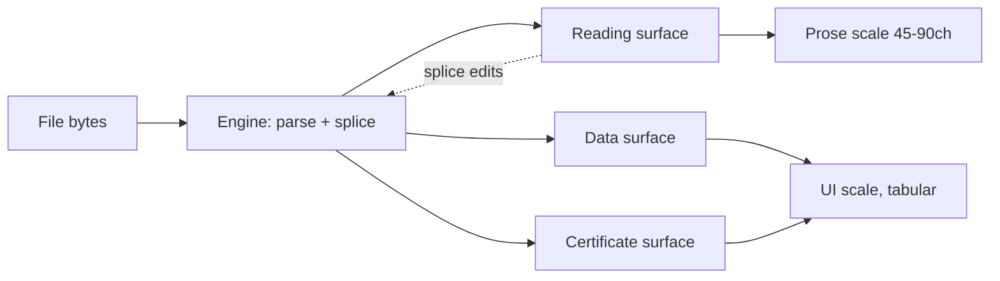

Verified read-only — only `curl`, stdout HTML extraction, and `git status` ran; the dirty paths pre-date this run.

## 23. Design references and the visual language

### 23.1 The reference set

Every row below was opened with `curl` on 2026-08-30 (the visual-pattern MCP was gate-refused; `curl` was not — tested before concluding, per the rule that a blocked tool is one tool's policy). Star counts and versions are from `api.github.com` and `registry.npmjs.org` the same day.

| Reference | URL | What it is evidence for | Live state read 2026-08-30 |
|---|---|---|---|
| Vercel Geist | vercel.com/geist | Content rules for dense UI, empty-state taxonomy, named type scale | Active docs; theme switcher system/light/dark [fetched] |
| GitHub Primer | primer.style/product | Empty-state anatomy; `DataTable`; UI-pattern layer above components | `primer/react` 3,895★, MIT, pushed 2026-08-28 [fetched] |
| Shopify Polaris | polaris.shopify.com | What happens when you depend on a vendor system | `Shopify/polaris` → redirects to `Shopify/polaris-react-archive`, 6,172★; `@shopify/polaris` frozen at 13.9.5, published 2025-03-26 [fetched] |
| Atlassian Design System | atlassian.design | A mature system still hedging on tables | Ships `Dynamic table`; its plain `Table`, `Page`, `Drawer`, `Inline dialog` are all labelled **Caution** [fetched] |
| IBM Carbon | carbondesignsystem.com | The only system publishing exact table density numbers | 9,394★, Apache-2.0, pushed 2026-08-30 [fetched] |
| Radix Primitives / Colors | radix-ui.com | Unstyled behaviour; a 12-step colour scale with role bands | Primitives 19,222★, MIT, pushed 2026-08-08 [fetched] |
| shadcn/ui | ui.shadcn.com | Copy-in distribution instead of a runtime dependency | 122,549★, MIT, pushed 2026-08-30 [fetched] |
| TanStack Table / Virtual | tanstack.com | Headless table behaviour, actively maintained | `@tanstack/react-table` 9.2.4 published 2026-08-28; Virtual 7,089★ [fetched] |
| Glide Data Grid | github.com/glideapps/glide-data-grid | Canvas-rendered grid at spreadsheet scale | 5,322★, MIT, last pushed 2026-01-21 [fetched] |
| CodeMirror 6 | codemirror.net | The editing surface itself | `@codemirror/view` 6.43.9 published 2026-08-16, MIT [fetched] |
| cmdk | github.com/dip/cmdk | Command palette — and a maintenance warning | 12,926★, MIT, last pushed 2025-10-29; npm 1.1.1 from 2025-03-14 [fetched] |
| iA Writer | ia.net | Typography as the product | Mac $49.99 / Windows $29.99 / iOS $49.99, one-time per platform; "One Time ≠ Lifetime" [fetched] |
| Obsidian | obsidian.md/pricing | Local-file positioning and a paid-sync ladder | Free, no sign-up; Sync $4/user/mo annual; Publish $8/site/mo annual; Commercial $50/user/yr [fetched] |
| Craft | craft.do/pricing | Block-metered freemium (INR shown from an India IP) | Plus ₹526.7/mo yearly; free tier capped at 1,500 blocks, 1 GB, 25 MB media [fetched] |
| Notion | notion.com/pricing, developers.notion.com/reference/block | The block-of-record model, stated in its own API | Plus $10/member/mo; every block carries `id`, `parent`, `created_by`, `has_children`, `in_trash` [fetched] |
| Butterick, *Practical Typography* | practicaltypography.com/line-length.html | Measure | "45–90 characters… two and three alphabets on a line" [fetched] |
| NN/g, Kaplan (2021-09-19) | nngroup.com/articles/empty-state-interface-design | Empty states as system status, not decoration | "Totally empty states cause confusion" [fetched] |
| WCAG 2.2 SC 1.4.3 | w3.org/WAI/WCAG22/Understanding/contrast-minimum | Contrast floor, both themes | 4.5:1 body, 3:1 large text [fetched] |
| Stripe Apps | docs.stripe.com/stripe-apps/design | Constrained component grammar for third parties | Ships "component hierarchy constraints" and prop validation [fetched] |

`ag-grid.com/license-pricing` returned HTTP 403 from CloudFront [measured] — no AG Grid price is stated in this section, and none should be quoted from memory.

### 23.2 Visual principles, derived

| # | Principle | Derived from | Anti-recommendation |
|---|---|---|---|
| 1 | Two type systems in one shell: a reading surface bound by measure, an app surface bound by density | Geist separates `text-copy-*` ("multiple lines… higher line height") from `text-label-*` ("single-lines"), and calls Label 14 "the most common text style of all" [fetched]; Butterick's 45–90ch governs prose only [fetched] | Do not run one modular scale everywhere; a 16px/1.6 body style inside a 40px table row wastes a third of the viewport |
| 2 | Absence is typed, never coerced | Geist Table: "Render — in cells where a value is unknown or not applicable. Don't substitute N/A, null, or an empty string" [fetched]; Primer names three distinct empty causes — never used, temporarily empty, error [fetched] | Do not let a missing frontmatter key, an unparseable value, and a value that is genuinely empty render identically |
| 3 | Every control states the byte effect before it runs | Geist: sortable headers "are buttons… announce the next sort state" [fetched]; the engine's splice edits are reversible only if the user knew what moved [inference] | Do not silently normalise on save — no reflowing tables, no rewriting `*` to `-`, no reordering frontmatter keys as a side effect of a UI action |
| 4 | Borrow tokens and behaviour; do not take a runtime dependency on a design system | Polaris React is archived and its npm package has not moved since 2025-03-26 [fetched]; cmdk has not been pushed since 2025-10-29 [fetched]; shadcn states "This is not a component library. It is how you build your component library" [fetched] | Do not `npm i` a vendor's component layer for a product with a ten-year file-format promise |
| 5 | Density is a user setting with published numbers | Carbon publishes five row heights: xs 24, sm 32, md 40, lg 48, xl 64 px, with a 48px toolbar paired to lg/xl [fetched] | Do not ship a single comfortable density and call it opinionated; a 300-row frontmatter table at 48px is 14,400px tall [derived: 300 × 48] |
| 6 | Contrast floor is a hard gate in both themes | WCAG 2.2 SC 1.4.3: 4.5:1 body, 3:1 large [fetched]; Radix ships paired light/dark scales with a documented "Accessible text" band at steps 11–12 [fetched] | Do not use a 3.0:1 grey for secondary metadata because it photographs well |
| 7 | Keyboard parity before visual polish | Geist ships a `Command Menu` primitive; Linear publishes a whole method site on building practice [fetched] | Do not make the palette the only route to an action — Geist's own rule is that a CTA "must be a real Button or Link, not an onClick div, so it joins the tab order" [fetched] |

### 23.3 Component inventory, mapped to a reference implementation

Claude implements each of these from the reference's *documented behaviour*, not from its package.

| Component | Reference implementation | Why that one | Anti-recommendation |
|---|---|---|---|
| Text editing surface | CodeMirror 6, `@codemirror/view` 6.43.9 [fetched] | Byte-offset native; decorations do not own the document | Not Lexical (23,813★) or Tiptap (38,197★) [fetched] — both centre a node tree, which is the settled-out model |
| Command palette | cmdk's list/filter semantics, reimplemented | The behaviour is right; the package is 10 months stale [fetched] | Do not adopt cmdk as a dependency |
| Empty state | Geist `Empty State` variants: blank-slate, informational, educational, guide, plus no-results / cleared / permission / error [fetched] | It is the only public taxonomy that separates "no rows after filtering" from "nothing created yet" | Geist's own rule: "Cap at one primary CTA… Three CTAs is a smell" [fetched] |
| Data table | TanStack Table 9.2.4 headless + Geist content rules + Carbon density scale [fetched] | Behaviour, prose, and metrics from three sources that each do one well | Do not adopt a grid product; see §23.5 |
| Row virtualisation | TanStack Virtual, 7,089★ MIT [fetched] | Required above ~200 rows | Do not virtualise the prose editor's document; CodeMirror already does viewport rendering |
| Key/value metadata block | Geist `Description` — explicitly not a two-column table [fetched] | Frontmatter on a document page is metadata, not a dataset | Do not render single-document frontmatter as a table |
| Row-with-one-action | Geist `Entity` [fetched] | Repos, integrations, collaborators | Do not use a table when only one column is comparable |
| Relative time | Geist `Relative Time Card`: `2m ago` up to 7 days, then `Mar 14, 2026` [fetched] | Journals and diffs are time-dense | Never show "3 months ago" where a date matters for a legal or audit read |
| Truncation | Geist `MiddleTruncate` [fetched] | Paths and branch names differ at the tail | Do not tail-ellipsis a file path |
| Status | Geist `Status Dot` + Primer `StateLabel` [fetched] | Certification results are enumerable states | Do not encode state in colour alone |
| Diff / degradation report | Primer `DataTable` + its "Degraded experiences" UI pattern [fetched] | Primer is the only system with a named pattern for a knowingly reduced experience | Do not present a degradation certificate as an error toast |
| Blank/loading | Primer `SkeletonText` / `SkeletonBox`, Geist `Skeleton` [fetched] | Only for network-bound views | Never skeleton a local file read; see §23.8 |
| Colour tokens | Radix 12-step role bands: 1–2 backgrounds, 3–5 interactive, 6–8 borders, 9–10 solid, 11–12 accessible text [fetched] | Roles survive a palette change | Do not hand-pick hexes per component |
| Numeric/mono type | Geist Mono or `tabular-nums`, per Geist's table rule [fetched] | Digit alignment across rows | Do not set a whole table in mono to get aligned digits |
| Overlays, menus, focus | Radix Primitives 19,222★ MIT [fetched] | Focus trapping and typeahead are where hand-rolled UI fails | Do not hand-roll a focus trap |

### 23.4 Typography and spacing for the reading surface

The reading surface and the app surface disagree about almost every value, and the disagreement is the design.

| Decision | Reading surface | App surface | Source |
|---|---|---|---|
| Measure | 45–90 characters; target ~68ch, hard cap 90ch | full width, column-bounded | Butterick, 45–90 or 2–3 alphabets [fetched] |
| Face | Duospace-class for source view; proportional for the projection | one UI sans; mono only in numeric columns and code | iA built Writer Mono/Duo/Quattro on IBM Plex, keeping "large word spacing and monospaced punctuation" [fetched, article dated 2018-12-14] |
| Why duospace | Markdown source is punctuation-load-bearing: `#`, `-`, `|`, `>`, `` ` `` must align down the left edge and inside table pipes; full mono taxes prose, full proportional breaks the pipes | n/a | [inference] from iA's stated rationale for Duo/Quattro [fetched] |
| Size | 16–17px body | 14px default, 13px secondary | Geist names Label 14 "the most common text style of all" and Label 13 for "a secondary line" [fetched] |
| Line height | ~1.6 | ~1.45 single-line, 1.3 in table cells | Geist splits Copy (higher line height, multi-line) from Label (single-line) [fetched] |
| Numerals | proportional in prose | `font-variant-numeric: tabular-nums` in every numeric column | Geist: "Apply tabular-nums (or Geist Mono) to numeric columns so digits align across rows" [fetched] |
| Vertical spacing | derived per markdown block type; paragraph gap ≈ 0.75 × line-height | 4px base unit; Carbon's `$spacing-05` = 16px, `$spacing-09` = 48px [fetched] | [derived] |

The one hard constraint the file model imposes: vertical spacing in the editor must be a pure function of block type, because the same bytes must produce the same layout on every device. Quantising paragraph gaps to an 8px grid looks tidy in a static comp and produces visible drift the moment a heading's line-box rounds differently at 1.25× zoom [inference].

**Set the source view in a duospace face and the projection in a proportional one, and never let a font change alter a byte offset the splice engine depends on.**

### 23.5 The dense-table problem

Most design systems are bad at this, and several admit it. Atlassian ships `Dynamic table` alongside a plain `Table` marked *Caution* [fetched]. Carbon's own guidance says not to use a data table "as a replacement for a spreadsheet application" [fetched]. Polaris's React table implementation is in an archive repo [fetched].

Who does it well, and what they actually do:

| Who | What they do that others do not | Read |
|---|---|---|
| IBM Carbon | Publishes the metrics: five row heights (24/32/40/48/64px), checkbox 20px, cell padding 16px, expanded-panel left padding 48px, and a per-release accessibility test status (default state, advanced states, screen reader, keyboard) | [fetched] |
| Vercel Geist | Publishes the *content* rules, which is the part everyone skips: em dash for unknown values; Title Case noun headers (`Last Used`, `Requests (7d)`); `Page 2 of 7` or `21–40 of 142` with an en dash; empty state rendered outside `Table.Body`, never as an empty body | [fetched] |
| TanStack Table | Headless — sorting, grouping, column sizing, pagination as state, zero markup. 9.2.4 published two days before this was read | [fetched] |
| Glide Data Grid | Canvas rendering, which is the only way past a few thousand visible cells; 5,322★ MIT, but last pushed 2026-01-21 — seven months quiet | [fetched] |
| Primer | A `Degraded experiences` UI pattern sitting above the table components, so a partial data load has a designed presentation rather than an error | [fetched] |

The recommendation: compose Carbon's density numbers, Geist's content rules, and TanStack Table's headless state, rendered as DOM until a measured frame budget is missed, and only then evaluate canvas. The anti-recommendation is the obvious move — adopting a commercial grid. It buys column virtualisation and pivoting that this product does not need, and it takes ownership of the one surface where the product's differentiation lives: the mapping from a cell back to a byte range in a file. AG Grid's pricing page was unreachable for verification [measured], which is itself a reason not to design a dependency around it in a section a founder will build from.

### 23.6 Dark mode

It matters, and the cost is bounded if it is a token swap rather than a second design.

| Question | Answer | Evidence |
|---|---|---|
| Do the references treat it as default-tier? | Yes. Geist's docs expose system/light/dark; Primer offers a dark-mode switch; Radix ships paired light and dark 12-step scales; Obsidian's community theme ecosystem is dark-dominant | [fetched] |
| Does the contrast floor change? | No. SC 1.4.3's 4.5:1 / 3:1 applies identically | [fetched] |
| What is the actual work? | One token set with role bands (Radix 1–2 background, 6–8 border, 11–12 text; Geist's parallel 1–3 backgrounds, 4–6 borders, 9–10 text and icons), redefined once per theme | [fetched] |
| Where does it break? | Syntax highlighting, diff colours, and the degradation certificate's pass/warn/fail semantics must be re-derived per theme, not filtered | [inference] |
| Where does it not apply? | Print, PDF export, and shared read-only links default to light regardless of the viewer's theme | [inference] |

Anti-recommendation: do not implement dark mode as a CSS filter or a colour inversion, and do not use pure `#000` with pure `#fff` text — Geist defines two distinct background tokens with "Background 2… used sparingly when a subtle background differentiation is needed" precisely because a single flat extreme leaves no room for elevation [fetched]. Also do not define any colour *only* inside a `prefers-color-scheme` block; the light palette is the base and dark redefines a subset.

### 23.7 What not to copy from Notion

Notion's API states the model plainly: "A block object represents a piece of content within Notion," each carrying `id`, `parent`, `created_by`, `last_edited_by`, `has_children`, and `in_trash` [fetched]. That is a tree of record with server-assigned identity — the exact model this product has settled against. The UI affordances are not separable from it.

| Notion move | Why it fails here |
|---|---|
| Per-block drag handle and hover-revealed block menu | It advertises that blocks are addressable objects with identity. Here a "block" is a byte range that renumbers when the line above it changes [inference] |
| Slash menu that inserts a block *type* | The correct affordance inserts markdown *text* the user could have typed. A menu that inserts an object the user cannot type breaks the promise that the file is the source of truth [inference] |
| Page properties as a database row UI | Frontmatter is an ordered YAML mapping whose key order and comments are preserved bytes; a properties panel that reorders or re-types keys on save silently violates the splice contract [inference] |
| Toggle blocks, column layouts, synced blocks | None has a stable markdown byte representation; every one of them creates content that cannot round-trip [inference] |
| Everything-is-a-page nesting | Files and folders already have a hierarchy, and it is the user's git repo [inference] |
| Cover images and per-page emoji identity | Emoji render differently across OS and font versions and are a control-surface failure in any exported or printed artefact [inference] |

What to take instead: the *speed* of Notion's block manipulation — arrow-key movement, `Cmd+Shift+↑/↓` to move a line or list item, backspace-at-start to outdent. Those are text operations with exact byte semantics, and they are the reason Notion feels fast [inference].

### 23.8 Anti-recommendations: moves that photograph well and fail in daily use

| Move | Why it survives a screenshot | What breaks by week two |
|---|---|---|
| Hover-revealed row actions | Screenshots are captured mid-hover | Zero discoverability, no touch equivalent, no tab stop — Geist requires the CTA "be a real Button or Link… so it joins the tab order" [fetched] |
| Icon-only toolbar | Clean | Every icon becomes a memory test; Geist's table rule is that headers are "Title Case nouns or noun phrases… Never sentences" — words, not glyphs, carry meaning in dense UI [fetched] |
| Low-contrast secondary text | Photographs as refined | Fails SC 1.4.3's 4.5:1 and is unreadable on a laptop outdoors [fetched] |
| Skeleton loaders everywhere | Implies speed | A local file read completes in under a frame; a skeleton adds a mandatory flash of fake content. Reserve skeletons for network-bound views [inference] |
| Animated page transitions between documents | Looks expensive | At 30 document switches an hour, a 250ms transition costs 7.5 seconds an hour of pure waiting [derived: 30 × 0.25s] |
| Command palette as the primary path | One screenshot shows the whole product | Nothing is discoverable to a new user; the palette should be the fast path to actions that also exist in the UI [inference] |
| Auto-hiding sidebar | Maximises the canvas in a comp | Position becomes unpredictable; users lose the file tree they came for [inference] |
| Full-bleed gradient app chrome | Marketing-ready | Competes with the document for attention on every session; Geist's whole background system is two near-neutral tokens [fetched] |
| Toast on every save | Reads as responsive | Byte-preserving autosave fires constantly; the correct signal is a persistent state indicator, not an interruption. Geist: "Don't put critical persistent warnings" in transient surfaces [fetched] |
| Infinite scroll on a data table | Feels modern | No end-of-list, no position, no shareable page. Geist specifies `Page 2 of 7` / `21–40 of 142` [fetched] |
| One comfortable density | Consistent-looking | Power users hit the viewport ceiling immediately; Carbon ships five row heights for this reason [fetched] |
| Emoji as status or control icons | Colourful, free | Renders differently per OS, font version, and export target; use a single inline-SVG icon set with the vector in the markup [inference] |
| Celebration animation on completion | Delightful once | Delightful zero times on the two-hundredth document [inference] |

The one move worth the screenshot cost: an empty state that does real work. NN/g's finding is that intentionally designed empty states "communicate system status, increase learnability… and provide direct pathways for key tasks," while totally empty states "cause confusion and decrease user confidence" [fetched, Kaplan 2021-09-19] — and Primer's rule is that when the emptiness is an error, "the graphic should not attempt to bring delight" [fetched].
