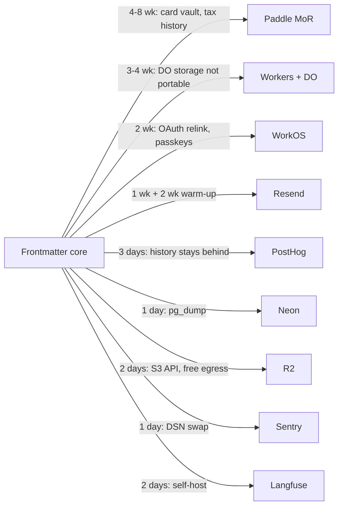

## 24. Build versus buy, component by component

### 24.1 The decision table

Scale assumption throughout: **1,000 registered users, 8% paid, $12/mo ARPU → $960 MRR** [derived, §24.2]. Founder-weeks assume Claude as the implementer at roughly 3× a human's line rate but the same review and debugging burden, so a "week" is a week of *your* attention, not of typing. All prices read 2026-08-30 unless stated.

| # | Component | Verdict | Vendor and price at our scale | Build cost | Switching cost later | Reason |
|---|---|---|---|---|---|---|
| 1 | Auth | BUY | WorkOS AuthKit — free up to 1M users, then $2,500/mo per additional 1M; SSO connections $125/ea (1–15) [fetched workos.com/pricing] | 5 wk | 2 wk — export users, re-link OAuth, re-enrol passkeys | Free to a million users, and the SSO/SCIM path the self-serve B2B tier needs already exists |
| 2 | Payments + MoR | BUY | Paddle — 5% + 50¢ per checkout transaction, no monthly fee [fetched paddle.com/pricing]. Alt: Polar — Starter 5% + 50¢, Pro $20/mo at 3.8% + 40¢, international +1.5%, $15/dispute [fetched docs.polar.sh/merchant-of-record/fees] | 14 wk + registrations | 4–8 wk, plus card-vault migration and churn | An India-domiciled seller taking global consumer cards inherits VAT/GST/sales-tax registration in ~100 jurisdictions; MoR is the only lawful shortcut |
| 3 | Email (transactional) | BUY | Resend — Free 3,000/mo (100/day, 3 domains); Pro $20/mo 50,000 emails, overage $0.90/1,000; Scale $90/mo 100,000; dedicated IP $30/mo [fetched resend.com/pricing] | 4 wk + reputation | 1 day to swap, 2 wk DKIM/IP warm-up | Deliverability is a reputation asset you cannot build in software |
| 4 | Email (marketing) | BUY, deferred | Loops — free to 4,000 sends/mo, priced on subscribed contacts, sending not metered separately [fetched loops.so/pricing] | 3 wk | 1 day (CSV) | Sequences are worth nothing until there is a funnel to sequence |
| 5 | Error tracking | BUY | Sentry Developer $0 (one user, 5k errors); Team $26/mo billed annually — 50k errors, 5 GB logs, 50 replays, 1 uptime + 1 cron monitor; PAYG errors 50K–100K at $0.0003625 each [fetched sentry.io/pricing] | 6 wk | 1 day (DSN swap) | Solo founder = one seat = the free tier is the correct tier for a year |
| 6 | Uptime + status page | BUY | Better Stack — free plan includes 10 monitors; paid tiers observed from $29 [fetched betterstack.com/uptime/pricing; the plan grid is JS-rendered and only partly readable]. OSS alt: OpenStatus, AGPL-3.0, 9,032★, pushed 2026-08-29 [fetched] | 2 wk | 1 day | A status page hosted on your own infrastructure is a status page that lies during the only incident that matters |
| 7 | Analytics | BUY | PostHog free tier — 1M events, 5K session replays, 1M feature-flag requests/mo, no credit card [fetched posthog.com/pricing]. Alt: Plausible Starter $9/mo to 10k pageviews [fetched plausible.io] | 8 wk | 3 days, history stays behind | One free tier covers analytics, replays and flags; three vendors collapse into one line |
| 8 | Search | BUILD | $0 — SQLite FTS5 on the client over the working copy, Postgres FTS over metadata only. Deferred alt: Meilisearch Cloud from $20/mo [fetched meilisearch.com/pricing]; Typesense GPL-3.0, 26,491★ [fetched] | 3 wk | n/a | A hosted index stores document text, and the architecture says zero document bytes cross our boundary |
| 9 | Real-time + presence | BUILD | Cloudflare Durable Objects on Workers Paid — $5/mo account minimum, 1M requests/mo then $0.15/M, 30M CPU-ms then $0.02/M [fetched developers.cloudflare.com/workers/platform/pricing] | 4 wk | 3–4 wk (DO storage has no portable equivalent) | Presence is cursors and locks, not document state; every collaboration vendor prices and models for CRDT documents we have settled against |
| 10 | File storage / blobs | ALREADY HAVE | Cloudflare R2 — $0.015/GB-month, Class A $4.50/M, Class B $0.36/M, zero egress; free 10 GB-month, 1M Class A, 10M Class B [fetched developers.cloudflare.com/r2/pricing, page last updated 2026-08-07] | — | 2 days (S3-compatible, and egress is free by design) | Settled |
| 11 | CDN | ALREADY HAVE | Cloudflare, bundled with the zone — $0 marginal | — | 1 day | Buying a second CDN in front of the first is a common and expensive reflex |
| 12 | Database hosting | BUY | Neon Launch — $0.106/CU-hour, $0.35/GB-month, up to 16 CU [fetched neon.tech/pricing]. Alt: Supabase Pro from $25/mo incl. $10 compute credits, 8 GB disk then $0.125/GB, 250 GB egress then $0.09/GB [fetched supabase.com/pricing] | 6 wk (ops, not code) | 1 day — `pg_dump`, `pg_restore` | It is plain Postgres holding a control plane with zero document bytes; it stays small and it stays portable |
| 13 | Background jobs + queues | BUILD | $0 — `SELECT … FOR UPDATE SKIP LOCKED` on the control-plane Postgres. Alt: Inngest free 50k executions / Pro from $99/mo, 1M executions [fetched inngest.com/pricing] | 2 wk | n/a (buying later is easy; leaving Inngest is not) | Job payloads carry GitHub App installation tokens and repo coordinates; a third boundary buys nothing and costs an audit |
| 14 | Feature flags | BUY | PostHog, included in the free tier above — 1M flag requests/mo [fetched]. OSS alt: Unleash AGPL-3.0 13,770★, Flagsmith BSD-3-Clause 6,533★ [fetched] | 1 wk | ~0 — a flag is a boolean behind an interface | Already paid for at $0; building it wins nothing |
| 15 | Support desk | BUY, deferred | `support@` in a mail client at $0 until roughly 300 paying users; then Plain Foundation $35/mo, 1 seat, +$35/seat [fetched plain.com/pricing]. OSS alt: Chatwoot 36,306★ [fetched] | 5 wk | 1 wk (thread export) | Ticket volume below one per day is a mailbox, not a desk |
| 16 | Documentation site | BUILD | $0 — Astro Starlight MIT 9,153★ [fetched] or Docusaurus MIT 66,123★ [fetched], on Cloudflare Pages | 1 wk | ~0 | Docs are markdown in a git repo rendered by a pipeline; if ours cannot do it, the product claim is false |
| 17 | AI gateway + observability | BUY | Langfuse Cloud Core $29/mo — 100k units, +$8/100k, 90-day retention; Pro $199/mo [fetched langfuse.com/pricing]; self-hostable, 33,928★. Alt: Helicone Pro $79/mo [fetched helicone.ai/pricing] | 7 wk | 2 days (self-host the same schema) | Prompt/trace storage becomes a columnar-store problem within a quarter; the gateway itself stays out of the hot path until there is a second model |
| 18 | Rate limiting | SPLIT | Policy: BUILD. State: BUY Upstash Redis PAYG — $0.20/100K commands, $0.25/GB after 1 GB free, bandwidth free to 200 GB then $0.03/GB [fetched upstash.com/pricing]. Cloudflare WAF rules are bundled | 1 wk | 1 day (Redis protocol) | The limits encode product policy; the counters are a commodity |
| 19 | PDF generation | BUILD on OSS | Gotenberg MIT, 12,962★, pushed 2026-08-21 [fetched], one container ≈ $5/mo. Alt: Browserless Prototyping $25/mo billed annually [fetched browserless.io/pricing] | 2 wk | 1 wk | PDF is a projection of our own render pipeline and must be byte-deterministic across runs; a vendor upgrading Chrome silently breaks that |
| 20 | Image processing | BUY | Cloudflare Images — $0.50/1,000 unique transformations after 5,000 free, $5/100k stored/mo, $1/100k delivered/mo [fetched developers.cloudflare.com/images/pricing]. OSS alt: imgproxy Apache-2.0, 11,033★ [fetched] | 2 wk | 3 days (URL scheme rewrite) | It sits directly in front of R2, which we already run |
| 21 | Markdown engine | BUILD | $0 in licence, everything in time. Nearest OSS: comrak 1,688★, markdown-it MIT 21,861★, remark MIT 8,987★, cmark-gfm 1,125★ (pushed 2026-07-13) [fetched] | 12+ wk, partly sunk | Infinite | Every one of them parses to an AST and re-renders, which destroys the source bytes; byte-preserving splice and cross-engine degradation certification exist nowhere to buy |
| 22 | Editor surface | ADOPT OSS | CodeMirror 6 — 7,820★ on `codemirror/dev` [fetched] | 20+ wk to replace | 8+ wk | Buy the text widget, build the engine behind it; the reverse is the classic inversion |

### 24.2 The monthly vendor bill, with arithmetic

Paid conversion 8%, ARPU $12/mo, all three scales [derived].

| Line | 100 users ($96 MRR) | 1,000 users ($960 MRR) | 10,000 users ($9,600 MRR) |
|---|---|---|---|
| MoR (Paddle 5% + 50¢) | 0.05×96 + 0.50×8 = **$8.80** | 0.05×960 + 0.50×80 = **$88.00** | 0.05×9,600 + 0.50×800 = **$880.00** |
| Auth (WorkOS) | $0 | $0 | $0 |
| Postgres (Neon Launch) | 60 CU-h×$0.106 + 2 GB×$0.35 = **$7.06** | 300 CU-h×$0.106 + 10 GB×$0.35 = **$35.30** | 1,080 CU-h×$0.106 + 50 GB×$0.35 = **$132.00** |
| Workers + Durable Objects | $5 base = **$5.00** | $5 + (6M−1M)×$0.15/M = **$5.75** | $5 + (60M−1M)×$0.15/M + DO duration ≈ **$40.00** [inference on DO duration] |
| R2 | free tier = **$0** | (20−10) GB×$0.015 = **$0.15** | (200−10)×$0.015 + (100M−10M)×$0.36/M = **$35.25** |
| Email (Resend) | Free = **$0** | Pro = **$20.00** | Scale = **$90.00** |
| Sentry | Developer = **$0** | Team = **$26.00** | Team + PAYG ≈ **$50.00** [inference] |
| Uptime (Better Stack) | $0 | $0 | **$29.00** |
| PostHog | free (≈40k events) = **$0** | free (≈400k events) = **$0** | ≈4M events ≈ **$200.00** [inference — the per-event overage rate was not readable on the fetched page] |
| Support desk (Plain) | $0 | Foundation 1 seat = **$35.00** | Foundation + 2 seats = **$105.00** |
| Langfuse | Hobby = **$0** | Core = **$29.00** | Core + 4×$8/100k units = **$61.00** |
| Upstash | 0.3M cmds = **$0.60** | 3M cmds = **$6.00** | 30M cmds = **$60.00** |
| Gotenberg container | **$5.00** | **$5.00** | 2 containers = **$20.00** |
| Cloudflare Images | free tier = **$0** | (30k−5k)/1,000×$0.50 + $1.50 + $3.00 = **$17.00** | (300k−5k)/1,000×$0.50 + $15 + $30 = **$192.50** |
| **Total** | **$26.46** | **$267.20** | **$1,894.75** |
| **As % of MRR** | 27.6% | 27.8% | 19.7% |

Two readings [derived]. First, MoR is 33% of the bill at 100 users and 46% at 10,000 — it is the only line that scales linearly with revenue, so every other decision on this page is rounding error next to the payments decision. Second, the Paddle-versus-Polar crossover: at $12 ARPU, Paddle costs 0.05×12 + 0.50 = $1.100 per transaction and Polar Pro costs (0.038+0.015)×12 + 0.40 = $1.036, a saving of $0.064; $20 ÷ $0.064 = **313 paying transactions per month** before Polar Pro's fixed fee pays for itself. Start on Paddle, revisit at 313.

LLM inference is deliberately excluded from this table. It is not a build-versus-buy question — there is nothing to build — and at 10,000 users it will exceed every line above combined.

### 24.3 The three obvious buys and the three obvious builds

**Buy: merchant of record, email deliverability, error tracking.** Payments because the failure mode is a tax authority rather than a bug, and 14 founder-weeks plus registrations in 100 jurisdictions is not a project a solo founder finishes. Email because deliverability is a reputation accrued over months in systems you cannot see, and no amount of correct SMTP code substitutes for it. Error tracking because Sentry's own self-hosted distribution (9,534★, `getsentry/self-hosted` [fetched]) requires Kafka, ClickHouse and roughly 8 GB of RAM to run the thing that tells you your 512 MB service is down. Anti-recommendation for all three: do not buy the *adjacent* upsell — not Paddle's churn-recovery add-on before you have churn data, not Resend's $30/mo dedicated IP below 3,000 sends/day (a cold dedicated IP has worse deliverability than a warm shared pool), not Sentry Business at $80/mo for features that presuppose a team.

**Build: the markdown engine, the queue, the docs site.** The engine because byte-preserving splice and degradation certification are the product, and every buyable parser is an AST round-tripper that discards the bytes we promise to preserve. The queue because two weeks of `SKIP LOCKED` against a Postgres you already operate avoids sending repo tokens across a third vendor boundary, and because Inngest's step model rewrites the shape of your code — that rewrite, not the $99/mo, is the switching cost. The docs site because a company selling a markdown engine that renders its own documentation with someone else's has published a review of itself. Anti-recommendation: building the engine does not license building the *editor* — CodeMirror 6 is 20+ founder-weeks you should not spend, and building the queue does not license building a cron scheduler, a retry-with-jitter library, or an observability stack around it.

### 24.4 Lock-in map and exit cost

Ranked exit cost [inference, from the migration mechanics in each vendor's export path]: Paddle 4–8 weeks and irreducible churn, because subscriptions and the payment-method vault live on their side and moving cards requires a network-token transfer both processors must agree to; Cloudflare Durable Objects 3–4 weeks, because DO storage has no equivalent at any other vendor and the Workers runtime is not Node; WorkOS 2 weeks; Plain 1 week; Resend 1 day of code and 2 weeks of reputation warm-up; PostHog, Sentry, Langfuse, Upstash, R2 and Neon between one day and three, all of them by design. The mitigation that costs nothing today: keep an internal `users.id` that no vendor issues, and never let a vendor's identifier become a foreign key anywhere in the control plane.

### 24.5 The rule for future decisions

Apply in order; stop at the first gate that fires.

1. **Does it touch document bytes?** Build. No exception, no pilot, no "just for the index."
2. **Is it on the projection law's critical path — parse, splice, render, certify?** Build.
3. **Does its outage take the editor down, or only degrade it?** If down, build it or make it optional at runtime.
4. **Is its failure mode regulatory** — tax, PCI, deliverability, SOC 2 evidence? Buy, and buy the boring incumbent.
5. **Otherwise compare build cost against 24 months of vendor spend at the 10,000-user scale — then buy anyway**, because that comparison omits maintenance, which runs 20–40% of original build cost per year [inference] and lands entirely on the one person who is also selling.
6. **Write the migration runbook before signing.** If it does not fit on one page, the lock-in is priced higher than the invoice.

**Never buy a component whose meter is your free users, and never build a component whose failure mode is a tax filing.**

### 24.6 Anti-recommendations

Commonly built, should be bought: authentication with password reset, session rotation, MFA and OAuth (5 weeks, and the bugs are security bugs); the billing state machine with proration, dunning and tax (14 weeks, and the bugs are refunds); a text editor widget (20+ weeks against CodeMirror 6); an analytics pipeline (8 weeks to reach what PostHog gives away); a status page (2 weeks to build a thing that must survive your own outage); outbound email infrastructure (4 weeks of code and an unbuyable reputation); an admin panel from scratch, when Postgres plus a read-only internal route covers the first year.

Commonly bought, should be built or skipped: a documentation vendor, for a company whose product renders markdown; a real-time collaboration vendor — Liveblocks, Ably, PartyKit, or Yjs directly (22,721★ [fetched]) — when sync is settled as git-merge plus splice journal plus compare-and-swap, so their per-connected-user pricing buys a CRDT we have refused; a hosted search index that stores document text, which contradicts zero-document-bytes and is also the most expensive line on most editors' bills; a workflow engine before there are workflows; an AI gateway in the request path before there is a second model to route to; product-tour software, because in an editor the empty document is the tour; managed Kubernetes, for a workload that is one Workers script, one Postgres and one container. The pattern in every case is the same: founders buy the things that feel like infrastructure and build the things that feel like product, when the correct test is which of the two, done badly, ends the company.
