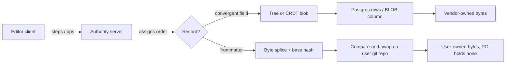

## 25. How comparable products are actually built

### 25.1 The eleven systems, opened

Every row below was read from the source named, on 2026-08-30. Star counts and versions are the values the GitHub API returned that day [measured].

| System | Storage model | Sync model | Editor core | Collaboration | Scaling story | Source |
|---|---|---|---|---|---|---|
| **Google Docs** | Revision log + current state on server | OT; client tracks 4 items (last server revision, unsent, sent-unacked, local state), server tracks 3 (queue, full revision log, current state) | Proprietary | Character-level, always converges | Not published | [fetched] `drive.googleblog.com/2010/09/whats-different-about-new-google-docs.html`, 2010-09-23 |
| **Jupiter (the ancestor)** | Central server holds world state | Centralised OCC + operation transformation, derived from Ellis & Gibbs | Widget toolkit | Serialised update streams | n/a | [fetched] Nichols, Curtis, Dixon, Lamping, Xerox PARC, *UIST '95*, PDF 175,773 B |
| **Figma** | `Map<ObjectID, Map<Property, Value>>` tree; comments/teams/projects in **Postgres, separate system** | Not OT, not "true CRDTs"; per-property last-writer-wins, server defines order | Custom canvas | Property-atomic; concurrent text edits do **not** merge | One server process per document; Rust | [fetched] Evan Wallace, 2019-10-16 |
| **Linear** | Models + properties + references; IndexedDB per workspace | Transactions → server → delta packets; global monotonic `lastSyncId` = DB version; total order | n/a (issue tracker) | Object-graph sync, not document sync | Lazy hydration, 5 load strategies, permission-scoped `syncGroups` | [fetched] `wzhudev/reverse-linear-sync-engine`, 2,158 ★, endorsed by Linear's CTO |
| **Notion** | Every unit is a block row: UUID v4, type, properties, `content[]`, `parent` | Server-authoritative | Proprietary | Block-level | 480 logical shards / 32 physical Postgres DBs, partitioned by workspace ID; re-sharded 2023 | [fetched] Notion blog 2021-05-18, 2021-10-06, 2023-07-17 |
| **Obsidian** | Plain files on the user's disk; no server copy required | Optional paid Sync, E2E encrypted, version history | CodeMirror | Shared vaults (file-level) | 7,115 community plugins [measured, `community-plugins.json`]; Sync $4/user/mo annual, Publish $8/site/mo annual | [fetched] `obsidian.md/pricing`, `stephango.com/file-over-app` |
| **Outline** | Three columns per document: `text` (markdown, **@deprecated**), `content` (ProseMirror JSONB), `state` (Yjs BLOB) | Yjs 13.6.31 + y-prosemirror 1.3.7 | ProseMirror | CRDT | Hard cap `maxStateLength` 1,536,000 B | [fetched] 40,380 ★, **BSL 1.1** with a "Document Service" use restriction, v1.9.1 |
| **HedgeDoc / CodiMD** | Markdown text is the record | Classic ot.js: `text-operation.js`, `wrapped-operation.js`, `editor-socketio-server.js` over socket.io 2.2 | CodeMirror | OT on markdown source | Per-pad state in a Node process | [fetched] 10,136 ★ / 7,386 ★, AGPL-3.0 |
| **AppFlowy** | Rust `collab-*` crates over `yrs` 0.21, SQLite via diesel, RocksDB, tantivy search | CRDT | Custom (Dart/Rust) | Yjs-compatible | Local-first desktop | [fetched] 76,077 ★, AGPL-3.0 |
| **AFFiNE** | BlockSuite docs in Yjs (patched 13.6.21) | CRDT | Custom | Yjs | v0.27.0; MIT frontend, separate backend licence | [fetched] 72,019 ★ |
| **Docmost** | Postgres via Kysely, BullMQ/Redis, pgvector 0.2.1; `collaboration/yjs.util.ts` | Yjs | Tiptap/ProseMirror | CRDT | v0.95.0 | [fetched] 21,514 ★, AGPL-3.0 |

Two more that set the priors: **ProseMirror** (8,702 ★, MIT) ships a collab module whose documented algorithm is "a central authority which determines in which order changes are applied… the other's changes will not be accepted, and… it'll have to rebase" [fetched, `prosemirror.net/docs/guide/`] — that is compare-and-swap with a different name. **Dropbox** rewrote its sync engine in Rust over four years because "Sync Engine Classic represents moves as pairs of deletes at the old location and adds at the new location", so a half-delivered move made a file disappear from the server and every other device [fetched, `dropbox.tech`, 2020-03-09].

### 25.2 The pattern table

| Converged practice | Who does it | Count |
|---|---|---|
| A central server assigns a total order | Google Docs, Jupiter, Figma, Linear, ProseMirror, Etherpad (18,514 ★, Apache-2.0), CodiMD; and every Yjs deployment above runs one authoritative server | 11/11 [fetched] |
| The record is a structured tree or binary blob, not document text | Notion, Figma, Outline, AFFiNE, AppFlowy, Docmost, Linear | 7/11 [fetched] |
| Document text is the record | Obsidian, HedgeDoc/CodiMD | 2/11 [fetched] |
| Relational DB as the control plane, holding metadata not document bytes | Figma explicitly ("comments, users, teams, projects… stored in Postgres, not our multiplayer system") | [fetched] |
| CRDT chosen by open-source projects; hand-rolled LWW/OT chosen by the well-funded | Outline/AFFiNE/AppFlowy/Docmost vs Figma/Linear/Google | [fetched] |
| Shard the control plane by tenant | Notion: workspace ID → one of 480 logical shards | [fetched] |

The two systems that reject CRDTs give the same reason in different words. Figma: "CRDTs are designed for decentralized systems where there is no single central authority… we can simplify our system by removing this extra overhead." Linear's documented rationale: CRDTs "introduce metadata overhead and become challenging to manage in scenarios involving partial syncing or permission controls" [both fetched].

The cost they are avoiding is measurable. On Kleppmann's 260k-operation editing trace, Automerge's own published table gives 107,121 bytes of plain text, 129,062 bytes for Automerge 2.0, and 146,406,415 bytes for Automerge 0.14 [fetched, `automerge.org/blog/automerge-2/`]. [derived] 129,062 ÷ 107,121 = 1.205, a 20.5% steady-state overhead; 146,406,415 ÷ 107,121 = 1,366.8×, the amplification before the Rust rewrite. Yjs on the same trace: 1,074 ms, 10,141,696 bytes resident [fetched].

### 25.3 Where we are conventional, and where we are genuinely unusual

| Our decision | Verdict | Evidence |
|---|---|---|
| Server is the total-order authority; writes are compare-and-swap | **Conventional.** Identical in shape to ProseMirror's authority and Linear's `lastSyncId` | [fetched] |
| Postgres as a control plane holding zero document bytes | Conventional. Figma runs exactly this split | [fetched] |
| Blobs in object storage (R2), out of the DB | Conventional | [inference] |
| No arbitrary client-side plugin execution | Conventional among web products; Obsidian is the outlier at 7,115 plugins, and that is a desktop trust model we cannot copy | [measured] |
| Deterministic simulation testing of the engine | Conventional at the top end only — Dropbox runs "millions of scenarios every day" from seeds | [fetched] |
| The byte sequence of a markdown file is the record | **Unusual.** Only Obsidian, and Obsidian does no server-side collaborative editing of those bytes | [fetched] |
| git merge as the document merge function in a live editor | Unusual to the point of unique in this set | [inference] |
| Documents live in the user's own repo | No comparable product does this | [inference] |
| Cross-engine degradation certification | No published equivalent found | [inference] |

The moat and the risk are the same fact. Outline's source marks its markdown column `@deprecated` and directs callers to `DocumentHelper.toMarkdown` "if exporting **lossy markdown**" [fetched, `server/models/Document.ts`]. The market's most-starred open collaborative editor concluded markdown could not be the record; if they are right, our whole surface is a smaller product than theirs. If they are wrong, we own the only exit-proof record in the category. Anti-recommendation: if a design partner's first three requests are merged table cells, block-anchored comments that survive reflow, and a database view, the tree is correct and this section is an argument against us, not for us.

The second unusual risk is dependency, not design. Notion owns its 32 Postgres hosts and pages itself when they hit 90% CPU [fetched]. We would own none of the storage our customers' documents sit in, which means a GitHub outage or a rate-limit change is an incident we can neither page nor fix. Conventional products cannot have that outage; we can.

### 25.4 What the ones who lost data did wrong, and whether we have the same hole

| Incident | Mechanism | Do we have it? |
|---|---|---|
| **GitLab, 2017-01-31** — ~300 GB removed from the primary; modifications from 17:20–00:00 UTC lost; ~5,000 projects, 5,000 comments, 700 accounts gone [fetched] | Five recovery paths, all dead: `pg_dump` running the 9.2 binary against a 9.6 cluster and failing silently for months; the cron failure emails rejected by DMARC so nobody knew; Azure snapshots never enabled on DB hosts; LVM snapshots not intended for DR; replication already broken. Recovery came from a manual snapshot an engineer happened to take 6 hours earlier | **Yes, in the same shape.** Our restore path is R2 + the splice journal + the user's remote, and none of it is proven until a restore is executed. Fix: a monthly drill that reconstructs a random document from R2 plus journal and byte-compares against the repo; alert on a *channel that fails loudly*, never email |
| **Dropbox Sync Engine Classic** [fetched] | Files had no stable identifier across moves; a move was a delete plus an add, so a partial delivery removed the file everywhere | **No, if the journal is disciplined.** A splice must be one atomic record carrying the base content hash and both offsets. The moment a rename or move is expressed as two records, we have rebuilt the exact bug |
| **Dropbox, 2014-01-10** [fetched] | An OS-upgrade script's state check was buggy and reinstalled live master-replica pairs. Fix shipped: machines "locally verify their state before executing incoming commands" and refuse destructive ops | Partially. Our control plane holds no document bytes, so the blast radius is metadata — but the same self-verification rule should gate any job that touches R2 or a customer remote |
| **Outline** [fetched] | `maxStateLength` = 1,536,000 B, with the user-facing error "Document collaborative state is too large, you must create a new document". [derived] against `maxRecommendedLength` 250,000 characters, that is 6.1 bytes of CRDT state permitted per recommended content character | Not for document bytes — we store none. But the splice journal grows without bound, so compaction must be provably byte-identical and must run before any cap is reachable |
| **Figma** [fetched] | Deleted objects' properties are kept nowhere on the server — only "in the undo buffer of the client that performed the delete", which is a deliberate trade to stop documents growing forever | Latent. Never let the only copy of pre-edit bytes live on a client. Pre-image goes to R2 before the CAS, or the edit does not happen |
| **Automerge 0.14** [fetched] | 146 MB on disk for a 107 KB document; the maintainers' own words: "much too slow and used too much memory for most production use cases" | No — we are refusing the mechanism that caused it |

### 25.5 The three converged decisions we are contradicting

**One — the record should be a structured tree, not text.** Seven of eleven systems store a tree or a CRDT blob, and Outline has actively demoted markdown to a deprecated column [fetched]. Our justification is that the projection law is the product: portability, diffability, git-mergeability and AI-legibility all fall out of the bytes being the record, and every one of them dies the moment a tree becomes canonical. The honest price is expressive ceiling, which we pay explicitly by refusing features markdown cannot carry and by shipping the degradation certificate so the ceiling is a published number rather than a surprise. *Anti-recommendation:* if a paying segment needs merged cells, reflow-surviving block anchors, or relational views, build the tree — and if you build it, do not keep a markdown column alongside it, because Outline's three-representation row is the strongest published argument that dual records rot.

**Two — concurrent editing must converge at character level.** Every system here except Obsidian either runs OT (Google Docs, CodiMD, Etherpad) or a CRDT (Outline, AFFiNE, AppFlowy, Docmost). We run git merge plus a splice journal plus CAS. The justification is that the field's own leaders already broke this rule where it cost too much: Figma states plainly that if one client changes text B to AB while another changes it to BC, "the end result will be either AB or BC but never ABC" [fetched], and Linear rejected CRDTs over partial-sync and permission cost [fetched]. ProseMirror's central authority is reject-and-rebase, which is CAS wearing a different hat [fetched]. *Anti-recommendation:* two people typing in the same paragraph is exactly the case we lose. If pilot telemetry shows same-paragraph concurrency above a few percent of sessions, adopt Yjs for the live editing buffer only — never for the record — and accept a second representation with all the rot risk named above.

**Three — the vendor should own the bytes.** Ten of eleven do. Our zero-byte control plane collapses the DPDP and GDPR surface, removes storage COGS from unit economics, and makes the moat something other than lock-in. It also imports an availability dependency we cannot page and, for some enterprise buyers, fails a retention or eDiscovery requirement outright. *Anti-recommendation:* for those buyers, offer a managed repo — the identical engine pointed at a remote we operate — rather than bending the D2C architecture toward custody it was designed to avoid.
