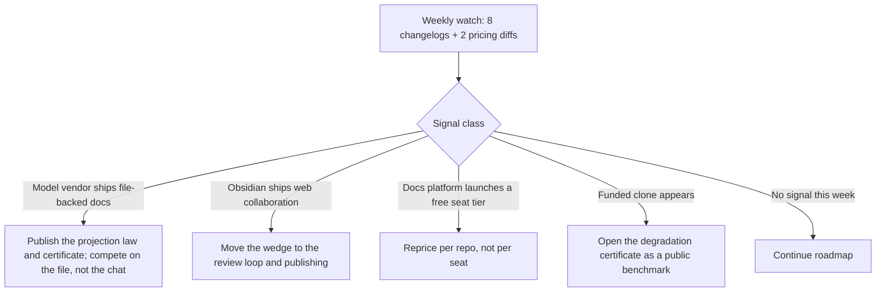

## 26. Remaining market and audience questions

### 26.1 Segment table

All prices, star counts and API counts below were read on 2026-08-30 unless stated. "WTP/yr" is the realistic annual contract value per buying unit, not per person.

| # | Segment | Size evidence | WTP/yr | Reachability | Effort to serve | Verdict |
|---|---|---|---|---|---|---|
| 1 | AI-native non-developer knowledge worker (analyst, PM, solo researcher, indie consultant) | Evernote's free tier is capped at 50 notes / 1 notebook / 1 device / 1 GB and it now ships an MCP connector to "Claude, ChatGPT, and any MCP-compatible AI tool" [fetched, evernote.com/compare-plans]; Notion Plus $10, Business $20 per member/month [fetched, notion.com/pricing] | $120–240 (1 seat) | High — same channels as D2C launch, no new motion | Low; it is the default product | Primary D2C target |
| 2 | Technical writer / documentation engineer as an individual | "technical writer" appears in 1,241 HN comments all-time vs 28 for "documentation engineer" and 104 for "docs as code" [measured, hn.algolia.com/api/v1/search] | $180–600 (1–3 seats) | High — Write the Docs, r/technicalwriting, docs-as-code conference circuit | Low | Beachhead; see 26.2 |
| 3 | Docs team at an API-first company (team budget) | Mintlify Pro $450/mo, Starter free at 5 editor seats [fetched, mintlify.com/pricing]; ReadMe Pro $250/mo annual + Ask AI add-on $150/mo [fetched, readme.com/pricing]; GitBook Premium $65/site/mo + $12/user/mo annual [fetched, gitbook.com/pricing] | $900–5,400 | Medium — they already have a vendor | Medium; needs publish targets we have | Self-serve B2B core |
| 4 | Developer relations / advocacy teams | "developer relations" 1,087 and "developer advocate" 806 HN comment hits all-time [measured] | $300–1,200 | Medium-high — DevRel is publicly visible and answers DMs | Low | Influence, not budget — see 26.5 |
| 5 | Open-source maintainers | 472,539 GitHub repos at ≥100 stars, 64,391 at ≥1,000, 5,515 at ≥10,000 [measured, api.github.com/search/repositories]; distinct maintainer accounts are materially fewer because owners hold many repos [inference] | $0–120 | Very high — the repo is the contact surface | Low, if the free tier is honest | Distribution channel, not revenue |
| 6 | Boutique consultancies and agencies (client deliverables) | Management consulting is defined as fee-for-outcome advisory work delivered to client organisations [fetched, en.wikipedia.org REST summary, Management_consulting]; the deliverable is a document whose provenance the client audits [inference] | $600–3,000 (3–10 seats) | Medium — no single watering hole | Medium; needs per-client repo isolation and branded export | Underrated; see 26.2 |
| 7 | Regulated industries needing audit trails (GxP, broker-dealer, clinical, ISO/QMS) | 21 CFR 11.10(b) requires "accurate and complete copies of records in both human readable and electronic form" and 11.10(e) requires "secure, computer-generated, time-stamped audit trails… Record changes shall not obscure previously recorded information" [fetched, ecfr.gov, title 21 part 11]; SEC 17a-4(f)(1)(ii) defines an electronic recordkeeping system as one that "preserves records in a digital format in a manner that permits the records to be viewed and downloaded" [fetched, ecfr.gov, title 17 §240.17a-4] | $2,000–15,000 | Low — gated by procurement and vendor questionnaires | High; SOC 2, validation pack, DPA | Underrated technically, dangerous commercially; see 26.2 and 26.5 |
| 8 | Note-taking refugees off Evernote / Notion | Evernote is owned by Bending Spoons, which "acquires products with existing product-market fit" and became public on 2026-07-01 [fetched, en.wikipedia.org REST summary, Bending_Spoons]; Obsidian is free with Sync at $4/user/mo annual and Publish at $8/site/mo annual [fetched, obsidian.md/pricing] | $0–96 | Very high — the loudest, cheapest audience on the internet | Low to acquire, high to retain | Traffic, mostly not revenue — see 26.5 |
| 9 | Non-English markets beyond India, Japan first | 46 of the 100 most recent Zenn articles carry a non-null `source_repo_updated_at`, i.e. were authored in a linked GitHub repo rather than the web editor [measured, zenn.dev/api/articles?count=100&order=latest]; Zenn documents the GitHub-repo workflow as a first-class mode [fetched, zenn.dev/zenn/articles/connect-to-github]; Qiita's public API reports 1,219,224 items [measured, `total-count` header, qiita.com/api/v2/items]; Obsidian ships 15 UI languages including 日本語, 한국어, Português (Brasil), Deutsch, 简体中文 [fetched, obsidian.md/pricing] | $120–360 | Medium — needs one local voice, not a localisation project | Medium | Most underrated; see 26.2 |
| 10 | Education as buyer (departments, labs, MOOC producers) | 3,931 Title IV degree-granting institutions in the US alone [fetched, en.wikipedia.org REST summary, Higher_education_in_the_United_States]; iA Writer offers a 20% educational discount and Apple Business Manager volume purchasing [fetched, ia.net/writer/pricing] | $500–5,000 per department | Low — purchase orders, annual windows | High; VPAT, SSO, invoicing | Anti-recommend for 24 months — see 26.5 |
| 11 | Paid technical authors and course producers | Zenn lets authors price a book from ¥0 to ¥5,000 and pays out cash or Amazon gift cards [fetched, zenn.dev/about] | $120–300 | Medium | Low | Adjacent to 9; free rider on the same build |

Reachability note that changes the ranking: geography-priced consumer competitors are already discriminating. Craft's pricing page served INR to this machine — Plus ₹526.7/month billed yearly, Family ₹986.7, Team ₹3,792 [fetched, craft.do/pricing]. Selling globally from India means choosing whether to mirror that or hold one USD price; the incumbents have already answered.

### 26.2 The two segments the previous thirteen rounds most underrate

**Japan is the one market on earth that has already been trained to accept this product's hardest premise — that your documents live as markdown files in your own git repo — and 46% of the last hundred Zenn articles prove it in production, not in a survey.** [measured, 2026-08-30]

The rounds covered India billing and i18n as a compliance and rendering problem. They did not ask where the premise is already normal. Zenn's own documentation describes linking a GitHub repository so that "creating and updating posted content is all done inside the repository" [fetched, zenn.dev/zenn/articles/connect-to-github, page dated 2020-09-06, last updated 2026-08-26]. Qiita, the older and larger Japanese platform, is at 1,219,224 public items [measured]. The onboarding objection that costs the most everywhere else — "why is my document a file?" — does not have to be argued there. What has to be argued instead is Japanese typography, line breaking, and IME behaviour in the editor, which are engine problems, not market problems.

Recommendation: after the English D2C launch stabilises, run one Japanese landing page and one Zenn article written by a paid native technical writer, and instrument signup-by-locale. Anti-recommendation: do not localise the product UI first. Obsidian ships 15 languages [fetched] and that is the output of a large community, not the input to one; a solo founder who localises before a single Japanese paying user exists has bought a maintenance burden with no signal attached.

The second underrated segment is the boutique consultancy, and the reason is the engine, not the editor. A consultancy's product is a document that a client will later dispute. Row 7's regulatory language is the general case of the same need: 21 CFR 11.10(e) demands audit trails where "record changes shall not obscure previously recorded information" [fetched, eCFR]. A byte-preserving splice edit with a journal is that sentence implemented. Every other document tool in the segment either rewrites the file on save or stores the truth in a proprietary block database.

Recommendation: sell the splice journal to consultancies as "prove what changed and when, per client, in a repo you hand over at the end of the engagement", priced per client-workspace rather than per seat. Anti-recommendation: do not pursue the regulated-industry version of this in the first 24 months. The compliance buyer needs a validation package, a SOC 2 report, a signed DPA and a vendor security questionnaire before the first dollar; that is a two-person compliance function, and a solo founder who takes the first pharma pilot will spend the following six months not shipping.

### 26.3 Threat map, 24 months

| Entrant | What they would have to build | Trigger that starts it | Early-warning signal a solo founder can actually watch | Lead time |
|---|---|---|---|---|
| Anthropic / OpenAI | A durable, file-backed artifact store so agent output survives the session | Agent output volume outgrows chat transcripts; enterprise customers demand retention | This session's own harness already exposes a first-party publish-a-document surface with versioning and comments [measured, tool surface available here, 2026-08-30]. Watch docs.claude.com changelog and the OpenAI release notes for a *file-on-disk* or repo-connected doc store, not a hosted page | 6–12 months |
| GitHub / Microsoft | WYSIWYG + collaboration on top of the existing web editor | Copilot needs a review surface for prose diffs, not just code diffs | A "docs" SKU appearing on github.com/pricing; github.dev gaining a rendered-edit mode; job posts for "documentation product" roles | 12–24 months |
| Google | Native `.md` storage in Drive rather than import/export conversion | Gemini output needs a home that engineers accept | workspaceupdates.googleblog.com RSS; the tell is Drive storing markdown as the stored bytes rather than converting into a Docs blob | 12–24 months |
| Obsidian | Real-time collaboration and a web editor on top of local files | Their own Sync page already advertises "Collaborate on shared vaults" and priority support at $4/user/mo annual [fetched, obsidian.md/pricing] | obsidian.md/changelog and the Discord release channel; watch for git-native branching, merge UI, or any browser editor | 6–18 months — highest-overlap incumbent |
| Docs platforms moving down-market | A cheap generic editor untied to a published site | Seat-based competition; their floors are high — Mintlify Pro $450/mo, ReadMe Pro $250/mo, GitBook $65/site + $12/user [fetched] | Pricing-page diffs, weekly. A new free or sub-$10 tier that does not require publishing a site is the signal | 6–12 months |
| IDE vendors (Cursor, Zed) | A prose mode with review-oriented diffs | Agents generate more prose than code in some repos | zed-industries/zed is at 89,451 stars and pushed 2026-08-30 [measured]; watch release notes for "markdown", "docs mode", "prose diff" | 12–24 months |
| A funded clone | The surface only; the engine takes longer than a seed round | Our own public traction becomes legible | Seed announcements using the phrase "Google Docs for markdown"; new npm packages implementing byte-preserving markdown splices | 3–9 months |
| Bending Spoons | Acquisition-led consolidation of the notes category | Public since 2026-07-01 [fetched], with an acquire-and-optimise model [fetched] | Acquisition press releases naming a markdown or notes asset | 12–24 months |

Recommendation: automate the eight changelog feeds and two pricing-page diffs as a cron job that opens an issue on change; the whole watch costs one afternoon. Anti-recommendation: do not build a competitive-intelligence dashboard or a scored threat model — a solo founder cannot act on more than one competitive signal per quarter, and the instrumentation will outlive the attention available to read it.

### 26.4 What would have to be true for each segment to become the main business

Each condition below is falsifiable within one quarter with instrumentation already planned.

| Segment | What must be true | Test | Kill criterion |
|---|---|---|---|
| 1. AI-native non-developer | People who never chose markdown will accept a file-backed document because their AI already emits markdown | ≥25% of signups declare a non-engineering role and reach week-4 retention within 5 points of engineers | Non-engineer week-4 retention more than 15 points below engineers |
| 2. Individual technical writer | The individual can buy without their team's docs-platform vendor being displaced | ≥50 self-serve seats sold to people whose employer runs Mintlify/ReadMe/GitBook | Fewer than 10 in a quarter, or all churn at renewal |
| 3. Docs team | We win on price plus review loop against a $4,800/yr ReadMe Pro + Ask AI bundle [derived: $250 + $150 = $400/mo × 12] while a 5-seat plan at $15/seat/mo costs $900/yr [derived: $15 × 5 × 12], i.e. 18.75% of it [derived: 900 ÷ 4,800] | ≥5 teams migrate a live docs site and keep publishing for 90 days | Migrations complete but publishing stops — we sold an editor, not a pipeline |
| 4. DevRel | DevRel holds or can trigger a budget line, not just influence | ≥3 paid team plans originated by a DevRel title | All DevRel-sourced deals stall at "I'll ask engineering" |
| 5. OSS maintainers | Free maintainer usage converts downstream at the maintainer's employer | ≥15% of paid team accounts trace to a maintainer who used the free tier first | Under 5% attribution after 2 quarters |
| 6. Consultancies | Per-client workspace isolation plus handover export is worth 3–10 seats | ≥10 firms paying for ≥3 client workspaces each | Firms buy 1 seat and use it as a personal editor |
| 7. Regulated | A compliance partner carries SOC 2, validation and questionnaires so the founder does not | A signed reseller or MSP partner exists before the first pilot | Any pilot that requires us to author a validation package ourselves |
| 8. Note refugees | Refugees pay rather than route to the free tier | Paid conversion from import-flow signups ≥8% | Under 3%, which is the honest expectation [inference] |
| 9. Japan | The git-authoring premise transfers to paid subscription, not just free publishing | ≥100 Japanese paying users from one landing page and one Zenn article | Traffic without signup — a rendering or IME defect, fix before concluding market failure |
| 10. Education | An institution can buy without an RFP | ≥3 departments purchase by card under a delegated budget | First deal requires a purchase order, a VPAT and a security review |
| 11. Paid authors | Publishing targets are good enough to replace a bespoke pipeline | ≥20 authors ship a paid book or course from the product | Authors export and finish elsewhere |

### 26.5 Anti-recommendations

Segments that will absorb effort and not convert, with the specific failure mode.

Education as an institutional buyer, for 24 months. 3,931 US degree-granting institutions [fetched] is a large number attached to the slowest purchasing process in software. The failure mode is not rejection, it is a nine-month cycle ending in a request for accessibility conformance documentation, SSO, and invoicing in a currency and instrument a solo Indian founder cannot easily issue. Serve education only through the same self-serve card flow as everyone else, with the discount iA Writer already normalises at 20% [fetched, ia.net/writer/pricing]. Do not build procurement.

DevRel as a buyer. DevRel is the highest-leverage audience in the table and one of the weakest budgets. They are reachable, publicly visible, generous with amplification, and almost never able to sign. Treat DevRel as the distribution channel for segment 3 and price nothing to them directly.

Evernote and Notion refugees as a revenue segment. They convert to traffic reliably and to payment poorly. Evernote's free tier at 50 notes and 1 device [fetched] manufactures a stream of people whose defining preference is not paying; the ones who do pay have already gone to Obsidian, where the app is free and Sync is $4/user/mo [fetched]. Build the import path because it is cheap and it feeds segment 1, and forecast nothing from it.

Open-source maintainers as revenue. 472,539 repos at ≥100 stars [measured] is a distribution surface, not a market. Maintainers are the most vocal free-tier population in software and the most likely to file feature requests that serve nobody who pays. Give them a genuinely unlimited free tier for public repos, and refuse every roadmap item that only a free public repo would need.

Regulated enterprise without a partner. The 21 CFR Part 11 language maps to the engine almost word for word [fetched], which is exactly why this is a trap: the technical fit is so good that it is tempting to chase before the commercial apparatus exists. The failure mode is a single pharma pilot consuming two quarters of build capacity to produce one logo and no repeatable motion.

China. Yuque and Feishu own the equivalent territory, and the payments, hosting and content-compliance requirements are not addressable by a solo founder in India. Japan, Korea and Brazil are the reachable non-English markets; treat China as out of scope rather than deferred.

Product-UI localisation ahead of demand. See 26.2. One landing page and one native-language article per market, then measure; the UI translation is the reward for a market that already paid, never the bet that opens it.
