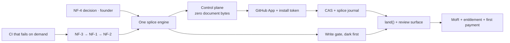

## 27. The build sequence, given the stack

§28 sequences features. This sequences *layers*. The ordering constraint is not "what does a user want next" but "what physically cannot be built until something else is true", and the stack has six places where that constraint bites: bytes (MDMAX), domain (`src/modules/`), the Next 16.2.6 app surface, the Postgres control plane, the user's own git repo reached through a GitHub App, and Cloudflare R2. Every item below names the layer it touches and the item it cannot start without.

### 27.1 Dependency-ordered work breakdown — empty CI to first payment

Layer codes: **ENG** bytes · **DOM** `src/modules/` · **APP** Next route or server action · **UI** CodeMirror 6 / React 19 · **CP** Postgres control plane (zero document bytes) · **BLOB** R2 · **GIT** GitHub App and the user's repo · **CI** GitHub Actions · **PAY/LEGAL** money and identity.

| # | Item | Layer | Cannot start until | Owner |
|---|---|---|---|---|
| E0 | Rotate the two PATs | credential | — | founder |
| E1 | `ci.yml`: typecheck · lint · test · build · arch · spec | CI | E0 | agent |
| E2 | Red-proof the workflow on a deliberately broken commit | CI | E1 | agent |
| E3 | Replace `npm run budget` — today literally `echo 'No bundle budget configured yet — skipping'` `[measured 2026-08-30]` — with a byte ceiling that exits 1 | CI | E1 | agent |
| E4 | `npm run corpus` as a CI job, pinned at the 8,513-file count the runner already hard-codes `[measured: literal 8,513 in scripts/corpus-foreign.mjs]` | CI+ENG | E2 | agent |
| E5 | NF-3 **red proof**: a set-only assertion on a synthetic bare-CR fence that fails at HEAD | ENG | E4 | agent |
| E6 | NF-3 fix: `FM_OPEN` accepts `---\r`; a lone set stops prepending a second block | ENG | E5 | agent |
| E7 | NF-1 red proof, then fix: column-0 `-` is a continuation of the preceding key | ENG | E6 | agent |
| E8 | NF-2: flow-seq closing `]` at column 0 | ENG | E7 | agent |
| E9 | Re-derive the recovery rate from the *patched* writer; commit the run's own JSON | ENG | E7, E8 | agent |
| E10 | NF-4 decision: one page on NFC/NFD key equality | spec | — (start day 1) | founder |
| E11 | `SAFE_KEY` quoted-key implementation | ENG | E10 | agent |
| E12 | Seam 3 — one splice engine replacing `splice-frontmatter.ts`'s single-key scanner | ENG→DOM | E8, E11 | agent |
| E13 | Seam 2 — write gate **dark**, behind a flag defaulting off | DOM→APP | E9 (residual ≤2/7,969) | agent |
| E14 | Write gate default-on | APP | E13 + 7 days of dark telemetry | founder call |
| E15 | Control-plane schema: repos, installations, entitlements, journal rows. Zero document bytes | CP | E12 (journal row shape) | agent |
| E16 | Register the GitHub App; private key, callback URL, permissions | GIT | E15 (needs a deployed callback) | founder |
| E17 | Installation-token git adapter | GIT+APP | E16 | agent |
| E18 | Compare-and-swap write path keyed on blob sha | GIT+CP | E12, E17 | agent |
| E19 | Splice journal writes | CP | E18 | agent |
| E20 | Conflict inbox | UI | E19 | agent, founder-reviewed |
| E21 | Two-device offline rig | test | E20 | founder witnesses |
| E22 | Identity and multi-tenancy | CP+APP | E17 | agent |
| E23 | MCP server + `land()` | APP | E12, E18 | agent |
| E24 | Review surface; reject leaves the file byte-identical | UI | E23, E20 | agent |
| E25 | Seam 4 — certificate sidecar job to R2 | BLOB | E12 | agent |
| E26 | ChatGPT / Claude importers + drop report | APP | E13 | agent |
| E27 | MoR, ToS, privacy, EU Art. 27 representative | LEGAL | — (vendor clock; start at E15) | founder |
| E28 | Paywall and entitlement check | CP+PAY | E22, E27 | agent |
| E29 | First paying non-founder account | — | E28 + M0–M6 | founder |

**Nothing measured before E2 is evidence, because a gate that has never been seen to fail has not been seen at all** — the repo already carries a commit named for four gates that reported green while blind (`9e84628`) `[measured: git log]`.

*Anti-recommendation:* do not front-load E15 (the control plane) because it feels like "real product". Written before E12, the journal row shape is a guess, and a schema guess costs a migration on live tenant data — the most expensive kind.

### 27.2 The critical path

Ten nodes. Renders (kanban, decision, calendar) appear nowhere on it, which is the single biggest difference between the feature roadmap and the engineering one.

### 27.3 The first ten commits

Every proof below is falsifiable in the same way: run the check at the parent commit and it must produce the opposite result. A check that passes at both commits is measuring the shell, not the system.

| # | Commit | What it does | How you know it worked |
|---|---|---|---|
| 1 | `chore(ci): add ci.yml — typecheck, lint, test, build, arch, spec` | Creates `.github/`, which does not currently exist `[measured]`. Six jobs, no `continue-on-error`, no path filters | `gh run list --json conclusion,headSha` shows a completed run for the head sha. Free-tier private repos get 2,000 CI/CD minutes/month `[fetched github.com/pricing 2026-08-30]` — a 6-job matrix must stay well inside it |
| 2 | `test(ci): deliberately break typecheck, observe red, revert` | Two commits' worth of history in one PR: a `const x: number = "a"`, then its revert | The run on the broken sha has `conclusion: failure`; the revert's run is `success`. If the first is green, the workflow is blind and every later number is void |
| 3 | `chore(ci): budget asserts a real byte ceiling` | Replaces the echo stub with a measured `.next` output ceiling | `npm run budget` exits 0 at the current size and exits 1 when the ceiling constant is lowered by one byte |
| 4 | `ci(corpus): run npm run corpus on engine/** and nightly` | Wires the existing runner into the workflow; asserts the file count, not just the exit code | The job fails when the pinned count is edited from 8,513 to 8,512. A corpus gate that cannot notice its own corpus shrinking is decorative |
| 5 | `test(engine): red proof — bare-CR fence set-only (NF-3)` | A set-only assertion on a synthetic fixture. Set-then-delete cancels the defect out, which is why a round-trip oracle never saw it | The new test **fails** at this commit. `git stash list` empty, `npm run test -- nf-003` exits 1 |
| 6 | `fix(engine): FM_OPEN accepts ---\r; a lone set no longer prepends a block` | The fix for #5 | #5's test passes here and fails at `HEAD~1`. The corpus cannot corroborate — zero bare-CR fences exist in all 8,513 files — so the synthetic fixture *is* the evidence |
| 7 | `test(engine)+fix: column-0 '-' is a continuation (NF-1)` | Red proof then fix, same commit-pair discipline | The corpus refusal count printed by the runner drops; the number is read out of the run's JSON, never typed by hand |
| 8 | `chore(engine): re-derive the recovery rate from the patched writer` | Commits the artifact the runner emitted, replacing the 99.98% inference with a count | `refused ≤ 2 of 7,969`, `changed = 0`, `threw = 0`, all three read from the committed JSON. If refused > 10, NF-1 was never one bug |
| 9 | `fix(engine): flow-seq closing ] at column 0 (NF-2)` | The last of the three walk defects | Its own red proof fails at `HEAD~1`; corpus residual does not regress |
| 10 | `refactor(vault): route writes through shape-gate + placement behind FM_WRITE_GATE (default off)` | Seam 2 lands dark | With the flag off, a known-refusable fixture still saves. With it on, the same request returns 4xx with a named reason. `npm run arch` still reports `"violations": []`, and no file under `src/modules/mdmax/` imports from `src/modules/*` |

*Anti-recommendation:* do not batch commits 5–9 into one "engine fixes" PR. The red-proof discipline only works if each fix has a parent commit at which its test fails; a squashed PR destroys exactly that evidence.

### 27.4 Agent-ownable versus founder-only

| An agent owns end to end | Why it can | Founder only | Why it cannot be delegated |
|---|---|---|---|
| `ci.yml`, budget gate, corpus job | Mechanical verifier; the artifact is one file | PAT rotation (E0) | The agent must never hold or print a credential; rotation is also the only item with a live blast radius today |
| NF-1/2/3 walk changes and fixtures | Disjoint files, each with a red proof | NF-4 key-equality decision (E10) | It is a written spec about Unicode normalisation, not code. An agent that guesses NFC vs NFD produces a plausible wrong answer |
| The six construct detectors, one agent each | Genuinely disjoint artifacts | GitHub App registration, private key, callback (E16) | Organisation identity plus a secret. No agent path exists that does not put the key in a transcript |
| CJK segmenter and MiniSearch bigram tokenizer | Test-verifiable against fixtures | MoR, CA, lawyer, EU Art. 27 rep (E27) | KYC binds a legal person. Lead times are vendor-clock, so start them the week the control plane starts |
| `globals.css` reconciliation, including the 2.14:1 token that fails WCAG AA | Contrast is computable; the check is a number | Watching the E21 two-device run | The gate *is* a human witness; a rig that scripts both devices in one process proves nothing |
| Importers, MCP scaffold, `land()` transport, test authoring | Contract-shaped; the verifier is byte-identity | Accepting or rejecting every agent diff | Write authority requires the full trace, not a task summary |

*Anti-recommendation:* do not fan agents out across the sync surface (E18–E20). It is one creative target carrying implicit architecture decisions — the conflict unit, the base-sha contract, the journal's replay semantics — and parallel agents will each settle them differently. Conversely, do not let the founder hand-write the corpus gate's numbers: a hand-computed count has no way to notice it is wrong.

### 27.5 Milestone gates, executable

| M | Command that decides it | Pass condition | How this gate could still lie |
|---|---|---|---|
| **M0** CI live | `gh run view <broken-sha> --json conclusion` then `<fixed-sha>` | `failure` then `success`; `npm run budget` exits 1 on a one-byte-lower ceiling | `continue-on-error`, path filters, or a job that only runs on `main` |
| **M1** Engine truth | `npm run corpus` → read its JSON | `refused ≤ 2 / 7,969`, `changed = 0`, `threw = 0`; NF-3's test fails at `HEAD~1` | Corpus count drifts off 8,513; assert it explicitly |
| **M2** MDMAX wired | `grep -rln "modules/mdmax" src \| grep -v "^src/modules/mdmax"` | ≥ 8 distinct files. Today it is exactly **2** — `get-snapshot.ts` and `search-index.ts` `[measured 2026-08-30]`. Plus `npx mdmax cert --fail-on=BROKEN` exits 1 on a seeded fixture inside CI | Type-only imports inflate the count; count value imports |
| **M3** Trust surface | Two machines, both offline, both edit, both reconnect; `sha256sum` before and after restore | Zero bytes lost; every divergence appears as a reviewable hunk; section restore reproduces the prior sha exactly | Both "devices" share a process, a clock, or a filesystem |
| **M4** Tenancy | A second GitHub account performs 100 sequential contents reads via an installation token | No 403. Unauthenticated reads cap at **60/hour** `[measured: api.github.com/rate_limit, 2026-08-30]`; authenticated at **5,000/hour** `[fetched docs.github.com REST rate limits, 2026-08-30]`. Files over 1 MB return only `raw`, and over 100 MB the contents endpoint is unsupported `[fetched docs.github.com/rest/repos/contents, 2026-08-30]` — the adapter must fall back to blobs before M4, not after | The founder's PAT is still in the environment; unset it and re-run |
| **M5** Agent protocol | External agent lands a change; reject it; diff | Post-reject sha256 equals pre-land sha256 | The reject path normalises line endings on the way out |
| **M6** Capture | One ChatGPT export ZIP through the importer | The drop report names a *seeded* lossy construct by count | A report that always prints zero is indistinguishable from a perfect import |
| **M7** v1 public | One non-founder card settles; entitlement flips | Webhook replayed in staging first, then live | A test-mode webhook flipping a production entitlement |

*Anti-recommendation:* do not add Playwright (v1.62.1, published 2026-07-30 `[fetched 2026-08-30]`) before M3. A browser suite written against a UI that is about to gain a conflict inbox is throwaway. Do add `fast-check` 4.9.0, MIT `[fetched registry.npmjs.org 2026-08-30]` at M1 — splice is exactly the shape property tests are for, and it is currently absent. Pin vitest while you are there: `^4.1.7` is installed, 4.1.11 is current `[measured / fetched 2026-08-30]`.

### 27.6 The three sequencing mistakes that cost the most

| Mistake | Why it is expensive | Early-warning signal, checkable weekly |
|---|---|---|
| **Seam 2 before E9** — turning the write gate on before the residual refusal rate is re-measured | At the measured foreign-vault refusal rate the gate rejects the large majority of publishes. It is an availability incident wearing a correctness costume, and it lands on new users first | The dark-mode counter shows any refusal on a non-founder account, or the corpus residual is above 2 of 7,969 while the flag is on anywhere |
| **Sync before CAS** — building the conflict UI before the compare-and-swap and journal contract exist | The conflict unit silently becomes "the file". Retrofitting a splice-level journal underneath a file-level inbox is a rewrite of E18–E20, after tenant data exists | Any migration adding a `content`, `body`, or `text` column to Postgres; any conflict record without a base blob sha. `grep -riE "add column .*(content\|body\|text)"` over migrations |
| **User PATs before the GitHub App** — shipping repo access on user-supplied tokens because `next-auth` v5 beta is already installed `[measured: ^5.0.0-beta.31]` | You become a credential custodian on day one, inherit the disclosure obligations that come with it, and owe every early user a migration when the App arrives | Any schema field, env var, or log line that could hold a `ghp_`/`github_pat_` string; any onboarding copy containing the words "paste your token" |

### 27.7 What v1 deliberately does not contain

| Not built | Why | What it costs |
|---|---|---|
| Kanban, decision and calendar renders | Off the critical path entirely | The demo is an editor. The "deep engine" claim has no visual proof, so the whole pitch rests on the certificate and the review loop landing well |
| Real-time multiplayer cursors | Settled: no CRDT for document bytes | Every head-to-head against Google Docs and Notion is lost on the feature grid. The counter-argument — byte preservation — must be *shown*, not asserted |
| Plugin marketplace and client-side code execution | Settled | No third-party long tail. Every integration is founder-built, which caps integration count at founder throughput |
| WYSIWYG | T6 | The non-technical half of D2C cannot be sold in v1; the addressable market in year one is people who already accept a markdown surface |
| Teams, roles beyond owner, SSO | T6 | Self-serve B2B lands single-seat. Expansion revenue is deferred a full release, and any buyer with a security questionnaire is out of scope |
| Full offline vault | Tauri v2 is in dependencies `[measured: ^2.11.0]` but offline is T6 | The "your files, your repo" promise is weaker while the app needs the network to open them |
| SOC 2 | Cost and calendar | Caps deal size. The ceiling is the buyer who does not run vendor review — which is the self-serve buyer, so this is deliberate, not accidental |

The cheapest item on the deferral question is the certificate job (E25), which is *not* deferred and costs almost nothing: one JSON sidecar per document per nightly re-certification is one Class A operation, priced at $4.50 per million with 1,000,000 free per month `[fetched developers.cloudflare.com/r2/pricing, page last updated 2026-08-07, read 2026-08-30]`. At 30 nights that is free up to 33,333 documents re-certified nightly `[derived: 1,000,000 ÷ 30 = 33,333]`, against $0.015/GB-month storage with free egress `[fetched, same source]`.

*Anti-recommendation:* do not treat this list as permanently settled. Renders and WYSIWYG are deferred on *sequence*, not on merit — the moment M5 is green and an agent can land reviewable changes, a render is the cheapest surface to build on top of the splice engine, and it moves ahead of T4.
