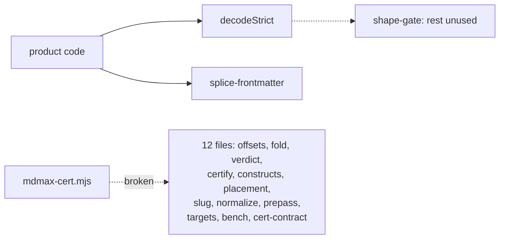

## 67. MDMAX as built — a line-level audit

3,614 lines across 13 files under `src/modules/mdmax/`, plus the 282-line splice writer and the 223-line CLI, read in full and executed here. 851 tests across 23 files pass in 1.82 s [measured: `npx vitest run test/mdmax test/share`]. The suite is green over a document-offset conversion that returns wrong answers, a certifier that silently drops blocks, and a CLI that cannot start. There is no `.github/workflows/` directory [measured: `ls` returns "No such file or directory"].

### 67.1 The fifteen files

| FILE | LINES | WHAT IT ACTUALLY DOES | PUBLIC EXPORTS | Q | CONCERNS |
|---|---|---|---|---|---|
| `domain/cert-contract.ts` | 168 | Types only — four verdicts, `Engine`, `Target`, `Certificate`, `CertFailure`. No runtime code. | 11 types/interfaces | B+ | Its own rule "`class` … Required whenever verdict === 'CORRUPT'" is a comment; `CellVerdict` declares `readonly class?: VerdictClass` on a non-discriminated shape, so a CORRUPT cell with no class typechecks. `brokenHistogram` already counts an `'UNCLASSED'` bucket for exactly that. |
| `domain/normalize.ts` | 62 | NFC → collapse an explicit 16-codepoint whitespace class → trim → lowercase → NFC. | `normalize`, `normalizeStamp`, `NORMALIZE_VERSION` | A | Pure, versioned, idempotent [measured]. Zero callers anywhere, including the anchor hash it was written to be. `.trim()` is in the code and absent from the documented pipeline "NFC → collapse whitespace → lowercase → NFC". |
| `domain/slug.ts` | 115 | Wraps `github-slugger`; resolves an anchor canonical-first then dash-collapsed. | `slug`, `collapsedSlug`, `slugDocument`, `resolveAnchor`, `decodeAnchor`, `slugStamp`, `SLUG_VERSION` | B | `resolveAnchor`, `collapsedSlug`, `decodeAnchor` and `slugStamp` have zero call sites and zero tests [measured]. The product slugs headings in `src/modules/preview/presentation/outline-utils.ts` with its own `new GithubSlugger()`, in the presentation layer, past this module entirely. |
| `domain/frontmatter-prepass.ts` | 121 | Quotes bare `[[…]]` values for a reader; refuses `TRIPLE_OPEN = /:\s*\[\s*\[\[/`. | `prepassFrontmatter`, `extractWikilinks` | B− | Zero callers. `src/modules/vault/infrastructure/markdown-parser.ts` ships a private `extractWikilinks` of its own — two implementations, the product uses the other one. |
| `domain/targets.ts` | 133 | Static registry of 15 (product, surface) pairs. | `TARGETS`, `LOCAL_TARGETS`, `uncertifiableShare`, `targetById`, `DECLARED_LAST_VERIFIED` | B | `DECLARED_LAST_VERIFIED = '2026-08-01'` is a literal with no staleness check in code. Nine of fifteen rows carry `engineId: 'remark-app'` — the app's own pipeline stands in for Obsidian, Notion, Typora, Bear, Slack, Discord. `targetById` uncalled. |
| `domain/offsets.ts` | 315 | Branded `U16Offset`/`ByteOffset`; `OffsetMap` with a 512-unit checkpoint table both ways. | `u16`, `u16OrThrow`, `unsafeU16`, `unsafeByte`, `splitsSurrogatePair`, `OffsetMap`, `utf8Length` | C | `toU16` returns `text.length` with `ok: true` for real interior byte offsets whenever `text.length % 512 === 0` (D1). `toByte` is unaffected. |
| `domain/shape-gate.ts` | 174 | Strict UTF-8 decode; one O(n) pass for bytes/lines/list-markers with early exit. | `decodeStrict`, `shapeGate`, `explainFailure`, `MAX_BYTES`, `MAX_LINES`, `MAX_LIST_MARKER_LINES`, `BUDGET_MS` | B− | `shapeGate` itself has zero call sites; only `decodeStrict` is imported (D5). Its invalid-UTF-8 column is wrong on multi-byte input (D4). 19,001 list lines gate in 2 ms [measured]. |
| `domain/placement.ts` | 154 | Insert-then-reparse-then-compare block skeletons; refuse on divergence. | `blockSkeleton`, `nearSetextUnderline`, `safeInsert`, types | C+ | Refuses safe insertions before any `---` thematic break, and permits insertion inside a fenced code block and inside an inline code span (D3). Zero callers. |
| `domain/constructs.ts` | 618 | 19 constructs, each with a masked byte-range detector over a cached document scan. | `CONSTRUCTS`, `CONSTRUCTS_BY_ID`, `inventory`, `skipRegions` | B+ | Best-built file here; every detector finds its own `source` [measured: 0 failures]. Module-level `let cachedText`/`let cachedScan` retain a whole document plus its `OffsetMap` after the last call. Six of nineteen entries carry `provenance: 'invented — …'` [measured: `grep -c "invented —"` = 6]. |
| `domain/fold.ts` | 430 | Single-pass HTML segmenter, then six named normalisations; returns which fired. | `fold`, `foldEqual`, `foldStamp`, `FOLD_RULES`, `FOLD_VERSION` | A− | Idempotent on 12 adversarial inputs [measured, 0 failures]; 57 KB→6 ms, 453 KB→26 ms [measured]. `foldStamp` is test-only. Never run over the pinned corpus, as its own header states. |
| `domain/verdict.ts` | 411 | The PASS/VOID/LEAK/DESTROY/MUTATE/STRIP ladder over source payload vs rendered haystack. | `classify`, `extractPayload`, `renderedHaystack`, `missingPayloadTokens`, `producesNoOutput`, `VERDICT_VERSION` | B+ | `renderedHaystack` references `TAG_ANY` above its `const` declaration. `unresolvedReferences` filters with `folded.text.includes(literal)` — a raw needle against a folded haystack, the exact mismatch the file fixes two functions later. `VERDICT_VERSION` uncalled. |
| `application/certify.ts` | 375 | Blank-line block split, per-target render, modal-consensus reference, cell loop, histogram. | `splitBlocks`, `certify`, `brokenHistogram` | C+ | Drops the first content block when no blank line follows front matter (D2). Its fence regex disagrees with `constructs.ts` (D7). `void oracle` (D9). `blockAnchor` seeds on `${start}:${text}`, so one inserted character re-keys every anchor after it. |
| `infrastructure/bench.ts` | 538 | Builds and version-pins 7 engines; sha256 over sorted (id, version, canonical options). | `loadBench`, `computeBenchId`, `stripJekyllFrontMatter`, `BENCH_ENGINE_IDS`, `JEKYLL_KRAMDOWN_OPTIONS` | B | Loads and certifies correctly when driven directly: 6 JS engines, 6 blocks × 6 targets in 30 ms [measured]. `DEFAULT_RUBY_BIN = "/opt/homebrew/opt/ruby/bin/ruby"`. Only the ruby engine has a timeout; the six JS engines run unbounded on the caller's thread. |
| `share/domain/splice-frontmatter.ts` | 282 | Locate a top-level key's bytes, replace only those, refuse otherwise. | `spliceFrontmatterValue`, `spliceFrontmatterKey`, `emitValue`, `emitScalar`, `SAFE_KEY` | B− | The only file with real product traffic. Refuses every zero-indent block sequence (D6); prepends a second front-matter block on a bare-CR file (D8); deletes a trailing `# comment` on set (D10). |
| `scripts/mdmax-cert.mjs` | 223 | The whole CLI surface — table, `--json`, `--histogram`, `--bench-info`, `--explain`. | — | D | Throws `ERR_MODULE_NOT_FOUND` before rendering anything; exit 1 (D11). |

### 67.2 The defect list

**D1 — `OffsetMap.toU16` silently returns end-of-document.** `src/modules/mdmax/domain/offsets.ts`. The table is sized `const blocks = Math.floor(text.length / BLOCK) + 1` but written only inside `for (let i = 0; i < text.length; i++)`, so when `text.length % 512 === 0` the final slot is never assigned and stays `0`. The binary search accepts it: `if ((this.byteAt[mid] ?? 0) <= target) lo = mid`. [measured] At length 512 every byte probe returns `{ok:true, value:512}`; at 1024 and 1536, every probe at or past the last checkpoint does. The failure is `ok: true` — the caller cannot detect it. This survived the previous fix commit, `cc1d451 fix(mdmax): Tier 2 — OffsetMap off-by-3` [measured: `git log`]. `toByte` never reaches the empty slot, so the certificate's `byteRange` is currently correct and nothing shipped is wrong today; anything reading a byte anchor back — a git blob range, an LSP that negotiated utf-8 — is.

**D2 — `certify` drops the block after front matter.** `src/modules/mdmax/application/certify.ts`, in `mergeLeadingFrontmatter`: `const rest = blocks.filter((b) => b.start >= fmEnd)`. A block that straddles `fmEnd` is discarded, not truncated. [measured] `'---\na: 1\n---\n# H\n\nBody paragraph.\n'` → blocks `[0,13]` and `[18,34]`; `# H` at `[13,18]` appears in no block, no verdict, and no summary. Insert one blank line and it reappears.

**D3 — `safeInsert` refuses the safe case and permits the unsafe one.** `src/modules/mdmax/domain/placement.ts`. The pre-check ends `if (prevLine.trim() !== '' || prevPrev.trim() !== '') return lineNo` — an `||` over a two-line lookback, and `SETEXT_UNDERLINE` matches bare `---`. [measured] `'# Title\n\n---\n\nBody\n'` and `'Body text\n\n---\n\nMore\n'` both return `ADJACENT_TO_SETEXT_UNDERLINE`; in both, the `---` is a thematic break that no insertion can convert. Conversely, insertion inside a ```` ```js ```` fence and inside `` `a b c` `` both return `{ok:true}` — the marker lands as visible code-block text while the block skeleton is unchanged, which is the only thing compared.

**D4 — invalid-UTF-8 location comes from a binary search over a non-monotone predicate.** `src/modules/mdmax/domain/shape-gate.ts`, `decodeStrict`: `decoder.decode(bytes.subarray(0, mid))` fails both for a truncated valid character and for the real bad byte, so "longest valid prefix" is not a sorted property. [measured] `é` + `0xFF` → col 2 (right); `éé` + `0xFF` → col 1 (should be 3); `ééé` + `0xFF` → col 4 (right). This is the only mdmax defect that reaches a user: the wrong column is printed by `search-index.ts` and surfaced by `explainFailure` as "This file is not valid UTF-8 (line …, column …)".

**D5 — no shape gate runs anywhere.** `shapeGate`, `MAX_BYTES`, `MAX_LINES`, `BUDGET_MS` have zero product call sites [measured]. `WIKILINK_RE = /(!?)\[\[([^\]]+)\]\]/g` — the regex the gate's own header cites as "k = 1.98 — 36,865 ms on 320 KB of `[[`" — is live and ungated in `src/modules/vault/infrastructure/markdown-parser.ts` and again as `COMBINED_WIKILINK_RE` in `src/modules/preview/presentation/markdown/wikilinks.tsx`.

**D6 — the 83% refusal, in one branch.** `splice-frontmatter.ts`: `} else if (text !== '' && !indented && !/^#/.test(text)) { return src }`, whose own comment names "a sequence item". [measured] `'---\ntags:\n- a\n- b\n---\n'` returns the input unchanged; the same YAML indented two spaces splices fine.

**D7 — two fence grammars in one module.** `certify.ts` uses `/^[ \t]*(\`{3,}|~{3,})/`; `constructs.ts` uses `/^ {0,3}(\`{3,}|~{3,})[ \t]*(.*)$/`. CommonMark caps fence indentation at three spaces. [measured] `'Intro\n\n    ```\n\nPara A\n\nPara B\n'` splits into two blocks — everything after an indented ```` ``` ```` collapses into one. The correct regex is already in the repo, one directory over.

**D8 — bare-CR set-destruction.** `FM_OPEN = /^---[ \t]*(\r?\n)/` requires `\n`. [measured] On `'---\ra: 1\r---\rBody\r'`, `spliceFrontmatterValue(src,'share','x')` returns `'---\nshare: x\n---\n\n---\ra: 1\r---\rBody\r'` — a second block prepended, the author's keys demoted to body.

**D9 — `void oracle`.** `certify.ts` computes `const oracleId = opts.oracleEngineId ?? 'commonmark'` and `const oracle = engineById.get(oracleId)`, then discards it with `void oracle`. `CertifyOptions.oracleEngineId` is documented as "Retained for `--explain`" and `--explain` does not use `certify`.

**D10 — trailing comments are deleted on set.** [measured] `spliceFrontmatterValue('---\nshare: old  # keep me\nb: 2\n---\n','share','new')` → `'---\nshare: new\nb: 2\n---\n'`. `# keep me` is gone. The sibling `spliceFrontmatterKey` explicitly promises "any trailing comment … preserved".

**D11 — the CLI cannot start.** `scripts/mdmax-cert.mjs` does `await import(R('../src/modules/mdmax/application/certify.ts'))`, and that file's `from '../domain/offsets'` has no extension, which Node ESM does not resolve. [measured] `node scripts/mdmax-cert.mjs <file>` → `ERR_MODULE_NOT_FOUND … /domain/offsets`, exit 1; `--bench-info` likewise. `bench.ts` additionally imports `@/modules/…`, which plain Node cannot resolve either. `const R = (p) => new URL(p, import.meta.url).pathname` will also mis-decode any repo path containing a space.

### 67.3 Where the code contradicts its own comments

`placement.ts` states "Inline content is deliberately excluded" from `blockSkeleton`, and its `INLINE` set omits `linkReference`, `imageReference`, `footnoteReference` and inline `html` — mdast types every one of those as a node the walk pushes. The forgiveness pass, `removeFirstInsertedHtml`, therefore cannot tell the marker's block `html` from an inline `<b>`.

`splice-frontmatter.ts` introduces `SAFE_KEY` as "the same character class `topLevelKeyLine` scans for, stated once so the two can never drift apart", and then writes the class three times: `SAFE_KEY = /^[A-Za-z0-9_.$-]+$/`, `/^([A-Za-z0-9_.$-]+)[ \t]*:(?:[ \t]|$)/` inside `topLevelKeyLine`, and `/^[A-Za-z0-9_.$-]+[ \t]*:[ \t]*[|>&*!]/` inside `isUnsafeContinuation`. It also opens with "leave every other byte in the file untouched" and then D10.

`targets.ts` says the uncertifiable share is "**7 of ~12 surfaces**"; `TARGETS` holds 15 entries of which 7 are `fidelity: 'local'`, so `uncertifiableShare()` returns 8 / 15 = 53.3% [derived: (15−7)/15 × 100].

`normalize.ts` is "the hash input for every stored anchor … this must land BEFORE the first anchor is persisted". `certify.ts` persists anchors from a private FNV-1a over `` const seed = `${start}:${text}` `` and never imports `normalize`. Position in the seed guarantees the property `normalize.ts` exists to protect: every anchor after an edit re-keys.

`cert-contract.ts` rule 5 — "THE ARTIFACT IS A JSON SIDECAR" — holds. Nothing in the cert path writes to a `.md` [measured: no `writeFile` in `scripts/mdmax-cert.mjs` or `src/modules/mdmax/`].

### 67.4 Dead and vestigial code

| Symbol | Path | Call sites | Case for deletion |
|---|---|---|---|
| `void oracle` + `oracleEngineId` | `application/certify.ts` | 0 | An option a caller can set that provably changes nothing. Delete both; the consensus reference is the design and the comment above it already explains why. |
| `closeRe` + `closeRe.lastIndex = 0` | `share/domain/splice-frontmatter.ts` | 0 | A compiled regex and a reset, immediately superseded by a hand-rolled `indexOf('\n')` scan. Two lines that make a reader look for a third use. |
| `resolveAnchor`, `decodeAnchor`, `collapsedSlug`, `slugStamp` | `domain/slug.ts` | 0 prod, 0 test | The module's whole documented reason to exist — write-strict / read-tolerant — is untested and unwired, while `outline-utils.ts` slugs for real. Do not delete: wire it, and delete `outline-utils.ts`'s slugger instead. Anti-recommendation: if the linker is not on the roadmap this quarter, delete `slug.ts` outright rather than carry a versioned key format nothing keys. |
| `normalizeStamp`, `targetById`, `VERDICT_VERSION`, `foldStamp` | four files | 0 (`foldStamp`: test-only) | Stamp accessors for versions that are already exported as consts. Keep `NORMALIZE_VERSION`/`FOLD_VERSION`, drop the wrappers. |
| `frontmatter-prepass.extractWikilinks` | `domain/frontmatter-prepass.ts` | 0 | A duplicate of the private one in `markdown-parser.ts`. Delete one; the mdmax copy is the better implementation (it splits on `|` and `#`), so promote it and delete the parser's. |
| `let cachedText` / `let cachedScan` | `domain/constructs.ts` | live | Not deletable — it is load-bearing for the 19-detector sweep — but it is module-level mutable state holding a document and its `OffsetMap` alive after the last call, and its own comment says "This is arithmetic, not a profile — I did not measure it". Move it to a scan object the caller owns. |

### 67.5 The three files most in need of work, ranked



**1. `scripts/mdmax-cert.mjs`.** It is the only thing that can execute the other twelve, and it has never executed them. Every claim about the corpus — 8,513 files, 0 corruption, `mdmax/fold@1` unrun — is a claim about code reachable only by hand-writing a Node resolve hook, which is what this audit had to do to produce any number at all. Fix the extensions and the `@/` alias (or run it under `vitest`/`tsx`), then run it once before anything else here is touched. Anti-recommendation: do not rewrite the CLI into the product build to fix this; a sidecar tool that needs the app's bundler is a tool that stops running the day the bundler changes.

**2. `src/modules/mdmax/domain/offsets.ts`.** The file that says "CONVERSION Exactly one place: OffsetMap. Nothing else in the codebase converts" is the file with a wrong answer that reports `ok: true`. Fix is one line — size the table `Math.ceil(text.length / BLOCK) || 1` — and the test that must fail first is a document of exactly 512, 1024 and 1536 code units, because the current suite's 16 offsets assertions do not contain one [measured]. Anti-recommendation: do not fix it by clamping in the binary search; that hides the empty slot instead of removing it, and the next reader inherits a table whose length lies.

**3. `src/modules/share/domain/splice-frontmatter.ts`.** It is the one file users' bytes actually pass through, and three of its four measured failures are silent: a refusal that looks like a no-op (D6), a prepended duplicate block (D8), a deleted comment (D10). D6 alone is the 83% publish-refusal. The zero-indent sequence is a two-branch change — treat a `- ` line at column 0 as a continuation of the preceding `key:` rather than as a bare top-level line — and it is testable against a fixture that fails today. Anti-recommendation: do not reach for a YAML parser to close these; the module's entire value is that it does not parse, and `matter.stringify` is what it was written to replace.
