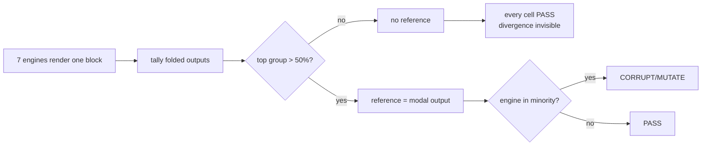

## 68. What the engine can actually do, versus what we claim

### 68.1 The claim-to-code-to-test matrix

Classification: **PROVEN** = code plus a test that fails without it; **IMPLEMENTED** = code, tests that exercise it only against doubles or only in-unit; **PARTIAL** = the claim holds over a narrower population than stated; **ASPIRATIONAL** = claimed, not built.

| # | Claim (source) | Code | Test | Verdict |
|---|---|---|---|---|
| 1 | Splice contract — locate range, replace those bytes, every other byte bit-identical (§7.1, §60) | `src/modules/share/domain/splice-frontmatter.ts` — `spliceFrontmatterValue`, `spliceFrontmatterKey` | `test/share/frontmatter-splice.test.ts` (30) + `scripts/fm-roundtrip-audit.mjs`, `scripts/fm-properties-audit.mjs` | **PARTIAL** — proven on the shapes it accepts; it accepts 17% of the corpus `[measured]` |
| 2 | Refusal is a first-class outcome (§60) | same file — every guard is `return src` | asserted for duplicate key, unterminated block, unsafe `SAFE_KEY`, block scalar | **PROVEN** |
| 3 | Never regenerate from a parse tree (§7.1) | `stringifyFrontmatterDoc` in `src/modules/preview/presentation/frontmatter.ts` has **zero product call sites**; only `test/preview/frontmatter.test.ts` imports it `[measured]` | grep | **PROVEN** |
| 4 | Degradation certificate across 7 real engines (§7.1) | `application/certify.ts` `certify`, `infrastructure/bench.ts` `loadBench` | `certify.test.ts` (28) uses **fake engines throughout**; `bench.test.ts` (31) never calls `certify` | **IMPLEMENTED** — the join is untested and, until this session, unrunnable |
| 5 | Four verdicts, three classes (§7.1) | `domain/verdict.ts` `classify` | `verdict.test.ts` (49), driving `marked` 16.4.2, `commonmark` 0.31.2, `markdown-it` 15.0.0 in-process | **PROVEN in unit, PARTIAL in situ** — MUTATE depends on bench composition (§68.2) |
| 6 | 19 constructs, UTF-8 byte ranges, skip mask (§7.1) | `domain/constructs.ts` `CONSTRUCTS`, `inventory`, `skipRegions` | `constructs.test.ts` (43) | **PARTIAL** — all six audited detector defects still fire `[measured]`; 6 of 19 carry `provenance: invented` |
| 7 | Branded offsets, one conversion point (§7.1) | `domain/offsets.ts` `OffsetMap`, `u16`, `utf8Length` | `offsets.test.ts` (22), cross-checked against `Buffer.byteLength` at every offset | **PROVEN** |
| 8 | Shape gate refuses hostile documents (§7.1) | `domain/shape-gate.ts` `shapeGate`, `decodeStrict` | `shape-gate.test.ts` (21) | **PROVEN as a function; ASPIRATIONAL as a gate** — `shapeGate` has zero product call sites; `BUDGET_MS` is documented "enforced by the caller" and no caller exists |
| 9 | Every byte written passes placement (§7.1, house rule P5) | `domain/placement.ts` `safeInsert`, `blockSkeleton` | `placement.test.ts` (16), opens with a genuine red proof | **ASPIRATIONAL in product** — zero call sites, and it refuses every visible-content insert `[measured]` |
| 10 | Lenient frontmatter pre-pass, 170/907 = 18.74% (§7.1) | `domain/frontmatter-prepass.ts` `prepassFrontmatter` | `frontmatter-prepass.test.ts` (16), red proof first | **PARTIAL** — repairs **0 of 21** strict-parse failures in the 7,969-block foreign corpus `[measured]` |
| 11 | `normalize/1` and `slug/1` pinned by a golden digest | `domain/normalize.ts`, `domain/slug.ts` | `pure-functions.test.ts` (19) over `fixtures/pure-function-golden.json`, `count: 200` | **PROVEN** |
| 12 | 99.627% re-anchoring across 384 configurations (§7.1) | none — no anchor store, no re-anchor function exists | none | **ASPIRATIONAL** |
| 13 | Missing engine is a hard refusal; `benchId` = sha256 over the full option set | `bench.ts` `loadBench`, `computeBenchId` | `bench.test.ts` — refuses ruby-absent, subset, unknown id, empty and duplicated `require` | **PROVEN** |
| 14 | The artifact is a JSON sidecar, never written into the `.md` | `certify.ts` returns `Certificate`; `scripts/mdmax-cert.mjs` only `console.log`s | `certify.test.ts` — "never serialises the render function into the artifact" | **PROVEN** |
| 15 | 0 corruption, 0 throws across 8,513 files (§58) | `scripts/corpus-foreign.mjs` | `verify` hashes bytes only — it does **not** run the engine | **PARTIAL** — 0 throws re-derived here; "0 corruption" is true only across the 17% the writer did not refuse |
| 16 | Content-derived anchors, provenance, pack/unpack, near-miss checker, budgeted projection, machine-write zones, `land()` | none | none | **ASPIRATIONAL** |

`npm run verify`'s arch gate is green and honest: `filesScanned: 208`, `violations: []` `[measured]`.

### 68.2 The dangerous list — claims the code does not support

**Every fidelity percentage in circulation was measured on a population the product does not serve.** The 2026-08-03 audit's replicated figure — 6.78% of blocks BROKEN on our docs, 5.78% on 30 third-party `README.md` files, excluding `frontmatter-app` — was the basis for calling kill condition (1) decided. Run over four pinned Obsidian vaults instead (419 files, 2,530 blocks, the first execution of `mdmax/fold@1` over pinned-corpus content `[measured]`):

| Target set | blocks BROKEN | files BROKEN | `__unattributed__` | K4 |
|---|---|---|---|---|
| all 7 | 847 / 2,530 = **33.48%** | 307 / 419 = 73.27% | 393 of 852 | fires at 98.9% |
| excluding `frontmatter-app` | 474 / 2,530 = **18.74%** | 284 / 419 = 67.78% | 28 of 484 | fires at 98.1% |

18.74 ÷ 5.78 = **3.24×** `[derived]`. READMEs have no YAML frontmatter and no task lists; vaults are 254 and 172 of the 484 attributions respectively. The number moved because the corpus changed, not because the code did.

| Claim | What the code does | Evidence |
|---|---|---|
| "0 corruption across 8,513 files, re-verifiable via `npm run corpus`" (§58) | `corpus-foreign.mjs verify` compares sha256 against `MANIFEST.sha256` and exits. No test, oracle or script in the repo runs the writer over `test/corpus/foreign/_vendor` — grep for `corpus/foreign` returns `corpus-foreign.mjs` and three spec files, nothing executable | `[measured]` |
| "the splice writer handles all 170 of these files at 100%" (`frontmatter-prepass.ts` header) | Over 7,969 foreign frontmatter blocks the writer refuses **6,615 (83.01%)**; 6,613 of those are one cause, a `-` item at column zero. 0 throws, 0 corruptions among the 1,354 that proceeded | `[measured]` |
| "MDMAX shipped" (`docs/mdmax/PLAN.md`, corrected in §7.4) | One symbol of thirteen files is reachable from product code: `decodeStrict`, imported by `src/modules/vault/application/get-snapshot.ts` and `src/modules/vault/infrastructure/search-index.ts`. Both use it as a `continue` — a file that fails is dropped from the snapshot and the search index with a `console.error` and no UI | `[measured]` |
| "every byte we write may not change what a user's document means" (§3.8.5) | `safeInsert` accepts an HTML-comment marker and returns `SKELETON_CHANGED` for a paragraph, a callout and a heading at a true block boundary. `removeFirstInsertedHtml` forgives exactly one `html` node, so visible content is refused by construction | `[measured]` |
| A certificate PASS means the engines agree | On `~~gone~~` the seven engines split **3 / 2 / 2** (`<del>`, `<s>`, literal `~~`). `certify.ts` requires `top.count > renderedByTarget.size / 2`, so there is no reference, `classify` never reaches the MUTATE branch, and all seven cells report **PASS** on three visibly different renderings | `[measured]` |
| A certificate MUTATE means the engine is wrong | On `- [x] done` the split is **4 / 1 / 1 / 1**. The majority is the four engines that do not implement GFM task lists; `remark-app`, `github-pages` and `marked` — which render the checkbox correctly — are each scored `CORRUPT/MUTATE`. 172 of 484 attributions in the vault run are `task-list` | `[measured]` |
| The `frontmatter-app` target measures our app | `bench.ts` `buildRemarkApp` records `notReplicated`: the React component map, `disallowedElements`, `createRehypeHtmlPolicy(content)`, `rehype-katex`, `rehype-highlight`. `Markdown.tsx` runs all five | `[measured]` |
| The engine is a build artifact anyone can run | `node scripts/mdmax-cert.mjs <file>` fails with `ERR_MODULE_NOT_FOUND` on `../domain/offsets`. `scripts/ts-resolve.mjs` was written for exactly this and has **zero importers anywhere in the repo** | `[measured]` |

The mechanism is symmetric and both ends are wrong: maximum disagreement yields silence, and correct GFM yields corruption whenever the bench holds four non-GFM configurations against three GFM ones.

**Recommendation.** Replace the modal-consensus reference with a declared per-construct expectation: a construct's reference is the output of the engines that implement the spec that defines it, named in `targets.ts`. **Anti-recommendation:** do not fall back to the CommonMark oracle — `certify.ts` records that this produced 356 MUTATEs on a five-file sample because the spec has no tables — and do not delete MUTATE, because it is the only verdict that catches structural loss with the characters intact.

### 68.3 The hidden-asset list — capabilities the code has and we neither claim nor use

| Asset | Symbol | Why it is worth money |
|---|---|---|
| YAML-independent wikilink extraction | `frontmatter-prepass.ts` `extractWikilinks` | Reads raw value text, so it works on blocks a parser refuses. The graph view already ships (`react-force-graph-2d`) and cannot see links in unparseable frontmatter |
| Tolerant anchor resolution that reports *how* it matched | `slug.ts` `resolveAnchor` returning `CANONICAL` / `COLLAPSED` / `UNRESOLVED` | A `COLLAPSED` match is a link that works here and breaks on GitHub. That is a shippable Doc Health warning today, with no new code |
| The over-quoting fix | `splice-frontmatter.ts` `emitScalar` — indicator characters are special in first position only | The naive rule quoted 435 of 907 corpus files unnecessarily. This is the difference between "preserves your file" and "reformats your file" |
| Kill-condition arithmetic as a function | `certify.ts` `brokenHistogram`, `targets.ts` `uncertifiableShare` | Reachable only from the broken CLI. `uncertifiableShare()` is our honesty number — 8 of 15 surfaces cannot be probed — computed and never surfaced |
| User-facing refusal copy | `shape-gate.ts` `explainFailure` | Seven refusal reasons already written as one-line sentences. §46's refusal UX has its strings and does not use them |
| Exact Jekyll front-matter semantics | `bench.ts` `stripJekyllFrontMatter` | Mirrors Jekyll's `YAML_FRONT_MATTER_REGEXP` including "unterminated is content". Reusable by the publish pipeline |
| Grapheme-correct cursor arithmetic | `offsets.ts` `toGrapheme`, `isGraphemeBoundary`, lazy `Intl.Segmenter` with a code-point fallback | Tested to count a ZWJ family as one grapheme. The editor does its own `.slice` at 119 sites outside mdmax |
| Sparse offset index | `offsets.ts` `BLOCK = 512` checkpoint table | ~8 KB per open 4 MB document against 16 MB for the dense `Uint32Array` the plan specified — a 2,048× memory saving nobody markets |
| A named, versioned equivalence relation | `fold.ts` `FOLD_VERSION`, `FOLD_RULES` reported per cell | Competitors ship diffs. We can say which of six normalisations fired on a given comparison |

### 68.4 What the ten test files actually assert, and the largest untested surface

320 tests across 11 files, all green in 1.18 s `[measured]`.

| File | Tests | What it actually asserts | Blind spot |
|---|---|---|---|
| `verdict.test.ts` | 49 | Each verdict against real `marked` / `commonmark` / `markdown-it` output, plus declared kramdown fixtures with the reproducing command | Every case is hand-built; none comes from the corpus |
| `fold.test.ts` | 45 | Six rules fire in isolation; a "does NOT hide" block; idempotence; §6.11 linearity under a 3 s timeout | Idempotence is over the file's own inputs, not corpus HTML |
| `constructs.test.ts` | 43 | Each pair is found by its own detector; skip mask; look-alike separation | Asserts no *frequency*; the six known false-positive shapes are absent |
| `bench.test.ts` | 31 | Jekyll's nine options; the disagreements the bench exists to catch; six refusal paths | Never calls `certify` |
| `frontmatter-splice.test.ts` | 30 | Byte-identity, BOM, non-ASCII key duplication, corpus scoring | Zero-indent sequence, bare-CR fence, quoted keys — the three live defects — are absent |
| `certify.test.ts` | 28 | Refusal, block segmentation, byte ranges as real UTF-8, histogram | **Fake engines throughout** |
| `offsets.test.ts` | 22 | `Buffer` agreement at every offset, block-boundary surrogate pairs | — |
| `shape-gate.test.ts` | 21 | Every ceiling by name, strict UTF-8, failures as values | Asserts `BUDGET_MS` is *named*, not enforced |
| `pure-functions.test.ts` | 19 | 200-case golden digest pin, idempotence, NFD collapse | — |
| `placement.test.ts` | 16 | Red proof that the naive insert corrupts, then that `safeInsert` refuses | Never asserts what it *accepts* beyond markers |
| `frontmatter-prepass.test.ts` | 16 | Red proof that the loud and quiet shapes differ, then repair vs refusal | Own-vault shapes only |

The biggest untested surface is **the certificate pipeline end to end**. `certify` is never invoked with a real `Engine`; `loadBench` is never handed to `certify`; `scripts/mdmax-cert.mjs` has no test at all and was broken at HEAD. Second is the foreign corpus: 8,513 pinned files with a hash gate and no behavioural gate. Third is `splice-frontmatter.ts` under the shapes that dominate real vaults — the writer's own test file scores it against `docs/engine/research/corpus-manifest.json`, our own vaults, where the zero-indent shape is rare.

Both shipped oracles are **structurally blind to set-destructive defects**, and this is demonstrable rather than theoretical. On a lone-CR file `'---\rtitle: T\r---\rBody\r'`, a single `spliceFrontmatterValue(src, 'public_slug', 's')` prepends a second frontmatter block and pushes the original into the body — two `---` fences become four. `spliceFrontmatterValue(set, 'public_slug', null)` then removes the block it created, and `back === cr` is **`true`** `[measured]`. The oracle reports a clean round trip on a file the set alone destroyed.

### 68.5 The tests that must exist before any fidelity number is published

§58 already forbids publishing a fidelity or coverage percentage. These are the gates that lift that ban, in order.

| # | Test | Path | Assertion | Red proof available today |
|---|---|---|---|---|
| 1 | NF-1 zero-indent sequence | `test/corpus/foreign/nf-001-red-proof.test.ts` — declared in `specs/engine/nf-001-zero-indent-sequence.md` `governs:` and **does not exist**; `spec-report` reports it as `ghost` | A **set** on a real corpus file with `tags:\n- a`. Post-fix: `refused <= 2 && changed == 0 && threw == 0` over 7,959 | Yes — 6,613 files fail now |
| 2 | NF-3 bare-CR fence | `test/corpus/foreign/nf-003-red-proof.test.ts` — also declared, also `ghost` | Set alone, never set-then-delete. Assert fence count is unchanged | Yes — reproduced above |
| 3 | NF-4 unaddressable keys | new | `SAFE_KEY` cannot address **2,447 of 29,288** top-level keys (8.35%) across **937 of 7,969** files (11.76%); `date created` 812, `date modified` 811, `分类` 232 `[measured]`. Assert the residual after the decision | Yes |
| 4 | Corpus behavioural gate | `test/corpus/foreign/writer-sweep.test.ts` | Run the writer over all 8,513, assert `changed_outside_key == 0 && threw == 0` and a refusal **ceiling**, not an equality (LR#66) | The sweep exists only as a scratch script |
| 5 | Certificate integration | `test/mdmax/cert-e2e.test.ts` | `loadBench()` → `certify()` on a fixture, asserting the exact matrix. Would have caught the broken CLI import | Yes — `node scripts/mdmax-cert.mjs` fails at HEAD |
| 6 | Consensus reference | `test/mdmax/certify.test.ts` | On a 3/2/2 split, a certificate must not report PASS. On a GFM construct, an engine implementing the spec must not be MUTATE | Yes — both reproduced |
| 7 | Detector false positives | `test/mdmax/constructs.test.ts` | The six cases: indented-code `html-comment` 1→0, indented-code `angle-bracket-text` 1→0, `a \|\| b` 1→2, `[[A]][[B]]` 1→2, one-column table 6→0, `coffee` fence 1→0 | Yes — all six fail now |
| 8 | Fold stamp completeness | `test/mdmax/fold.test.ts` | `FOLD_VERSION` must incorporate the `entities` version (§68.6) | No |

**Recommendation.** Land tests 1–4 before any number leaves the building, and publish the refusal rate alongside every fidelity rate as a single fraction — "measured on the 17% we can currently write" is honest, "83% fidelity" is not. **Anti-recommendation:** do not gate publication on tests 5–8; they protect the certificate, and the certificate is not yet a customer-facing claim, so blocking on them delays the numbers that are.

### 68.6 Can a third party reproduce the certificate?

They cannot, for five reasons, four of which are cheap to fix.

| Gap | Detail | Cost |
|---|---|---|
| The CLI does not run | `mdmax-cert.mjs` needs `node --import ./scripts/ts-resolve.mjs`. The hook exists and nothing imports it | One line |
| `entities` is undeclared | `fold.ts` and `verdict.ts` both `import { decodeHTML, escapeText } from 'entities'`. `package.json` lists it in neither `dependencies` nor `devDependencies`; the resolved `node_modules/entities@8.0.0` is marked `dev` in `package-lock.json`, hoisted from `parse5@^8` and `markdown-it@^8`. Under `npm ci --omit=dev` the production domain layer loses its import — and `escapeText` **is** the definition of PASS, so a silent major bump changes every verdict without moving `mdmax/fold@1` | Declare it; add its version to the fold stamp |
| `marked` is undeclared | One of seven bench engines. `package-lock.json` shows exactly one dependent: `node_modules/mermaid`. A diagram-library upgrade silently changes `benchId` | Declare and pin |
| Ruby is ambient | `bench.ts` `DEFAULT_RUBY_BIN = "/opt/homebrew/opt/ruby/bin/ruby"`, overridable by `MDMAX_RUBY_BIN`. `kramdown 2.5.2` + `kramdown-parser-gfm 1.1.0` come from whatever gems are installed. There is no `Gemfile`, no `Gemfile.lock`, no `.ruby-version` | Add a `Gemfile.lock`, or drop `github-pages` to `declared` |
| The artifact under-describes itself | `Certificate` top-level keys are `schema, bench, fold, file, targets, summary, blocks` `[measured]`. Absent: `VERDICT_VERSION` (`mdmax/verdict@1` exists in `verdict.ts` and never reaches the artifact, though `verdict.test.ts` asserts "a stored cell can be traced to the definition that produced it"), the `entities` version, the Node version, the ruby and gem versions, and any corpus id | Extend the interface — a schema change, so `mdmax/cert@1` becomes `@2` |

What *is* reproducible is real and should be said plainly: `benchId` is a sha256 over each engine's `(id, version, sorted options)` with rows sorted, so it is stable across loads, changes when one option changes, and is visibly different for a smaller bench — measured here as `51947c2e8812` for seven engines and `4c46fb96a5da` for six. Every non-PASS cell carries `before` and `after` and the `foldApplied` rule list. That is more auditable than any competitor publishes.

**A certificate nobody can re-run is a marketing asset, not a defensible one, and the distance between the two is a `Gemfile.lock`, two `package.json` lines and an `--import` flag.** Once those land, the honest posture is to publish the artifact for a public corpus with the bench manifest attached, and to state the uncertifiable share — `uncertifiableShare()` returns 8 of 15 — in the same breath. **Anti-recommendation:** do not pursue third-party attestation, signing or a hosted verifier until at least one external party has re-run the CLI end to end; a signature over an unreproducible artifact adds ceremony to the same claim.
