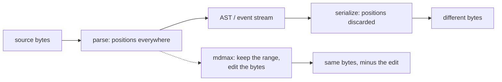

## 69. The engine landscape — what other markdown engines do that we do not

### 69.1 The comparison, on the five axes that decide our contract

Versions and dates fetched from the registries on 2026-08-30 [fetched: registry.npmjs.org, crates.io, pypi.org, api.github.com]. "Positions" means what the engine hands a caller, not what it computes internally; every one of these engines knows where it is in the source, and most throw that away before you can reach it.

| Engine | Version / date | Position unit exposed | Inline positions | Incremental reparse | Write path | CommonMark | Licence |
|---|---|---|---|---|---|---|---|
| `micromark` | 4.0.2 / 2025-02-27 | UTF-16 code units (`Point.offset`) | yes, every token | no | none (tokenizer only) | 0.31 target | MIT |
| `mdast-util-from-markdown` + `-to-markdown` | 2.1.2 / 2024-11-04 | UTF-16 (`position.start.offset`) | yes | no | regenerates from AST | 0.31 target | MIT |
| `remark` / `remark-stringify` | 15.0.1, 11.0.0 / 2023-09-18 | as above | yes | no | regenerates | 0.31 target | MIT |
| `markdown-it` | 15.0.1 / 2026-08-27 | **line numbers only** (`Token.map`) | **no — `map` is `null`** | no | none | 0.30 claimed | MIT |
| `cmark` | 0.31.2 / 2026-02-14 | line:column, opt-in `CMARK_OPT_SOURCEPOS` | block only | no | `cmark_render_commonmark` regenerates | 0.31.2 (reference) | NOASSERTION per GitHub API — verify before vendoring |
| `cmark-gfm` | 0.29.0.gfm.13 / **2023-07-21** | as cmark | block only | no | regenerates | 0.29 — three spec revisions stale | NOASSERTION |
| `comrak` | 0.54.0 / 2026-07-12 | `Sourcepos {start,end}` line:column, **columns in UTF-8 bytes**, `--sourcepos-chars` switches to code points | block only | no | `format_commonmark` regenerates | 0.31 + GFM | BSD-2-Clause |
| `goldmark` | v2.0.0 / 2026-08-27 | `text.Segment {Start,Stop}` — **byte offsets** | yes, via segments | no | none shipped | 0.31 | MIT |
| `pulldown-cmark` | 0.13.4 / 2026-05-20 | `OffsetIter` → `(Event, Range<usize>)` — **byte range per event** | yes, every event | no | separate crate | 0.31 | MIT |
| `markdown-rs` (`markdown`) | 1.0.0 / 2025-04-23 | mdast with `1:3-1:6 (2-5)` — line:col **and** byte offset | yes | no | none | tracks `cmark`/`cmark-gfm` behaviour | MIT |
| `tree-sitter-markdown` | v0.5.3 / 2026-02-26 | byte ranges on every node | yes (split block/inline parsers) | **yes** (`ts_tree_edit`) | none | its README: not recommended where correctness matters | MIT |
| `@lezer/markdown` | 1.7.2 / 2026-07-15 (repo moved off GitHub) | tree positions | yes | **yes** (consumes tree fragments) | none | **not conforming** — does not validate link references | MIT |
| `pandoc` | 3.11 / 2026-08-29 | **none** — `data Block` in `pandoc-types` `Definition.hs` has zero position fields | no | no | regenerates | own dialect + CommonMark reader | GPL-2.0 |
| `prettier` (markdown) | 3.9.6 / 2026-07-21 | remark AST | yes | no | regenerates, reformats by design | 0.31 via remark | MIT |
| `dprint-plugin-markdown` | 0.23.2 / 2026-08-29 | own CST | — | no | regenerates | GFM-ish | MIT |
| `mdformat` | 1.0.0 / 2025-10-16 | markdown-it tokens | no | no | regenerates, **gated by an equality check** | 0.30 via markdown-it-py | MIT |
| `yaml` (frontmatter CST) | 2.9.0 (installed) | **absolute offsets on every CST token** | n/a | no | **byte-preserving** | n/a | ISC |

Two rows deserve their own sentence because they are the ones a reviewer will check. `cmark-gfm`, the engine behind GitHub's own rendering, last cut a release on 2023-07-21 against CommonMark 0.29 while the current spec is 0.31.2 [fetched: `api.github.com/repos/github/cmark-gfm/releases/latest`, `spec.commonmark.org`]. And `tree-sitter-markdown`'s own README states it is not recommended where correctness is important, its stated goal being syntax highlighting for neovim and helix [fetched: `README.md`, `split_parser` branch].

### 69.2 Who preserves source — measured, not asserted

Read-side position fidelity is a solved problem and has been for years. Write-side source preservation is solved by exactly nobody in the markdown ecosystem.

I measured the read side against the copy in `node_modules`. `mdast-util-from-markdown` gives every node — including inline `emphasis` and `link` — a `position.start.offset`; `markdown-it` 15.0.0 gives block tokens a `Token.map` of `[startLine, endLineExclusive]` and gives every inline child `map === null` [measured, `node_modules/markdown-it/dist/markdown-it.mjs`, `node_modules/mdast-util-from-markdown/index.js`]. On `a 𝄞 *b*\n` (9 UTF-16 units, 11 UTF-8 bytes) the `emphasis` node reports `offset: 5..8`; slicing the string by those numbers yields `"*b*"` and slicing the UTF-8 buffer by the same numbers yields `"\uFFFD *"` [measured]. mdast offsets are UTF-16 code units and are silently wrong the moment anyone treats them as bytes — which is precisely the failure `src/modules/mdmax/domain/offsets.ts` exists to make unrepresentable, via branded `U16Offset` / `ByteOffset` and a `u16()` that returns `{ok:false, error:{kind:'INSIDE_SURROGATE_PAIR'}}` rather than rounding.

The write side, same corpus, one command: `toMarkdown(fromMarkdown(src))` on a nine-line document turned a setext heading into ATX and an indented code block into a fenced one, 96 bytes in, 98 bytes out, `===` false [measured]. That is not a bug in `mdast-util-to-markdown`; it is the documented purpose of a serializer that "turns a syntax tree into markdown" [fetched: its readme]. `comrak`'s `format_commonmark` is the same shape — `src/cm.rs` opens with a comment conceding that "formatting an ill-formed AST might lead to invalid output" and validates only in debug builds [fetched]. Pandoc cannot preserve source even in principle: `pandoc-types` `Definition.hs` `data Block` carries no position field and a grep for `sourcepos|position` over that file returns 0 [fetched].

Ranked by distance from our contract — locate the range, replace exactly those bytes, refuse when ambiguous:

1. **`yaml` 2.9.0's CST layer.** Closest, and it is already a direct dependency (`"yaml": "^2.9.0"` in `package.json`). Measured: `CST.stringify(new Parser().parse(fm))` round-trips the exact frontmatter shape that refuses 83% of publishes — a block sequence at column zero — byte-identically, 68B → 68B, `=== true`; every token carries an absolute offset (`scalar@30="beta"`); mutating one token's `.source` and re-stringifying produces bytes identical to a naive string replace [measured].
2. **`pulldown-cmark`'s `OffsetIter`.** `Iterator<Item = (Event<'a>, Range<usize>)>` in `parse.rs` — a byte range for every event, inline included. It has the addressing half of the contract and none of the writing half.
3. **`goldmark`'s `text.Segment`.** Byte `Start`/`Stop` on every node, with one caveat that matters: `Padding` is a synthesized-space count, so a Segment is *not* always a literal slice of the source [fetched: `text/segment.go`].
4. **`mdformat`.** Furthest from the contract mechanically — it regenerates everything — and closest to it philosophically, because it refuses. See below.
5. **`tree-sitter` / `@lezer/markdown`.** Lossless by construction (nodes are byte ranges into an unmodified buffer) and incremental, but neither writes, and both trade conformance for single-pass speed.

### 69.3 Techniques to adopt, each with its anti-recommendation

**Adopt `mdformat`'s `is_md_equal` as the shape of a write gate, not as its content.** In `src/mdformat/_util.py`, `is_md_equal(md1, md2)` renders both strings to HTML, collapses runs of whitespace, and compares; the CLI refuses to write the file when it returns false, and `--no-validate` is the escape hatch [fetched]. That is our `foldEqual` with one rule where we have six (`FOLD_RULES = ['entity-decode','smart-punctuation','void-element-spelling','whitespace','id-prefix','heading-anchor-id']`) and one engine where we have seven. The adoptable part is the *placement*: mdformat runs the check on the write path and blocks the write. We run ours in `certify.ts` and block nothing. *Anti-recommendation:* do not adopt their comparison basis. Their own docstring concedes whitespace collapsing "is not a perfect solution, as there can be meaningful whitespace in HTML, e.g. in a `<code>` block" — our `fold.ts` header documents the same trap and solves it by decoding entities then re-escaping with `entities.escapeText` so `
&lt;cat&gt;
` cannot collapse into an invisible tag.

**Adopt `comrak`'s `--sourcepos-chars` as a disclosure obligation.** Comrak ships a CLI flag whose entire job is to say which unit a column is measured in — bytes by default, code points on request [fetched: `README.md`]. Every position we ever put in a certificate, an anchor, or an API response should carry its unit the same way. *Anti-recommendation:* do not copy the mechanism — a runtime flag is the weak form. `offsets.ts` already has the strong form in the type system, and adding a flag would create a second source of truth about units.

**Adopt `pulldown-cmark`'s range-per-event iterator shape for our own construct scan.** `into_offset_iter()` returns `(Event, Range<usize>)` so a caller never has to ask a second question to find out where an event was. `constructs.ts` already returns `ReadonlyMap<string, readonly Range[]>` from `inventory()`; the adoptable idea is extending that to a single ordered stream so `skipRegions()` and `inventory()` cannot drift. *Anti-recommendation:* do not adopt pulldown-cmark itself as the scanner. It is Rust, it would land behind WASM, and our shape gate budget in `shape-gate.ts` (`BUDGET_MS`, `MAX_BYTES = 4 * 1024 * 1024`) is not currently the binding constraint.

**Adopt `@lezer/markdown`'s fragment-reuse model for editor-side reparse, which we already ship.** `@codemirror/lang-markdown` 6.5.0 and `@lezer/markdown` 1.6.3 are installed [measured, `node_modules/*/package.json`], and the parser "consumes fragments of such trees for its incremental parsing" [fetched: README]. *Anti-recommendation:* never let a lezer tree become the tree of record. Its README states it does not validate link references and will parse `[a][b]` as a link when no `[b]` exists — an editor-fidelity parser, not a semantics-of-record parser, and the settled rule that there is no tree-of-record already covers this.

**Adopt `mdast-util-to-markdown`'s `Unsafe` table as the model for our quoting rules.** It maintains an explicit, data-driven table of character-in-context pairs that must be escaped, rather than scattering conditionals. `emitScalar()` in `splice-frontmatter.ts` is already the YAML analogue and already carries the measured lesson — the over-broad rule that treated indicator characters as special anywhere quoted 435 of 907 corpus files unnecessarily. *Anti-recommendation:* do not generalize `emitScalar` into a full YAML emitter; the module's value is that it emits one scalar for one key and refuses everything else.

### 69.4 What we do that nobody else does

Three claims, each stated narrowly enough to survive a hostile reviewer.

**We refuse on the write path and return the input unchanged; every other markdown writer either succeeds or throws.** `spliceFrontmatterValue` has eleven `return src` branches — unsafe key shape, duplicate key, unterminated block, block scalar or anchor on the target key, a bare non-key line at top level, and so on. Measured against the real function: `spliceFrontmatterValue('---\ntitle: A note\ntags:\n- alpha\n- beta\n---\n\nbody\n', 'title', 'B note')` returns its input byte-for-byte, while the two-space-indented variant of the same document splices correctly [measured, via `node --experimental-strip-types`]. The scrutiny this must survive: refusal is not novel in software generally — `git apply` refuses, `patch` refuses — the claim is bounded to markdown/frontmatter *writers*, and `mdformat`'s `is_md_equal` gate is the one genuine near-miss. It differs in that mdformat regenerates first and then checks; we never regenerate at all.

**We publish a per-document, cross-renderer degradation verdict with a versioned equivalence relation.** The prior art a reviewer will name is babelmark3, which does compare a document across many markdown implementations [fetched: `babelmark.github.io`, "allows to compare various implementations of Markdown"]. The claim must therefore be stated as a difference in kind, not in existence: babelmark is an interactive diff viewer producing no artifact; `cert-contract.ts` defines a `Certificate` with a `CertSummary`, per-cell `CellVerdict` values classified by `classify()` into named classes, an engine set hashed by `computeBenchId()` over `(id, version, sorted options)`, and a `fold.version` stamp so a reader can tell which definition of "equivalent" produced a stored verdict. A stamped, replayable, per-construct artifact is the differentiated thing; "we run seven parsers" is not.

**We model a renderer target as `(product, surface)` and mark unmeasurable rows as declared-and-dated rather than measured.** `targets.ts` states the finding that forced it — GitHub is three renderers that disagree on identical bytes — and carries `fidelity: 'local' | 'requires-push' | 'declared'` plus `DECLARED_LAST_VERIFIED = '2026-08-01'`. No engine or comparison tool in the table above models the distinction between "I ran this" and "I asked the vendor's docs on a date."

The claim we must **not** make: that we have a better markdown parser. We do not have one at all. Everything above is built on other people's parsers, and `remark-app` is the first row in `BENCH_ENGINE_IDS`.

### 69.5 Build vs adopt

There is one engine we should be building on rather than beside, and we already pay for it. `yaml` 2.9.0 is a direct dependency, and `src/modules/preview/presentation/frontmatter.ts` imports `parseDocument` and `isMap` from it — the *Document* layer, whose `doc.toString()` is named in `splice-frontmatter.ts`'s own header as one of the two regenerating write paths we replaced. Nothing in `src/` or `scripts/` imports `Parser` or `CST` [measured, grep over both trees]. We own the right library and use the wrong layer of it, and the 83% publish-refusal rate is the bill for that. The measured CST round-trip in §69.2 is the fix: the refused shape parses, addresses, edits, and re-stringifies byte-identically today, with no new dependency and no new licence.

*Anti-recommendation, and it is the load-bearing half:* adopting the CST does not mean deleting the splice writer or handing YAML mutation to a library. `CST.stringify` will happily emit a document you have made ill-formed, exactly as `comrak::format_commonmark` will; the refusal discipline has to stay ours, wrapped around the CST rather than replaced by it. The correct shape is a widened locator — CST tokens supply the range, `spliceFrontmatterValue` still decides whether the range is unambiguous, and the final write is still `src.slice(0, start) + bytes + src.slice(end)`. That also keeps `SAFE_KEY` honest: the CST gives us non-ASCII keys for free at the *addressing* level, but it does not answer what key equality means for `café` typed NFC versus NFD, which is the reason the regex is narrow.

For the body of the document, adopt nothing. The read side we need already exists in `mdast-util-from-markdown` (which we ship) and in `@lezer/markdown` (which we ship through CodeMirror); the write side does not exist in any of the seventeen projects above, which is why `mdmax` exists. Building on `pulldown-cmark` or `markdown-rs` would buy byte-native offsets at the cost of a WASM boundary and a second CommonMark implementation to keep in agreement with the seven already in `BENCH_ENGINE_IDS` — a worse trade than the `OffsetMap` checkpoint table we already have.

The three things that are actually missing are not engines. There is no CI, `mdmax/fold@1` has never been run over the pinned 8,513-file corpus, and twelve of thirteen mdmax files have zero product importers — only `decodeStrict` from `shape-gate.ts` is called, by `get-snapshot.ts` and `search-index.ts`. A comparison table is a poor answer to a module nothing imports.
