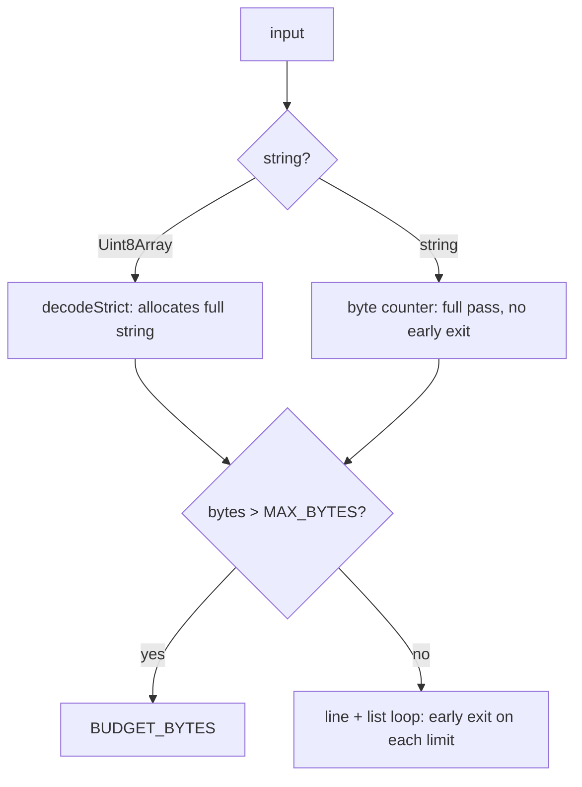

## 70. Engine performance and correctness under load

### 70.1 Provenance of every number below

Everything in this section was executed on 2026-08-31 against working-tree commit `d405f3f`, Node v24.6.0, Apple M4 Pro / 14 cores / 48 GB, with the mdmax domain sources copied verbatim into a scratch directory and run through Node's native type stripping (the same files the test suite loads; only relative specifiers gained a `.ts` extension). The corpus is the pinned one at `test/corpus/foreign/_vendor` — 8,513 files, 19,047,891 bytes, verified present before each run. Engine versions read off disk: `micromark@4.0.2`, `mdast-util-from-markdown@2.0.3`, `markdown-it@15.0.0`, `marked@16.4.2`, `commonmark@0.31.2`, `remark-parse@11.0.0`, `entities@8.0.0`, `yaml@2.9.0`. [measured]

Three things must be said before the tables, because they change how every other number reads. There is no `.github` directory in this repo, so no benchmark in this section is currently enforced by anything. [measured] `shapeGate` — the function this whole section's guard story rests on — has zero product call sites; the only import of `src/modules/mdmax/domain/shape-gate.ts` from outside the module is `decodeStrict`, in `src/modules/vault/application/get-snapshot.ts` and `src/modules/vault/infrastructure/search-index.ts`. [measured] And `node scripts/mdmax-cert.mjs <file>`, exactly as its own header documents it, fails with `ERR_MODULE_NOT_FOUND` for `.../mdmax/domain/offsets`; it runs only as `node --import ./scripts/ts-resolve.mjs scripts/mdmax-cert.mjs`, and nothing in `package.json` or `scripts/` references `ts-resolve.mjs`. [measured]

### 70.2 The performance budget per engine operation

`BUDGET_MS` in `shape-gate.ts` declares three tiers — `keystroke: 250`, `coldOpen: 2_000`, `batch: 10_000` — and its own comment concedes they are "enforced by the caller via `worker.terminate()`. Not enforced here." No caller exists. The budget below assigns each operation to a tier and states measured headroom.

| Operation (symbol, file) | Tier | Target | Measured | Headroom | Justification |
|---|---|---|---|---|---|
| `shapeGate` on a whole document | keystroke | ≤ 5 ms @ 4 MB | 16 ms @ 4 MB string; p99 0.045 ms, max 3.42 ms over the corpus | corpus fits; the ceiling does not | 8,513 files in 63.5 ms = 286 MB/s; every file passed, none refused [measured] |
| `decodeStrict` happy path | keystroke | ≤ 20 ms @ 4 MB | 8 ms @ 64 MB ASCII | large | one `TextDecoder` pass, no per-byte JS [measured] |
| `decodeStrict` failure locate | coldOpen | ≤ 50 ms | 10.6 ms, invalid byte at offset 4,194,303 | 4.7× | binary search over the longest valid prefix, log₂(4 M) ≈ 22 decodes [measured] |
| `new OffsetMap(text)` | coldOpen | ≤ 100 ms/doc | 27 ms for 8,513 docs / 18.2 MB = 676 MB/s | ~600× | one pass, `Uint32Array` checkpoint every `BLOCK = 512` units [measured] |
| `OffsetMap.toByte` | keystroke | ≤ 1 µs | 465 ns over 20,000 random lookups on the 20 largest docs | 2.1× | block seek + bounded ≤512-unit scan [measured] |
| `inventory(markdown)` | coldOpen | ≤ 50 ms/doc | 0.09 ms mean, 11.0 ms worst over 400 files | 4.5× at worst | 30+ construct detectors, each a `matchAll` over masked text [measured] |
| `skipRegions(markdown)` | keystroke | ≤ 5 ms | 0.003 ms mean over 400 files | large | shares one `analyse()` scan [measured] |
| `fold(html)` | batch | ≤ 20 ms/doc | 0.05 ms mean, 11.9 ms worst; 22.7 MB/s over 2.3 MB of rendered HTML | 1.7× at worst | segment scan + `decodeHTML`/`escapeText` per text run [measured] |
| `spliceFrontmatterValue` | keystroke | ≤ 100 µs | 1.3 µs/file over 7,969 front-matter files | 77× | line scan of the block only; body is never touched [measured] |
| One certificate cell (`Engine.render`) | batch | ≤ 5 ms | 0.02–0.69 ms for six JS engines; **54.50 ms for `kramdown-jekyll`** | violated 11× | `runRuby` calls `spawnSync` once per render; process start dominates [measured] |
| Whole-corpus certification | batch (offline) | ≤ 10 min | 60 files / 39 blocks in 2.667 s wall → ≈ 5,533 blocks, ≈ 5.6 min single-threaded for 8,513 files | 1.8× | 60.7 ms/block × block count [derived: (2.667 s − 0.3 s startup) ÷ 39 blocks; 39 blocks ÷ 60 files × 8,513 files] |

Recommendation: keep one ruby process alive behind a line-delimited protocol instead of `spawnSync` per render, and the cert falls from 60.7 ms/block to roughly 2 ms/block. Anti-recommendation: do **not** drop `kramdown-jekyll` from `BENCH_ENGINE_IDS` to buy the speed — `loadBench`'s rule 4 ("a missing engine is a HARD REFUSAL") exists precisely so the bench cannot quietly shrink, and GitHub Pages is the one target no JS engine models.

### 70.3 Known quadratics and pathological inputs

| Input | Path that eats it | Measured | Guard | Guard tested? |
|---|---|---|---|---|
| `"[["` × n | `WIKILINK_RE = /(!?)\[\[([^\]]+)\]\]/g` in `src/modules/vault/infrastructure/markdown-parser.ts`; identical source as `COMBINED_WIKILINK_RE` in `src/modules/preview/presentation/markdown/wikilinks.tsx` | 42.9 / 162.9 / 649.2 / 2,575.7 / 10,384.3 / **41,527.3 ms** at 10/20/40/80/160/320 KB; log-log slope k = 1.98 [measured] | none on this path — `shapeGate` has no call site | no |
| `"[["` × n | `const WIKILINK = /\[\[([^\]]*)\]\]/` used by `.test(rawValue)` in `frontmatter-prepass.ts` | 40,410.9 ms at 320 KB, k ≈ 2.0 [measured] | none; the value is a single front-matter line, so exposure is bounded by line length, not file size [inference] | no |
| n flat list items | `mdast-util-from-markdown` vs `micromark` on identical bytes | 22.9 KB: 54 vs 37 ms (1.5×); 94.9 KB: 254 vs 129 (2.0×); 404.9 KB: 2,318 vs 492 (4.7×); 1.29 MB: 21,237 vs 1,709 (12.4×) [measured] | `MAX_LIST_MARKER_LINES = 20_000`, early-exit at 20,001 in 1.1 ms | yes — 4 refs in `test/mdmax/` |
| > 4 MB document | `MAX_BYTES` | `BUDGET_BYTES` in 8.2 ms at 4 MB + 1; 128 ms at 64 MB (string path) | `MAX_BYTES = 4 * 1024 * 1024` | yes — 2 refs |
| > 200,000 lines | `MAX_LINES` | `BUDGET_LINES` in 3.4 ms | `MAX_LINES = 200_000` | yes — 2 refs |
| Invalid UTF-8 | `decodeStrict` | `INVALID_UTF8` at line 1, col 4,194,304 in 10.6 ms | fatal `TextDecoder`, never repairs | yes — 3 refs |
| Slow parse | — | — | `BUDGET_TIME` | **no** — the reason appears in `test/mdmax/shape-gate.test.ts` only as a literal `{ ok: false, reason: "BUDGET_TIME", elapsedMs: 300, limit: 250 }` fed to `explainFailure`; grep for `new Worker` / `worker.terminate` in `src/` returns zero hits |
| Parser throw / worker crash | — | — | `PARSER_THREW`, `WORKER_DIED` | **no** — same shape as above; nothing in the codebase constructs either value |

Three of the seven members of `ShapeFailure` are unreachable: the union declares them, `explainFailure` renders them, and no code path produces them. That is not a gap in coverage, it is a gap in the thing being covered. [measured]

The upstream precedent the file's header cites is real: cmark issue 373 is titled "Quadratic behavior when parsing inlines", and cmark carries a merged change titled "Fix two cases of quadratic behavior (GHSA-66g8-4hjf-77xh)" — the advisory behind CVE-2023-22484. [fetched, api.github.com]

There is also an ordering defect inside the gate itself. On the `Uint8Array` branch, `decodeStrict(input)` runs and materialises the whole string *before* `if (bytes > MAX_BYTES)` is evaluated, so a 64 MB paste allocates 64 MB of JS string in order to be told it is too big. On the `string` branch the hand-rolled byte counter (`for (let i = 0; i < text.length; i++)`) has no early exit, so a 64 MB string costs a full 128 ms pass to reach the same refusal. [measured]

Recommendation: move `input.length > MAX_BYTES` above the decode, and break the string byte counter once `bytes` exceeds the limit. Anti-recommendation: do not replace `decodeStrict`'s fatal decoder with a lenient one to make the large-input path cheaper — substituting U+FFFD changes the document's byte length, and every offset computed afterwards would be correct for a file the user does not have.

### 70.4 Correctness risks under scale

**Very large files.** The largest corpus file is `oldwinter__knowledge-garden/.obsidian/plugins/obsidian-linter/default-misspellings.md` at 939,763 bytes / 35,147 lines — 22.4% of `MAX_BYTES` and 17.6% of `MAX_LINES`. [measured] No file in the pinned corpus reaches any gate limit, so the corpus proves the happy path and proves nothing at all about the ceilings. The synthetic probes in §70.3 are the only evidence the ceilings work.

**Deeply nested structures.** `analyse()` in `constructs.ts` builds `lineStarts` by a single scan and resolves fences with a `new RegExp(...)` per opening marker; nesting depth is not tracked and there is no recursion, so the risk is not stack exhaustion but *masking* — `skipRegions` must correctly exclude fenced and front-matter spans or a detector fires inside a code block. Over 400 corpus files `inventory()` threw zero times and `skipRegions()` cost 0.003 ms mean. [measured] The worst `inventory()` case, 11.0 ms, is `community-archive_obsidian-hub/02 - Community Expansions/02.01 Plugins by Category/Uncategorized plugins.md` — 278,458 bytes of dense link tables, i.e. width, not depth.

**Adversarial input.** The two live wikilink regexes are the whole exposure, and they sit on paths the gate does not protect. 320 KB of `[[` costs 41.5 s in `markdown-parser.ts`. A vault sync that walks every file will find one. [measured]

**Multi-byte boundaries.** `offsets.ts` opens by asserting "Only 67 of 1,080 files in the pinned corpus have `bytes == UTF-16 code units == code points`. 93.8% already diverge." Over the 8,513-file vendor corpus the same test gives 6,568/8,513 — **77.2% do not diverge**, and 475 files (5.6%) contain surrogate pairs. [measured] The two populations disagree by an order of magnitude, and the header's number describes a corpus that is not the one the engine is now certified against. The design conclusion survives the correction — 22.8% divergence and 475 non-BMP files is still far past the point where an untyped offset is a bug — but the figure must not be quoted as if it described `_vendor`. `splitsSurrogatePair` is exercised 6 times in `test/mdmax/`, and `u16` refuses rather than rounds; a splice of an astral value round-tripped correctly (`title: a😀b`). [measured]

**Line endings.** Zero corpus files contain a bare CR. [measured] `spliceFrontmatterValue` preserves CRLF (`const eol = open[1]`) and a leading BOM, both verified on synthetic inputs. [measured]

### 70.5 The splice writer's real failure, and one it hides

The publish path reproduces exactly: `spliceFrontmatterValue(src, 'fm_slug', 'my-note')` over the 7,969 corpus files with a closed front-matter block refuses 6,615 of them — **83.0%** — in 11 ms total, 1.3 µs/file. [measured] The cause is the fall-through branch that returns `src` on "a bare non-key line at top level"; 6,613 of those files (83.0%) contain a YAML block sequence at column zero, which is Obsidian's default emission for `tags:`. [measured] The two-file gap between 6,613 and 6,615 is unexplained by that signature and should be resolved before the fix is written, not after.

The same branch hides a corruption. A sequence *of maps* at column zero — `- name: a` — satisfies `isTop` (unindented, contains `:`) but not `topLevelKeyLine`, so it is neither spliced nor refused. Setting the key above it yields `tags: [x, y]\n- name: a\n- name: b\ntitle: T`, which `yaml@2.9.0` rejects with "Implicit keys need to be on a single line at line 2, column 1"; deleting that key yields a block opening with `- name: a`. [measured] Fifteen corpus files carry the shape; zero were reachable through the exact route probed (a key with an empty value immediately above the first sequence item), so this is a latent path, not a live one. [measured]

Recommendation: teach the block scanner that an unindented `- ` line continues the preceding key, which fixes the 83% refusal and closes the corruption in one change. Anti-recommendation: do not fix the refusal by loosening the bare-line branch alone — that converts 6,613 refusals into 6,613 unguarded appends and turns a visible no-op into the silent rewrite the module was written to prevent.

### 70.6 The benchmark suite

`mdmax/fold@1` had never been run over the pinned corpus. It has now: 946 files rendered by `markdown-it` at `html:true` and `html:false`, folded both sides — 100 ms of fold over 2.3 MB of HTML (22.7 MB/s), **0 of 946 non-idempotent**, 0 throws. [measured] Fold power against a genuinely different engine (`markdown-it` html:true vs `marked` defaults, same 946 files): 49 documents byte-equal (5.2%) before the fold, 434 (45.9%) after. [measured] Do not quote that against the prototype's "43.71% → 4.28%": this is whole-document byte equality over two engines, that was per-block over six, and the populations share no `corpus_id`.

| Bench | Measures | Corpus | Assertion | Runs when |
|---|---|---|---|---|
| `gate-throughput` | `shapeGate` ms/file | all 8,513 | p99 ≤ 0.1 ms **and** 0 refusals **and** 0 throws | every push |
| `gate-ceilings` | each of the 7 `ShapeFailure` reasons | 7 synthetic fixtures | every reason is produced by a real input, not by a literal in a test | every push |
| `quadratic-canary` | k for each regex reachable from user text | `"[["` × {10, 20, 40, 80} KB | fitted log-log slope < 1.3, and 80 KB < 250 ms | every push |
| `offset-integrity` | `u16` / `toByte` / `toU16` round trip | the 475 non-BMP files | round trip is the identity on every valid offset; 0 rounded | every push |
| `splice-oracle` | set / delete / rename, then re-parse with `yaml@2.9.0` | all 7,969 front-matter files | every non-refusal re-parses; refusal rate is asserted as a **floor-and-ceiling band**, not an equality | every push |
| `fold-idempotence` | `fold(fold(x)) === fold(x)` | rendered HTML for all 8,513 | 0 non-idempotent | nightly |
| `cert-matrix` | full 7-engine certificate | 400-file stratified sample | 0 throws; `benchId` unchanged unless an option changed | nightly |
| `cert-full` | whole corpus | all 8,513 | histogram deltas reported, nothing asserted | weekly |

Three design rules the harness must carry, each already paid for elsewhere in this system. Assert a band on refusal rates, never an equality — an equality goes red the moment a file is added and rewards standing still. Preflight the environment and refuse with a stated remedy rather than emitting a dozen false failures. And before trusting any new guard test, make it fail against the unfixed code first; a green suite over a rare fault is the expected draw, not evidence.

Recommendation: wire all eight as one `npm run bench` behind a `.github/workflows` job, with `MDMAX_RUBY_BIN` set so `kramdown-jekyll` loads rather than refusing the whole bench. Anti-recommendation: do not let `cert-full` gate a merge — 5.6 minutes single-threaded is a nightly cost, and a slow required check is a check people learn to skip.

### 70.7 Where this is too slow for a live editor, and the mitigation

| Surface | Cost | Mitigation | Anti-recommendation |
|---|---|---|---|
| Wikilink extraction on every keystroke | 41.5 s on 320 KB of `[[` | call `shapeGate` first; then match with an index-based scanner (`indexOf('[[')`, bounded forward search for `]]`) instead of a backtracking regex | do not "fix" the regex with a possessive/atomic rewrite — JS has neither, and a lookahead-simulated atomic group is harder to read than the linear scanner and no faster |
| Certificate on save | 60.7 ms/block, 97% of it ruby process start | run certification off the editor thread, on demand or on publish — never on save | do not cache a certificate keyed on file path; `benchId` is part of its identity, and a stale cert under a changed option set is exactly the lie `computeBenchId` exists to prevent |
| `mdast-util-from-markdown` for structure | 21.2 s on a 1.29 MB flat list | use `micromark` events for anything that only needs spans; reserve the mdast tree for operations that genuinely need parent links | do not adopt the tree as the document of record to amortise the parse — the contract is byte-range replacement, and a tree-of-record makes every save a regeneration |
| `inventory()` on a 278 KB link table | 11.0 ms | debounce to idle; it is a coldOpen-tier operation wearing a keystroke-tier call site | do not sample the document to keep it under budget — a detector that runs on part of a file reports an inventory for a document nobody has |

**The optimisations to refuse are the ones that trade the byte contract for throughput, and every one of them looks like a win in a profile.** Do not repair invalid UTF-8 to avoid a refusal; do not round an offset off a surrogate boundary to avoid an `OffsetError`; do not widen `SAFE_KEY` to admit `título` without first deciding whether NFC and NFD `café` are the same key; do not normalise line endings on read to simplify the splice scanner; do not let the fold collapse attribute values or `<pre>` whitespace to raise the PASS rate, because a fold that swallows everything turns the certificate into a curiosity. Each of these makes a benchmark greener and makes the product's one differentiating claim false.
