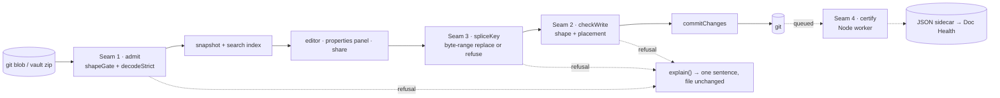

## 71. Wiring MDMAX into the product

MDMAX is 13 files and 3,614 lines under `src/modules/mdmax/`, plus the splice writer at `src/modules/share/domain/splice-frontmatter.ts` and the CLI at `scripts/mdmax-cert.mjs`. Product code reaches exactly one symbol of it. `grep -rn "mdmax" src/` outside the module itself returns two hits, both `import { decodeStrict } from "@/modules/mdmax/domain/shape-gate"` — in `src/modules/vault/application/get-snapshot.ts` and `src/modules/vault/infrastructure/search-index.ts` `[measured]`. The other twelve files have zero product importers. `npx vitest run test/mdmax test/share` is 23 files, 851 tests, 1.63 s, all green `[measured]` — the engine is tested and unreached, which is the specific failure mode this section exists to close.

### 71.1 The four seams

| # | Seam | Entry point today | State | Blocked by |
|---|---|---|---|---|
| 1 | Ingress gate | `decodeStrict` in `get-snapshot.ts`, `search-index.ts` | live, refusal invisible to the user | nothing |
| 2 | Write gate | none — `makeCommitChanges` in `src/modules/repository/application/commit-changes.ts` | not built | NF-1, NF-3 |
| 3 | Splice engine | `spliceFrontmatterValue` (share domain, not mdmax) | live, returns a bare `string` | NF-1, NF-3, NF-4 |
| 4 | Certificate | `certify` + `loadBench`, CLI-only | CLI does not run as documented | job runner, `spawnSync` cost |

### 71.2 Seam 1 — ingress gate

| Property | Value |
|---|---|
| Call site | `src/modules/vault/application/get-snapshot.ts`, the `for (const [zipPath, bytes] of Object.entries(entries))` loop; `src/modules/vault/infrastructure/search-index.ts`, same shape |
| Signature | `decodeStrict(bytes: Uint8Array): { ok: true; text: string } \| ShapeFailure` |
| Asserts | the blob is strict UTF-8; a non-fatal decode would substitute U+FFFD, change byte length, and commit mojibake back to git on the next save |
| On refusal | `console.error(...)` then `continue` — the note is dropped from the snapshot and from the search index |
| User-visible error | none `[measured]` — the note silently does not exist in the tree or in search |
| Test | `test/mdmax/shape-gate.test.ts` covers `decodeStrict`; nothing asserts the *caller's* drop behaviour |
| Ordering | independent; fix any time |

The gate is correct and its call sites are not. `explainFailure(f: ShapeFailure): string` already exists in the same file and produces `"This file is not valid UTF-8 (line N, column M). It was not changed."` — nothing calls it `[measured]`. Wire the refusal into `VaultSnapshot` as a `skipped: { path, reason }[]` field and render it in the file tree. The anti-recommendation: do not promote the drop to a thrown error or a failed snapshot load. One unreadable file in a 6,586-file vault must not blank the app, and `shapeGate` itself is built on the rule that failure is a value.

`shapeGate(input: string | Uint8Array): ShapeResult` — the wider gate carrying `MAX_BYTES` (4 MB), `MAX_LINES` (200,000) and `MAX_LIST_MARKER_LINES` (20,000) — is not called anywhere in `src/` `[measured]`. It belongs on the same call sites, ahead of `parseMarkdown`, because the quadratics it exists to bound (`WIKILINK_RE` at k=1.98) live in the parse path, not the decode path.

### 71.3 Seam 2 — write gate

| Property | Value |
|---|---|
| Call site | `src/modules/repository/application/commit-changes.ts`, immediately after the `for (const file of req.files) assertVaultWritable(file.path)` loop and before `writer.getHeadCommit()` |
| Proposed signature | `checkWrite(args: { path: string; before: string; after: string }): WriteVerdict` where `WriteVerdict = { ok: true } \| { ok: false; reason: ShapeFailure['reason'] \| 'SKELETON_CHANGED' \| 'ADJACENT_TO_SETEXT_UNDERLINE'; detail: string }` |
| Asserts | the outgoing bytes pass `shapeGate`; and, for any *inserted* marker, that `safeInsert(text, offset, marker, parse)` returns `ok: true` — the block skeleton is unchanged |
| On refusal | abort the whole commit before `createBlob`, exactly as the existing `ConflictError` path does |
| User-visible error | `"Refused: <detail>. No file was changed."` surfaced as 409, never 500 |
| Test | a red proof that a `"Heading\n---"` document with a marker inserted at the underline boundary is rejected — `test/mdmax/placement.test.ts` already proves `safeInsert` refuses it; what is missing is the assertion that `commitChanges` never reaches `createBlob` |
| Ordering | last of the three write-path seams |

Two contract mismatches have to be resolved at this boundary. `commitChanges` throws (`ConflictError`, `new Error("refusing to write outside the vault: ...")`) while every MDMAX function returns a discriminated union; the gate must translate, and the translation belongs in `commit-changes.ts`, not inside mdmax. And `bench.ts` imports `node:child_process`, so nothing in `src/modules/mdmax/infrastructure/` may be pulled into this path — the gate imports only `domain/shape-gate` and `domain/placement`, both of which are dependency-free apart from the injected `ParseFn`.

**Do not land the write gate before NF-1 and NF-3 are fixed: at the measured refusal rate it converts a silent failure into a loud one across 83% of foreign-vault publishes, which is a worse incident, not a better one.**

The number is reproducible today. Running `spliceFrontmatterValue(src, 'public_slug', 'x-slug')` over the pinned corpus at `test/corpus/foreign/_vendor/`: 8,513 markdown files, 7,969 carrying frontmatter, **6,615 refused (83.01%)**, 1,354 spliced, 0 threw `[measured, this session]`. Bucketing each refusal by its first offending top-level line: 6,611 are a block sequence at column zero, 3 a bare non-key line, 1 a flow-close bracket. `specs/engine/nf-001-zero-indent-sequence.md` records `blast_radius: 6613 of 6614`; the two-file difference is an attribution-method difference, not corpus drift — `node scripts/corpus-foreign.mjs verify` is the authority and must be run before either figure is quoted again.

### 71.4 Seam 3 — splice engine

| Property | Value |
|---|---|
| Call sites | `src/modules/share/infrastructure/share-writer.ts` (`const next = spliceFrontmatterValue(file.content, "public_slug", slug)`); `src/modules/preview/presentation/PropertiesPanel.tsx` (`setValue`, `renameKey`, `removeKey`, `addProperty`, all funnelled through `function emit(next: string)`) |
| Signature today | `spliceFrontmatterValue(src: string, key: string, value: string \| number \| boolean \| string[] \| null): string` |
| Proposed signature | `spliceKey(src, key, value): { ok: true; text: string } \| { ok: false; reason: 'UNADDRESSABLE_KEY' \| 'NOT_A_PLAIN_MAP' \| 'UNTERMINATED_FENCE' \| 'DUPLICATE_KEY' \| 'UNSAFE_CONSTRUCT'; detail: string }` |
| Asserts | the key's byte range is locatable unambiguously; every byte outside it is bit-identical afterwards |
| On refusal today | returns `src` unchanged — indistinguishable from a successful no-op |
| User-visible error | none, and worse than none: see below |
| Test | `test/share/frontmatter-splice.test.ts` (in the 851 green) plus `node scripts/corpus-foreign.mjs verify` then the writer sweep |
| Ordering | NF-1 and NF-3 first, then the `Result` type, then the call sites |

The bare-`string` return is the load-bearing defect. `makeShareWriter` commits `next` unconditionally, so a refusal produces an empty commit titled `share: set public_slug=<slug> on <path>`, `makeSetShare` returns a `publicUrl`, `makeShareSnapshotPort.listShares()` never sees the note because `publicSlug` was never written, and `makeResolvePublicNote` returns `null` at `if (matches.length !== 1)` → the shared link 404s. The user is handed a URL that cannot work, and the commit log says it did. `PropertiesPanel`'s `emit` handles the same case correctly — `if (!onEdit || next === content) return` — and its own comment concedes the consequence: "A refusal reaches `emit` as an unchanged string and is dropped silently."

Three defects sit behind this seam and are four specs, not one:

| ID | Shape | Behaviour reproduced `[measured]` | Severity |
|---|---|---|---|
| NF-1 | `tags:\n- a\n- b` | refused; the `} else if (text !== '' && !indented && !/^#/.test(text)) {` branch whose body is `return src` | availability, 6,611 files |
| NF-3 | `---\rtitle: T\r---\r` | `FM_OPEN = /^---[ \t]*(\r?\n)/` misses a bare CR, so the no-frontmatter branch runs and **prepends a second block** — output contains four `---` runs | destructive on a single `set` |
| NF-4 | key `date created` | refused by `SAFE_KEY = /^[A-Za-z0-9_.$-]+$/` | availability, design unresolved |

A fourth, not in any spec: `emitValue` re-indents. `emitValue(['alpha','beta'], "\n- alpha\n- beta")` returns `"\n  - alpha\n  - beta"`, because the indent probe `/\n(\s+)-/` cannot match a zero-indent item and falls through to the `?? '  '` default `[measured]`. Once NF-1 extends the key's span across its items, every list edit on a zero-indent vault rewrites bytes the author wrote — turning NF-1's availability fix into a violation of its own invariant 2 and of the splice writer's invariant 1. NF-1 is not done until `emitValue` preserves a zero-width indent. The anti-recommendation: do not "solve" this by normalising all sequences to two-space indent on write. That is the normalize-on-save model PRD §8.1 rule F4 rules out by name.

### 71.5 Seam 4 — certificate

| Property | Value |
|---|---|
| Call site | none exists; must be an out-of-band Node worker, never a route handler |
| Signature | `loadBench(opts?: { require?: string[] }): Promise<BenchResult>` then `certify(opts: CertifyOptions): Promise<CertResult>` |
| Asserts | every requested engine loaded (`ENGINE_MISSING` is a hard refusal); the artifact is a JSON sidecar, never written into the `.md` |
| On refusal | `CertFailure` value; the CLI exits 2 with `REFUSING: <reason>` |
| User-visible error | Doc Health shows "not certified yet" — a certificate is advisory and must never block a save |
| Test | `test/mdmax/certify.test.ts`, `test/mdmax/bench.test.ts`, `test/mdmax/fold.test.ts` |
| Ordering | last; independent of NF-1/NF-3 |

The CLI does not run as its own header documents. `node scripts/mdmax-cert.mjs --bench-info` fails with `ERR_MODULE_NOT_FOUND` on `.../domain/offsets` `[measured]`. `scripts/ts-resolve.mjs` exists precisely to supply the extension and `@/*` alias, and nothing in the repo references it `[measured]`. With `node --import ./scripts/ts-resolve.mjs scripts/mdmax-cert.mjs --bench-info`, all seven engines load — including `kramdown-jekyll` at `kramdown@2.5.2+kramdown-parser-gfm@1.1.0` — and it reports 8 of 15 surfaces (53.3%) unprobeable `[measured]`. That is a one-line fix and it unblocks the only capability the product's marketing rests on.

`mdmax/fold@1` had never been run over the pinned corpus. It has now been run over 405 of 8,513 files (three vaults: kepano, erazlogo, s-blu) `[measured, this session]`:

| Metric | Value |
|---|---|
| Files / blocks | 405 / 2,511 |
| Blocks with BROKEN | 840 — 33.45% |
| Files with BROKEN | 301 — 74.32% |
| By class | LEAK 1,245 · MUTATE 953 · DESTROY 8 |
| Top constructs | `__unattributed__` 392 · `yaml-frontmatter` 249 · `task-list` 171 · `unknown-fence-lang` 16 |
| Kill condition 1 (fold swallows everything) | does not fire |
| Kill condition 4 (it is a lint rule) | **fires** — top-5 constructs are 98.9% of attributions |

Kill condition 4 firing on a 4.8% sample is a finding to carry into the full run, not a verdict — and its top bucket is `__unattributed__` at 392 of 845, meaning the largest single explanation for a BROKEN block is that no detector claimed it. Sharpening `CONSTRUCTS`' detectors is therefore a prerequisite to reading that condition at all.

Cost is the design constraint. Certifying kepano's 103 files with the six in-process engines takes 338 ms; adding `kramdown-jekyll` takes it to 14,020 ms — **41.5×** `[derived: 14020 / 338]` — because `buildKramdownJekyll` renders through `spawnSync(rubyBin(), ...)`, one blocking subprocess per block. The three-vault run was 130 s wall for 405 files = 321 ms/file `[derived]`, extrapolating to roughly 45 minutes for all 8,513 `[derived: 8513 × 0.321 s = 2,733 s]`. This can never sit on a request path. It is a queued job writing a JSON sidecar, and the honest interim product is the six-engine certificate at 3.3 ms/file with `github-pages` marked `declared` rather than `local`. The anti-recommendation: do not drop kramdown from the registry to make the number look good — Jekyll's `hard_wrap: false` divergence is the reason `Engine.options` is hashed into `benchId` at all.

### 71.6 The module boundary rule, and whether it is enforced

The rule holds today and is not enforced. Every import inside `src/modules/mdmax/` resolves to a sibling mdmax file, `entities`, `github-slugger`, or `node:*` — zero imports from any other module `[measured]`.

| Gate | What it actually checks | Would it catch `mdmax/domain/fold.ts` importing `@/modules/vault/domain/note.ts`? |
|---|---|---|
| `eslint-plugin-boundaries` | `boundaries/elements` maps `src/modules/*/domain` to the single type `domain`; the rule allows `from: domain → to: domain` | No — both files are type `domain`, so the import is permitted `[inference, from the config text]` |
| `npm run arch` | layer *direction* only: app/presentation/application → infrastructure, framework imports in domain, `process.env` | No — `layerOf()` returns `parts[3]`, discarding the module name |
| `import-boundary-report.mjs` | substring ban on `@/server`, `@/lib`, `@/components` | No |

`npm run arch` reports `"filesScanned": 208, "violations": []` with `MIN_SCANNED_FILES = 50`, so it cannot pass by going blind `[measured]` — but blindness is not the gap here; granularity is. The fix is one rule, not a new tool: give mdmax its own element type in `boundaries/elements` (`{ type: "engine", mode: "folder", pattern: "src/modules/mdmax" }`, declared *before* the generic per-module patterns so it wins) and allow `from: engine → to: engine` only. The anti-recommendation: do not enforce this by moving mdmax to `src/shared/` — `shared-domain` is importable *by* everything and would still permit mdmax to import it back.

### 71.7 The API MDMAX should expose

Every other module has an `index.ts` — `src/modules/share/index.ts`, `src/modules/vault/index.ts`, `src/modules/repository/index.ts`, `src/modules/preview/index.ts`. `src/modules/mdmax/` has none `[measured]`, which is why the only live consumer deep-imports `@/modules/mdmax/domain/shape-gate`. Four verbs, one file, one rule: nothing in the public surface returns a bare `string`, and nothing throws.

| Export | Signature | Seam | Runtime |
|---|---|---|---|
| `admit` | `(bytes: Uint8Array) => { ok: true; text: string; bytes: number; lines: number } \| ShapeFailure` | 1 | any |
| `checkWrite` | `(args: { before: string; after: string; parse: ParseFn }) => WriteVerdict` | 2 | any |
| `spliceKey` | `(src: string, key: string, value: Scalar \| Scalar[] \| null) => SpliceOutcome` | 3 | any |
| `explain` | `(f: ShapeFailure \| WriteVerdict \| SpliceOutcome) => string` | all | any |
| `certifyDocument` | `(args) => Promise<CertResult>` — exported from `mdmax/node`, a second entry point | 4 | Node only |

`admit` collapses `decodeStrict` and `shapeGate` into one call so no caller can decode without gating. `explain` generalises the existing `explainFailure` so the UI has exactly one place to turn a refusal into a sentence, and so the "≤200 char natural-language hint, never a stack trace" rule has a single owner. The `mdmax/node` split is load-bearing: `infrastructure/bench.ts` imports `node:child_process`, `node:fs` and `node:path`, and a single accidental barrel export would pull all three into the Next client bundle.

### 71.8 What has to change inside mdmax

| Change | Why | Anti-recommendation |
|---|---|---|
| Add `src/modules/mdmax/index.ts` and a `node.ts` entry | deep imports today; `bench.ts` is Node-only | do not export `bench.ts` from the root barrel to "keep it simple" |
| Move `splice-frontmatter.ts` into `mdmax/domain/` | it is the engine's central contract living in the share module; `PropertiesPanel` already imports it across a module boundary | do not copy it — two writers is how the two shipped write paths diverged in the first place |
| `spliceKey` returns a union | a `string` return makes refusal invisible; it is the direct cause of the dead public link | do not throw instead — a throw in a write path is data loss at the call site |
| Fix NF-1, NF-3, and `emitValue`'s indent probe | 83.01% availability loss, one structural corruption, one latent rewrite | do not bundle them into one commit; the red proofs become unattributable |
| Sharpen `CONSTRUCTS` detectors | `__unattributed__` is the largest BROKEN bucket at 392 of 845 | do not drop unattributed blocks from the histogram — that is how six constructs come to explain everything |
| Register `ts-resolve.mjs` and add `"cert"` to `package.json` scripts | the CLI does not run as documented | do not add `tsx` or a build step; the CLI must execute the same source the tests do |

### 71.9 Order of work

| Step | Work | Verification gate |
|---|---|---|
| 0 | Register `ts-resolve.mjs`; add `"cert"` script | `npm run cert -- --bench-info` exits 0 and prints seven engines |
| 1 | Write `test/corpus/foreign/nf-001-red-proof.test.ts` and `nf-003-red-proof.test.ts` | both **fail** against the unfixed writer; `npm run spec` drops from 2 warnings to 0 — today it reports `ghost … governs glob matches 0 files` for both `[measured]` |
| 2 | Fix NF-1, NF-3, `emitValue` indent (three commits) | `node scripts/corpus-foreign.mjs verify` exits 0, then the writer sweep asserts `refused <= 2 && changed == 0 && threw == 0` over 7,969 files — a floor and a hard zero, never an equality |
| 3 | `index.ts` + `node.ts`; `spliceKey` returns a union; move the writer into `mdmax/domain/` | no file under `src/` imports a path deeper than `@/modules/mdmax` or `@/modules/mdmax/node`; `share-writer.ts` branches on `ok` and does not commit on refusal |
| 4 | Seam 2 in `commit-changes.ts` | a placement-unsafe write returns 409 with a reason and reaches zero `createBlob` calls; empty-commit count over a publish sweep is 0 |
| 5 | `boundaries` element type for mdmax; add `npm run corpus` to `npm run verify`; add `.github/workflows/` | a deliberate `@/modules/vault/...` import inside mdmax fails `npm run lint`; `npm run verify` runs the corpus gate — today it runs typecheck, lint, test, build, arch, spec and **not** corpus `[measured]` |
| 6 | Seam 4 as a queued Node worker | full-corpus histogram completes and is published with its `benchId`, `fold` version and `__unattributed__` share stated alongside the kill-condition verdicts |

Step 1 before step 2 is not process theatre. A test written after the fix, over a corpus where the defect is rare, passes for the wrong reason; the only proof a red proof covers its bug is that it fails against the unfixed code first. NF-3 is the standing example — it stayed invisible because the round-trip oracle asserted on set-then-delete, and those two operations cancel.
