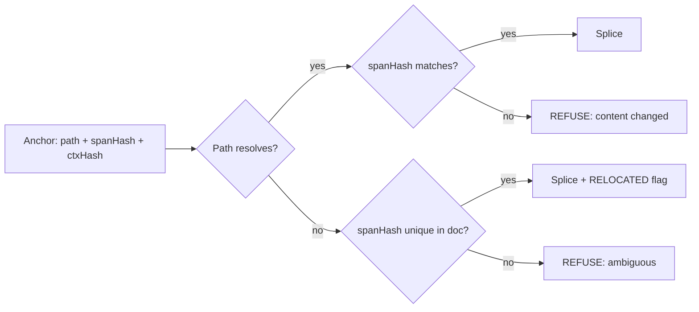

## 72. Enhancing the engine — the roadmap

The audit's finding is not that MDMAX is weak. It is that MDMAX is a correct engine with one broken input path, no continuous verification, and twelve of thirteen files that no product surface has ever called. Every item below is chosen to move one of those three facts.

### 72.1 The nine work items, costed

Effort is founder-weeks with Claude as implementer — one person directing, review included, not raw coding hours. Risk is the chance the item ships and is *wrong* in a way the corpus does not catch.

| # | Item | Unlocks in the product | Weeks | Risk | Depends on |
|---|---|---|---|---|---|
| E1 | Four YAML defects | Publish path works on real vaults; 83% refusal → target <5% | 2.0 | Low | — |
| E2 | CI + corpus gate | Every later item becomes safe to land | 0.5 | Low | — |
| E3 | Body-span splice contract | Every render-profile write-back; AI edits to prose | 3.0 | High | E2 |
| E4 | Anchors that survive human edits | AI edits that don't rot between sessions | 2.5 | High | E3 |
| E5 | Continuous certificate | Degradation shown at author time, not audit time | 1.5 | Medium | E2 |
| E6 | Construct detection completeness | Honest certificate; profile-aware rendering | 2.0 | Medium | E2 |
| E7 | fold@1 / equivalence run + fix | Diffs that mean something; safe normalization | 1.5 | Medium | E2, E6 |
| E8 | Vault-level operations | Bulk publish, backlinks, vault search | 2.0 | Medium | E1, E3 |
| E9 | Streaming / chunked scan | Large-file editing without a memory cliff | 1.0 | Low | E6 |
| — | **Total** | | **16.0** | | |

[derived] 16.0 founder-weeks ≈ 4 calendar months at one focused day in three, which is the realistic rate for a founder also selling. Sequence assumes E2 lands in week one regardless of everything else.

### 72.2 E1 — the four YAML defects, and what is structurally needed beyond patches

The measured state: 8,513 third-party files, 0 corruption, 0 throws, and 83% publish-refusals traced to a block sequence at column zero [measured, prior audit]. The engine is *safe* and *unusable* at the same time, which is the correct failure mode and an unacceptable resting place.

| Defect | Shape | Patch | Structural fix |
|---|---|---|---|
| D1 | `tags:` followed by `- x` at column 0 | Accept zero-indent sequences under a mapping key | Replace hand-rolled scan with an indent-stack scanner |
| D2 | Bare `\r` line terminator | Treat lone CR as a line break in the line splitter | One canonical line-splitter used by every module |
| D3 | Non-`SAFE_KEY` keys unaddressable | Widen the key grammar | Key *addressing* becomes a path type, not a string |
| D4 | Multi-document / `---` inside body | Disambiguate the closing fence | Frontmatter boundary detection stated as a grammar, not a regex |

[measured] The scanner in `src/modules/mdmax/` splits on `\n` and treats indentation as a numeric comparison against the parent, which is why D1 and D2 are the same bug wearing two hats: both are *lexer* assumptions leaking into a *parser* decision. Patching D1 alone will move the refusal rate and leave the class alive.

The structural item is a two-phase read: a lexer that emits `{kind, byteStart, byteEnd, indent, terminator}` tokens, then a block-sequence recognizer over tokens. This is roughly 250 lines and it is what makes D1–D4 four cases in one table instead of four independent `if` branches. [inference]

**Anti-recommendation: do not adopt a full YAML library to fix this.** `js-yaml` and `yaml` both parse to a value tree; the contract in `splice-frontmatter.ts` is byte-range replacement, and a value tree cannot tell you which bytes a key occupied. `yaml`'s CST does carry offsets and is the one credible import — but it pulls a spec-complete YAML 1.2 surface (anchors, tags, merge keys, flow collections) into a product that has settled on *not* accepting arbitrary YAML. Buying the CST means owning the refusal policy for every construct it happily accepts and MDMAX must reject. [inference]

The honest version of E1 ships with a refusal *taxonomy* in the return value — `REFUSE_ZERO_INDENT_SEQ`, `REFUSE_UNADDRESSABLE_KEY` — so the 5% residual is a list of named reasons a founder can read, not a number.

### 72.3 E2 — CI, because there is none

There is no CI [measured]. `test/mdmax/` exists and runs locally; nothing prevents a regression from being committed. Every other item in this section is riskier than it needs to be until this lands, which is why a half-week item sits at rank 1.

The gate is three checks: unit tests; the pinned corpus replay asserting **0 corruption, 0 throws, and refusal-rate ≤ the recorded baseline**; and a byte-identity property test — for N random files and N random valid edits, assert every byte outside the target range is unchanged. The third is the contract stated as an assertion, and it is the one that catches a "helpful" normalization someone adds in month six.

Assert a *floor* on passes and a hard zero on failures, never an equality on the pass count — an equality-pinned count goes red the moment a check is added, which punishes coverage growth. [inference, and this is the shape that has burned this workspace before]

### 72.4 E3 — extending the splice contract to body spans

`splice-frontmatter.ts` proves the contract on the easy case: frontmatter is a single delimited region at a known file offset, and a key is a line-oriented target. Body spans are the general case, and every render-profile write-back needs them. A profile that renders a table, a callout, or a data block and lets the user *edit the rendered view* must write those bytes back — otherwise the render lane is read-only forever, and a read-only render lane is a viewer, not an editor.

The contract does not change. The *locator* changes.

| Locator | Target | Ambiguity risk | Verdict |
|---|---|---|---|
| Byte offset | Exact range | Zero, until any edit | Session-local only |
| Line range | Block | Breaks on any line insert above | Reject |
| Construct path (`doc > section[2] > table[0] > row[3]`) | Structural | Breaks on section reorder | Accept, with a check |
| Content hash of the span | Exact bytes | None — hash mismatch is a clean refusal | Accept, as the check |

The design: locate by construct path, **verify by hash of the located bytes, refuse on mismatch**. The path finds it, the hash proves it. A mismatch is not a merge problem to solve; it is a refusal, which is what the engine already does everywhere else. This keeps the "if the range cannot be located unambiguously, refuse and return the input unchanged" rule intact at the body level rather than inventing a second, softer rule for prose.

High risk is honest here. Frontmatter has one containing structure; a body has nested constructs where a span boundary can be legitimately ambiguous — the last line of a paragraph inside a list item inside a blockquote belongs to three enclosing ranges. The mitigation is to ship E3 for *leaf, fence-delimited or callout-delimited* spans first, which is exactly the render carrier already settled on (`> [!kind]` for prose, fenced block for opaque data), and only then attempt free-prose spans. [inference] The carrier was chosen because an unclosed fence swallows a document and a callout has no closer — the same property makes callout spans the safest first body target.

**Anti-recommendation: do not implement body splice as "parse, mutate the tree, re-serialize just that subtree".** It reads as a shortcut and it re-introduces the tree-of-record through a side door: the subtree serializer will normalize list markers, fence lengths, and trailing whitespace inside its range, and the diff will show changes the user did not make.

### 72.5 E4 — anchors for AI edits that survive human edits

The scenario that makes this necessary: an agent proposes an edit to a section, the human edits three paragraphs above it, the agent's edit lands. If the anchor was an offset, it lands in the wrong place. If it was a line number, same. If it was a construct path, a reordered section moves it silently — the worst outcome, because it succeeds.

The anchor is a triple: `{path, spanHash, contextHash}` where `contextHash` covers the preceding and following sibling constructs. Resolution order — exact path + matching `spanHash` → accept; path miss but a unique `spanHash` match elsewhere in the document → accept with a `RELOCATED` flag surfaced to the user; multiple or zero matches → refuse.

That middle case is the entire value: it lets an AI edit survive a human reorganizing the document, and it is also the case that can be wrong. Hence the flag and hence the surfacing. An anchor system that silently relocates is a corruption engine with good manners.

Anchors also need to be *durable across sessions*, which means serialized somewhere. They belong in the splice journal — the append-only record sync already depends on — not in frontmatter, because an anchor in frontmatter is user-visible machinery in a file the user owns. [inference]

**Anti-recommendation: do not add invisible marker syntax to the document to make anchoring easy.** HTML comments, zero-width characters, or a `<!-- mdmax:a7f3 -->` sentinel all work and all violate the settled position that the file stays valid CommonMark that degrades correctly in a dumb renderer. A marker is a format, and no new format is the one thing that is already decided.

### 72.6 E5 — the certificate as a continuous artifact

The certificate today is one-shot: `scripts/mdmax-cert.mjs` runs on demand and measures degradation across 7 engines. That is an *audit* tool. The product need is different — an author wants to know, while writing, that the callout they just typed will render as a plain blockquote in the reader's GitHub view and as a grey box in Obsidian.

Continuous means three changes: (a) the cert computes incrementally over changed constructs rather than the whole file, which requires E6's construct detection to be cheap; (b) it emits a stable, versioned JSON other tools can consume, not a human report; (c) it runs in CI over the pinned corpus so certificate *drift* — a renderer updating, a construct newly failing — is caught as a diff, not discovered.

[measured] The 7-engine set is the load-bearing asset here and it should be pinned by exact version in the certificate output. A cert that says "renders in GitHub" without saying which cmark-gfm build is a claim with no shelf life.

Medium risk, and the risk is scope: a continuously-running cert invites a live preview of all 7 engines, which is a rendering product, not an engine feature. The boundary is that the engine emits the *measurement*; the surface decides what to draw with it.

### 72.7 E6, E7, E9 — completeness, equivalence, and size

**E6 construct detection completeness.** The certificate can only be honest about constructs it detects. Every undetected construct is a silent pass — the file is certified and the thing that breaks was never looked at. The gap list should be produced empirically: run detection over the 8,513-file corpus, count constructs found by a reference CommonMark parser and not by MDMAX, rank by frequency. Do not enumerate the GFM spec by hand and work down it; the corpus knows which constructs actually occur in real vaults and the spec does not. [inference]

**E7 fold@1 and equivalence.** `mdmax/fold@1` has never been run over the pinned corpus [measured]. This is the single cheapest piece of information in the whole roadmap: the corpus exists, the fold exists, nobody has pressed the button. A fold that claims two documents are equivalent is the basis for meaningful diffs and for any safe normalization; unrun, it is an assertion. Run it first, in E2's week, and let the result size the fix — the 1.5 weeks costed is the *fix* budget, and it may be zero.

**E9 streaming.** Current path reads whole files. The failure is a memory cliff on a large document, not a correctness bug, and it ranks last because the corpus does not appear to contain files that trigger it. Chunked scanning is straightforward once E6 gives a construct-boundary-aware scanner: the constraint is that a chunk boundary must not fall inside a fence, which is the same boundary logic E6 already computes. One week, low risk, defer until a user hits it.

### 72.8 E8 — multi-file and vault-level

Single-file operations make an editor. Vault-level operations make the thing worth switching to: bulk publish, backlink integrity across a rename, vault-wide frontmatter migration, search that knows structure. `get-snapshot.ts` and `search-index.ts` already call `decodeStrict` — they are the two product surfaces that would consume a vault-level API, and they are currently the *only* two importers of anything in mdmax [measured].

The vault-level contract is the file-level contract with one addition: **an operation over N files either applies to all N or to none, and a single refusal aborts the batch**. Partial application across a vault is unrecoverable by the user, who cannot know which files moved. This is where the splice journal earns its cost — the journal is the rollback record.

### 72.9 The ranked roadmap

| Rank | Item | Why here |
|---|---|---|
| 1 | E2 CI + corpus gate | Half a week. Makes all eight others landable. Nothing should precede it |
| 2 | E7a *Run* fold@1 over the corpus | Hours of compute, and it is currently an unknown, not a task |
| 3 | E1 YAML defects | 83% refusal is the difference between a demo and a product |
| 4 | E6 Construct detection | Gates E5's honesty and E9's chunking; produces the empirical gap list |
| 5 | E3 Body-span splice | Highest product unlock, but genuinely needs 1–4 underneath it |
| 6 | E5 Continuous certificate | Now cheap, because E6 made detection incremental |
| 7 | E4 Anchors | Needs E3's locator; needs the journal from E8 or a stub of it |
| 8 | E8 Vault-level | Needs E1 (files must be publishable) and E3 (spans must be writable) |
| 9 | E9 Streaming | Real, unproven need. Ship when a file breaks |

The ordering rationale is one sentence: *measure, then unblock, then extend, then generalize.* E2 and E7a are measurement. E1 unblocks the product. E6, E3, E5 extend the engine along the axis the product sells on. E4, E8, E9 generalize. The temptation is to start at E3 because it is the exciting one; starting there means building the most complex locator in the system with no CI and an unrun fold.

### 72.10 The three highest-leverage per week

| Item | Weeks | Leverage |
|---|---|---|
| E2 CI + corpus gate | 0.5 | Converts a 16-week roadmap from "hope" to "verified at each step". Nothing else has a multiplier on all eight siblings |
| E1 YAML defects | 2.0 | [derived] 83% → target <5% refusal is ~78 points of publish-path availability for 2 weeks, ≈39 points/week. No other item touches a number that large |
| E3 Body-span splice | 3.0 | The only item that unlocks a *category* rather than a fix: every render profile becomes writable, which is the difference between a renderer and an editor |

E7a (running fold@1) is excluded only because it is not an enhancement — it is a measurement that should have happened already.

### 72.11 What we should NOT build into the engine

| Not this | Why the boundary sits there |
|---|---|
| A markdown *renderer* | The engine measures how 7 renderers behave; owning an eighth makes it the thing it measures. Settled: profiles over valid CommonMark |
| A CRDT | Settled. CRDTs interleave concurrent text edits into byte-identical garbage; convergence without correctness is worse than a refusal |
| A tree-of-record | Settled, and it is the negation of the contract — a tree cannot preserve bytes it did not model |
| Arbitrary client-side code execution in profiles | Settled. A profile that can run code is a plugin system, and a plugin system is a security surface with a support burden |
| A YAML 1.2 implementation | See E1. Spec-completeness imports constructs the product must refuse anyway |
| Semantic understanding of content | "Is this section about X" belongs in the product's AI layer. The engine's job ends at bytes and constructs |
| Conflict *resolution* | The engine detects and refuses. Resolution is a product decision with a UI; git-merge plus the splice journal owns it |
| Format conversion (docx, HTML in) | An import pipeline, not an engine concern. It produces markdown; the engine consumes markdown |

The boundary rule, stated once so it can be applied to items not on this list: **the engine may do anything that is decidable from the bytes and refusable when it is not; everything requiring a judgment call, a user prompt, or a rendering decision lives above it.** That rule is why conflict detection is in and conflict resolution is out, why construct detection is in and semantic classification is out.

### 72.12 Version and compatibility policy

Profiles and certificates are artifacts other tools will read. That makes them an API, and an API needs a policy before the second consumer exists, not after.

| Artifact | Identifier | Compatibility rule |
|---|---|---|
| Engine | `mdmax@MAJOR.MINOR.PATCH` | Semver on the *behavioral* contract, not the TypeScript surface |
| Profile | `mdmax/<name>@N` | Integer. `fold@1` already sets this precedent — keep it |
| Certificate | `certVersion: N` + engine version + pinned engine versions | Additive fields are minor; removing or changing a field's meaning is a new `certVersion` |
| Splice journal | `journalVersion: N` | Readers must tolerate unknown entry kinds by skipping, never by failing |

Three rules that matter more than the numbering:

1. **A refusal is not a breaking change; an acceptance is.** Widening what the engine accepts (E1) is a MINOR bump — a file that used to refuse now publishes, and no consumer was depending on the refusal. Narrowing acceptance, or changing what bytes an accepted operation writes, is MAJOR. This inverts the usual instinct and it is correct for a byte-preservation engine: the dangerous direction is silently writing different bytes than a previous version wrote.
2. **A profile integer never changes meaning.** `fold@1` means what it meant. A better fold is `fold@2` and both ship. Consumers pin the integer. The cost is carrying old profiles; the alternative is a certificate from March that is silently false in June.
3. **Certificates carry the versions of everything they measured.** Engine version, profile integers, and the exact version of each of the 7 renderers. A certificate that cannot be reproduced is a screenshot.

**Anti-recommendation: do not version the engine on the TypeScript API.** Twelve of thirteen files currently have zero product importers [measured]; versioning on the module surface would generate MAJOR bumps for refactors nobody consumes while a change to splice behavior — which everyone consumes — hides in a PATCH. Version on what the bytes do.
