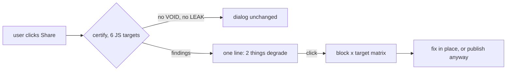

## 73. The degradation certificate as a product surface

### 73.1 What the certificate proves today, precisely

The certificate is a per-file, per-block, per-(product, surface) differential run against pinned renderers. It is not a prediction and not a lint pass. `src/modules/mdmax/application/certify.ts` splits a document on blank lines outside fences (`splitBlocks`, deliberately not an mdast walk, "because each engine's own block segmentation is one of the things being MEASURED"), renders every block through every selected engine, folds each output through `mdmax/fold@1`, and classifies the cell in `src/modules/mdmax/domain/verdict.ts` (`classify`) into PASS / STRIP / CORRUPT{LEAK,DESTROY,MUTATE} / VOID.

| Claim | Status | Evidence |
|---|---|---|
| Runs the file through 7 real engines, not a model of them | true | `--bench-info` prints `remark-app`, `react-markdown`, `marked`, `markdown-it` ×2, `commonmark 0.31.2`, `kramdown@2.5.2+kramdown-parser-gfm@1.1.0` [measured] |
| Records the full option set, hashed | true | `computeBenchId` in `bench.ts` sha256s `(id, version, canonical(options))`; 7-engine bench id `51947c2e88127bfc…`, 6-engine (no ruby) `4aa717561b15…` [measured] |
| Every verdict carries `before`/`after` | true | `CellVerdict` makes both required in `cert-contract.ts`; CLI prints the pair for every non-PASS [measured] |
| Never touches the `.md` | true | `certify` returns a value; the CLI writes only stdout [measured] |
| Never throws on a user document | holds at 1,100 files | 300- and 800-file corpus samples: 0 refusals, 0 throws [measured] |
| Covers the surfaces users name | false | `uncertifiableShare()` returns 8 of 15 (53.3%) non-`local`; Obsidian, Notion, Typora, Bear, Slack, Discord, `github-blob`, `github-comment` are declarations [measured] |
| The declarations are current | false | `DECLARED_LAST_VERIFIED = '2026-08-01'`, 29 days stale at 2026-08-30 UTC [derived] |
| MUTATE is judged against the spec | false, and correctly so | the consensus note in `certify.ts`: commonmark-as-reference made "356 MUTATEs on a five-file sample, nearly all false"; reference is now the modal folded output [measured, read here] |
| It runs | **false at HEAD** | `node scripts/mdmax-cert.mjs --bench-info` → `ERR_MODULE_NOT_FOUND … /domain/offsets`; `certify.ts` imports `'../domain/offsets'` extensionless, which Node 24.6.0 type-stripping will not resolve. Every measurement below required a custom resolve hook [measured] |

What it does not prove: that a PASS is a PASS on Obsidian; that a MUTATE matters; that the numbers are stable under subsetting. The last is sharp — `--targets` is not a filter, it redefines the question, because the consensus is computed over the selected targets. `AGENTS.md` with 7 targets: PASS 326 / STRIP 0 / CORRUPT 38 / VOID 0. The same file with 4 targets: 202 / 0 / 6 / 0, both MUTATE rows gone [measured].

### 73.2 The measurement that had never been taken

`fold.ts` states in its own header that `mdmax/fold@1` "has never been run over the pinned corpus." It has now — over a deterministic every-*n*th sample of `test/corpus/foreign/MANIFEST.sha256` (8,513 files, 19,047,891 bytes, mean 2,238 B), 6 JS targets, kramdown excluded.

| | 300 files | 800 files |
|---|---|---|
| Blocks / cells | 3,946 / 23,676 | 10,176 / 61,056 |
| Wall time | 1,449 ms (4.8 ms/file) | 3,258 ms (4.1 ms/file) |
| Refusals, throws | 0, 0 | 0, 0 |
| Blocks BROKEN on ≥1 target | 24.35% | 25.26% |
| Files with a BROKEN block | 93.33% | 94.25% |
| LEAK / MUTATE / DESTROY | 1,735 / 939 / 0 | 4,689 / 2,513 / 0 |
| VOID cells | 4,400 | — |
| Top-5 constructs' share of attributions | 99.3% of 962 | 99.8% of 2,570 |
| Top-3 (`html-comment`, `yaml-frontmatter`, `pipe-in-prose`) | 91.6% | 93.8% |

[measured, two independent samples]

Kill condition (1) — the fold swallows everything — does not fire. Kill condition (4), as `scripts/mdmax-cert.mjs` itself evaluates it ("top-5 constructs are >80% of BROKEN attributions… the apparatus reduces to a static rule set"), fires at 99.8% [derived]. On real third-party vaults, three constructs explain nine tenths of every finding, and DESTROY — the class that would justify the word "corruption" — never occurs.

Two more results that must gate any product decision. First, the app's own target is the loudest offender on hand-authored prose: on `AGENTS.md`, 25 of 38 CORRUPT cells are `frontmatter-app CORRUPT/MUTATE`, and the minimal case reproduces — `Line one\nLine two` renders `
Line one Line two
` on `frontmatter-app` and identically-without-` ` on the other six, so it is the minority against consensus [measured]. `remark-breaks` in the app pipeline *is* `hard_wrap`, which `bench.ts` pins OFF for kramdown precisely because "every soft line break in every document would be a false MUTATE." Second, ruby dominates cost: `docs/ENGINE.md` (110,876 B, 303 blocks) takes 16.004 s with 7 targets and 0.500 s with 6, so `kramdown-jekyll` is 96.9% of wall time at 51.2 ms/block — `spawnSync` per block, confirmed at 51.5 ms/block on a second file [derived].

### 73.3 Distribution surfaces, ranked

Effort in engineer-days with Claude implementing; value is distribution or retention, stated per row.

| Rank | Surface | Effort | What it is for | Anti-recommendation |
|---|---|---|---|---|
| 0 | **Make the CLI executable** — extensioned specifiers, a `bin` entry, `--targets` defaulting to the JS six | 1 | Every other surface imports this path; it is currently unrunnable | Do not ship it as `npx` until the `frontmatter-app` MUTATE row is fixed or excluded — the tool would accuse its own vendor on every soft-wrapped paragraph |
| 1 | **MCP tool** `certify_markdown(path, targets)` returning the `Certificate` JSON | 2 | The consumer is an agent that can *act* on VOID and LEAK before writing; the artifact is already machine-shaped, no rendering work | Do not return the whole certificate — 24.4× source size on `AGENTS.md`, 19.6× on `ENGINE.md`; return summary + non-PASS cells and a pointer (LR#17 token cap) |
| 2 | **Public web checker** — paste or drop a file, get the block × target matrix | 4 | Top-of-funnel; 4.1 ms/file JS-only means a request is free | Do not put kramdown behind it synchronously (51.2 ms/block); do not accept a directory upload; do not persist submitted content |
| 3 | **GitHub Action** wrapping `--fail-on=BROKEN` | 3 | Repeat exposure inside someone else's CI | Do not ship default-fail: 94.25% of real files carry a BROKEN block, so the default is a red build on adoption day. Ship a baseline file and fail only on *new* CORRUPT/DESTROY and VOID |
| 4 | **In-editor panel** — a right-rail matrix for the open file | 8 | Retention, and the only surface where the fix is one keystroke away | Do not render it live on every keystroke; do not show MUTATE unattended |
| 5 | **Badge** — `renders-clean` SVG | 1 | Nothing defensible | Anti-recommended outright, see 73.8 |

Rank 0 first is not process theatre. `.github/` does not exist [measured], `npm run verify` in `package.json` chains typecheck → lint → test → build → arch → spec and never invokes cert, and 12 of the 13 mdmax files have zero product importers — only `decodeStrict` from `shape-gate.ts`, imported by `src/modules/vault/application/get-snapshot.ts` and `src/modules/vault/infrastructure/search-index.ts` [measured]. The 290 tests in `test/mdmax/` pass in 639 ms [measured], which means the code is healthy and unwired, not broken and untested.

### 73.4 The in-product experience

The user meets the certificate at exactly one unasked moment: the instant they make a file leave the app. The share path already mutates bytes there — `src/modules/share/domain/splice-frontmatter.ts` writes the slug back into front matter — so the publish dialog is where "how does this render where it is going" is a question the user is already holding.

Three rules make it survivable. Only VOID and LEAK surface unasked: VOID is 18.6% of blocks in the corpus sample and is genuinely invisible content — the reader sees `![[Some Note]]` and nothing else — while LEAK is front matter and `{#id}` becoming visible text, which is measurable on the exact file the user is publishing. On `docs/ENGINE.md` bytes 0–68 that reads: *your front matter is invisible on 2 of 7 targets and visible as `updated: 2026-08-30 generated_by: …` on the other 5* [measured]. MUTATE is suppressed by default because 93.8% of attributions come from three constructs and because 34 of 34 `react-markdown` MUTATEs on `ENGINE.md` are GFM tables — true, unactionable, and enormous [measured]. And silence is the default state: no findings, no chip, no badge, no toast.

The anti-recommendation is the whole design constraint. Do not put a persistent quality score in the chrome; do not colour the editor gutter with verdicts; do not run cert on the keystroke path. A per-file JS-only pass is 4.1 ms and a per-block one is far less, but the cost is not compute — it is that a panel showing 25 MUTATE rows on a normal document teaches the user, correctly, that the panel is noise, and a surface that trains its own dismissal is worse than no surface (LR#65 restated for a product).

### 73.5 The public dataset

The proposal: publish derived verdicts for all 8,513 corpus files, keyed by the source `sha256` already in `MANIFEST.sha256`, alongside `SOURCES.json`'s pinned upstream commits — never the source text, which is third-party material under its own licences and is gitignored under `_vendor/`.

| Line | Value | Note |
|---|---|---|
| Compute, JS-only | 8,513 × 4.1 ms = 34.9 s | [derived] from the 800-file rate |
| Compute, with kramdown | 12.72 blocks/file × 8,513 × 51.2 ms = 92.4 min | [derived]; a nightly job, not a request |
| Artifact size, uncompressed | 0.35–0.43 GB | [derived] from 19.6× and 24.4× measured blowups over 18.2 MB |
| Recurring cost | one re-run per engine bump | `computeBenchId` makes a bump a visibly different bench, not a silent one |
| Legal | source text not redistributed | verdicts + `before`/`after` fragments are the exposure; cap fragment length |

What it buys: a citable number where today there is a paraphrase, a reason for other people's engines to appear in your registry, and — the underrated one — public dating of the eight declared rows, which forces the staleness that `DECLARED_LAST_VERIFIED` already encodes into something the team cannot quietly let rot for 29 days.

What it risks: yes, it hands a competitor the map. The honest counter is not that the map is secret; it is that the map expires. `TARGETS` says so out loud — "that decay is the reason this is the one dataset a competitor cannot simply copy once." A competitor who copies the 2026-08 verdicts owns a snapshot of seven engine versions; they do not own `loadBench`, `computeBenchId`, or the fold whose version string is the definition of PASS. The real risk is narrower and worth naming: publishing a table in which 99.8% of findings reduce to five constructs tells a competitor they can approximate you with five regexes, and that is true today.

### 73.6 Third-party reproducibility

An unverifiable certificate is a press release. Four gaps, each with a named fix.

| Gap | Where | Fix |
|---|---|---|
| `benchId` covers engines but not what resolved them | `computeBenchId` hashes `(id, version, options)`; `sha` is excluded by design | add `bench.lockfileSha256` over `package-lock.json` + the ruby `Gemfile.lock` |
| `fold.version` is a string a human types | `FOLD_VERSION = 'mdmax/fold@1'` in `fold.ts` | add `fold.sha256` over the source of `fold.ts`; a fold edit that forgets the bump then still changes the id |
| No corpus identity | `corpus-foreign.mjs` has `MANIFEST.sha256` and `SOURCES.json`, the `Certificate` has neither | add `corpus_id` to any published aggregate; the file header of `fold.ts` already warns that the famous 43.71%→4.28% figure "carries no `corpus_id`" |
| Nothing recomputes the id | no verifier exists | `mdmax-cert.mjs --verify <cert.json>`: rebuild the bench from the cert's own `bench.engines`, recompute `computeBenchId`, refuse on mismatch |

`--verify` is the load-bearing one, and it must be written to fail before it is trusted: a verifier authored in the same session as the thing it verifies is a second opinion from the first opinion (LR#60). Mutate one option in a stored certificate, prove the verifier refuses, then ship it. The anti-recommendation: do not sign certificates. A signature proves *we* produced it, which is the opposite of what a third party needs; a recomputable id proves *anyone* can produce it.

### 73.7 Wedge, feature, or moat

It is a wedge, sold as a feature, and it is not a moat.

Wedge, because it is the only artifact here that a stranger will run against *their* files without an account, and because it produces a specific, checkable, unflattering sentence about a document they already own — bytes 0–68 leak on 5 of 7 targets. Feature, because inside the product it is one line in a publish dialog with a matrix behind it, and that is the correct size. Not a moat, because `loadBench` composes seven public libraries at their documented defaults, and `TARGETS` is a hand-maintained list of fifteen rows.

The strongest argument against: the corpus data says it is a lint rule, and a lint rule is a weekend. Kill condition (4) fires at 99.8%; three constructs — HTML comments, YAML front matter, pipes in prose — cover 93.8% of attributions; DESTROY, the only class whose name survives contact with a customer, occurs zero times in 10,176 blocks. On that evidence the differential apparatus, the consensus reference, the four-verdict ladder and the 3,614 lines exist to rediscover five regexes, and the honest product is a 200-line linter with five rules and no ruby dependency. That argument is strong enough that it should be the first thing tested: build the five-regex linter, run both over the same 800 files, and if agreement exceeds ~95% of findings, the certificate's product claim is the *residual* — the lone-tilde case that the differential found and no construct list predicted — and the residual must be measured before it is sold.

The rebuttal is narrow and should not be oversold. Five constructs explain this corpus, in 2026, against these seven engine versions. The apparatus is what re-derives next year's five when `marked` ships a breaking release or GitHub swaps a renderer, and `computeBenchId` is what makes that re-derivation visible rather than silent. That is a maintenance moat, not a technology moat, and maintenance moats are worth roughly one engineer-week per quarter — price it that way.

### 73.8 Anti-recommendations

Do not ship a badge. A verdict is a function of the target set, the bench id and the fold version — `--targets` subsetting alone moved `AGENTS.md` from 38 CORRUPT to 6 [measured] — so a two-state SVG either encodes none of that or is unreadable, and at a 94.25% file-level BROKEN rate it is a red-badge generator.

Do not put kramdown in any interactive path. 96.9% of wall time, 51.2 ms per block, one `spawnSync` each; it belongs in the nightly dataset job and nowhere else.

Do not ship `--fail-on=BROKEN` as an Action default, and do not report a per-file "score". Both convert a measurement into a grade, and the grade is dominated by three constructs the author cannot remove without giving up front matter, comments, and tables.

Do not publish the corpus aggregate before `frontmatter-app` stops MUTATEing on soft line breaks. Publishing a table whose loudest row is our own renderer disagreeing with six others, over a `remark-breaks` choice we made on purpose, is a self-inflicted headline.

Do not fold the fix. The temptation, on seeing 25 MUTATEs from one ` `, is to teach `mdmax/fold@1` that ` ` is whitespace. `fold.ts` is explicit that it is "deliberately under-powered" and that "everything it does NOT do is a real finding"; the correct fix is to state that `frontmatter-app` hard-wraps, in `Target.prePipeline` or in the option record, not to widen the definition of "equivalent" until the finding disappears.

Do not claim the certificate covers Obsidian or Notion. Eight of fifteen surfaces are declarations, they are 29 days stale, and `targets.ts` already names the kill condition — "the uncertifiable surface is the only one anyone cares about." Say `local` and `declared` in the product copy, in those words, or the first user who checks will find the gap before the second one does.
