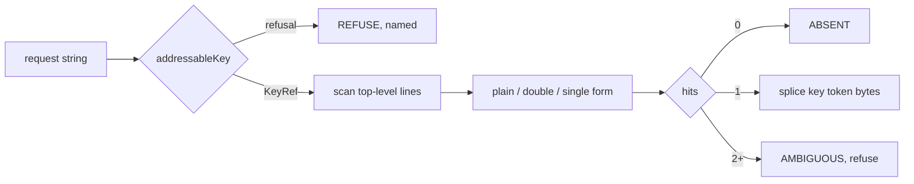

## 75. Key addressability — the NF-4 design

### 75.1 The decision

`SAFE_KEY = /^[A-Za-z0-9_.$-]+$/` in `/Users/sagnikmitra/Desktop/GitHub/frontmatter/src/modules/share/domain/splice-frontmatter.ts` is replaced by a **predicate over what the byte locator can find unambiguously**, not a character allowlist. Any Unicode string is an addressable key when it is already NFC, is one line, carries no control character, has no edge whitespace, contains neither `:` followed by space-or-EOL nor space-followed-by-`#`, and does not begin with a YAML c-indicator. Equality between a requested key and an on-disk key is codepoint equality after NFC normalisation of the request only — the file is never normalised, and a file whose key is not NFC is refused with a distinct verdict rather than matched.

Measured against the pinned corpus at `/Users/sagnikmitra/Desktop/GitHub/frontmatter/test/corpus/foreign/_vendor/`: this unlocks 936 of the 942 currently-unaddressable files, and the 6 that remain refused are all correct refusals.

### 75.2 What key equality means, and what breaks under each answer

The module comment is right that this is the prior question. Three candidate semantics, and what each costs [inference, with the parser behaviour measured below]:

| Semantics | `café` NFC vs NFD | What it breaks |
|---|---|---|
| Codepoint equality, request normalised to NFC (chosen) | two distinct keys | a user who types NFD (macOS filesystem-sourced text) gets `ABSENT` for a key visibly on screen — surfaced as a named refusal, never as a silent append |
| NFC-fold equality on both sides | one key | a file that legitimately holds both loses one on the next write, and the splice must choose which bytes survive — a rewrite of bytes we were not asked to change |
| Normalise the file to NFC on open | one key | rewrites bytes across the whole document, violating the contract at its root; every anchor offset shifts |

[measured] `yaml@2.9.0` and `js-yaml@3.14.2` — both installed in this repo — parse `café: 1` (NFC) and `café: 2` (NFD) in one block as two distinct keys, with no warning. `Object.keys(YAML.parse(...)).length === 2`. Every YAML consumer downstream of us therefore already treats them as different. Folding them would make us the only participant in the ecosystem that disagrees with the file.

[fetched, yaml.org/spec/1.2.2/ via `curl -sL --compressed`] The spec routes equality through the tag's canonical form: "A mapping's keys are unique if no two keys are equal to each other," and scalar tags "must specify a mechanism for producing the canonical form." For `tag:yaml.org,2002:str` the canonical form is the character string itself. No normalisation is mandated anywhere in the spec. Codepoint equality is the spec-conformant answer, not a shortcut.

### 75.3 What YAML 1.2.2 actually permits in a block key

[fetched] "To limit the amount of lookahead required, the `:` indicator must appear at most 1024 Unicode characters beyond the start of the key. In addition, the key is restricted to a single line." In `BLOCK-KEY` context, `ns-plain-safe(BLOCK-KEY) ::= ns-plain-safe-out`, which excludes nothing but line breaks — the flow indicators `[`, `]`, `{`, `}`, `,` are unrestricted mid-key.

[measured, `yaml@2.9.0`] What a plain block key legally is, probed directly:

| Input | Parsed key | Consequence for the locator |
|---|---|---|
| `date created: 2022-08-06` | `date created` | spaces are ordinary plain characters |
| `分类: x` | `分类` | non-ASCII is ordinary |
| `a:b: 1` | `a:b` | a colon *not* followed by space is part of the key |
| `a: b: c` | THROW `Nested mappings are not allowed in compact mappings` | `: ` terminates the key; a key containing it must be quoted |
| `a : 1` | `a` | padding may sit between key and colon |
| `-a: 1`, `?a: 1` | `-a`, `?a` | `-` and `?` are indicators only when followed by space |
| `a[b]`, `a{b}`, `a,b`, `a'b`, `a"b`, `a!`, `a?` | as written | legal plain keys, all of them |
| `a: 1` twice | THROW `Map keys must be unique` / `duplicated mapping key` | exact duplicates are an error in both parsers |
| `: 1` | `yaml`: `{"": 1}` · `js-yaml`: THROW | the empty key is a parser-divergence hazard; refuse it |

The last row is the reason the rule is a predicate and not a transcription of the grammar: an empty key is legal to one parser and fatal to another, so "what YAML allows" is not a safe specification for what we may address.

### 75.4 Measurement against the pinned corpus

All figures below are [measured] by `node --input-type=module` scripts run over the 8,513 vendored files, extracting the frontmatter block by the same rules the splice writer uses (`^---[ \t]*(\r?\n)` after an optional BOM, closing on a line that is exactly `---` or `...`), then scanning top-level lines for a key terminated by the first `:` that is at EOL or followed by space/tab.

| Quantity | Count | Share |
|---|---:|---:|
| Files in corpus | 8,513 | — |
| Files opening with a frontmatter block | 7,969 | 93.6% |
| Top-level `key:` lines | 29,293 | — |
| Distinct key shapes | 234 | — |
| Distinct shapes failing `SAFE_KEY` | 50 | 21.4% of shapes |
| Occurrences failing `SAFE_KEY` | 2,452 | 8.4% of key lines |
| Files with ≥1 unaddressable key | 942 | 11.8% of fm files |
| Keys quoted on disk (any form) | 0 | 0% |
| Exact duplicate top-level keys within a file | 0 | 0% |
| Case-insensitive duplicate keys within a file | 0 | 0% |
| Keys not already in NFC | 0 | 0% |
| Distinct keys colliding under NFC folding | 0 | 0% |
| Keys containing `:`, `#`, `.`, or edge whitespace | 0 | 0% |
| Files with a non-BMP character inside a key | 20 | 0.25% |
| Files with a zero-indent block sequence (NF-1) | 6,613 | 82.98% |

The 82.98% cross-checks the reported 83% publish-refusal rate to two decimal places, which is the confirmation that NF-1 and NF-4 are genuinely different defects rather than two readings of one.

The 50 failing shapes decompose as 44 real keys and 6 scanner artifacts. Of the 44: three are ASCII-with-space (`date created` in 812 files, `date modified` in 811, `Would rewatch` in 31), forty are CJK with no space (`分类` in 232 files, `器械` in 54, `主要训练肌肉` in 53), and one is both non-ASCII and non-BMP (`🏃 训练动作集合`, 20 files). The `date created` figure lands in `oldwinter__knowledge-garden`, which has 957 files with frontmatter of which 905 carry an unaddressable key — the 812/957 in the brief, confirmed.

The 6 artifacts are instructive rather than embarrassing: five are `- Structured Copy: Files & Folders` and siblings, which are sequence items at column zero under `aliases:`, not keys at all, and one is a Nunjucks template line beginning `{{type | replace(...)`. A key scanner that widens its character class without also refusing a leading `-` would read all five as top-level keys and splice into a sequence item.

Under the rule specified in §75.5:

| Outcome | Count |
|---|---:|
| Files unaddressable today | 942 |
| Files unaddressable after the fix | 6 |
| Files unlocked | 936 (99.36%) |
| — of which NF-4 alone suffices (no zero-indent sequence present) | 750 |
| — of which NF-1 must also land before publish succeeds | 186 |
| Distinct key shapes unlocked | 44 |
| Key occurrences unlocked | 2,446 |

[derived] 936 / 942 = 99.36%. The residual 6 are the 5 sequence items and the template line — every one of them a correct refusal.

### 75.5 The rule

```ts
// src/modules/share/domain/key-ref.ts  (new)

/** A key that has passed addressability. The only type the splice API accepts. */
export type KeyRef = { readonly nfc: string }

export type KeyRefusal =
  | { kind: 'EMPTY' }
  | { kind: 'TOO_LONG'; length: number }          // > 1024 (YAML 1.2.2 implicit-key limit)
  | { kind: 'CONTROL_CHAR'; at: number }          // C0, C1, DEL, U+2028/2029, U+FEFF
  | { kind: 'EDGE_WHITESPACE' }                   // leading or trailing SP/TAB
  | { kind: 'CONTAINS_TAB' }
  | { kind: 'COLON_TERMINATOR'; at: number }      // /:(?=[ \t]|$)/  — would end the key
  | { kind: 'SPACE_HASH'; at: number }            // /[ \t]#/        — would start a comment
  | { kind: 'LEADING_INDICATOR'; char: string }   // /^[-?:,[\]{}#&*!|>'"%@`]/
  | { kind: 'NOT_NFC'; nfc: string }              // request must arrive normalised

export function addressableKey(raw: string): Result<KeyRef, KeyRefusal>
```

Order of checks is the order of the union. `NOT_NFC` carries the normalised form so the UI can offer it as a one-click correction; it is the only refusal that suggests a repair.

The leading-indicator set is deliberately wider than YAML requires. `-a` and `?a` are legal plain keys [measured], and we refuse them anyway: the locator must scan lines it did not write, a leading `-` is the NF-1 sequence marker, and refusing costs zero corpus files. The check is on the first codepoint of the *key*, never on the line, so a key like `a-b` (already common) is untouched.

The `$` from the old class is retained implicitly — it is simply an ordinary character now. There is no allowlist left to maintain.

### 75.6 Locating a key whose on-disk form differs from the request



Three on-disk forms can carry one logical key. The corpus has zero quoted keys in 8,513 files, so the quoted branches are dead code today and must still be written, because the moment a user adds `date: created` through our own UI we will emit one.

```ts
type KeyForm = 'plain' | 'double' | 'single'
type KeyHit = {
  readonly tokenStart: U16Offset   // first byte of the key token, INCLUDING an opening quote
  readonly tokenEnd:   U16Offset   // one past the closing quote / last plain char
  readonly form: KeyForm
  readonly entryStart: U16Offset   // start of line — the existing keyStart
  readonly entryEnd:   U16Offset   // existing keyEnd, incl. indented continuations
}

function locateTopLevelKey(block: string, blockStart: number, want: KeyRef):
  | { kind: 'FOUND'; hit: KeyHit }
  | { kind: 'ABSENT' }
  | { kind: 'AMBIGUOUS'; hits: number }
  | { kind: 'ON_DISK_NOT_NFC'; found: string }
```

Per top-level line, in this order:

1. `/^"((?:[^"\\]|\\.)*)"[ \t]*:(?=[ \t]|$)/` → unescape `\\(.)` → candidate.
2. `/^'((?:[^']|'')*)'[ \t]*:(?=[ \t]|$)/` → unescape `''` → candidate.
3. Plain: walk the line for the first index `j` where `line[j] === ':'` and `j+1` is EOL or SP/TAB. If `j <= 0`, this line is not a top-level key — hand it to the existing bare-line refusal branch. Otherwise the candidate is `line.slice(0, j)` with trailing SP/TAB stripped, which is what makes `a : 1` resolve to `a` [measured].

Compare `candidate === want.nfc`. If that fails but `candidate.normalize('NFC') === want.nfc`, return `ON_DISK_NOT_NFC` with the on-disk bytes — do not match, do not repair. Zero corpus files reach this branch; it exists because a single NFD `é` typed on a Mac and committed will produce it, and the honest failure is a named refusal that shows the user both forms.

The splice for a rename becomes `src.slice(0, hit.tokenStart) + emitKeyToken(newKey, hit.form) + src.slice(hit.tokenEnd)`, replacing the *token* rather than `oldKey.length` bytes. The current `src.slice(0, hit) + newKey + src.slice(hit + oldKey.length)` in `spliceFrontmatterKey` is only correct because quoted keys are unreachable today; under the widened rule it would leave a dangling closing quote.

`emitKeyToken` writes plain unless the key would not read back plain — which, given `addressableKey` already excludes `: `, ` #`, edge whitespace and leading indicators, is never. New keys are therefore always emitted plain, matching every one of the 29,293 key lines in the corpus. `emitScalar`'s quoting logic stays where it is; it governs values, and keys have a strictly narrower rule.

### 75.7 Case, colons, dots, leading dashes

Keys are case-sensitive, with no folding at any layer. [measured] Zero files contain a case-insensitive duplicate, while eight case pairs exist *across* the corpus (`date`/`Date`, `title`/`Title`, `link`/`Link`, `status`/`Status`, `genre`/`Genre`, `rating`/`Rating`, `runtime`/`Runtime`, `cover-img`/`Cover-Img`). Folding would merge shapes that no single file treats as the same, in exchange for zero measured benefit.

Colons are permitted mid-key when not followed by space or EOL, because `a:b` is one key to both parsers. Dots are permitted and carry no path semantics — `a.b` is a key named `a.b`, never a traversal into `a`. Zero corpus keys contain a dot, so this is a forward commitment, and it is the commitment that keeps the module honest about only ever touching top-level keys. Leading dashes are refused, per §75.5.

### 75.8 The refusal set after the fix

| Refusal | Reachable from | Corpus count |
|---|---|---:|
| `EMPTY` | UI add-property with blank name | 0 |
| `TOO_LONG` | pasted template | 0 |
| `CONTROL_CHAR` | pasted terminal output | 0 |
| `EDGE_WHITESPACE` | trailing space in the name field | 0 |
| `CONTAINS_TAB` | pasted spreadsheet cell | 0 |
| `COLON_TERMINATOR` | `date: created` typed as a name | 0 |
| `SPACE_HASH` | `budget #1` | 0 |
| `LEADING_INDICATOR` | zero-indent sequence item read as a key | 5 |
| `NOT_NFC` | NFD text from a macOS filename | 0 |
| `ON_DISK_NOT_NFC` | a committed NFD key | 0 |
| `AMBIGUOUS` (duplicate key line) | hand-edited file | 0 |
| unparsed top-level line (existing bare-line branch) | NF-1, templates | 13,413 lines / 6,613 files |

The last row is not NF-4's to fix. Of the 942 files NF-4 unblocks, 186 also carry a zero-indent block sequence and will still refuse at the existing bare-line branch until NF-1 lands; 750 publish on NF-4 alone.

### 75.9 Migration for keys already written

There is nothing to migrate in the files. `spliceFrontmatterValue` refuses at `if (!SAFE_KEY.test(key)) return src` before any write, and `spliceFrontmatterKey` refuses on both old and new key, so the engine has never written a key outside the old class. The 2,452 unaddressable occurrences in the corpus were all authored by other tools.

What does migrate is persisted key text on our side:

1. **Splice journal entries.** Every entry that names a key gains `keyForm: 'nfc-v1'`. Entries written before this field are read as `'legacy-ascii'` and are byte-identical to their NFC form by construction (the old class is ASCII-only), so the migration is a field addition with no rewrite. Do not backfill; an absent field is unambiguous.
2. **`PropertiesPanel.tsx`.** The four `SAFE_KEY.test(...)` call sites — `aria-invalid`, the disabled state, and the two guards in the add/rename handlers — switch to `addressableKey(...).ok`, and the invalid state renders `KeyRefusal.kind` instead of a generic red border. One definition, two modules, still no drift.
3. **Anchor store.** Unaffected. Content-derived anchors do not name frontmatter keys.

### 75.10 The test set

Fixtures under `test/corpus/` plus unit cases; `npm run spec` gates, `npm run corpus` replays.

| # | Input | Expected |
|---|---|---|
| 1 | `date created: 2022-08-06` → set | value bytes replaced, all other bytes identical |
| 2 | `分类:` with zero-indent sequence → set | key resolves, refuse at the NF-1 branch, file unchanged |
| 3 | `🏃 训练动作集合: 1` → set | succeeds; `OffsetMap` reports a non-BMP-safe range; no offset splits a surrogate pair |
| 4 | `- Structured Copy: Files & Folders` under `aliases:` → set `Structured Copy` | `ABSENT`, not a match |
| 5 | `a:b: 1` → set `a:b` | matches; set `a` returns `ABSENT` |
| 6 | `a : 1` → set `a` | matches, padding preserved |
| 7 | NFD `café: 1`, request NFC `café` | `ON_DISK_NOT_NFC`, file unchanged |
| 8 | request NFD `café` | `NOT_NFC` with `nfc` populated |
| 9 | `"date created": 1` (quoted) → rename | closing quote survives; token replaced, not `oldKey.length` bytes |
| 10 | two `date created:` lines | `AMBIGUOUS`, file unchanged |
| 11 | key of 1,025 characters | `TOO_LONG` |
| 12 | full corpus replay, set-then-delete on every distinct key | 8,513 files byte-identical; 0 throws |

Test 4 is the one that must fail against the unfixed widened regex before it is trusted (LR#68): a rule that drops the leading-`-` refusal passes tests 1–3 and 5–12 and silently splices into a sequence item.

### 75.11 Decision ledger

| Decision | Rejected alternative | Why | Cost of being wrong | Falsified by |
|---|---|---|---|---|
| Predicate, not allowlist | widened character class | a class cannot express `: ` or ` #`, which are positional | a key that reads back as a different key | any corpus file where the predicate accepts a key the locator then mislocates |
| NFC on request only | normalise the file | normalising rewrites bytes we were not asked to touch | every anchor offset shifts; the contract is void | a vault where >1% of keys are non-NFC, making refusal the common path |
| Codepoint equality | NFC folding | both parsers key NFC and NFD separately [measured] | we disagree with every downstream consumer | a parser survey showing the ecosystem folds |
| Case-sensitive | case-insensitive | 0 in-file case duplicates, 8 cross-file pairs [measured] | merges keys no file treats as one | an in-file case-duplicate found in a real vault |
| Refuse leading `-` and `?` | follow YAML exactly | 5 corpus lines would be misread as keys | splice into a sequence item — silent structural corruption | a vault with real `-`-leading keys |
