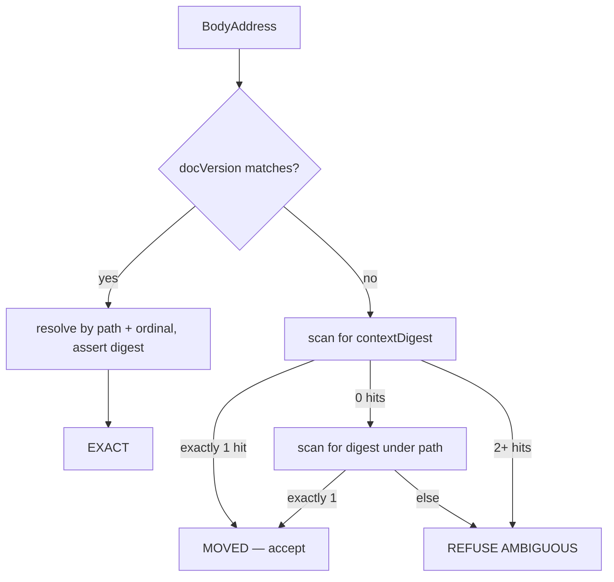

## 76. Body-span splicing — extending the contract past frontmatter

### 76.1 The gap, stated exactly

`spliceFrontmatterValue` in `/Users/sagnikmitra/Desktop/GitHub/frontmatter/src/modules/share/domain/splice-frontmatter.ts` addresses one thing: a top-level YAML key inside the block opened by `FM_OPEN`. Every write-back a render profile needs lives below that block.

| Write-back | Target span | Today's path |
|---|---|---|
| Kanban drag → status | a field inside a list item, or a frontmatter key | frontmatter only; a card whose status is in the body has no write path |
| Checkbox toggle | the three units `[ ]` inside a `TaskMarker` | none |
| Calendar drag → date | a date token inside a list item or heading line | frontmatter only |
| Accepted AI hunk | an arbitrary block range | none |
| Section-level restore | heading line through the next heading of depth ≤ d | none |

The projection law says a render profile is a view whose edits write back to the bytes that produced it. With no body locator, the law holds for exactly one region of the file.

### 76.2 The addressing model

Four candidates, measured against the pinned corpus at `/Users/sagnikmitra/Desktop/GitHub/frontmatter/test/corpus/foreign/_vendor` (8,513 files, 19,047,891 bytes).

| Model | Survives reflow above it | Survives edit to the target | Survives duplicate content | Cost |
|---|---|---|---|---|
| lezer `SyntaxNode` position | no — offsets are per-parse | n/a | yes | needs a live tree; useless across a session boundary |
| Content digest of the span | yes | no | no — measured below | cheap, stateless |
| Line + column offset | no | no | yes | trivially wrong after any prepended line |
| Structural path + ordinal + digest | yes | yes (path survives) | yes (ordinal disambiguates) | three fields to persist, a cascade to resolve |

The duplicate-content number is the one that decides it. [measured] Over the corpus, a task-list line's trimmed text is unique within its own file for 2,278 of 3,378 items — 67.436%. Adding the preceding non-blank line as context raises that only to 75.607% (2,554/3,378). A content-only anchor is therefore ambiguous for roughly one task item in four, which is the single most common write the product has. Against that, an ATX heading's full ancestor path is unique within its file for 37,413 of 37,489 headings — 99.797% (76 collisions). [measured] Both runs walked every `.md`/`.markdown` file under `_vendor`, skipping fenced regions with a `^ {0,3}(\`{3,}|~{3,})` toggle and skipping the frontmatter block.

Decision — the address is a triple, resolved as a cascade:

```ts
// src/modules/share/domain/body-address.ts  (new)
export type SpanKind =
  | 'task-marker'      // the 3 code units `[ ]` — the only mutable part of a checkbox
  | 'list-item-text'   // the item's own text, excluding its marker and its children
  | 'inline-field'     // `key:: value` or `key: value` inside a list item
  | 'fenced-block'     // open fence line through close fence line, indivisible
  | 'callout-body'     // the payload of a `> [!kind]` container
  | 'heading-section'  // heading line through the next heading of depth <= d

export interface BodyAddress {
  readonly kind: SpanKind
  /** ATX heading text chain, NFC-normalised, case-folded. Empty = preamble. */
  readonly path: readonly string[]
  /** 0-based index among same-kind spans under `path`. Disambiguates duplicates. */
  readonly ordinal: number
  /** Digest over the span's own UTF-8 bytes. */
  readonly digest: Digest128
  /** Digest over (previous non-blank line + span + next non-blank line), UTF-8. */
  readonly contextDigest: Digest128
  /** Content hash of the document this address was minted against. The CAS token. */
  readonly docVersion: Digest128
}
```



Rejected: the pure content anchor already shipped for block-versions, which resolves at 99.627% with 0.050% false positives over 41,642 block-versions. That population is whole blocks of prose, not list lines; the 67.436% uniqueness above is what the same scheme scores on the span kind the product writes to most. Cost of being wrong: a false EXACT resolves onto the wrong task item and the toggle lands on someone else's checkbox — silent, and indistinguishable from a user error. Falsifier: if a replay over the corpus shows path+ordinal resolving under 99.5% with zero false positives on a 5%-perturbation sweep, the structural half is not carrying its weight and the model collapses back to content-plus-refusal.

### 76.3 Span kinds and their atomicity class

**The governing rule is that a span is the narrowest byte range that expresses the intent, never the enclosing node.**

| Kind | lezer node | Mutable range | Atomicity |
|---|---|---|---|
| `task-marker` | `TaskMarker` | `from + 1`, length 1 | a single code unit |
| `list-item-text` | `ListItem` minus `ListMark` and child blocks | text run only | marker, indent, numbering never touched |
| `inline-field` | inside `Paragraph` under `ListItem` | value run after the separator | key bytes never touched |
| `fenced-block` | `FencedCode` | `[node.from, node.to)` | open and close in ONE edit or refuse |
| `callout-body` | `Blockquote` with `[!kind]` first line | payload lines | no closer exists — cannot be unbalanced |
| `heading-section` | `ATXHeading*` → next heading of depth ≤ d | whole range | boundary rules in §76.6 |

[measured] `@lezer/markdown@1.6.3` configured with `GFM` yields `TaskMarker` spanning exactly three code units for every marker shape tested — `- [x]`, `- [X]`, `* [ ]`, `1. [ ]`, `  - [ ]` — with the state character always at `from + 1`. A checkbox toggle is therefore a one-unit splice, not a line rewrite. That is the whole argument for the narrowest-range rule: a one-unit splice cannot disturb the marker character, the indentation, a trailing tag, a wikilink, or a comment, because it never sees them.

Fenced constructs are the opposite case and the reason atomicity is a stated rule rather than an implementation detail. [fetched] CommonMark 0.31.2 §4.5, `https://spec.commonmark.org/0.31.2/`: "If the end of the containing block (or document) is reached and no closing code fence has been found, the code block contains all of the lines after the opening code fence until the end of the containing block (or document)." A splice that writes an opening fence and defers its closer has, between the two writes, a document in which every subsequent line is code. On a product where every save is a commit, that intermediate state is publishable. The rule: `fenced-block` edits construct the full replacement string including both delimiters and splice it as one range replacement; there is no API that writes a fence delimiter alone. This is why `specs/render/carrier.md` puts prose in a callout — the callout has no closer to drop.

Decision: span kinds are a closed enum; a caller cannot pass a raw range. Rejected: a general `spliceRange(from, to, text)`. Why: a general range API has no way to know that `[from, to)` was supposed to be balanced, so the fence invariant becomes a convention instead of a type. Cost of being wrong: an unbalanced fence swallows the document, and the blast radius is the whole file rather than one line. Falsifier: a profile that genuinely needs a range the enum cannot express — at which point the enum grows by one entry with its own atomicity class, not by adding an escape hatch.

### 76.4 Surviving a concurrent edit

Two regimes, and conflating them is how offsets rot.

| Regime | Mechanism | Guarantee |
|---|---|---|
| Same session, editor open | `ChangeSet.mapPos` from `@codemirror/state` | deterministic; a resolved span tracks every keystroke |
| Across a save, a sync, or a reload | re-resolve the `BodyAddress` against the current bytes | probabilistic; refusal on ambiguity |

[measured] `ChangeSet.of([{from:0,to:0,insert:"XY"}], 10).mapPos(5)` returns `7`, and the `assoc` argument is honoured. In-session tracking is solved and needs no invention.

Decision: a resolved span is never persisted. What persists is the `BodyAddress`, and every write re-resolves immediately before splicing, inside the same synchronous turn as the byte replacement — no `await` between locate and splice. Cross-session convergence stays where the PRD settled it: git merge plus a splice journal plus compare-and-swap on `docVersion`. A CAS miss is not a merge; it is a re-resolve. If the address still resolves EXACT against the new bytes, the splice proceeds. If it resolves MOVED, the splice proceeds and the journal records the move. If it refuses, the write becomes a conflict for `merge3.ts` to surface.

Rejected: mapping stored offsets through a diff of the two document versions. Why: `diff-match-patch` was measured non-idempotent while returning true, so a mapped offset carries no proof it landed on a character boundary, let alone the right character. Cost of being wrong: an offset mapped one unit into a surrogate pair produces an address that `u16()` would have rejected, written into durable storage. Falsifier: a mapper that is provably idempotent and boundary-preserving over the corpus would make the re-resolve redundant for the same-document case.

### 76.5 List-item and task-list mutation

This is the most common write, so it gets the most specific rules.

| Rule | Reason |
|---|---|
| The list marker character (`-`, `*`, `+`) is never normalised | it is authored style; rewriting it is the `matter.stringify` failure in a new costume |
| Ordered-list numbers are never renumbered | [measured] 1,151 ordered items in the corpus, 8 non-sequential — those 8 are authored, and a renumber destroys them |
| Indentation of the item and of its children is never re-computed | changing the content column reparents every child |
| A `list-item-text` splice ends at the item's own text run, never at `ListItem.to` | [measured] 19,135 of 60,000 list items (31.892%) are followed by a lazy continuation line; `ListItem.to` swallows it |
| A task item with child blocks is refused for `list-item-text`, allowed for `task-marker` | [measured] 50 of 3,378 task items carry indented children; the one-unit marker splice is unaffected by them |
| A candidate line inside a fenced region is not a task item | [measured] 12 lines matching the task pattern sit inside fences across the corpus |

The kanban write is the interesting case, because "status" may live in three places: a frontmatter key (already handled), an `inline-field` inside the item (`status:: doing`), or the item's membership of a heading section. The first two are splices. The third is a move, which is a delete plus an insert, and a move is refused in v1 — it changes the block skeleton in two places at once and there is no single range that expresses it. A profile that needs section-move ships after the section-restore verb, not before it.

### 76.6 Heading-section boundaries

A section is `[start of the heading line, start of the next heading line of depth ≤ d)`, or end of document. Ending at the *start* of the terminating heading, not at the end of the previous content line, is deliberate: it makes the section span exactly the bytes a restore should replace, with no ownership question about the blank lines between them — they belong to the section that precedes them.

Setext headings break this. [measured] After excluding frontmatter closers and table delimiter rows, the corpus has 15 setext headings across 11 of 8,513 files, all dash-underlined, zero equals-underlined. My first pass reported 27.660% because it counted frontmatter closers and pipe-table rows; the corrected number is 0.129% of headings. Rarity is not safety here — `src/modules/mdmax/domain/placement.ts` already documents, with a parse-verified fixture, that inserting a marker next to a setext underline turns an `h2` into a paragraph plus a thematic break, and that blank-line padding does not prevent it.

Decision: a `heading-section` whose start or terminator is a setext heading is refused. Rejected: including the underline in the span and rewriting it as ATX on the way out. Why: that is a regeneration, and the contract forbids regenerating bytes the user authored. Cost of being wrong: 11 files in 8,513 lose the section-restore verb — an availability cost of the NF-1 class, not a corruption cost. Falsifier: a vault where setext usage is above a few percent would make the refusal a real product hole and force a narrower fix.

### 76.7 Interaction with the branded offset types

`src/modules/mdmax/domain/offsets.ts` already fixes the units: `U16Offset` internal, `ByteOffset` only at edges, `OffsetMap` the single conversion point, no rounding ever.

| Value | Unit | Why |
|---|---|---|
| `LocateResult.span.from/to` | `U16Offset` | lezer, CodeMirror and mdast all report UTF-16 |
| `BodyAddress.digest` inputs | `ByteOffset` range → UTF-8 bytes | a digest over UTF-16 units is not reproducible from a git blob |
| Journal entries, CAS tokens | `ByteOffset` | they cross the process boundary |
| Cursor / column in refusal messages | `GraphemeIndex` | a user-facing column that splits an emoji is wrong |

Every `U16Offset` entering `spliceBodySpans` is constructed through `u16(text, n)`, never `unsafeU16`, so an offset inside a surrogate pair is rejected at the door rather than written. The digest is computed over `map.toByte(from)`..`map.toByte(to)`, in one place, so the two units never meet in application code. [measured, prior] Only 67 of 1,080 corpus files have bytes equal to UTF-16 units and 103 of 2,314 contain non-BMP characters — the branding is load-bearing, not decorative.

### 76.8 The API

```ts
// src/modules/share/domain/splice-body.ts  (new)
import type { U16Offset } from '../../mdmax/domain/offsets'
import type { ParseFn, BlockNode } from '../../mdmax/domain/placement'

export type LocateRefusal =
  | { readonly kind: 'AMBIGUOUS'; readonly candidates: number }
  | { readonly kind: 'NOT_FOUND' }
  | { readonly kind: 'PATH_DIVERGED'; readonly matchedDepth: number }
  | { readonly kind: 'KIND_MISMATCH'; readonly found: string }
  | { readonly kind: 'INSIDE_SKIP_REGION'; readonly region: 'fence' | 'code-span' | 'frontmatter' }
  | { readonly kind: 'SETEXT_BOUNDARY'; readonly line: number }
  | { readonly kind: 'SHAPE_REFUSED'; readonly inner: ShapeFailure }
  | { readonly kind: 'OFFSET_REFUSED'; readonly inner: OffsetError }

export type LocateResult =
  | { readonly ok: true
      readonly from: U16Offset
      readonly to: U16Offset
      readonly confidence: 'EXACT' | 'MOVED'
      readonly rulesFired: readonly ('path' | 'ordinal' | 'digest' | 'context')[] }
  | { readonly ok: false; readonly reason: LocateRefusal }

export function locateBodySpan(src: string, addr: BodyAddress): LocateResult

export interface BodyEdit {
  readonly addr: BodyAddress
  /** Replacement text for the span. For `task-marker`, exactly one code unit. */
  readonly replacement: string
}

export type SpliceResult =
  | { readonly ok: true
      readonly text: string
      readonly applied: readonly { from: U16Offset; to: U16Offset; confidence: 'EXACT' | 'MOVED' }[]
      readonly docVersion: Digest128 }
  | { readonly ok: false; readonly reason: LocateRefusal | VerifyFailure; readonly text: string }

/**
 * All-or-nothing. Every edit is located against `src` FIRST, ranges are asserted
 * disjoint and sorted, then applied right-to-left so earlier offsets stay valid.
 * On any refusal the input is returned unchanged, exactly as the frontmatter writer does.
 */
export function spliceBodySpans(src: string, edits: readonly BodyEdit[], parse: ParseFn): SpliceResult

export type VerifyFailure =
  | { readonly kind: 'BYTES_OUTSIDE_CHANGED'; readonly firstAt: number }
  | { readonly kind: 'SKELETON_CHANGED_OUTSIDE_SPAN'; readonly before: readonly string[]; readonly after: readonly string[] }
  | { readonly kind: 'ADDRESS_NO_LONGER_RESOLVES'; readonly addr: BodyAddress }
  | { readonly kind: 'FENCE_UNBALANCED'; readonly openAt: number }

/** Runs inside `spliceBodySpans` before it returns ok; exported so tests can call it alone. */
export function verifyBodySplice(
  before: string, after: string, edits: readonly BodyEdit[], parse: ParseFn,
): { readonly ok: true } | { readonly ok: false; readonly reason: VerifyFailure }
```

The generalisation of `placement.ts` is in `SKELETON_CHANGED_OUTSIDE_SPAN`. `safeInsert` requires the whole block skeleton to be unchanged, which is right for an invisible marker and wrong for a section restore that legitimately adds blocks. Each `SpanKind` declares its permitted delta: `task-marker`, `list-item-text` and `inline-field` permit zero; `fenced-block` and `callout-body` permit changes strictly inside their container node; `heading-section` permits anything inside the span and nothing outside it. The check splits both skeletons at the span boundary and compares the two outer segments.

### 76.9 Invariants

| # | Rule | Failure mode | Executable check |
|---|---|---|---|
| 1 | Bytes outside every located span are bit-identical | the failure all three competitor teardowns showed | corpus run reports `changed = 0` outside spans |
| 2 | `spliceBodySpans` never throws; it returns the input or a result | a throw in a write path is data loss at the call site | corpus run reports `threw = 0` |
| 3 | An ambiguous address is refused, never resolved to the first candidate | the 32.564% duplicate-task-text population toggles the wrong box | `nf-005` red proof |
| 4 | A fence open and its closer are one edit or no edit | CommonMark §4.5 — the rest of the document becomes code | `nf-006` red proof; `FENCE_UNBALANCED` |
| 5 | The block skeleton outside the span is identical after the write | a setext underline turns an `h2` into a paragraph plus a rule | `verifyBodySplice`, reusing `blockSkeleton` |
| 6 | The address re-resolves EXACT against the post-write bytes | an address that stops resolving after its own write is unusable for the next one | `ADDRESS_NO_LONGER_RESOLVES` |
| 7 | Ranges within one call are disjoint and applied right-to-left | overlapping edits produce order-dependent output | assertion before the first write |
| 8 | There is one body splice implementation | two writers means the guarantee holds in one of them | grep for a second locator, labelled a PROXY check |
| 9 | Every refusal names the bytes that were not changed | a silent no-op reads as a successful save | refusal-message tests |

### 76.10 Refusals

| Condition | Outcome |
|---|---|
| Address matches 2+ candidates after the full cascade | `AMBIGUOUS` — file unchanged, user told which span kind and how many candidates |
| Heading path diverges above the target | `PATH_DIVERGED` with the depth that still matched |
| Target is a task item with indented child blocks, kind `list-item-text` | refused; `task-marker` on the same item is still allowed |
| Section start or terminator is a setext heading | `SETEXT_BOUNDARY` |
| Candidate lies inside a fence, a code span, or the frontmatter block | `INSIDE_SKIP_REGION` |
| Document fails `shape-gate` | `SHAPE_REFUSED`, carrying the inner reason |
| Any offset would split a surrogate pair | `OFFSET_REFUSED`, carrying the `OffsetError` |
| Edit is a section move | refused in v1 — two ranges, no single span |

### 76.11 The red proof

There is no body locator today, so a proof against "today's code" must be a proof against the implementation any team would write first. Each red test checks in a ~20-line `naiveLineLocate` — find the line whose trimmed text equals the anchor, rewrite it — as the reference wrong answer, and must fail against it before the real locator is trusted.

- `test/engine/body/nf-005-task-ambiguity.red.test.ts` — over `_vendor`, for every file with ≥2 task items sharing trimmed text, mint an address for the second and resolve it with `naiveLineLocate`. Expected failure: it returns the first. Corpus population 1,100 of 3,378 items across the files that carry them. The real locator must return `AMBIGUOUS` or resolve to the correct ordinal on all 1,100.
- `test/engine/body/nf-006-fence-atomic.red.test.ts` — replace a `FencedCode` span with an opening fence and no closer, then compare `blockSkeleton` beyond the fence. Expected failure: every following block becomes code. Must be shown red before `FENCE_UNBALANCED` may certify anything, per the pattern `specs/render/carrier.md` already sets for `fence-atomic-splice.test.ts`.
- `test/engine/body/nf-007-setext-section.red.test.ts` — the 11 corpus files with setext headings plus a synthetic `Heading\n---` fixture. Expected failure: a naive section span ends at the underline and the restore emits a document whose skeleton has one fewer heading.
- `test/engine/body/nf-008-lazy-continuation.red.test.ts` — the 19,135 lazily-continued list items. Expected failure: a span ending at `ListItem.to` swallows the continuation line.
- `test/engine/body/nf-009-fenced-task.red.test.ts` — the 12 task-shaped lines inside fences. Expected failure: `naiveLineLocate` edits code.

Preconditions, in order: `node scripts/corpus-foreign.mjs verify` must exit 0 so the corpus is provably the pinned one; each red test must be observed failing against `naiveLineLocate`; only then may `locateBodySpan` be measured. Exit condition for the body track, stated as a floor and hard zeros so added coverage never reads as a regression: over every task item and every heading section in the corpus, `changed_outside = 0`, `threw = 0`, `false_resolve = 0`, and resolution rate ≥ 99.5% with all residual outcomes being explicit refusals.
