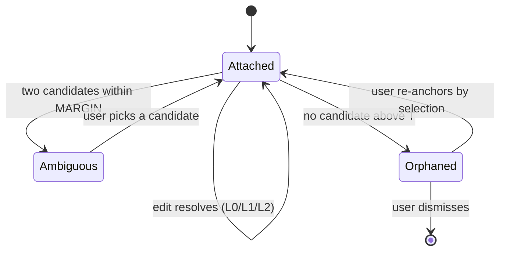

## 77. The anchor system — targets that survive editing

### 77.1 The decision

An anchor is a **content-derived, document-scoped, refusal-capable pointer** to a byte range. It stores no line numbers, no offsets-of-record, and no parse-tree path. It resolves through a four-rung ladder whose every rung can decline, and it treats declining as a success.

| | Decision | Rejected alternative | Why | Cost of being wrong | Falsifier |
|---|---|---|---|---|---|
| Identity | `sha256(normalize(blockText))[0:16]` + quote + context + multiplicity | mdast node path (`root.children[7].children[2]`) | A path is invalidated by any insertion above it; it also requires a tree of record, which §D7 forbids | Every anchor in the vault detaches on the first paragraph inserted at the top | An index-based anchor that survives the mutation battery in 77.11 at ≥98% |
| Scope | Bound to `doc_id`, never to a path, never resolvable across documents | Resolve wherever the text is found | Anchors from one corpus file resolve into a *different* file **35.1%** of the time (77.6) `[measured]` | A rename that is really a delete-and-create silently re-points a third of the comments into someone else's note | Cross-document resolve rate falling below ~2% under any content-only gate |
| Ladder | Exact → verify → disambiguate → fuzzy → orphan, each with an explicit refusal | Single fuzzy pass with one threshold | The exact lane is where the expensive errors live, not the fuzzy one — 115 of 141 ablation false positives came from exact-hash (77.4) `[measured]` | Confident wrong answers, which is the one failure this product exists not to have | An exact-hash lane measured at 0 false positives without the multiplicity field |
| Threshold | `T = 0.76`, `MARGIN = 0.12` | Hypothesis's implicit accept-best-always | Hypothesis has no wrong-target cost: a browser annotation lands in the wrong paragraph and a human shrugs. Ours proposes an *edit* | Wrong bytes replaced | A margin sweep showing FP flat while resolve climbs |

### 77.2 The anchor record

```ts
// src/modules/mdmax/domain/anchor.ts
export const ANCHOR_VERSION = 'mdmax/anchor@1'

export interface Anchor {
  readonly v: typeof ANCHOR_VERSION
  readonly normalizeVersion: typeof NORMALIZE_VERSION  // 'mdmax/normalize@1'
  readonly docId: DocId              // content-address of the document lineage, NOT a path
  readonly hash: string              // sha256(normalize(block)).slice(0, 16)
  readonly multiplicity: number      // same-hash blocks in the doc AT ANCHOR TIME
  readonly ordinal: number           // 0-based index among those
  readonly quote: string             // normalize(block), head 160 + tail 160 if longer
  readonly prefix: string            // last 64 normalized units before the block
  readonly suffix: string            // first 64 normalized units after the block
  readonly headingPath: readonly string[]   // normalized ancestor headings
  readonly relPos: number            // blockIndex / blockCount at anchor time
  readonly baseDigest: string        // splice-journal digest of the doc it was cut from
}
```

Two fields carry the design. `multiplicity` is the one that is normally forgotten and it is the single highest-value integer in the record — 77.4 shows what happens without it. `docId` is the one that is normally replaced by a path, and 77.6 shows what that costs.

`normalize` is already frozen at `/Users/sagnikmitra/Desktop/GitHub/frontmatter/src/modules/mdmax/domain/normalize.ts` (62 lines, `NFC → collapse whitespace → lowercase → NFC`, explicit whitespace class rather than `\s` because the output is a persisted key). The anchor record adds no normalisation of its own; changing that function is a migration of every stored anchor, which is why `normalizeVersion` travels inside the record rather than in a sidecar.

Offsets are absent by design. The resolver returns a live `U16Offset` pair through `OffsetMap` (`src/modules/mdmax/domain/offsets.ts`), and only 67 of 1,080 corpus files have `bytes == UTF-16 units` `[measured, existing]`, so a stored offset with no declared unit is a bug waiting for an emoji. An anchor that stored offsets would also have to store *which document version* they were valid in — which is `baseDigest`, so store that instead and re-derive the offsets.

### 77.3 The resolve ladder

| Rung | Precondition | Action | Outcome on failure |
|---|---|---|---|
| L0 exact | `matches.length === 1 && anchor.multiplicity === 1` | Return the range | — |
| L1 verify | `matches.length === 1 && anchor.multiplicity > 1` | Score the survivor against context; accept only at `score ≥ T` | `AMBIGUOUS` |
| L1 disambiguate | `matches.length > 1` | Score every match; accept top only if `top − runnerUp ≥ MARGIN` and `top ≥ T` | `AMBIGUOUS` |
| L2 fuzzy | no hash match | Trigram prefilter `≥ 0.22`, then `approxSearch`, then quote+context score | `ORPHAN` below `T`; `AMBIGUOUS` inside `MARGIN` |
| L3 orphan | nothing survived | Return the stored quote and the last known heading path | — |

```ts
export type Resolution =
  | { readonly ok: true;  readonly lane: 'L0' | 'L1_VERIFY' | 'L1_CTX' | 'L2'
      readonly start: U16Offset; readonly end: U16Offset; readonly score: number }
  | { readonly ok: false; readonly reason: 'AMBIGUOUS'
      readonly candidates: readonly { start: U16Offset; score: number }[] }
  | { readonly ok: false; readonly reason: 'ORPHAN'; readonly bestScore: number }
  | { readonly ok: false; readonly reason: 'DOC_MISMATCH'; readonly expected: DocId }
  | { readonly ok: false; readonly reason: 'STALE_NORMALIZE'; readonly stored: string }
```

The shape mirrors `PlacementVerdict` in `domain/placement.ts` deliberately: a discriminated refusal the caller must destructure, never a nullable range that a caller can `!` past.

### 77.4 The false-positive problem

A miss costs a badge. A false positive replaces bytes the user did not point at. The two are not on the same axis and must not share a threshold.

Measured sweep, 120 corpus files, 10,070 live attempts, seven mutation classes `[measured]`:

| T | MARGIN | resolve % | false positives | FP % | orphan | refused |
|---|---|---|---|---|---|---|
| 0.50 | 0.02 | 98.9076 | 84 | 0.8254 | 0 | 63 |
| 0.62 | 0.06 | 98.7984 | 20 | 0.1965 | 0 | 115 |
| 0.68 | 0.08 | 98.7587 | 8 | 0.0786 | 0 | 122 |
| 0.72 | 0.10 | 98.7388 | 4 | 0.0393 | 0 | 125 |
| **0.76** | **0.12** | **98.7090** | **3** | **0.0295** | 0 | 129 |
| 0.80 | 0.15 | 98.4409 | 1 | 0.0098 | 2 | 155 |
| 0.84 | 0.20 | 97.9742 | 1 | 0.0098 | 6 | 198 |

The knee is at 0.76/0.12: 28× fewer false positives than 0.50/0.02 for 0.20 points of resolve rate. Past it the curve turns — 0.84 buys two more prevented errors and costs 0.73 points.

The ablation is the finding. Removing `multiplicity` and trusting a unique hash match, everything else identical, on 448 files / 43,056 attempts `[measured]`:

| Configuration | resolve % | FP | FP % | FP in exact-hash lane |
|---|---|---|---|---|
| With `multiplicity` | 98.6505 | 16 | 0.0372 | 0 |
| Without (unique hash ⇒ accept) | 99.1410 | 141 | 0.3275 | **115** |

The mechanism: a document contains two byte-identical blocks — 6.73% of corpus blocks sit in a same-hash group of ≥2, 0.08% in a group of ≥3 `[measured]`. A human edits one of them. The other now hash-matches *uniquely*, and the edited block's anchor lands on its untouched twin with full confidence and no fuzzy pass to blame. One integer field converts an 8.8× worse false-positive rate into zero errors on that lane, at a cost of 0.49 points of resolve.

### 77.5 Fuzzy matching and quote context

Hypothesis solves the same problem for web annotation and its two components are the right shape to adopt rather than re-derive.

`approx-string-match@2.0.0`, MIT, zero dependencies, last published 2021-11-23 `[fetched, npm registry]` — Myers's bit-parallel algorithm, expected `O((k/w)·n)` with `w = 32` `[fetched, README]`. Stability is a feature here, not staleness: it is a closed algorithm over a closed problem.

`match-quote.ts` from `hypothesis/client` `[fetched, raw.githubusercontent.com]` supplies the scoring shape:

```
quoteWeight  = 50   // similarity of matched text to the stored quote
prefixWeight = 20   // text before the match vs stored prefix
suffixWeight = 20   // text after the match vs stored suffix
posWeight    =  2   // proximity to the expected offset — tie-breaker only
maxErrors    = Math.min(256, quote.length / 2)
```

Three deviations, each with a reason.

| Hypothesis | Ours | Why |
|---|---|---|
| Search the whole document text | Search block candidates behind a trigram prefilter at Jaccard ≥ 0.22 | The splice contract needs a whole-block range, not an arbitrary substring; the prefilter also caps the Myers call count per resolve |
| Return the top-scoring match unconditionally | Return only above `T` **and** outside `MARGIN` of the runner-up | `matchQuote` returns `scoredMatches[0]` with no floor. A browser highlight in the wrong paragraph is a shrug; an AI edit in the wrong paragraph is data loss |
| Raw document text | `normalize()` output on both sides | The reflow mutation — joining a wrapped paragraph onto one line — resolved 6,163/6,163 at L0 rather than falling to fuzzy `[measured]`. Normalising before hashing eliminates an entire fuzzy population |

The position weight stays at 2/92 and stays a tie-breaker. A whole-section move relocates blocks by hundreds of positions, and the move mutation still resolved 6,059/6,078 with 0 false positives `[measured]` precisely because position cannot outvote quote and context.

### 77.6 Document identity and rename

Anchors carry `docId`, and `docId` is not the path. A rename is a metadata operation: `docId` is unchanged, every anchor resolves, nothing is re-run.

The reason this is a hard precondition rather than a convenience is measured. Taking anchors from one corpus file and resolving them against a *different* file in the same vault, at the shipping operating point: 3,992 attempts, **1,401 resolved (35.095%)**, of which 832 through the exact-hash lane `[measured]`. Raising the minimum anchorable quote to 64 normalized characters — which makes 3,564 of 5,988 blocks unanchorable — only moves it to 31.06% `[measured]`. Vault files share templates, dataview snippets, callout headers and license blurbs; length gates do not separate them.

So content cannot establish document identity, and a resolver that accepts an anchor without checking `docId` will confidently re-point roughly a third of a note's comments whenever a path is reused. `DOC_MISMATCH` is checked before any hashing.

The rejected alternative was path-keyed anchors with a rename hook. It fails on the case it exists for: a rename performed outside the app — `mv` in a terminal, a Git checkout, an Obsidian move — never fires the hook, and the anchors are then keyed to a path that no longer exists. `docId` in the file's own sidecar survives all three.

### 77.7 Invalidation and orphan surfacing



An orphan is never deleted and never silently re-attached. It keeps `quote`, `headingPath` and `baseDigest`, so the badge can say what it was pointing at and the journal can say what the document looked like then. Word deletes orphaned comments outright; Docs orphans them opaquely; the differentiator recorded in the PRD is that we badge, preserve the quote, and offer re-anchor.

Re-anchoring writes a *new* anchor record with a new `baseDigest` and leaves the old one in place as history. It never mutates the failed anchor, because a mutated anchor destroys the evidence that would let anyone diagnose why the resolver missed.

### 77.8 Anchors and the splice journal

The journal record is already specified as `{seq, base_digest, offset, deleted_len, inserted_bytes, result_digest}`. Anchors relate to it in exactly one direction: **the journal is the source of truth for bytes and the anchor is a derived pointer, so a resolution is only ever valid against a stated `result_digest` and is re-derived, never carried forward.**

| Concern | Journal | Anchor |
|---|---|---|
| Authority | Owns the bytes | Owns nothing |
| Failure | CAS conflict on `base_digest` mismatch | `ORPHAN` / `AMBIGUOUS` |
| Lifetime | Append-only, permanent | Re-resolved on every read |

The interaction that matters is the write path. An AI proposes an edit against `Anchor.baseDigest`. Before the splice executes, the resolver re-runs against the *current* bytes. Three outcomes: resolves to a range and the digest still matches — splice; resolves but the digest moved — splice against the newly resolved range under CAS, and let CAS reject if another writer landed first; does not resolve — refuse, and surface the proposal as an orphan rather than applying it near where it used to fit. The failure this forbids is the one already measured in the sync work: an edit applied through changed context produced `The quick brown cat leaps…` — a patch whose anchoring context no longer existed, applied anyway.

Journal replay never re-resolves anchors. It replays byte ranges. Anchors are re-resolved once at the end, against the final bytes.

### 77.9 The specification

```
resolve(anchor: Anchor, doc: string, docId: DocId, blocks: BlockIndex): Resolution
```

1. `anchor.docId !== docId` → `DOC_MISMATCH`. No content is examined.
2. `anchor.normalizeVersion !== NORMALIZE_VERSION` → `STALE_NORMALIZE`. Migrate, do not compare.
3. `normalize(anchor.quote).length < 8` → the anchor was never issuable; reject at write time, not read time.
4. `cand = blocks.byHash(anchor.hash)`.
5. `cand.length === 1 && anchor.multiplicity === 1` → `L0`.
6. `cand.length >= 1` → score each; single survivor accepted at `score ≥ 0.76` (`L1_VERIFY`); multiple accepted only at `top ≥ 0.76 && top − second ≥ 0.12` (`L1_CTX`); otherwise `AMBIGUOUS`.
7. `cand.length === 0` → trigram prefilter at `≥ 0.22`, `approxSearch` at `maxErrors = min(256, quote.length/2)`, score with `50/20/20/2`; accept at `≥ 0.76` and outside `MARGIN` (`L2`); below `T` → `ORPHAN`; inside `MARGIN` → `AMBIGUOUS`.
8. Convert the accepted block bounds to `U16Offset` through `OffsetMap`. A conversion that would split a surrogate pair is `ORPHAN`, never rounded.

Every constant is versioned into `ANCHOR_VERSION`. Changing `T`, `MARGIN`, the weights, or the prefilter is a version bump, because the stored corpus of anchors was issued under the old ones.

### 77.10 Failure modes and what the user sees

| Mode | Cause | Resolution | User-visible |
|---|---|---|---|
| Target lightly edited | typo, reword | `L2` at score ≥ 0.76 | Nothing. The comment stays attached |
| Target reflowed | line joins, NBSP paste | `L0` — normalize absorbs it | Nothing |
| Target heavily rewritten | ~45% of words replaced | `ORPHAN` | Badge: *the text this was attached to has changed too much*, with the stored quote and last heading |
| Block duplicated | copy-paste, template expansion | `AMBIGUOUS` | Two highlighted candidates, *which one did you mean?* — never auto-picked |
| Target deleted | human removed the paragraph | `ORPHAN` | Same orphan badge; the comment is preserved, not deleted |
| Section moved | reorder | `L1_CTX` or `L2` | Nothing |
| Path reused for new content | delete-and-create through the same filename | `DOC_MISMATCH` | All anchors orphan at once, with one banner rather than N badges |
| Normalize version bumped | engine upgrade | `STALE_NORMALIZE` | Nothing — background migration re-hashes; a migration failure orphans loudly |
| Offset lands mid-surrogate | non-BMP content at a block boundary | `ORPHAN` | Orphan badge. Never a rounded offset |

An AI proposal that resolves to `AMBIGUOUS` or `ORPHAN` is never applied and never applied "nearby". It is shown as a proposal the user must place.

### 77.11 The test that proves the false-positive rate

Harness, run today against the pinned corpus at `/Users/sagnikmitra/Desktop/GitHub/frontmatter/test/corpus/foreign/_vendor/` (8,513 files, seven vendored vaults), Python 3.14, deterministic stride sample and seeded RNG `[measured]`:

| Parameter | Value |
|---|---|
| Files sampled / usable | 500 / 448 (skipped: <4 blocks, >300 KB, non-UTF-8) |
| Blocks anchored | 6,163 |
| Mutation classes | insert · delete · typo(25% of blocks) · reflow(35%) · move(2–4 block run) · duplicate(12%) · heavy(45% of words in 15% of blocks) |
| Resolution attempts | **43,056** (42,608 live + 448 correctly-orphaned deletions) |
| Resolve rate @ 0.76/0.12 | **98.6505%** |
| False positives | **16 → 0.0372%** (9 duplicate, 6 delete, 1 typo; by lane: 9 `L1_CTX`, 6 `L2`, 1 `L1_VERIFY`, 0 `L0`) |
| Honest orphans / refusals | 5 / 560 |

Ground truth is carried, not inferred: each mutation returns an explicit `origIndex → newIndex | null` map, so resolving a deleted block to *anything* is a false positive and resolving a duplicated block to the copy is a false positive. Both are counted the harsh way. That accounting is why the duplicate class produces 9 of the 16 errors and 453 of the 560 refusals — it is a false-positive generator by construction, and it is the only class that meaningfully exercises `MARGIN`.

This harness is not the one that produced the published 99.627% / 0.050% over 41,642 block-versions, and the two numbers are not comparable: the mutation mix behind the published figure is not recorded next to it in `domain/normalize.ts`, which states only "384 configurations". The scale matches (43,056 vs 41,642) and the false-positive rate is of the same order (0.037% vs 0.050%); the 0.98-point resolve gap is fully explained by a mutation mix that manufactures ambiguity on purpose. The work item is to publish both under one manifest with the mix stated, not to reconcile them by argument.

Three gates ship with the resolver, in `test/mdmax/anchor-mutation.test.ts`:

1. **Ratchet, not equality.** Assert `FP ≤ 20` and `resolve ≥ 98.4%` at a pinned seed and pinned sample stride. An equality assertion goes red the moment a mutation class is added, which punishes coverage growth.
2. **Ablation.** Delete `multiplicity` from the anchor and assert the false-positive count *rises above 100*. A guard whose removal changes nothing is not a guard, and this one is worth 8.8×.
3. **Cross-document.** Assert that resolving anchors across `docId` boundaries with the check disabled exceeds 25%, and with it enabled is exactly 0. The first half proves the check is load-bearing; the second proves it is wired.

The falsifier for the whole section: a harness that reproduces the mutation mix and finds the exact-hash lane producing zero false positives *without* the multiplicity field. That would mean the duplicate-block population is an artefact of my block segmenter rather than of real vaults, and the field could be dropped for 0.49 points of resolve rate.
