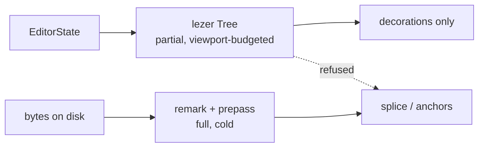

## 79. Incremental parsing — the lezer decision

### 79.1 The decision

Keep remark/micromark as the engine's only parse layer. Keep `@lezer/markdown` where it already is — inside CodeMirror, serving decorations — and make the boundary between them one-way and typed, so that no position produced by the editor's tree can reach `splice-frontmatter.ts` or any anchor resolver.

**Two trees of the same document are not the hazard; two trees of two different revisions treated as one is, and that is a provenance problem, not a parser-choice problem.**

Rejected: adopting lezer as the engine's parse layer. Rejected: a shared position model across both trees. Both are rejected on a measurement that contradicts the premise, given in §79.3.

| | Adopt lezer in the engine | Dual, undefined boundary (today) | Dual, typed one-way boundary (chosen) |
|---|---|---|---|
| Frontmatter addressable | No — measured misparse (§79.5) | n/a | Yes, remark + prepass, unchanged |
| Bare-CR safe | No — measured (§79.5) | Partly, by luck | Yes |
| Joins the 7-engine certificate | No — emits no HTML | n/a | Yes, unchanged |
| Stale-tree splice possible | Yes | Yes | No — refused at the type |
| Engine parse cost, 8,513 files | 566 ms | 4,849 ms | 4,849 ms |
| Work to implement | Rewrite 3 domain files + bench | 0 | ~60 lines, 1 lint rule |

### 79.2 What each side actually gives

| Capability | `@lezer/markdown` 1.7.2 | remark / micromark 4.0.2 |
|---|---|---|
| Incremental reparse | Yes — `TreeFragment.applyChanges` + `parse(doc, fragments)` | No. Full reparse only |
| Position unit | UTF-16 code units [measured] | UTF-16 code units, `position.*.offset` [measured] |
| Line/column | No — offsets only | Yes, 1-based line + column alongside offset |
| Emits HTML | No. "doesn't help with outputting HTML" [fetched, README] | Yes, via remark-rehype/rehype-stringify |
| Link-reference validation | No, deliberately — `[a][b]` parses as a link with no `[b]` defined [fetched, README] | Yes |
| Frontmatter | Not in the default parser [measured] | `remark-frontmatter` 5.0.0, installed |
| GFM tables/footnotes/strike | Via the `GFM` extension in the same package | `remark-gfm` 4.0.1, installed |
| Weekly npm downloads | 4,789,610 [fetched, 2026-08-23→29] | 57,013,343 micromark / 51,168,105 remark-parse [fetched] |
| Ecosystem the engine already uses | none | `mdast-util-*`, `rehype-*`, react-markdown, the bench's `remark-app` engine |

The engine's live usage of lezer is three files, all presentation: `src/modules/editor/presentation/live-preview.ts` (`import { syntaxTree } from "@codemirror/language"`, then `syntaxTree(view.state).iterate({…})` to conceal delimiter marks), and `CodeMirrorEditor.tsx` / `live/InlineBlockEditor.tsx`, which each call `markdown()`. No engine file imports lezer. The dual-parser situation is therefore already one-directional in fact — it is simply not enforced.

### 79.3 The premise that does not survive measurement

The brief states lezer offers "byte-accurate SyntaxNode positions." It does not. Lezer parses a JavaScript string and its node offsets index that string, which means UTF-16 code units — the same unit mdast reports.

Ran, `node $TMPDIR/lz/pos.mjs`, on `"# 🌊 tide\n\nafter\n"` [measured]:

```
doc.length (UTF-16 units) = 17     byteLength = 19     code points = 16
lezer:  ATXHeading1 [0,9)   slice = "# 🌊 tide"
mdast:  heading   start.offset 0, end.offset 9
```

Identical values, and neither is 11 (the byte length of that heading). Adopting lezer buys nothing against the contract in `src/modules/mdmax/domain/offsets.ts`; `OffsetMap` and the `U16Offset`/`ByteOffset`/`GraphemeIndex` brands are still required, for the same reason as today — only 67 of 1,080 corpus files have bytes equal to UTF-16 units. A migration justified by positional accuracy would deliver zero positional accuracy. [derived: 9 − 0 = 9 units, 11 bytes, so any consumer treating a lezer offset as a byte index is wrong by 2 on the first emoji.]

What lezer positions *do* carry that mdast's do not is a hidden precondition. `syntaxTree(state)` is documented to return whatever tree exists; `ensureSyntaxTree(state, upto, timeout)` and `syntaxTreeAvailable(state, upto)` exist in `@codemirror/language`'s public surface precisely because the tree may not span the document — the view parses on a work budget around the viewport [fetched, `node_modules/@codemirror/language/dist/index.d.ts`]. An offset read from a partial tree is not wrong in unit; it is absent, or correct against a prefix. That is the failure a splice must never inherit.

### 79.4 The performance numbers, corrected

`src/modules/mdmax/domain/shape-gate.ts` records `mdast-util-from-markdown 12,429 ms vs micromark's 1,207 ms — a 10.3x gap that widens with size`. That measurement is on flat lists, an adversarial shape, and it belongs where it sits: as justification for `MAX_LIST_MARKER_LINES = 20_000`. It does not describe steady state, and it should not be quoted as if it does.

Ran, `node $TMPDIR/lz/bench.mjs`, over the pinned corpus at `test/corpus/foreign/_vendor` — 8,513 files, 19,047,891 bytes, 300-doc warmup, `@lezer/markdown` 1.6.3 as installed [measured]:

| Parser | Total | Throughput | Errors |
|---|---|---|---|
| `@lezer/markdown` `parser.parse` | 566 ms | 33.6 MB/s | 0 |
| `mdast-util-from-markdown` | 4,849 ms | 3.9 MB/s | 0 |
| `micromark` → HTML | 5,019 ms | 3.8 MB/s | 0 |

So on real documents `from-markdown / micromark = 0.97x`, not 10.3x. The mdast construction step is not the cost; the tokenizer is. Lezer is genuinely 8.56x faster, and that resolves to 0.57 ms per document versus 0.57 s per 1,000 — below the `BUDGET_MS.keystroke = 250` floor by three orders of magnitude on any single file.

Incremental reparse, `node $TMPDIR/lz/inc.mjs`, 50 largest corpus docs (939,748 chars max, 18,039 median), one character inserted at 80% depth, 3 iterations each [measured]:

| Path | ms/reparse |
|---|---|
| lezer, cold | 1.83 |
| lezer, `TreeFragment.applyChanges` + reuse | 0.46 |
| `fromMarkdown`, full | 51.37 |

112x against full mdast, 4x against lezer cold. Real, and entirely an editor property. The engine's work — `certify.ts`, `placement.ts`, `splice-frontmatter.ts`, the corpus runner — is cold, once, per document, in a worker under `BUDGET_MS`. There is no keystroke loop in the engine to make incremental. Buying incrementality for a consumer that does not exist is the whole of the case against adoption.

### 79.5 Where lezer is wrong for this engine's jobs

Ran `node $TMPDIR/lz/fm.mjs` against the default parser [measured]:

```
in:  "---\ntitle: x\ndate created: y\n---\n\nbody\n"
out: Document[0,39) HorizontalRule[0,3) SetextHeading2[4,32) HeaderMark[29,32) Paragraph[34,38)
```

The frontmatter block is a horizontal rule followed by a setext heading whose underline is the closing fence. The region the product is named after is not addressable in this tree at all. `@codemirror/lang-markdown` 6.5.2 does not ship a frontmatter extension either — its dependency list is `@lezer/markdown`, `@lezer/common`, `lang-html`, `autocomplete`, `view`, `state`, `language` [fetched, registry].

Second, bare CR:

```
in:  "# a\rpara\r- one\r- two\r"    (21 units)
lezer:  Document[0,21) ATXHeading1[0,21) HeaderMark[0,1)
mdast:  heading[0,3) paragraph[4,8) list[9,20)
```

Lezer does not treat a lone CR as a line ending, so a 21-unit document collapses into a single heading. This is the same family as the bare-CR set-destruction already queued as `[measured]` engine work; adopting lezer would make it structurally unfixable at the parse layer rather than a normalization step in front of one.

Third, and decisive on priorities: the 83% publish-refusal defect is a YAML block sequence at column zero, and `SAFE_KEY = /^[A-Za-z0-9_.$-]+$/` cannot address `date created`, which appears in 812 of 957 files in one vault. Both live strictly below the markdown grammar. `splice-frontmatter.ts` states it outright — "It does not parse YAML. It scans the frontmatter block line-wise for a top-level key." No markdown parser swap moves either number by one file.

### 79.6 Conformance, and the certificate

`@lezer/markdown` declares its own non-conformance: to stay single-pass and incremental "it doesn't validate link references, so it'll parse `[a][b]` and similar as a link, even if no `[b]` reference is declared" [fetched, README]. That is a documented, intentional divergence from CommonMark, and it is the exact class of divergence the degradation certificate exists to measure.

It also cannot be measured. `infrastructure/bench.ts` compares seven engines' HTML bytes — `remark-app`, `react-markdown`, `marked`, `markdown-it` at `html:false` and `html:true`, `commonmark`, `kramdown-jekyll` — with `computeBenchId` hashing `(id, version, sorted options)` per RULE 3. Lezer emits no HTML. Adding it would require writing a renderer, and a renderer we authored is a new engine to certify, not a measurement of an existing target. It would inflate the bench's apparent coverage while measuring our own code.

### 79.7 The archive, priced correctly

Confirmed via the GitHub API [fetched, 2026-08-30]: `github.com/codemirror` holds 57 public repos, 55 archived; `codemirror/language` and `codemirror/lang-markdown` both show `archived: true` with `pushed_at: 2026-04-15`. The two unarchived repos are `grammar-mode` (last push 2020-07-09) and `google-modes` (2023-12-27) — dormant, not survivors.

The abandonment reading is wrong. The `repository` field on `@lezer/markdown@1.7.2` and `@codemirror/language@6.12.4` now reads `git+https://code.haverbeke.berlin/…`, that host returns 200, `discuss.codemirror.net` returns 200, and releases continued past the archive date: `@lezer/markdown` 1.6.4 on 2026-05-28, 1.7.0/1.7.1/1.7.2 across 2026-07-08→15; `@codemirror/language` 6.12.4 on 2026-06-25; `@codemirror/lang-markdown` 6.5.2 on 2026-08-04 [all fetched, registry `time` map]. This is a hosting migration off GitHub, not a dead project.

What did get worse is the fork option. Issues, PR history, and the public fork button moved to a single self-hosted instance under one maintainer. The realistic risk is not "npm goes dark" but "the bus factor is one and the audit trail is now on his server." Priced accordingly: `@codemirror/*` and `@lezer/*` are already a presentation-layer dependency behind a module boundary the architecture report enforces, and the fallback for a genuinely dead CodeMirror is replacing the editor, which this decision does not make harder. Adopting lezer in the engine *would* make it harder, by putting a one-maintainer dependency underneath the splice contract.

Installed here is `@lezer/markdown` 1.6.3 against 1.7.2 latest, and `@codemirror/language` `^6.12.3` against 6.12.4 — a routine bump, unrelated to this decision.

### 79.8 The boundary, as code



The seam already exists: `placement.ts` declares `export type ParseFn = (markdown: string) => BlockNode`, so the engine's placement logic is parser-agnostic by construction. Nothing needs to change there. What is missing is a type that makes the wrong crossing unrepresentable.

New file, `src/modules/editor/presentation/tree-boundary.ts`, ~60 lines:

```ts
declare const EditorTreeBrand: unique symbol

/**
 * A UTF-16 offset read from a CodeMirror syntax tree. SAME UNIT as U16Offset
 * (measured: lezer and mdast both report [0,9) for "# 🌊 tide"). Different
 * PROVENANCE: valid only against the EditorState generation it was read from,
 * and only where that state's tree actually spans the offset.
 */
export type EditorOffset = number & { readonly [EditorTreeBrand]: true }

export type Crossing =
  | { readonly ok: true; readonly at: U16Offset; readonly docLength: number }
  | { readonly ok: false; readonly reason: 'TREE_INCOMPLETE'; readonly parsedTo: number; readonly docLength: number }
  | { readonly ok: false; readonly reason: 'DOC_DIVERGED'; readonly editorLength: number; readonly bytesLength: number }

/**
 * The ONLY function permitted to turn an EditorOffset into a U16Offset.
 * Refuses rather than guessing — mirrors splice-frontmatter's refusal contract
 * and the anchor resolver's AMBIGUOUS verdict.
 */
export function crossToEngine(state: EditorState, at: EditorOffset, bytes: string): Crossing {
  const len = state.doc.length
  if (!syntaxTreeAvailable(state, at)) {
    return { ok: false, reason: 'TREE_INCOMPLETE', parsedTo: syntaxTree(state).length, docLength: len }
  }
  if (state.doc.toString() !== bytes) {
    return { ok: false, reason: 'DOC_DIVERGED', editorLength: len, bytesLength: bytes.length }
  }
  return { ok: true, at: at as unknown as U16Offset, docLength: len }
}
```

The `DOC_DIVERGED` check is a full string compare, which at corpus median (18,039 chars) is free relative to the 51 ms an mdast reparse costs, and it is the only check that catches the real failure — the editor's tree describing a revision the disk bytes no longer hold.

Enforcement, one ESLint `no-restricted-imports` rule in `eslint.config.*`: `@codemirror/*` and `@lezer/*` are importable only under `src/modules/editor/presentation/**`. That is a mechanical assertion, not a convention, and it is the kind of check that survives a maintainer who has not read this section.

### 79.9 Migration path

There is none, which is the point. No engine file imports lezer today; the change is additive and reversible.

1. Add `tree-boundary.ts` and the `no-restricted-imports` rule. `npm run lint --max-warnings=0` fails on any future violation.
2. Add a `specs/` assertion pinning the measured claim, so a future lezer release that changes position semantics goes red rather than silent: parse `"# 🌊 tide\n\nafter\n"` with both parsers, assert lezer `ATXHeading1` and mdast `heading` report identical `[from,to)`, and assert both differ from `Buffer.byteLength` of the slice.
3. Add the bare-CR and frontmatter misparse cases as `xfail`-documented facts about lezer, referenced from `live-preview.ts` — the decoration path must not assume block structure survives a CR-only file.
4. Leave `ParseFn` alone.

Nothing in `mdmax/`, nothing in `splice-frontmatter.ts`, no change to the bench, no change to `benchId`.

### 79.10 Cost of being wrong, and what falsifies it

If this is wrong, the cost is that the engine keeps paying 4,849 ms per full-corpus pass instead of 566 ms, and that a future feature wanting sub-frame structural feedback on a 900 KB document has to build it in the editor layer rather than reaching into the engine. Both are recoverable: `ParseFn` is the injection point, and a lezer-backed `BlockNode` adapter is a day's work if a consumer for it ever appears. The asymmetric cost sits on the other side — a stale or partial lezer offset reaching the splice writes correct-looking bytes at the wrong place in a file that is committed on every save, and the contract's whole value is that this cannot happen.

Falsifiers, in order of how cheaply they can be run:

- A measurement showing `SyntaxNode.from` indexing anything other than UTF-16 code units of the input string. §79.3's assertion is the test; it takes 40 ms.
- An engine-side consumer that genuinely needs sub-100 ms structural reparse on a document over ~200 KB, appearing in a shipped feature rather than a plan. The corpus median is 18,039 chars; the 51 ms mdast figure is the 50-largest average, not the typical case.
- `@lezer/markdown` shipping frontmatter parsing and CR-as-line-terminator in the default configuration, which would remove two of the three job-fitness objections in §79.5.
- No `@lezer/markdown` or `@codemirror/language` release for four consecutive quarters on `code.haverbeke.berlin` — which falsifies §79.7's "migration, not abandonment" and changes the editor replacement question, though not this decision.
- Evidence that the 83% refusal rate is materially affected by markdown block structure rather than by YAML sequence indentation and `SAFE_KEY`. That would mean the parse layer is on the critical path after all, and this section is arguing about the wrong layer.
