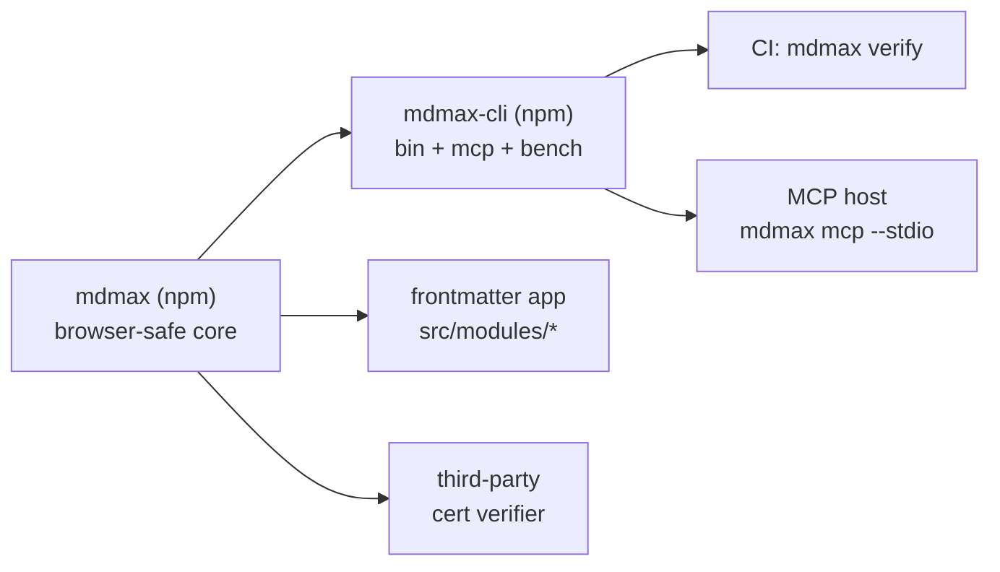

## 80. The engine public API, versioning and distribution

### 80.1 Measured starting position

| Fact | Value | How |
|---|---|---|
| Engine files / lines / bytes | 13 / 3,614 / 153,178 | `find src/modules/mdmax -name '*.ts'`, `wc -l`, `wc -c` [measured] |
| `export` declarations | 88 | `grep -rhn "^export " src/modules/mdmax --include='*.ts' \| wc -l` [measured] |
| Symbols imported from outside the module | 1 (`decodeStrict`), at 2 sites — `src/modules/vault/application/get-snapshot.ts`, `src/modules/vault/infrastructure/search-index.ts` | `grep -rn "modules/mdmax" src` [measured] |
| Imports MDMAX makes from `src/modules/**` | 0 | same grep, inverted [measured] |
| Real `throw` sites | 2: `throw new RangeError(\`invalid U16Offset` in `domain/offsets.ts`, `throw new Error(\`kramdown-jekyll:` in `infrastructure/bench.ts` | `grep -rn "throw " src/modules/mdmax` [measured] |
| Third-party runtime deps | `github-slugger@2.0.0` (ISC), `entities@8.0.0` (BSD-2-Clause) | `node_modules/*/package.json` [measured] |
| Comment + whitespace share of source | 51.9% | comment/blank strip in node [measured] |
| Stripped code bytes, browser-eligible files only (excludes `bench.ts`, `certify.ts`, `targets.ts`) | 57,318 | same script [measured] |
| `mdmax` on npm | HTTP 404 — unregistered | `curl -s -o /dev/null -w '%{http_code}' https://registry.npmjs.org/mdmax` [fetched 2026-08-30] |
| `@sgnk/mdmax` | HTTP 404 | same [fetched] |
| `frontmatter` on npm | HTTP 200 — taken | same [fetched] |
| `LICENSE` file in repo | absent | `ls LICENSE*` [measured] |

88 exports and one external consumer is the whole problem in one line. There is no API; there is a folder that other folders reach into.

### 80.2 The public surface

Decision: one barrel, `src/modules/mdmax/index.ts`, exporting **31** symbols in six capability groups. Everything not in the barrel is internal, regardless of whether the file still says `export`.

| Group | Exported | Kept internal |
|---|---|---|
| Admission | `shapeGate`, `decodeStrict`, `explainFailure`, `MAX_BYTES`, `MAX_LINES` | `MAX_LIST_MARKER_LINES`, `BUDGET_MS` |
| Offsets | `OffsetMap`, `u16`, `utf8Length`, `splitsSurrogatePair`, types `U16Offset`/`ByteOffset`/`GraphemeIndex` | `u16OrThrow`, `unsafeU16`, `unsafeByte` |
| Splice (write path) | `spliceFrontmatterValue`, `spliceFrontmatterKey`, `emitValue`, `emitScalar`, `SAFE_KEY` | frontmatter regexes `FM_OPEN`, `NEWLINE`, `BOM` |
| Anchors | `slug`, `slugDocument`, `resolveAnchor`, `decodeAnchor`, type `AnchorMatch` | `collapsedSlug` |
| Structure | `inventory`, `skipRegions`, `safeInsert`, `prepassFrontmatter`, `extractWikilinks`, types `Construct`/`Range`/`BlockNode`/`PlacementVerdict` | `CONSTRUCTS`, `CONSTRUCTS_BY_ID`, `blockSkeleton`, `nearSetextUnderline` |
| Certificate | `certify`, `classify`, `fold`, `foldEqual`, `normalize`, `TARGETS`, `targetById`, `brokenHistogram`, types `Certificate`/`CellVerdict`/`Target`/`Verdict` | `splitBlocks`, `extractPayload`, `renderedHaystack`, `missingPayloadTokens`, `producesNoOutput`, `loadBench`, `computeBenchId` |
| Versions | `VERSIONS` (one frozen object), `stamp()` | the four separate `*_VERSION` consts and four `*Stamp()` functions |

Three structural moves come with it. `src/modules/share/domain/splice-frontmatter.ts` moves to `src/modules/mdmax/domain/splice.ts` — the splice writer is the engine's single most load-bearing function and it currently lives outside the module it belongs to, which is why nothing enforces its purity. `infrastructure/bench.ts` (imports `node:child_process`, `node:fs`) moves behind a `node`-only subpath so it can never be pulled into a browser graph. And `slugStamp`/`foldStamp`/`normalizeStamp` collapse into one `stamp()` returning the whole version vector, because a consumer that records three of four stamps has produced an unreproducible artifact.

Rejected: `export *` from a barrel that re-exports every module. It is a one-line change and it freezes all 88 symbols as public — including `unsafeU16`, whose entire purpose is to skip the surrogate-pair check that `OffsetMap` exists to enforce. Cost of being wrong on the 31: a consumer needs an internal and has to fork or patch, which we learn about in an issue and can fix in a MINOR. Cost of being wrong on `export *`: `unsafeU16` appears in third-party code and can never be removed. Falsifier: if three or more distinct external requests for the same internal arrive in the first two quarters, the group boundary is drawn wrong and should be redrawn, not widened one symbol at a time.

### 80.3 The purity rule and its mechanical enforcement

The rule: `src/modules/mdmax/**` may import from `node:*` (in `infrastructure/` only), from its own relative paths, and from a fixed allowlist of runtime dependencies. It may not import `@/modules/**`, `@/shared/**`, `@/app/**`, `@/container/**`, `react`, `next`, or any storage or network client. The inverse also holds: nothing outside the module may import a path deeper than `@/modules/mdmax` itself.

**Purity that is only a convention is a convention that lasted until the first deadline, so this ships as a gate before it ships as a sentence in a doc.**

New harness `specs/harness/mdmax-purity-report.mjs`, wired into `npm run verify` alongside the existing `clean-architecture-report.mjs` and `import-boundary-report.mjs`. Four checks, all executing rather than grepping prose:

| Check | Method | Failure |
|---|---|---|
| P1 — outbound purity | Parse every import specifier in `src/modules/mdmax/**`; reject any not matching `^(node:|\.{1,2}/)` or the dep allowlist | exit 1, names file and specifier |
| P2 — inbound barrel-only | Reject any `from '@/modules/mdmax/...'` outside the module; only `from '@/modules/mdmax'` allowed | exit 1 |
| P3 — browser graph is node-free | Resolve the transitive import graph from `index.ts`; assert `node:` appears in zero reachable files | exit 1, prints the path that pulled it in |
| P4 — denominator guard | Assert `filesScanned >= 13`, mirroring `MIN_SCANNED_FILES` in `clean-architecture-report.mjs` | exit 2, refuses to report a pass |

P4 is not decoration. `clean-architecture-report.mjs` carries a comment recording that it once reported `{"total":0,"violations":[]}` and exit 0 whether it had scanned 208 files or zero, and that renaming `src/modules/` to `src/features/` took a violating tree from exit 1 to exit 0 by going blind [measured, read in that file]. A purity gate that scans nothing passes perfectly.

Rejected: ESLint `no-restricted-imports`. It is already configured and it does not catch P3 — a transitive `node:fs` three files down through a type-only-looking import is invisible to a per-file lint rule, and it is exactly how `bench.ts` would leak into a browser bundle. Cost of being wrong: a 400 KB `node:fs` shim in the web bundle, discovered by a user on a slow connection. Falsifier: if P3 never fires in a year across the whole team's commits, it is over-engineering and can drop to a pre-release-only check.

### 80.4 Errors and refusals as values

Every public function returns a discriminated union. No public function throws. The two existing throws are handled explicitly: `u16OrThrow` leaves the barrel (it is a test convenience), and `bench.ts`'s kramdown throw becomes a `CertFailure` at the subprocess boundary, which is what `CertResult` already models.

```ts
type Refusal =
  | { kind: 'not-utf8';            at: number; detail: string }
  | { kind: 'too-large';           bytes: number; limit: number }
  | { kind: 'too-many-lines';      lines: number; limit: number }
  | { kind: 'unaddressable-key';   key: string; pattern: string }
  | { kind: 'ambiguous-range';     candidates: number; construct: string }
  | { kind: 'range-not-found';     construct: string }
  | { kind: 'splits-grapheme';     offset: number }
  | { kind: 'unsafe-placement';    reason: 'setext' | 'fence' | 'list-continuation' }
  | { kind: 'engine-unavailable';  engine: string; detail: string }

type Result<T> = { ok: true; value: T } | { ok: false; refusal: Refusal }
```

Two rules make this survive contact. Every `Refusal` carries the operand that caused it, not just a message — `unaddressable-key` carries `key` and the literal `pattern` it failed, because the 83% publish-refusal rate was diagnosable only once someone read the source and found `if (!SAFE_KEY.test(key)) return src`. And the current silent-return idiom is retired: `spliceFrontmatterValue` returning the unmodified `src` on refusal is indistinguishable from a successful no-op write, so callers cannot tell "refused" from "already correct". That single ambiguity is why an 83% refusal rate ran in production without an alarm.

Rejected: typed exception classes with `instanceof`. They cross the MCP and CLI JSON boundaries as `{}`, and a `catch` that forgets one subclass fails open. A union serialises to JSON unchanged, which is the only form a third-party certificate verifier can consume. Cost of being wrong: verbose call sites. Falsifier: if the union grows past roughly fifteen variants, refusal has become the primary output and the engine's admission criteria need redesigning, not the type.

### 80.5 Versioning: engine and artifacts are separate axes

Four artifact versions already exist in source as `mdmax/normalize@1`, `mdmax/slug@1`, `mdmax/fold@1`, `mdmax/verdict@1` [measured]. Three more are missing: `mdmax/offsets@1`, `mdmax/splice@1`, `mdmax/cert@1`.

| Axis | Identifier | Bumps when | Never |
|---|---|---|---|
| Engine | npm semver `mdmax@x.y.z` | API shape changes | tracks output bytes |
| Artifact | `mdmax/<name>@N`, integer | the same input produces different output bytes | decreases; is reused |
| Certificate | `mdmax/cert@N` + embedded `stamps` + `benchId` | the schema changes, or any input artifact bumps | is emitted without the full stamp vector |

Rules an implementer follows literally:

1. Artifact versions are integers and monotonic. `mdmax/slug@1` names one function forever. Changing slug output creates `mdmax/slug@2`; both ship, `slug()` defaults to the newest, `slugAt(2, heading)` addresses one explicitly.
2. An artifact bump is at minimum a MINOR engine release, and a MAJOR if the old artifact is removed. Old artifact implementations are removed only in a MAJOR, and never before two MINORs of overlap.
3. Every certificate embeds the complete stamp vector. A certificate carrying three of seven stamps is unverifiable and the emitter must refuse to produce it.
4. Narrowing refusal — accepting input previously refused, such as the zero-indent block sequence behind 83% of refusals, or widening `SAFE_KEY` to address `date created` — is a MINOR. It changes no existing output byte; it converts refusals into successes.
5. Widening refusal — refusing input previously accepted — is a MAJOR, no exceptions, because it breaks a working pipeline.
6. Adding a `Refusal` variant is a MINOR; consumers must have a `default` arm. Adding a field to an existing variant is a PATCH. Removing or renaming a variant is a MAJOR.
7. Adding an engine to `TARGETS` is a MINOR and bumps `mdmax/cert@N` only if cell semantics change. `DECLARED_LAST_VERIFIED = '2026-08-01'` moves with each re-verification and is a PATCH.
8. The pinned corpus at `test/corpus/foreign/_vendor/` with `MANIFEST.sha256` is versioned independently as `corpus@YYYY-MM-DD`. A certificate references the corpus version it was measured against; changing the corpus never changes an engine version.

The compatibility promise, stated as what a consumer may rely on within a MAJOR: `slug()` output bytes for a given `mdmax/slug@N`; `normalize()` output bytes for `mdmax/normalize@N`; that a document accepted by `shapeGate` at version *x* is accepted at *x+n*; that splice never regenerates from a parse tree; that a certificate emitted at `mdmax/cert@N` parses at any later `mdmax/cert@N`. Explicitly not promised: which refusal variant a rejected input produces, refusal message strings, the ordering of `inventory()` ranges, and performance.

Rejected: one version for everything, bumping the package on any output change. It forces a MAJOR whenever a slug edge case is fixed, and it destroys the property that makes certificates auditable — a third party must be able to recompute `fold()` from `mdmax/fold@1` without knowing which of forty engine releases produced it. Cost of being wrong the other way: seven version numbers to keep straight, mitigated by `VERSIONS` being one frozen object and `stamp()` the only way to read it. Falsifier: if after a year no artifact has bumped independently of the engine, the second axis is unearned and collapses into semver.

### 80.6 Package boundary and distribution



Decision: two published packages from one repo, not one and not three. `mdmax` is the engine — the barrel, browser-safe, `"sideEffects": false`, subpath `mdmax/cert` for the certificate path so a splice-only consumer never pulls `entities`. `mdmax-cli` depends on `mdmax` with a caret range and carries the `bin`, `bench.ts`, the Ruby/kramdown subprocess, and the MCP server as `mdmax mcp --stdio`. The repo keeps the engine at `src/modules/mdmax/` as the source of truth and builds `packages/mdmax/` from it, so the app is never consuming a stale published copy of its own engine.

The MCP server does not get its own package. It is stdio glue over the same exported functions, it has exactly the CLI's dependency profile, and a third package triples the version-compatibility matrix to buy nothing.

Name: `mdmax`, unscoped, confirmed 404 on the registry [fetched 2026-08-30]. `frontmatter` is taken (HTTP 200), which settles the alternative.

Licence: Apache-2.0 for both packages, with a `NOTICE` file. Not MIT, for one specific reason — the certificate is a published claim about seven third-party rendering engines, and Apache-2.0 §6 withholds trademark rights explicitly, so the word "MDMAX" cannot be used by a fork to issue certificates under our name while MIT would leave that entirely to trademark law. The patent grant in §3 is secondary but free. There is currently no `LICENSE` file in the repo at all [measured], so this is an addition, not a change.

Size and dependency budget, enforced in CI:

| Entry | Budget | Current basis |
|---|---|---|
| `mdmax` (splice + anchors + admission) | ≤ 20 KB gzip, ≤ 1 runtime dep | 57,318 stripped bytes across the browser-eligible files [measured]; roughly 15–18 KB gzipped after minification [derived, estimate — must be replaced by a real bundler number before the budget is enforced] |
| `mdmax/cert` | ≤ 45 KB gzip, ≤ 2 runtime deps | adds `constructs.ts` (17,693 stripped) plus `entities` |
| `mdmax-cli` | unbudgeted | node-only |

The one permitted core dependency is `github-slugger@2.0.0` (ISC, 36 KB on disk [measured]). It stays because it *is* the definition GitHub ships; reimplementing it forks `mdmax/slug@1` from the thing the artifact claims to reproduce. `entities@8.0.0` (BSD-2-Clause, 388 KB on disk [measured]) is used only by `fold.ts` and `verdict.ts` — both certificate-side — so it lands behind the `mdmax/cert` subpath and never in the splice path. `npm run budget` currently prints `No bundle budget configured yet — skipping` [measured, in `package.json`], which is a gate that always passes; it gets a real bundler and these numbers.

Rejected: a three-package monorepo with `@mdmax/engine`, `@mdmax/cli`, `@mdmax/mcp`. Three release cadences, three changelogs, and a cross-package version matrix, for two artifacts that will always release together. Cost of being wrong: if the MCP server later grows host-specific dependencies, splitting a package out of an existing repo is a day of work and a deprecation notice. Falsifier: the moment CLI and MCP need to release independently more than twice in a quarter, split.

The anti-recommendation: **do not publish anything until the zero-indent-sequence refusal and `SAFE_KEY` are fixed.** Publishing now freezes `SAFE_KEY = /^[A-Za-z0-9_.$-]+$/` as observable behaviour, and widening it later is rule 4 — a MINOR — only because it converts refusals into successes; but publishing an engine that refuses 83% of real vaults, and whose refusal is silent because `spliceFrontmatterValue` returns `src` unchanged, buys a public reputation for an engine that mostly declines to work. And do not publish `test/corpus/foreign/_vendor/` in either package: 8,513 files from third-party vaults under licences we have not individually cleared, whose only purpose is `npm run corpus` in this repo. Ship `MANIFEST.sha256` and `SOURCES.json` so a verifier can reconstruct the corpus; ship the corpus itself never.
