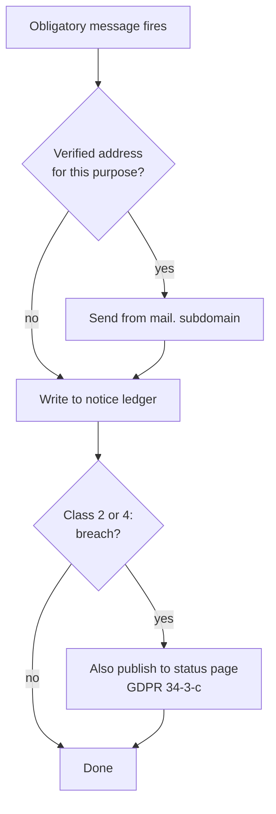

Verified read-only: `~/.claude` HEAD is `6e390828` (pre-session), the 19 dirty paths pre-existed, and this session ran only `curl`, `grep`, `dig`, `git status` and text extraction — no writes, no commits.

## 81. Reaching users — email infrastructure and in-product messaging

### 81.1 The gap, stated as a measurement

`grep -oiF` over `docs/FRONTMATTER-PRD-v2-2026-08-29.md` (120,539 words by `wc -w`) returns: `SPF` 1, `DKIM` 1, `DMARC` 2, `List-Unsubscribe` 0, `unsubscribe` 1 [measured 2026-08-30]. Of those, one `DMARC` hit is GitLab's backup-alarm postmortem and every other hit sits inside the gap-sweep row that reports the count as zero — so the substantive coverage is **zero occurrences in the governing document** [measured]. The product as specified has no route to tell a user anything. First run collects no email by design; the weekly digest and the What-is-New modal are banned; no sending infrastructure was ever designed. A breach notice, a price change and a failed renewal all currently terminate at the same dead end.

The resolution is not to relax the bans. It is to separate *obligatory* messages — which are triggered by law or by contract, are never periodic, and have a named legal deadline — from *marketing*, which we are not building at all, and to build exactly one channel for each.

### 81.2 The obligatory messages and their triggers

| # | Message | Trigger | Basis, with source | Deadline | Channel |
|---|---|---|---|---|---|
| 1 | Cyber-incident report | Unauthorised access, data breach, DoS, phishing on our infra | CERT-In Directions under s.70B(6) IT Act, 28.04.2022, para (ii) + Annexure I item xi "Data Breach" [fetched 2026-08-30] | **6 hours** of noticing | To CERT-In (`incident@cert-in.org.in`), not to users |
| 2 | Breach intimation to each affected user | Any personal data breach | DPDP Rules 2025, G.S.R. 846(E), 13 Nov 2025, Rule 7(1) [fetched 2026-08-30] | "without delay" | **"through her user account or any mode of communication registered by her"** — Rule 7(1) verbatim |
| 3 | Breach report to the Data Protection Board | Same event as #2 | DPDP Rules 2025, Rule 7(2)(a)–(b) [fetched] | description without delay; full report within **72 hours** | Board portal |
| 4 | Breach communication to EU data subjects | Breach "likely to result in a high risk" | GDPR Art. 34(1) [fetched 2026-08-30] | without undue delay | Email or, under Art. 34(3)(c), public communication |
| 5 | Statement of reasons | Any account suspension, content removal, visibility restriction, or restriction of monetary payments | DSA (EU) 2022/2065 Art. 17(1)(a)–(d), contents mandated by Art. 17(3)(a)–(f) [fetched 2026-08-30] | "at the latest from the date that the restriction is imposed" | Email, **but only where "the relevant electronic contact details are known"** — Art. 17(2) |
| 6 | Annual renewal pre-notice | Any auto-renewing term of one year or longer, California consumer | Cal. Bus. & Prof. Code §17602(b)(2), contents at §17602(a)(8)(A)–(F) [fetched 2026-08-30] | **at least 15 and not more than 45 days** before renewal | Email, and it must carry a link to the cancellation flow — §17602(a)(8)(E) |
| 7 | Price change / terms change | Unilateral amendment to a live subscription | Contractual: our own terms must state the notice period; there is no single statutory number [inference] | Before the next charge, never after | Email + ledger |
| 8 | Payment-failure and dunning | Mandate debit declined | Contract; the RBI e-mandate pre-debit notice at T−24h is the **issuer's** obligation, not ours (RBI DPSS.CO.PD.No.447/02.14.003/2019-20, 21 Aug 2019, Annex ¶8–10) [fetched 2026-08-30] | See §81.8 | Email + ledger |
| 9 | Team invite | Inviter names an address | Contract, and the invitee's *only* contact point | Immediate | Email only |
| 10 | Account recovery | User requests it | Contract; without it a lost device is a lost account | Immediate | Email only |

Two consequences fall straight out of the table. First, DPDP Rule 7(1) and DSA Art. 17(2) both explicitly contemplate a user we cannot email: the Indian rule names the *user account* as an acceptable channel, and Rule 2(1)(c) defines "user account" to include "any profiles, pages, handles, email address, mobile number and other similar presences by means of which such Data Principal is able to access the services" [fetched]; the European rule switches off entirely when contact details are unknown. Second, penalty asymmetry: failure to give breach notice under s.8(6) of the DPDP Act 2023 carries a penalty that "may extend to two hundred crore rupees" [fetched 2026-08-30, Act schedule].

Timing that matters for the build order: Rules 1, 2 and 17–21 came into force on publication; Rule 4 at +1 year; **Rules 3 and 5 to 16 — which includes Rule 7 — at eighteen months after 13 November 2025**, i.e. 13 May 2027 [fetched; date derived: 2025-11-13 + 18 months]. Rule 8's 48-hour pre-erasure notice binds only the Third Schedule classes — e-commerce entities with ≥2 crore registered users, online gaming intermediaries with ≥50 lakh, social media intermediaries with ≥2 crore [fetched] — so it does not reach us and should not be built.

Scope note for the DSA: Art. 17 sits in Section 2 and binds all providers of hosting services regardless of size, while Art. 19 excludes micro and small enterprises (Recommendation 2003/361/EC) from Section 3, which is where the Art. 20 internal complaint-handling system lives [fetched 2026-08-30]. A solo-founder company owes the statement of reasons and does not owe the complaint-handling system.

### 81.3 The minimum identity, reconciled against no-email-at-signup

We keep first run empty. Instead, every address is collected at the moment an obligation is *created*, and the ask is framed by the obligation:

| Moment | What we ask | Why the user says yes | What we store |
|---|---|---|---|
| First run, local vault | nothing | — | nothing |
| Enabling cloud sync | one recovery address | "this is the only way back into an account on a lost device" | address, `verified_at`, purpose `recovery` |
| Checkout | one billing address | the PSP requires it for the receipt and for chargeback correspondence [inference] | address, `verified_at`, purpose `billing` |
| Being invited to a team | the inviter supplies it | it is the invite | address, purpose `team` |

The stored record is four columns plus a suppression state. No name, no company, no phone, no country beyond what billing already requires. One address may carry several purposes; a user with none is a supported, permanent state, not a funnel leak to be fixed.

The anti-recommendation: the alternative is an email field at signup, which would make every message in §81.2 trivially deliverable and would also convert first run from "open the editor" to "fill a form" — the single change most likely to move the 5% developer-median conversion rate downward. We are choosing a harder compliance path to protect the cheapest thing we own.

### 81.4 The DNS records we actually publish

Requirements, from the primary sources, all opened 2026-08-30:

**Gmail** (`support.google.com/a/answer/81126`): all senders need SPF *or* DKIM, valid forward and reverse DNS on the sending IP, TLS transport, spam rate below **0.3%** as reported in Postmaster Tools, and RFC 5322 formatting. Senders of **more than 5,000 messages per day to Gmail accounts** additionally need SPF *and* DKIM, a DMARC record (enforcement may be `p=none`), From-header alignment with either the SPF or the DKIM domain, and one-click unsubscribe on marketing and subscribed messages plus a visible unsubscribe link in the body. DKIM keys must be at least 1024 bits; 2048 recommended.

**Yahoo** (`senders.yahooinc.com/best-practices/`): the same 0.3% ceiling, the same SPF-or-DKIM floor, and for bulk senders SPF *and* DKIM, a DMARC policy of at least `p=none` with an `rua` tag "strongly recommended", relaxed alignment accepted, RFC 8058 one-click "highly recommended" with `mailto:` acceptable, and **unsubscribes honoured within 2 days**. Yahoo computes the spam rate on mail *delivered to the inbox*, so a sender's own denominator will not match Yahoo's.

**Microsoft** (`sendersupport.olc.protection.outlook.com/pm/policies.aspx`): from 5 May 2025, domains sending over 5,000 emails per day to Outlook.com must have SPF, DKIM and DMARC; non-compliant mail goes to junk, with rejection stated as coming "shortly".

The records, on a sending subdomain `mail.<domain>`:

| Host | Type | Value | Note |
|---|---|---|---|
| `mail.<domain>` | TXT | `v=spf1 include:<token the vendor's dashboard prints> ~all` | Never copy an `include:` token from a blog post. RFC 7208 §4.6.4 caps `include`/`a`/`mx`/`ptr`/`exists`/`redirect` at **10 DNS-querying terms**; exceeding it is a `permerror`, which is a hard authentication failure, not a soft one [fetched 2026-08-31] |
| `<selector>._domainkey.mail.<domain>` | CNAME or TXT | vendor-issued, 2048-bit | One selector per vendor so a vendor swap is a DNS change, not an outage |
| `_dmarc.<domain>` | TXT | `v=DMARC1; p=none; rua=mailto:dmarc@<domain>; adkim=r; aspf=r` | Start at `none` with reports. Move to `p=quarantine` only after the `rua` feed is clean for 30 days, then `p=reject` |
| `<domain>` | MX | your mailbox host | Required so `postmaster@`, `abuse@` and the DPDP Rule 7(1)(e) responder address actually receive mail |
| PTR | — | vendor's responsibility on shared IPs | Gmail lists forward+reverse DNS as a requirement; on a shared-IP ESP it is satisfied by the vendor, and you must confirm that in writing rather than assume it [inference] |

One-click unsubscribe, when we ever send anything unsubscribable, is two headers — `List-Unsubscribe-Post: List-Unsubscribe=One-Click` and `List-Unsubscribe: <https://…>` — and the endpoint must act on a bare POST body of `List-Unsubscribe=One-Click` [fetched, Gmail guidelines]. RFC 8058 exists precisely because anti-spam software fetches header URLs automatically, so a GET-plus-confirmation-page unsubscribe is both broken and non-compliant [fetched 2026-08-30, RFC 8058 §1].

Anti-recommendation on BIMI: it requires DMARC at quarantine or reject plus a paid Verified Mark Certificate, and buys a logo in the Gmail avatar slot. At our volume it is a cost with no deliverability entitlement attached; skip it until DMARC is at `p=reject` for other reasons.

### 81.5 Two subdomains, because reputation is per-domain

Yahoo's guidance is explicit: "Don't send bulk/marketing email from the same IPs you use to send user mail, transactional mail, alerts, etc. Each IP and DKIM domain has a reputation" [fetched 2026-08-30]. That is the whole argument. If a promotional send ever earns complaints, a shared sending identity carries those complaints into the breach notice and the password-reset link.

- `mail.<domain>` — obligatory mail only. No `List-Unsubscribe` header at all, because none of it is unsubscribable.
- `news.<domain>` — provisioned, DMARC-covered, and **currently unused**. Anything sent from it carries one-click unsubscribe and a visible link.

The boundary rule: a message that carries an unsubscribe header must not originate from `mail.`, and a message that a user cannot opt out of must not originate from `news.`. If a proposed message is hard to place, it is marketing.

Anti-recommendation: a wholly separate registrable domain isolates reputation more cleanly than a subdomain, but needs its own DMARC record, its own warm-up, and reads as a phishing signal to any user who checks the sender. Subdomains of the organisational domain keep relaxed DMARC alignment working (`adkim=r; aspf=r`) and keep the visible From recognisable.

### 81.6 Vendor, with the arithmetic

Volume first. At the settled 113,507 cumulative free signups, a heavy month of obligatory-only mail is roughly: 8,000 new verifications + 12,000 billing receipts and renewal notices + 3,405 recovery messages (3% of base) + 500 invites + 240 dunning ≈ **24,145 messages/month, 794/day** [derived; inputs are assumptions, not measurements]. Split across mailbox providers, that is a few hundred per day to Gmail — an order of magnitude below the 5,000/day bulk threshold at Gmail, Yahoo and Outlook. The bulk-sender rules therefore do not bind us at launch scale, and we publish SPF, DKIM and DMARC anyway, because the 0.3% spam-rate ceiling and the authentication floor bind every sender regardless of volume [fetched].

| Vendor | Plan (read 2026-08-30) | Cost at 24,145 msg/mo |
|---|---|---|
| **Resend** | Free $0 — 3,000/mo, 100/day cap, 3 domains. Pro **$20/mo** — 50,000/mo, overage $0.90/1,000, 10 domains, no daily cap. Scale $90/mo — 100,000/mo. Dedicated IP add-on $30/mo, only above 3,000/day on Scale | **$20.00/mo** |
| Postmark | Free $0 — 100/mo. Basic $15/mo — 10,000, overage $1.80/1,000. Pro $16.50/mo — 10,000, overage $1.30/1,000 | $15 + 14.145 × $1.80 = **$40.46/mo** [derived] |
| AWS SES | À la carte $0.10/1,000 outbound + $0.12/GB attachments; Essentials plan $0.16/1,000 (0–10M/mo); Pro $105/account/region/mo; dedicated IP $24.95/mo | 24.145 × $0.10 = **$2.41/mo** [derived] |
| Zoho ZeptoMail | Pay-as-you-go, 1 credit = 10,000 emails, valid 6 months, first credit free. Per-credit price is rendered by JavaScript and was **not readable** from the pricing page; the page also states pricing changes for new signups from 1 July 2026, so any remembered figure is stale [fetched 2026-08-30] | not quotable |

**Recommendation: Resend Pro at $20/month.** The saving from running SES directly is $20.00 − $2.41 = **$17.59/month, $211.08/year** [derived], in exchange for owning sandbox exit, bounce and complaint processing, suppression-list correctness, and reputation from a cold start — for a solo founder that is a bad trade at four hours a year, let alone forty. At ₹20L/mo revenue and an assumed ₹90/USD (assumption, not fetched), $20 is ₹1,800, or **0.09% of revenue** [derived].

Anti-recommendation, stated plainly: if send volume ever crosses roughly 200,000/month, the same arithmetic inverts — Resend's $0.90/1,000 marginal rate against SES's $0.10 makes SES nine times cheaper at the margin, and the migration is a DKIM selector swap plus a suppression-list export. Write the sender behind a two-method interface (`send`, `suppress`) on day one so that swap stays a day of work.

### 81.7 The notice ledger — an in-product channel that is not a modal

The channel is a folder. Obligatory messages are written into the user's vault as read-only markdown files under `Notices/`, named `YYYY-MM-DD-<slug>.md`, with front-matter carrying `class` (one of the ten in §81.2), `severity`, and `issued_at`. The reader is the editor. There is nothing new to build, nothing to style, and nothing to dismiss into oblivion.

This is the product's own grain: the file is the source of truth, the notice is a file, and the view of it is the same deterministic reversible projection every other document gets. It is greppable, exportable, survives a vault copied to another machine, and satisfies DPDP Rule 7(1)'s "through her user account" literally rather than by analogy [fetched].

Rules that keep it out of banned territory:

- **Not a modal.** It never takes focus, never blocks the caret, never covers text. The only chrome is one line in the status bar: the title of the single most recent unread notice, and nothing else.
- **Not a digest.** Strictly event-triggered, from the closed list of ten. No cadence, no batching, no "here is your week".
- **Not a What's-New.** Release notes are categorically ineligible. A shipped feature is not an obligatory message and must never enter this folder.
- **Two severities only.** `must-read` (breach, price change, terms change, suspension) persists in the status line across launches until the file is opened. `for-the-record` (receipt, invite sent) writes the file and shows nothing.
- **No rating, no reply, no reaction.** The only signal is whether the file was opened — implicit telemetry, consistent with the finding that an explicit feedback field was filled 7 times in 694 opportunities.
- **The status line clears on open, never on a dismiss button.** There is no dismiss button; a dismissal is indistinguishable from a read and destroys the only evidence we have that a legally required notice reached the user.

For a user who has never given an address, the ledger *is* the compliance channel, not a consolation prize. For a user who has, the ledger is the durable copy and the email is the alert — every message in §81.2 writes the file first and sends second, so a bounced or spam-foldered message is a delivery failure, not a compliance failure.

Anti-recommendation: a folder of files is invisible to a user who never opens the file tree, which a banner or a badge would not be. The status line is the concession to that, and it is deliberately the smallest one available; if it proves insufficient for class-2 breach notices specifically, the escalation is a second status line, not a dialog.

### 81.8 Dunning, when retries do not exist

Indian cards under the RBI e-mandate framework get exactly one payment attempt: no smart retries, no cascade. The message therefore *is* the recovery mechanism, and the sequence is a notice schedule, not a retry schedule. Note that the T−24h pre-debit notification is sent by the card issuer, must name merchant, amount, date/time, reference and reason, and gives the cardholder a facility to opt out of that specific transaction or the mandate entirely (RBI DPSS.CO.PD.No.447/02.14.003/2019-20, 21 Aug 2019, Annex ¶8–10) [fetched 2026-08-30] — we neither control its wording nor see whether it landed. The ₹15,000 per-transaction constant is settled elsewhere in this document and was not re-derived here.

| Day | Message | Note |
|---|---|---|
| T−45 to T−15 | Annual renewal pre-notice | Mandatory for California consumers on annual terms; §17602(a)(8)(A)–(F) fixes the contents and (E) requires a link straight to cancellation [fetched] |
| T+0 | Charge failed, here is a one-tap pay link | Not a retry — a new authenticated transaction |
| T+3 | Reminder, unchanged tone | |
| T+7 | Downgrade to Free on day 10; the vault is untouched | The file is local; losing Pro must never read as losing work |
| T+10 | Downgraded, restore link, no further mail | Terminal. There is no fourth reminder |

§17602(d)(1)(A) also requires that a subscription accepted online be cancellable online through "a prominently located direct link or button" inside the account [fetched] — which the product can satisfy in-app, and which removes any temptation to route cancellation through email support.

Anti-recommendation: a longer dunning ladder measurably recovers more revenue in most SaaS, and every additional message is one more chance to be marked spam by someone who already decided to stop paying — which lands directly on the 0.3% ceiling that also governs whether our breach notices arrive.

### 81.9 What this section forbids

No preference centre: there are two categories, obligatory and none, and a toggle implies a third. No re-engagement, win-back, or "we miss you" mail. No product-update mail in any form, which is the digest ban restated at the transport layer. No `List-Unsubscribe` header on obligatory mail, because offering an opt-out from a breach notice is worse than not offering one. And no address collected before the obligation that justifies it exists.
