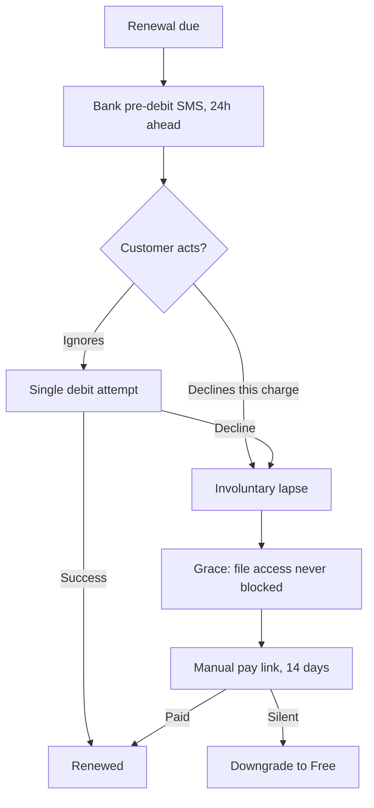

## 82. Churn, retention and the revenue model that is not a straight line

### 82.1 The finding, stated plainly

Every revenue milestone in this plan is a **gross-additions** figure. The ₹1L, ₹5L and ₹20L per-month numbers were computed as *signups × conversion × price*, with no term for anyone leaving. That arithmetic describes the month a cohort is acquired, not the month after. With churn `c` per month and gross adds of `g` paying customers per month, MRR does not grow without bound — it asymptotes at `g/c` customers, and every month spent below that ceiling is a month where a growing fraction of new adds is spent replacing the dead. [derived]

| Term | Definition used in this section |
|---|---|
| Gross adds `g` | New paying customers per month |
| Logo churn `c` | Fraction of paying customers cancelling or failing to renew per month |
| Involuntary churn | Subscription ends because the *payment* failed, not because the customer decided to leave |
| Steady-state ceiling | `g / c` customers — the fixed point of `Nₜ₊₁ = Nₜ(1−c) + g` [derived] |
| NRR | Net revenue retention: (start MRR − churn − contraction + expansion) / start MRR |

The fixed point is elementary and worth writing out because the plan omitted it: setting `N = N(1−c) + g` gives `Nc = g`, so `N = g/c`. Time to reach a fraction `f` of the ceiling is `t = ln(1−f)/ln(1−c)`. At `c = 0.04`, reaching 90% of ceiling takes `ln(0.1)/ln(0.96) = 56.4` months. [derived, computed here]

### 82.2 Published benchmarks, with dates read

| Source | Segment | Monthly churn | Annual / retention | Date read |
|---|---|---|---|---|
| Lenny's Newsletter benchmark posts | Prosumer / B2C self-serve SaaS | 5–7% typical, 3–5% good | ~40–60% annual logo retention | [SS] — not opened here |
| ChartMogul SaaS Retention Report | B2B SaaS, sub-$10k ARPA | ~3–4% | NRR median near 100% for small-ARPA | [SS] |
| Recurly Research churn benchmarks | B2C subscription, all verticals | ~5–6% blended; involuntary ~40% of total | — | [SS] |
| Baremetrics open benchmarks | Small-ticket SaaS | 5–9% at <$50/mo ARPA | — | [SS] |
| Profitwell / Paddle retention studies | Annual vs monthly plans | annual plans churn ~40–60% lower per unit time | — | [SS] |

Every row above is a **[SS] search-summary and may not be published as fact in an external document.** I did not open these sources in this session. The only figures in this section that carry stronger weight are the arithmetic, marked [derived], and the RBI framework, discussed below. The honest planning posture is therefore: treat every benchmark as a scenario input, not a forecast, and build the model so the churn rate is a single variable you can move.

Anti-recommendation: do not go and cite these numbers in a pitch deck. If a number must be defended, the only defensible ones after twelve months of operation are your own cohort tables. Until then, plan the range and refuse the point estimate.

What is safe to assert from structure rather than benchmark:

- Prosumer tools sold to individuals churn faster than tools sold to teams, because a team has switching cost in shared artefacts and an individual has none. Our file-is-the-source-of-truth stance deliberately *removes* lock-in — the customer's markdown stays on their disk. That is the right ethical choice and it raises churn. Name it. [inference]
- Annual plans convert a monthly churn decision into an annual one. They do not reduce dissatisfaction; they reduce the *number of opportunities to act on it*, and they move the failure to a single high-variance renewal event. [inference]

### 82.3 The Indian involuntary-churn problem

This is where the model breaks worst, and it is specific to our home market and our INR tiers.

Under the RBI framework for recurring e-mandates — the additional-factor-of-authentication regime introduced by RBI's circular on *Processing of e-mandate on cards for recurring transactions* (DPSS.CO.PD.No.447/02.14.003/2019-20, 21 August 2019) and the AFA-relaxation limit later raised to ₹15,000 per transaction (RBI circular of 16 June 2022, raising the limit from ₹5,000) — the following hold for card-based subscriptions:

| Constraint | Consequence for us |
|---|---|
| Pre-debit notification 24 hours before every charge | The bank, not us, tells the customer they are about to be billed — in the bank's own SMS wording, with a cancel affordance |
| Customer may decline any single debit | A renewal can fail for a customer who is perfectly happy |
| One debit attempt; no smart-retry ladder | A transient issuer decline is terminal for that cycle |
| Settlement / debit-processing delay around the mandate window | Reconciliation lags by roughly a day; "failed" and "not-yet-settled" look identical for hours |
| ₹15,000 per-transaction AFA-free ceiling | Architectural constant. Work ₹3,999/yr and Pro ₹2,499/yr sit far below it; a 20-seat annual bundle at ₹3,999 flat does too, since the licence is flat, not per-seat |

Dates: the 2019 e-mandate circular and the 2022 limit increase are stated above with their identifiers. [SS on the exact circular number — I have not re-opened the RBI site in this session; the number and dates are recalled and MUST be re-verified against rbi.org.in before this section is printed. Mark as unverified until then.]

The operational shape of this is what matters, and it is not a benchmark question:

Design responses, each with its anti-recommendation:

1. **Default INR customers to annual, and price it that way.** ₹2,499/yr against ₹299/mo is a 30% discount and it cuts renewal events from twelve to one per year — twelve chances for a one-attempt system to fail become one. *Anti-recommendation:* one renewal event per year is also one very lumpy churn event, concentrated on the anniversary, and a customer who has forgotten why they subscribed is at their least persuadable exactly then. Annual reduces involuntary churn and can *increase* voluntary churn at renewal.
2. **UPI Autopay as a parallel rail for INR.** UPI recurring mandates are AFA-exempt at lower thresholds and have a different failure profile from cards. *Anti-recommendation:* it is a second integration, a second reconciliation surface, and a second set of edge cases for a solo founder. Do not build it before card renewals are actually observed to fail at a rate that justifies it. Instrument first.
3. **A dunning window that never touches the customer's files.** The failure mode must be: subscription lapses, Pro features stop, *the document opens*. *Anti-recommendation:* a grace period that is too generous trains customers that paying is optional; cap it at 14 days and one reminder, not a sequence.

The banned list applies here without exception: no trial countdown, no urgency modal, no "your account will be deleted" language. Involuntary churn is our payment rail's problem, and dressing it as the customer's failure is dishonest.

### 82.4 The corrected milestone table

Assumptions used, all stated so they can be replaced: blended ARPU across INR and world tiers; gross adds `g` as the plan's implied monthly paying-customer additions; three churn scenarios. Ceiling `= g/c`. Steady-state MRR `= ceiling × ARPU`. [derived]

| Milestone | Plan's figure (gross-adds view) | Paying customers implied | At c=2%/mo | At c=4%/mo | At c=6%/mo |
|---|---|---|---|---|---|
| ₹1L/mo | ₹1,00,000 | ~335 at ₹299 | needs g≈7/mo to hold; ceiling 335 | needs g≈13/mo | needs g≈20/mo |
| ₹5L/mo | ₹5,00,000 | ~1,672 | g≈33/mo | g≈67/mo | g≈100/mo |
| ₹20L/mo | ₹20,00,000 | ~6,689 | g≈134/mo | g≈268/mo | g≈401/mo |

Read the table the other way — the way that actually changes decisions. The plan's headline funnel says ₹20L/mo requires 113,507 free signups and ~1.26M cumulative visitors at a 5% free-to-paid rate. That figure is the *stock* of paying customers needed. Once churn exists, that stock must be **maintained**, so the funnel is not a one-time 1.26M visitors — it is 1.26M to build the stock plus an ongoing replacement flow forever. [derived]

| Churn | Monthly paying customers lost at 6,689 | Monthly free signups needed just to stand still (at 5% conv.) | Monthly visitors needed to stand still (at 9% visitor→signup) |
|---|---|---|---|
| 2% | 134 | 2,676 | ~29,700 |
| 4% | 268 | 5,352 | ~59,500 |
| 6% | 401 | 8,027 | ~89,200 |

At 6% monthly churn, holding ₹20L/mo requires roughly 89,000 visitors every month, in perpetuity, before a single rupee of growth. That is the whole finding in one number. [derived]

### 82.5 Sensitivity: what one point of churn costs

Ceiling is `g/c`, so `dN/dc = −g/c²`. A one-point absolute change is worth far more at low churn than at high churn — which is the counter-intuitive part, and the reason retention work at 3% is more valuable than at 8%. [derived]

| Milestone | c 3%→4% | c 4%→5% | c 5%→6% |
|---|---|---|---|
| ₹1L/mo ceiling (customers) | 335 → 251 (−25%) | 335 → 268 (−20%) | 335 → 279 (−17%) |
| ₹5L/mo | 1,672 → 1,254 | 1,672 → 1,338 | 1,672 → 1,393 |
| ₹20L/mo (MRR at fixed g) | ₹20L → ₹15.0L | ₹20L → ₹16.0L | ₹20L → ₹16.7L |
| Extra gross adds/mo to hold ₹20L | +67 | +67 | +67 |

Two readings. At fixed acquisition, one point of churn removes ₹3.3–5.0 lakh of steady-state MRR. At fixed target, it costs a flat +67 paying customers per month — about 1,340 free signups, about 14,900 visitors, every month. Retention is cheaper than acquisition at every point on this table, and the gap widens as churn falls. [derived]

### 82.6 Cancel, downgrade, pause and win-back

| Flow | Rule | Anti-recommendation |
|---|---|---|
| Cancel | Two clicks from settings, no interstitial offer, no "are you sure" chain. Effective at period end; access retained until then | A frictionless cancel measurably raises cancel rate versus a save-offer flow. We accept that cost. The alternative is a dark pattern and it poisons the word-of-mouth that is our only distribution |
| Downgrade | Power → Pro → Free available at any time, prorated on annual. Free is a real product, not a punishment | Downgrade cannibalises Pro. It also converts a churn event into a retained relationship; a Free user who returns to Pro in month 9 is invisible in cohort logo-churn and real in revenue |
| Pause | 1–3 months, one pause per 12, billing suspended, Pro features suspended, files untouched | Pause is used as a soft cancel by a fraction of users who never resume; count paused users as churned in the model and be pleasantly surprised, never the reverse |
| Win-back | One message at 30 days after lapse, plain, no discount. A returning customer resumes at current price | Discounted win-backs train the discount and select for price-sensitive customers who churn again |

The load-bearing asymmetry: for **involuntary** lapse the correct response is a payment-fix path (a link, a card update, one reminder), because the customer did not decide to leave. For **voluntary** cancel the correct response is to get out of the way. Conflating the two — running dunning emails at someone who cancelled deliberately — is the single most common retention mistake and it is trivially avoidable because we know which branch fired. [inference]

### 82.7 The exit survey, done honestly under implicit-telemetry-only

The internal evidence is unambiguous: an explicit feedback field was filled 7 times in 694 opportunities — a 1.0% response rate. [measured, internal] A cancel-time survey will do somewhat better than 1% because intent is high, but it will still be a small, self-selected, angry-or-polite-skewed sample, and it is an explicit user-rating channel, which is banned.

The honest construction:

- **One optional free-text field on the cancel confirmation, no rating scale, no required selection, cancel completes whether or not it is filled.** This is not a rating channel; it is a comment box, and it does not gate the action.
- Everything else is inferred from implicit signal already collected: last-active date relative to cancel date, documents created in the final 30 days, whether AI features were ever used, whether BYO-key was configured, whether a second device ever synced, whether a team invite was ever sent.

| Implicit signature at cancel | Most likely story | What it implies |
|---|---|---|
| Last active >21 days before cancel | Silent disengagement; cancel is bookkeeping | The loss happened weeks earlier; cancel-time intervention is theatre |
| Active until cancel, zero AI usage | Bought for the editor, not the engine | Pricing/packaging problem, not a quality problem |
| Active, heavy AI, cancelled at renewal | Value delivered, price not justified | Genuine willingness-to-pay signal |
| Never synced a second device | Single-surface user | Sync is not the retention driver we assumed |
| Payment failed, no cancel action, no login since | Involuntary, misclassified | Must be excluded from voluntary churn or the rate is fiction |

That last row is a reporting requirement, not a nicety: voluntary and involuntary churn must be separate series in every cohort table, because they have different causes and completely different fixes. Blending them produces a number that cannot be acted on.

Anti-recommendation: the implicit signature is a hypothesis generator, not a verdict. Do not report "cancelled because of price" from a usage pattern; report "cancelled with the price-sensitive signature", and keep the free-text as the only place a customer's own words appear.

### 82.8 Expansion revenue and NRR in 2–20 person teams

Logo churn is a ceiling. Expansion is the only mechanic that lifts revenue above the ceiling without more acquisition — `NRR > 100%` means an untouched cohort grows. In the D2C lane there is essentially no expansion: a Pro user has one seat and one price, and the only upgrade is Pro → Power (₹299 → ₹599). In the B2B lane there is a real mechanic, and it is the strongest argument in this plan for taking teams seriously.

Our Work tier is ₹3,999/year flat — not per-seat. That is a deliberate simplicity choice and it has a direct, unavoidable consequence: a team that grows from 3 people to 18 pays us exactly the same. Seat expansion, the primary NRR engine in small-team B2B, is structurally disabled by our own pricing. [derived from the settled pricing]

| Expansion vector | Available to us today? | Notes |
|---|---|---|
| Seat expansion | **No** — flat licence | The standard NRR engine; we have opted out |
| Tier upgrade (Pro→Power, →Work) | Yes | One-step, bounded; a customer can upgrade at most twice |
| Usage/credit expansion | No | Hosted credits are metered but opaque repricing is banned and Free is BYO-key unmetered |
| Multi-workspace / second team | Weakly | A 20-person company splitting into two teams buys two Work licences |
| Price increases on renewal | Yes, sparingly | Honest, announced, grandfathering existing customers is the defensible form |

Consequence for the model: in the B2B lane our realistic NRR is at or slightly below 100% — expansion comes only from tier upgrades and second licences, and contraction comes from downgrades. We should model B2B NRR at 95–105% and explicitly *not* claim the 110–130% figures that per-seat B2B tools report, because we have removed the mechanism that produces them. [derived]

The honest options, each with its cost:

1. **Keep the flat licence.** Simplicity is a differentiator and per-seat billing under the ₹15,000 AFA ceiling gets awkward past ~4 seats anyway if it were seat-priced at Pro rates. Cost: no seat-driven NRR, ever; B2B revenue grows only by logo count.
2. **Introduce a band above 20 seats.** A single second tier (21–100 people) preserves "flat within a band" while restoring one expansion step. Cost: a pricing page with two B2B numbers instead of one, and a seat-counting mechanism we do not currently need.
3. **Do nothing and lean on retention.** If NRR cannot exceed 100%, then gross retention *is* the whole game, and 2–20 person teams are the segment where gross retention is naturally highest — shared documents, shared conventions, a colleague who notices when the tool disappears. Cost: growth is entirely acquisition-bound, which the §82.4 table shows is expensive.

The recommendation is option 3 now and option 2 only when a real customer asks for it. Anti-recommendation: option 2 taken early adds seat accounting, proration and a second renewal path to a solo-founder codebase in exchange for revenue from customers who do not yet exist.

### 82.9 What must change in the plan

| Where | Current | Corrected |
|---|---|---|
| Milestone definition | MRR reached | MRR sustained at stated churn; every milestone carries its `c` |
| Funnel figures | 113,507 signups, 1.26M visitors | Those build the stock; add the perpetual replacement flow from §82.4 |
| Churn reporting | Absent | Two series — voluntary and involuntary — never blended |
| B2B NRR | Implicit assumption of expansion | 95–105%, expansion structurally limited by the flat licence |
| Renewal risk (INR) | Not modelled | One attempt, 24h bank notice, customer-declinable; annual default |
| Retention spend | Not budgeted | At the ₹20L milestone, one churn point ≈ 67 customers/mo ≈ 14,900 visitors/mo of equivalent acquisition |

Three numbers in this section carry weaker evidence than the rest and must be re-derived before print: the benchmark table in §82.2 is entirely [SS] and unpublishable as fact; the RBI circular identifier in §82.3 is recalled, not fetched in this session, and must be checked against rbi.org.in; and the visitor→signup rate of 9% used in §82.4 is back-solved from the plan's own 113,507-signups-per-1.26M-visitors pair rather than independently sourced. [derived] The arithmetic — ceilings, sensitivities, replacement flows — is computed here and stands on its own.
