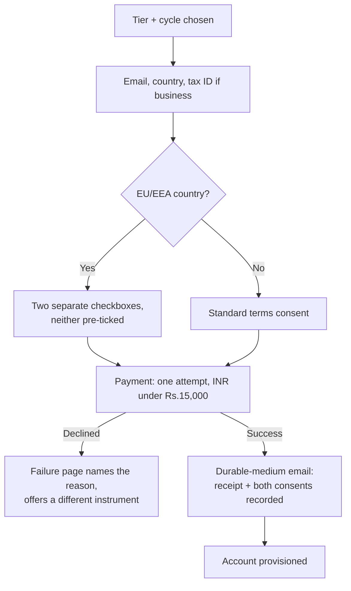

## 83. Pricing experimentation and the pricing page

### 83.1 The finding

The plan says "test ₹299 against ₹249 and ₹399." That sentence contains no sample size, no minimum detectable effect, no exposure unit, no stopping rule, and no analysis plan. It is not an experiment; it is an intention to look at numbers after the fact. This section does the arithmetic that the plan skipped, states the verdict, and then specifies the pricing page — which twenty-four corpus files analyse in competitors and zero specify for us.

### 83.2 Power analysis with our actual funnel

Inputs, all from settled plan figures (§ pricing, § distribution):

| Input | Value | Source |
|---|---|---|
| Visitor → free signup | 9.0% | plan funnel assumption |
| Free → paid (developer median) | 5.0% | settled, § distribution |
| Visitors needed for ₹20L/mo | 1,260,000 cumulative | settled |
| Free signups at that point | 113,507 cumulative | settled |
| Realistic month-6 traffic, solo founder, no paid acquisition | 3,000–8,000 visitors/month | [inference] from the cumulative figures above spread over a 24–36 month ramp |
| Baseline paid conversion per visitor | 0.09 × 0.05 = 0.45% | [derived] |

Two-proportion test, two-sided, α = 0.05, power = 0.80. The standard normal constants are z(α/2) = 1.960 and z(β) = 0.842, so (z(α/2) + z(β))² = 7.849 [derived].

Sample size per arm, n = 7.849 × [p₁(1−p₁) + p₂(1−p₂)] / (p₁ − p₂)².

**Case A — detect a 20% relative lift in paid conversion (0.45% → 0.54%).**
p₁(1−p₁) = 0.0045 × 0.9955 = 0.004480. p₂(1−p₂) = 0.0054 × 0.9946 = 0.005371. Sum = 0.009851.
(p₁ − p₂)² = (0.0009)² = 0.00000081.
n = 7.849 × 0.009851 / 0.00000081 = **95,455 visitors per arm** [derived]. Three arms (₹249 / ₹299 / ₹399) = 286,365 visitors. At 5,000 visitors/month that is **57 months** [derived: 286,365 / 5,000].

**Case B — detect a 50% relative lift (0.45% → 0.675%), an implausibly large price elasticity effect.**
p₂(1−p₂) = 0.00675 × 0.99325 = 0.006704. Sum = 0.011184. (Δp)² = (0.00225)² = 0.000005063.
n = 7.849 × 0.011184 / 0.000005063 = **17,341 per arm** [derived]; three arms = 52,023 visitors = **10.4 months** at 5,000/month [derived].

**Case C — the metric that actually matters, revenue per visitor.** Price tests move revenue even when conversion is flat, so the honest test is on a continuous outcome. Revenue per visitor at ₹299 = 0.0045 × 299 = ₹1.3455 [derived]. The distribution is zero-inflated: 99.55% zeros, 0.45% at the price point. Variance = E[X²] − (E[X])² = (0.0045 × 299²) − 1.3455² = 402.30 − 1.81 = 400.49; σ = ₹20.01 [derived]. To detect a 10% difference in revenue per visitor (Δ = ₹0.1346): n = 2 × 7.849 × 400.49 / 0.1346² = 6,286 / 0.018117 = **347,000 per arm** [derived]. Worse than Case A, because the zero-inflation drives the variance.

**Case D — the only test that is nearly affordable: free-signup rate, not paid conversion.** Price shown on the landing page can suppress signup itself. Baseline 9.0%, detect a 15% relative drop (9.0% → 7.65%): p₁q₁ = 0.0819, p₂q₂ = 0.07065, sum = 0.15255; (Δp)² = 0.0135² = 0.00018225. n = 7.849 × 0.15255 / 0.00018225 = **6,570 per arm** [derived], two arms = 13,140 visitors ≈ **2.6 months**. This measures price *anchoring*, not willingness to pay, and must not be reported as the latter.

### 83.3 Verdict on testability

| Test | n per arm | Months at 5k/mo | Viable |
|---|---|---|---|
| Paid conversion, 20% lift, 3 arms | 95,455 | 57 | No |
| Paid conversion, 50% lift, 3 arms | 17,341 | 10.4 | No — 50% MDE is not a real hypothesis |
| Revenue per visitor, 10% | 347,000 | 208 | No |
| Free-signup rate, 15% drop, 2 arms | 6,570 | 2.6 | Marginal, and answers a different question |

**A solo founder at this traffic cannot run a valid randomised price test on paid conversion; the arithmetic says the ₹299-versus-₹249-versus-₹399 test as written would take 57 months and must be struck from the plan.** [derived]

Anti-recommendation: if traffic ever exceeds ~40,000 visitors/month sustained, Case A drops to 7.2 months for three arms and the test becomes worth revisiting; do not treat this verdict as permanent. Also note the trap in the other direction — a test that *did* reach significance quickly at this traffic would almost certainly be a false positive from peeking, not a real elasticity effect.

### 83.4 What to do instead, and what each method costs you

| Method | What it gives | Weakness that must be stated alongside it |
|---|---|---|
| Sequential cohorts (₹299 for Q1, ₹349 for Q2) | Real money, real intent, no split infrastructure | Fully confounded with season, launch coverage, product changes, and the cohort's own composition. Cannot separate price from time. Report as observation, never as a test. |
| Geographic split (INR page vs USD page) | Natural boundary, no user sees two prices | Populations differ on everything — income, payment rails, competitor set. Measures the market, not the price. |
| Van Westendorp PSM (four questions: too cheap / bargain / expensive / too expensive) | An acceptable range and an indifference point from ~40 respondents | Measures stated attitude with no budget constraint; systematically over-reports acceptable prices. It brackets a range; it does not pick a number. [SS] |
| Gabor-Granger (would you buy at ₹X, escalating) | A demand curve and a revenue-maximising point | Anchoring on the first price shown, hypothetical bias, and it assumes the respondent already understands the product's value — which for a markdown editor with a deep engine they usually do not on first contact. [SS] |
| Willingness-to-pay interviews (n = 15–25, real users, "what do you pay for today") | Mechanism, not just number: the substitute they'd cancel, the budget line it comes from | Not projectable. Interviewees are recruited from people who already like you. |
| Price-change natural experiment (raise price, grandfather existing) | Genuine causal signal on *new* conversion | One-shot, unrepeatable without reputational cost, and confounded by whatever else shipped that week. |

Recommended stack for year one: van Westendorp on ~40 free users to confirm ₹299 sits inside the acceptable band, plus 20 WTP interviews for the *reasoning*, plus revenue-per-visitor tracked as a monitored series with no significance claim attached. Anti-recommendation: this stack cannot tell you whether ₹349 beats ₹299 by 8%, and if the decision genuinely hinges on that margin, the correct move is to pick one and spend the year on distribution instead — 1.26M cumulative visitors is the binding constraint, not the price point.

### 83.5 Ethics and mechanics when users talk to each other

Developer users share screenshots. A price test is discoverable, and discovery of undisclosed differential pricing reads as manipulation regardless of intent.

| Rule | Mechanic |
|---|---|
| Price is sticky to the account, not the session | Assign at first landing, persist server-side keyed to the eventual account; never re-roll on a new device. Two devices showing two prices is the failure mode that goes on Hacker News. |
| Honour any advertised price for anyone who asks | If a user cites a lower price they saw, give it. Support cost of doing this is near zero at our volume; the cost of refusing is unbounded. |
| Never vary price by inferred wealth signals | No device-type, no IP-to-income, no browser. Geographic PPP tiers are disclosed and uniform within a country; that is a published policy, not a test. |
| Disclose the test in the terms page | One line: "we occasionally test list prices; your price is locked at signup and never rises while you remain subscribed." |
| Exclude anyone arriving via a shared link with a price in it | Referral and comparison traffic gets the control price. |

Anti-recommendation: sticky-by-account pricing means the arm assignment survives forever and every future price change has to reason about a growing set of legacy prices; the alternative — re-rolling per session — is cheaper to operate and worse to be caught doing.

### 83.6 Grandfathering policy

| Event | Policy |
|---|---|
| List price rises | Existing paid subscribers keep their price for as long as the subscription is continuous. Stated at checkout, not discovered later. |
| Subscription lapses > 60 days | Legacy price is forfeit on resubscribe. Prevents indefinite churn-and-return arbitrage. |
| Tier upgrade (Pro → Power) | New tier at current list; the old tier's legacy price does not carry across. |
| Annual → monthly | Legacy price forfeit; annual discount is the consideration for the commitment. |
| Work licence (₹3,999/yr flat) | Locked for the licence term; renews at the then-current price with 30 days' notice. |
| Currency/PPP tier reassignment | Never applied retroactively to an existing subscriber. |

Anti-recommendation: perpetual grandfathering caps blended ARPU permanently and makes the 57-month revenue model optimistic. A three-year sunset with 90 days' notice would be defensible and is the standard alternative; it costs goodwill precisely with the earliest users, who are the ones who talk.

### 83.7 If a test does become viable — the pre-registered protocol

| Element | Specification |
|---|---|
| Unit of exposure | Anonymous visitor ID at first landing, hashed, persisted to the account on signup. Not session, not pageview. |
| Randomisation | Deterministic hash of visitor ID mod 100, salted per experiment so arms don't correlate across tests. |
| Primary metric | Revenue per exposed visitor over 90 days (captures conversion *and* tier mix *and* annual-versus-monthly). |
| Guardrail metrics | Free-signup rate; 90-day retention; refund rate. Any guardrail degrading > 15% halts the test regardless of the primary. |
| MDE, declared before start | 20% relative on the primary. Anything smaller is unaffordable (§83.2). |
| Fixed horizon | n per arm computed from §83.2 formula at current baseline, converted to a calendar end date. No looking at the primary metric before that date. |
| Stopping rule | If peeking is unavoidable, use O'Brien-Fleming spending with at most three interim looks, or a sequential-probability-ratio test; naive daily peeking at α = 0.05 inflates the false-positive rate well past 0.05 [SS]. Guardrails may be monitored continuously; the primary may not. |
| Analysis | Two-sided two-proportion / t-test as pre-declared. No subgroup analysis reported as a finding. |
| Payment constraint | Every arm must sit under ₹15,000 per transaction (RBI recurring-mandate constant, settled) and must survive the one-attempt-no-retry reality of Indian cards — an annual arm that fails a single charge has no second chance, so annual arms carry a different failure rate than monthly arms and the comparison is not clean. |

### 83.8 The pricing page — layout

Four columns on desktop, stacked on mobile with Pro first (not Free first — mobile users scroll past the first card, so the recommended tier leads).

| Column | Header line | Leads with |
|---|---|---|
| Free | ₹0 forever | "Bring your own API key. Unmetered AI." |
| Pro — visually marked, single accent border | ₹299/mo or ₹2,499/yr | "Everything, hosted, on every device." |
| Power | ₹599/mo | "For people whose vault is their job." |
| Work | ₹3,999/yr, flat, whole team | "One licence. 2–20 people. No per-seat maths." |

Feature rows are grouped under four headings — Editing, Files and sync, AI, Team — with a checkmark grid. No feature appears in a higher tier that a lower tier user was already using; the ladder is additive only.

The annual toggle sits above the columns, **defaults to monthly**, and shows the annual saving as an absolute rupee figure ("save ₹1,089/yr") not a percentage. Rationale: defaulting to annual inflates the headline discount and then surprises the user at checkout with a ₹2,499 charge; with one payment attempt and no retries on Indian cards, a surprised user is a declined card. Anti-recommendation: defaulting to annual measurably raises annual mix and therefore cash and retention, and most SaaS does it for that reason; we are trading revenue for a lower checkout-failure rate on the rail we actually run on.

### 83.9 What each tier leads with, per persona

| Persona | Enters at | The one line that has to land |
|---|---|---|
| Developer, already has an API key | Free | "Your key, your model, no credit meter, no cap." |
| Writer with a large vault | Pro | "Open a 4,000-file vault and search it instantly." |
| Researcher / heavy AI user | Power | "Ask questions across the whole vault, not one file." |
| Team of 2–20 | Work | "₹3,999 a year for everyone. Not per person." |
| Obsidian/Notion migrator | Pro | "Your files stay files. Point us at the folder." |

### 83.10 Objection handling, on the page

Answered inline next to the relevant column, not buried:

| Objection | Placement | Answer |
|---|---|---|
| "Why pay when Obsidian is free?" | Under Pro | Sync, the AI engine, and the fact that the file is still yours in plain markdown. |
| "What happens to my files if you shut down?" | Footer of the grid, all tiers | They are markdown in a folder you already control. Export is a no-op. |
| "Is Free crippled?" | Under Free | No. BYO-key AI is unmetered. Free is the whole editor. |
| "Does the AI train on my documents?" | Under the AI feature group | No, with the vendor terms linked. |
| "₹3,999 for twenty people — what's the catch?" | Under Work | None; the catch is that support is email and there is no SSO. Say it on the page. |

### 83.11 FAQ that removes support tickets

Ten questions, each answered in under sixty words, chosen because each maps to a ticket class: what happens when I cancel; do my files leave with me; how the BYO key works and what it costs; why my card was declined and what to do (the one-attempt reality, stated plainly); can I switch monthly to annual mid-term; do you have student pricing; is there a refund window and how long; what "2–20 people" means precisely for Work; do you support my platform; how to change the payment method before renewal.

Anti-recommendation: a long FAQ pushes the buy button below the fold on mobile and depresses conversion. Keep it collapsed by default and keep the primary CTA sticky.

### 83.12 Checkout flow and the EU withdrawal acknowledgement

Directive 2011/83/EU on consumer rights, Article 16(m), removes the fourteen-day right of withdrawal for supply of digital content not on a tangible medium only if performance began with the consumer's **prior express consent** and their **acknowledgement that they thereby lose the right of withdrawal**; Article 8(7)/(2) requires confirmation on a durable medium including that consent and acknowledgement. Directive (EU) 2019/2161 amended Article 16 to extend the same logic to contracts where the consumer pays with personal data rather than money [fetched: eur-lex.europa.eu, Directive 2011/83/EU consolidated text, read 2026-08-30]. Absent both elements, the consumer keeps the withdrawal right and can demand a refund after using the product.

The two EU checkboxes, worded exactly and never pre-ticked:
1. "I ask you to start providing this digital content immediately, before the 14-day withdrawal period ends."
2. "I acknowledge that I will lose my right of withdrawal once you begin providing it."

Store the timestamp, IP-country, and the exact text version against the order; replay the same text in the confirmation email. Anti-recommendation: making immediate access conditional on waiving withdrawal is the standard pattern but it costs you the users who won't waive — the alternative is to grant the withdrawal right unconditionally and eat the refunds, which at a ₹299 price point may cost less than the checkout friction. Measure refund rate for two quarters before deciding.

Checkout mechanics that follow from the settled constraints: all INR amounts stay under the ₹15,000-per-transaction RBI ceiling (the ₹3,999 Work licence and ₹2,499 annual both clear it comfortably); the Indian card rail gets exactly one attempt, so the failure page must be a designed surface, not a stack trace, and must offer UPI as the immediate alternative rather than asking the user to retry the same card; no trial countdown, no upgrade modal, no post-purchase celebration screen.
