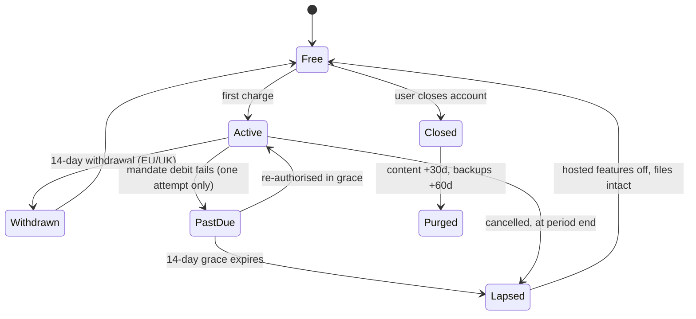

## 84. Refunds, cancellation and the subscription lifecycle

### 84.1 The decision, priced

| Decision | Setting | Cost, shown | Anti-recommendation |
|---|---|---|---|
| First-charge refund | 30 days, no questions, every tier, every currency | At a 2% refund rate on ₹10,00,000 annual gross: ₹10L / ₹2,499 = 400.2 Pro-annual subs, 2% = 8.0 refunds, principal ₹20,000 + Dodo's $1/refund × 8 × 95.39 = ₹763, total ₹20,763 = **2.08% of gross** [derived] | If the paid tier ever becomes a one-time unlock rather than an ongoing hosted service, 30 days is an open door: the vault is local, so a refunder keeps every file. Do not sell a perpetual unlock behind a refundable subscription. |
| Renewal refund | Prorated on request within 90 days of the renewal charge; discretionary after | Pro annual refunded at day 100: ₹2,499 × 265/365 = ₹1,814.34 forgone [derived] | Proration on renewals invites annual-plan users to treat us as a monthly plan at a discount. Cap at one prorated renewal refund per account, lifetime. |
| Chargeback contest | Never contest below ₹5,000 | Dodo Payments: $30 per dispute, same price for Visa RDR [fetched, dodopayments.com/pricing, 2026-08-30]. At USD/INR 95.39 [fetched, api.frankfurter.dev, rate date 2026-08-28] that is ₹2,861.70 = **9.57× a ₹299 monthly charge** and 1.15× a ₹2,499 annual charge [derived] | Never contesting is legible to abusers. Track disputes per account and refuse re-subscription after two — a service decision, not a refund decision. |
| Grace after failed debit | 14 days | 14 days of hosted service to a cohort that mostly does not return | If measured recovery inside the window is under ~20%, cut to 7 days. Do not keep 14 because it feels generous. |
| Published pages after lapse | Keep resolving, frozen, indefinitely | Egress on content from a non-paying account | Free hosting is a real abuse surface. Cap frozen pages per account and throttle any page exceeding a rolling bandwidth threshold. |

Contribution margin is 57–73% on every INR tier (settled). A 2% refund rate therefore consumes 3.51% of contribution at the low end and 2.74% at the high end [derived: 0.02/0.57, 0.02/0.73].

### 84.2 What the benchmark set does

| Product | Stated policy | Read |
|---|---|---|
| Obsidian | "All fees are non-cancellable and non-refundable and are based on Services purchased and not actual usage" [fetched, obsidian.md/terms] | 2026-08-30 |
| Paddle (merchant of record for thousands of tools) | "Unless required by applicable law, all Transactions are non-refundable and non-exchangeable"; discretionary refunds handled separately; "If local consumer protection laws or a Supplier of a Product provides you with additional or non-waivable rights, the highest level of rights will always apply" [fetched, paddle.com/legal/refund-policy] | 2026-08-30 |
| 37signals (Basecamp, HEY) | Refund on request for a forgotten auto-renewal; prorated refund "for the remaining whole months"; account data kept 60 days after the paid period ends so you can migrate [fetched, basecamp.com/about/policies/refund] | 2026-08-30 |
| 37signals, deletion timing | "We'll permanently delete the content in your account from our servers 30 days after cancellation, and from our backups within 60 days" [fetched, basecamp.com/about/policies/cancellation] | 2026-08-30 |

The distribution is bimodal: file-first tools write "non-refundable" and rely on statute to override them; service-first tools write a generous policy and publish the deletion clock. We are a file-first product sold as a service, and the 37signals shape is the one that matches our thesis. Adopting it costs 2.08% of gross at a 2% refund rate [derived]; adopting Obsidian's costs nothing and contradicts everything else in this document [inference].

### 84.3 Statutory rights that override the policy

| Regime | Right | Article, and what it says |
|---|---|---|
| EU / EEA | 14-day withdrawal from distance contracts for digital content | Directive 2011/83/EU Art 16(m), as amended by (EU) 2019/2161: no withdrawal right for digital content not on a tangible medium "if the performance has begun and, if the contract places the consumer under an obligation to pay, where: (i) the consumer has provided prior express consent to begin the performance during the right of withdrawal period; (ii) the consumer has provided acknowledgement that he thereby loses his right of withdrawal; and (iii) the trader has provided confirmation in accordance with Article 7(2) or Article 8(7)" [fetched, EUR-Lex CELEX:02011L0083-20220528, 2026-08-30] |
| EU / EEA | Consumer pays nothing if we get the checkout wrong | Art 14(4)(b): the consumer bears no cost for digital content supplied where (i) no prior express consent to begin performance before the 14-day period ends, (ii) no acknowledgement of loss of the withdrawal right, **or** (iii) the trader failed to provide confirmation under Art 7(2) or 8(7) [fetched, EUR-Lex CELEX:32011L0083, 2026-08-30] |
| UK | Consumer Contracts (Information, Cancellation and Additional Charges) Regulations 2013, regs 28 and 37 — the domesticated mirror of the above | legislation.gov.uk returned HTTP 202 to four fetch attempts (HTML, XML API, PDF) on 2026-08-30, so the regulation text is unverified here [SS]. Corroborating operational text is fetched: Paddle applies a 14-day window across "European Union / EEA / Switzerland / United Kingdom" and adds a UK-specific clause — "If you completed a Transaction in the UK and have an annual Subscription, you will have a new period of 14 calendar days to exercise your right to withdraw starting the day the Subscription auto-renews for another year" [fetched, paddle.com/legal/refund-policy, 2026-08-30]. That renewal-resets-the-clock rule is the one an annual-plan seller gets wrong. |
| India | Consumer Protection Act 2019 and the Consumer Protection (E-Commerce) Rules 2020: mandatory display of the refund and cancellation policy, and a named grievance officer with defined acknowledgement and redressal windows | consumeraffairs.nic.in, egazette.gov.in and indiacode.nic.in were all unreachable from here on 2026-08-30 (HTTP 000/404), so rule numbers and time limits are unverified [SS]. Verify before publication. |
| India, data | DPDP Act 2023 s.12(3): "upon receipt of such a request, the Data Fiduciary shall erase her personal data unless retention of the same is necessary for the specified purpose or for compliance with any law for the time being in force" [fetched, meity.gov.in DPDP PDF, 2026-08-30] |
| EU, data | GDPR Art 17(1)(b): erasure where "the data subject withdraws consent … and where there is no other legal ground for the processing" [fetched, EUR-Lex CELEX:32016R0679, 2026-08-30] |

Paddle's own floor is the correct drafting instruction: the highest level of rights always applies, and no policy of ours discharges a statutory duty.

### 84.4 What must be captured at checkout for the EU exemption to exist

Three artefacts, all three, or Art 14(4)(b) makes the supply free [fetched]:

1. A separate, unticked checkbox reading, verbatim: *"I want frontmatter to start immediately, and I understand I lose my 14-day right of withdrawal once it does."* Not bundled into the terms checkbox. Store the boolean, the exact string version, and the timestamp against the subscription row.
2. Performance must actually begin — the hosted workspace provisioned — and that event timestamped.
3. The Art 7(2)/8(7) confirmation: a durable-medium receipt emailed at purchase that repeats the acknowledgement text back.

Anti-recommendation: taking the waiver by default maximises revenue retention and is the commonest way a small seller loses a regulator complaint. The alternative — **offer the EU withdrawal right unconditionally for 14 days and never ask for the waiver** — costs at most 14 days of one subscription per withdrawing customer, deletes an entire compliance surface, and is what I recommend, because we have no free trial, so there is exactly one withdrawal window per contract rather than the two that Paddle's clause 2.2.2 creates for trial-bearing plans [fetched] [inference].

### 84.5 App stores, if we ever ship there

| Rule | Value | Read |
|---|---|---|
| Apple refunds are Apple's, not ours | Users request at reportaproblem.apple.com; "Refund eligibility may vary by country or region" [fetched, support.apple.com/en-in/118223] | 2026-08-30 |
| Apple Small Business Program | "reduced commission rate of 15% on paid apps and In-App Purchases"; qualification at up to 1 million USD proceeds in the prior calendar year [fetched, developer.apple.com/app-store/small-business-program/] | 2026-08-30 |
| Google Play | "The developer can help with purchase issues and can process refunds pursuant to its policies and applicable laws"; separate EEA/UK refund policies for purchases on or after 28 March 2018 [fetched, support.google.com/googleplay/answer/2479637] | 2026-08-30 |
| Google Play service fee | "99% are eligible for a fee of 15% or less"; from 30 June 2026 the EEA/UK/US fee depends on whether the transacting user's install is "new" or "existing" [fetched, support.google.com/googleplay/android-developer/answer/112622] | 2026-08-30 |

The operational consequence, not the commission: on Apple we can neither see nor control the refund decision, and a refunded in-app purchase silently revokes entitlement — so the state machine in §84.7 must be driven by server-to-server notifications, never by our own billing events [inference].

### 84.6 Chargebacks: the merchant-of-record boundary

| Absorbed by the MoR | Still ours |
|---|---|
| Sales-tax registration and remittance across jurisdictions; invoice issuance; the card-network relationship; dispute paperwork and evidence submission | The reason the dispute happened |
| Legal identity on the transaction; the statutory refund floor as a policy | Statutory rights above that floor — the MoR's policy does not discharge our duty [fetched, Paddle refund policy §1.4, §2.1] |
| Cancellation of the subscription itself [fetched, Paddle Buyer Terms §6] | Transitioning the workspace state, which only we can do |
| Payment-data controllership | Data-fiduciary duty for vault content under DPDP and GDPR — the MoR never holds it |

Fee exposure, both routes, both fetched 2026-08-30: Dodo Payments $30 per dispute and $1 per refund; Stripe India ₹1,000 dispute-received fee plus ₹1,000 dispute-countered fee, the latter returned on won disputes and not on lost ones. Net Stripe exposure is ₹1,000 if we win and ₹2,000 plus principal if we lose [derived].

The dominant preventable cause for an MoR seller is descriptor non-recognition — the statement reads as the reseller, not as us [inference, not measured]. Mitigations that cost nothing: set the descriptor suffix to `FRONTMATTER`, name the reseller in the receipt subject line, and send the receipt within 60 seconds of the charge.

### 84.7 Proration, and the Indian mandate constraint

Upgrades are charged immediately as a one-off, never by amending the mandate:

- Pro ₹299 → Power ₹599, day 12 of 30: unused = 299 × 18/30 = ₹179.40; charge now = 599 − 179.40 = **₹419.60** [derived]
- Pro annual ₹2,499 → Work ₹3,999, day 100 of 365: unused = 2499 × 265/365 = ₹1,814.34; charge now = ₹2,184.66 [derived]

Downgrades never refund cash. Power → Pro at day 12 leaves ₹359.40 unused; it becomes account credit, the next renewal charges ₹299 − 299 = ₹0 and carries ₹60.40 forward [derived]. The mandate amount changes only at renewal.

Why: RBI DPSS.CO.PD.No.447/02.14.003/2019-20 dated 21 August 2019 requires the issuer to send a pre-transaction notification at least 24 hours before the debit, naming merchant, amount, date/time and reference, and gives the cardholder a per-transaction or whole-mandate opt-out where "Any such opt-out shall entail AFA validation by the issuer" [fetched, rbi.org.in, 2026-08-30]. Touching the mandate mid-cycle risks re-authentication on a customer who is upgrading — the worst possible moment to surface a bank OTP screen. The AFA-relaxation ceiling was raised to ₹15,000 per transaction by RBI/2022-23/73, CO.DPSS.POLC.No.S-518/02.14.003/2022-23 dated 16 June 2022 [fetched, 2026-08-30]; our highest charge, Work at ₹3,999, sits at 3.75× headroom [derived], so no tier ever needs step-up authentication.

Anti-recommendation: charging the upgrade delta immediately is real cash out of the customer's pocket at an unexpected moment. Upgrading free until the next renewal and then charging the new rate is cleaner and loses ₹419.60 per mid-cycle upgrade. Choose it if upgrade volume is small enough that the simplicity is worth more than the cash.

### 84.8 The state machine

Indian cards get exactly one payment attempt with no smart retries (settled). There is therefore no dunning ladder to build. The 14-day grace period *is* the retry mechanism, and the retry is a human one: the customer re-authorises. It is 14 days so the product carries one number, matching the statutory withdrawal window, rather than two.

### 84.9 What a lapsed user retains and loses

| Capability | Active | Lapsed | Closed (0–30 days) | Purged |
|---|---|---|---|---|
| Local vault files, plain `.md` | Yes | Yes, untouched, forever | Yes | Yes — never ours to delete |
| Editor on local files | Full | Full, at Free-tier feature set | Full | Full |
| BYO-key AI, unmetered | Yes | Yes — Free tier includes it | Yes | Yes |
| Hosted sync across devices | Yes | Stops at lapse | Off | Off |
| Full-vault export: one ZIP, `.md` + attachments + `manifest.json` | Yes | Yes, unlimited | Yes, unlimited | N/A |
| Version history, hosted | Full | Read-only for 30 days, then dropped | Read-only | Deleted |
| Published pages on `*.frontmatter.page` | Live, editable | Live, frozen, re-publish disabled | Live | Removed at purge |
| Published pages on a custom domain | Live | 30 days, then the record detaches | Detached | Detached |
| Team seats and shared workspaces | Yes | Collapse to owner-only, read-only | Read-only | Deleted |
| Hosted AI credits | Per tier | Zero | Zero | Zero |
| Invoices and tax records | Yes | Yes | Yes | Retained under law |

**A product whose thesis is that the file is the only source of truth cannot hold the file hostage the moment the customer stops paying, and cannot break a stranger's bookmark to punish a lapsed subscriber.** Published pages therefore keep resolving after lapse — frozen, not deleted — because the reader of a published page never entered a contract with us and is not the party being sanctioned [inference]. Custom domains are the exception: DNS and certificate renewal are ongoing operational costs tied to a live relationship, so they detach at 30 days.

### 84.10 Deletion and export on account closure

Export is unconditional and always available, in every state including Lapsed and Closed, because the vault is already on disk and the ZIP is a convenience, not a permission. There is no "export your data before you lose it" prompt anywhere in the product; that sentence is a threat, and it would be false.

Deletion on closure follows the 37signals shape [fetched]: content purged from live systems at 30 days, from backups within 60. Restoring one account from a backup is not possible, which must be said plainly so a customer who changes their mind knows the real deadline is day 30, not day 60.

The DPDP/GDPR carve-out, stated rather than hidden: a closure request erases vault content, account identifiers, telemetry and published pages. It does not erase invoices, tax records or the payment processor's own records, because DPDP s.12(3) excepts retention "necessary … for compliance with any law" [fetched] and GDPR Art 17(3)(b) makes the same carve-out. Indian statutory books-of-account retention (Companies Act 2013 s.128) and GST record retention set the floor [SS — not fetched here; confirm exact periods with the auditor before publication].

Anti-recommendation: same-day hard deletion is the maximally trustworthy policy and a competitor will eventually advertise it. It is also unrecoverable from a support mistake or an account takeover, and it makes backups architecturally awkward given R2 has no object versioning (settled). The 30/60 shape trades a worse headline for a recoverable system; if the trust position is worth more, offer immediate purge as an explicit, double-confirmed option rather than as the default.

### 84.11 The policy, as published

> **Refunds and cancellation**
>
> Cancel any time, from Settings → Billing. Cancellation takes effect at the end of the period you have already paid for. You are not charged again.
>
> **Your first payment on any plan is refundable in full for 30 days.** Email support@frontmatter.app and say so. We do not ask why. This applies worldwide, on monthly and annual plans, in every currency we sell in.
>
> **Renewals.** If an annual renewal charged you and you did not want it, tell us within 90 days and we will refund the unused whole months, prorated. After 90 days it is at our discretion, and we usually say yes.
>
> **If you are in the EU, the EEA or the UK**, you have a statutory right to withdraw from this contract within 14 days, and we do not ask you to waive it. In the UK, an annual subscription gets a fresh 14 days each time it renews. These rights sit on top of the 30-day policy above; where the two differ, whichever gives you more applies.
>
> **Your files are yours and we never take them.** They are on your disk. Cancelling, lapsing, closing your account or getting a refund does not touch a single one. You can export a complete ZIP of everything — plain `.md` files, your attachments, and a manifest — at any time, on any plan, including after you cancel.
>
> **If a payment fails**, we give you 14 days to fix it. Indian card mandates permit exactly one debit attempt, so we will not retry silently; we will email you and wait.
>
> **When a subscription lapses**, sync stops and your workspace becomes read-only. Anything you published stays online at its `frontmatter.page` address, frozen. Custom domains detach after 30 days. Nothing local changes.
>
> **When you close your account**, we delete your hosted content from our live systems within 30 days and from our backups within 60. We cannot restore a single account from a backup, so day 30 is the real deadline. We keep invoices and tax records because Indian law requires it.
>
> **Disputes.** If you are about to file a chargeback, email us instead. We will refund it the same day. It costs us less and it is faster for you.
