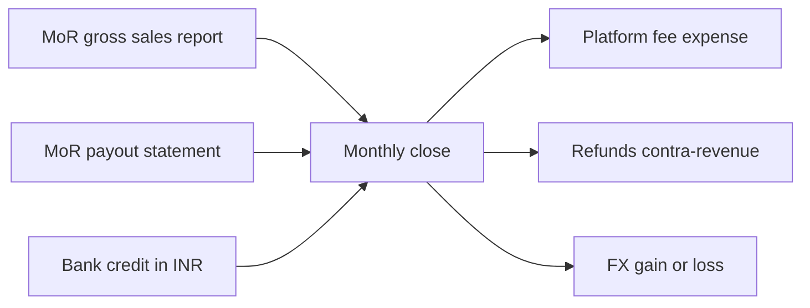

## 85. Business operations — the things nobody adds up

### 85.1 Accounting — the ledger, the deferred revenue, and the three numbers that never match

| Decision | Cost | Trigger point |
|---|---|---|
| Ledger: Zoho Books, Free plan | ₹0 | Free indefinitely while FY revenue ≤ ₹25 lakh [fetched, zoho.com/in/books/pricing, read 2026-08-30] |
| Upgrade to Standard | ₹899/mo, or ₹749/mo billed annually [fetched, same page] | The month FY revenue crosses ₹25 lakh — i.e. within one month of the first ₹2.1 lakh/mo run-rate |
| Upgrade to Professional | ₹1,799/mo, or ₹1,499/mo billed annually [fetched, same page] | The first non-INR payout. "Record multi-currency transactions" is listed only from Professional up [fetched] — Standard cannot hold a USD payout correctly |
| Revenue recognition method | ₹0 to decide, expensive to change | Before the first annual-plan sale |
| Statutory audit + ROC + tax filings (CA retainer) | ₹35,000–₹90,000/yr for a single-entity Pvt Ltd [SS — vendor quotes vary; get three written quotes, do not budget from this range] | Incorporation. A private limited company is audited regardless of turnover [inference — Companies Act 2013 s.139; mca.gov.in and indiacode.nic.in were both unreachable from this machine on 2026-08-30, so treat as verify-before-use] |

Annual plans are a liability before they are revenue. ₹2,499 collected on 1 November, at 18% GST inclusive, is ₹2,117.80 net of tax and ₹176.48 recognised per month [derived: 2499 ÷ 1.18 = 2117.80; ÷ 12 = 176.48]. At the 31 March close, five months are earned (₹882.40) and ₹1,235.40 sits in deferred revenue as a current liability. The ₹3,999 Work licence is ₹3,388.98 net, ₹282.42/month [derived: 3999 ÷ 1.18]. Every GST-inclusive INR price in the settled list loses 15.25% before it reaches the P&L: ₹299 → ₹253.39, ₹599 → ₹507.63 [derived].

Gross versus net is the one accounting choice with downstream teeth. Under a merchant-of-record the platform is the principal to the end user and we are its supplier, so revenue is the net payout, not the consumer price [inference]. Choosing net keeps reported turnover 5–9% lower, which delays GST-registration and audit thresholds; choosing gross inflates the top line you will later quote to investors and cannot quietly restate. Pick net, write the policy down, and never switch.

Reconciliation is three numbers that are never equal, and the close is the act of proving why.

The monthly close, in order: pull the MoR gross sales file; pull the payout statement; tie payout = gross − fees − refunds − platform-collected tax; tie bank credit = payout − conversion spread − bank charges; post the three differences to their own accounts; then roll deferred revenue forward by the schedule, not by a plug. Anti-recommendation: do not reconcile only bank-to-invoice. That ties two of the three numbers and hides fee drift and refund leakage entirely, which is exactly where an MoR relationship goes wrong.

GST has a trap specific to this structure. Sales routed through a non-Indian MoR paid in convertible foreign exchange are an export of services, zero-rated, and need a Letter of Undertaking on file [inference — IGST Act 2017 s.2(6) and s.16, CGST Rules r.96A; cbic.gov.in and cbic-gst.gov.in were unreachable on 2026-08-30, verify with the CA]. Sales where an Indian-domiciled MoR entity pays you in INR are a domestic supply at 18%. The same ₹299 subscriber can land in either bucket depending on which entity settles. Ask the MoR, in writing, which legal entity invoices you and in what currency, before the first rupee moves.

### 85.2 Insurance — what a ₹250 crore ceiling actually buys you

| Decision | Cost | Trigger point |
|---|---|---|
| Professional indemnity (tech E&O), ₹1–2 crore limit | Quote-only; no Indian insurer publishes a rate card | First signed B2B contract with a service-level or accuracy warranty |
| Cyber liability, ₹1–2 crore limit | Quote-only | First enterprise security questionnaire or DPA that demands a certificate of insurance |
| Cover for the DPDP penalty itself | Not purchasable | Never — see below |
| Directors' and officers' liability | Quote-only | First external investor or first non-founder director |

The ceiling is real and it is dated. The Schedule to the Digital Personal Data Protection Act, 2023 (read against s.33(1)), entry 1: breach of the obligation "to take reasonable security safeguards to prevent personal data breach under sub-section (5) of section 8" — penalty "may extend to two hundred and fifty crore rupees." Entry 2: failure to notify the Board and affected principals under s.8(6) — up to ₹200 crore. Entry 7, the residual: up to ₹50 crore [fetched, DPDP Act 2023 gazette PDF via meity.gov.in and prsindia.org, both byte-identical at 182,082 bytes, read 2026-08-30].

The ceiling is not the expected loss. Section 33(2) directs the Board to have regard to seven factors when setting the amount, including "(d) whether the person, as a result of the breach, has realised a gain or avoided any loss" and "(g) the likely impact of the imposition of the monetary penalty on the person" [fetched, same source]. A solo Pvt Ltd with ₹2.4 crore of annual revenue is not a ₹250 crore respondent. Budget for the proportionate penalty and the response cost, not the headline.

No policy will indemnify the headline anyway. Indian insurers do not publish cyber exclusions on their marketing pages — HDFC ERGO's commercial Cyber Security page lists benefits and a "What's Not Covered" tab whose content is not in the served HTML at all [fetched, hdfcergo.com/commercial-insurance/specialty-insurance-policy/cyber-security, read 2026-08-30]. Go Digit's Professional Indemnity page is a quote form asking for pincode, number of employees, industry category, sum insured and "Registered in India? Yes/No", with the cost section saying only that premium depends on business type, coverage and location [fetched, godigit.com/business-insurance/professional-indemnity-insurance, read 2026-08-30]. Availability at solo size: yes, the funnels accept a one-person company. Published price at solo size: no, and any figure quoted without a slip in hand is fiction.

Recommendation: buy a combined PI-plus-cyber tech package at a ₹1–2 crore limit when the first foreign B2B team signs a data-processing agreement, and read the exclusions clause on fines and penalties before signing. Anti-recommendation: do not buy at incorporation on the theory that the ₹250 crore ceiling makes it urgent. Cover priced against a ceiling you cannot insure is cover you are overpaying for; the money is better spent on the s.8(5) safeguards themselves, which are what the Board will actually assess.

### 85.3 FX exposure — INR prices, USD costs

Every material cost is USD-denominated. Cloudflare Workers Paid has a minimum charge of $5 USD per month per account [fetched, developers.cloudflare.com/workers/platform/pricing, page last updated Aug 28 2026, read 2026-08-30]. R2 standard storage is $0.015/GB-month, Class A $4.50/million, Class B $0.36/million, egress free [fetched, developers.cloudflare.com/r2/pricing, last updated Aug 7 2026]. Claude Sonnet 5 is $2/MTok input and $10/MTok output, now the standard price after the introductory period through August 31 2026; Opus 5 is $5/$25 [fetched, docs.claude.com pricing, read 2026-08-30]. Dodo Payments charges 4% + 15¢ on Indian domestic cards and UPI, 4% + 40¢ US domestic, +1.5% international, +0.5% for subscriptions [fetched, dodopayments.com/pricing, read 2026-08-30]. Apple's Developer Program is 99 USD per membership year [fetched, developer.apple.com/support/compare-memberships, read 2026-08-30].

Measured, from the ECB daily series: USD/INR was 82.69 on 2023-08-30 and 95.39 on 2026-08-28, a 15.36% move over three years; the trailing twelve-month range was 87.57–96.83, 10.57% peak to trough; annualised volatility 3.85% over three years and 5.24% over twelve months [measured — 765 daily observations pulled from api.frankfurter.app, computed here 2026-08-30].

The fixed-cent component is the part nobody prices. Dodo's 15¢ on a ₹299 charge was ₹12.40 at 82.69 and is ₹14.31 at 95.39 — 4.15% of the price then, 4.79% now, 64 basis points of margin surrendered to currency drift alone [derived]. All-in on ₹299: 4% + 15¢ + 0.5% subscription = ₹27.77, or 9.29% of gross. On ₹2,499: ₹115.77, or 4.63% [derived]. The annual plan is not a retention device, it is a 466-basis-point fee reduction.

| Revenue milestone | USD-denominated annual spend at 27–43% of revenue | 1σ annual FX swing at 5.24% | Observed 12m range effect at 10.57% |
|---|---|---|---|
| ₹1 lakh/mo (₹12L/yr) | ₹3.24L – ₹5.16L | ₹17k – ₹27k | ₹34k – ₹55k |
| ₹5 lakh/mo (₹60L/yr) | ₹16.2L – ₹25.8L | ₹85k – ₹1.35L | ₹1.71L – ₹2.73L |
| ₹20 lakh/mo (₹2.4cr/yr) | ₹64.8L – ₹1.03cr | ₹3.40L – ₹5.41L | ₹6.85L – ₹10.91L |

All [derived] from the settled 57–73% contribution margin and the measured volatility above.

Sensitivity in one line: a 1% rupee depreciation costs 27–43 basis points of contribution margin, permanently, because the INR price list is fixed and the cost stack is not.

Do not hedge. At ₹20 lakh a month the one-sigma swing is ₹3.4–5.4 lakh a year against a treasury operation that needs a bank forward facility, an underlying-exposure declaration under FEMA, and monthly mark-to-market bookkeeping [inference — rbi.org.in was reachable but the Master Directions index is JavaScript-rendered and did not yield the hedging paragraph; confirm the documentation threshold with the AD Category-I bank]. The price list is the hedge: review INR price points once a year against the trailing twelve-month average rate, and take the drift as a scheduled repricing rather than a derivative. Anti-recommendation: if a multi-year INR-fixed Work licence above ₹25 lakh is ever signed, that single contract does need either a forward or an explicit FX-reset clause, because a fixed three-year INR price against a 4.9%-per-year drift [derived: 15.36% over three years] gives away roughly a sixth of the contract's real value by the end.

### 85.4 App-store tax — and the one decision that matters more than the rate

| Store | Rate | Threshold / condition |
|---|---|---|
| Apple App Store, standard | 30% | Default |
| Apple Small Business Program | 15% | Proceeds ≤ $1M USD in the prior calendar year across all Associated Developer Accounts; new developers qualify; crossing $1M mid-year moves future sales to standard; re-qualify the year after falling below [fetched, developer.apple.com/app-store/small-business-program, read 2026-08-30] |
| Google Play, EEA/UK/US, from 30 June 2026 — auto-renewing subscriptions | 10% + 5% billing fee | Applies to both new and existing installs [fetched, support.google.com/googleplay/android-developer/answer/112622, read 2026-08-30] |
| Google Play, EEA/UK/US, other transactions | 20% + 5% (new installs) / 25% + 5% (existing installs), or 20% for external web links | "New install" = first install or first update on or after 30 June 2026 [fetched, same page] |
| Google Play, rest of world including India | 15% on the first $1M/yr, 30% above; subscriptions 15% regardless of revenue | Until the updated fees roll out globally [fetched, same page] |
| Google Play, India, alternative billing system | Applicable fee minus 4 percentage points | Offering an alternative billing alongside Play billing per the Payments policy [fetched, same page] |
| Mac app, Developer ID + notarization, distributed direct | $99 USD/yr, 0% commission | Notarization and Developer ID for Mac apps are included in the Apple Developer Program [fetched, developer.apple.com/support/compare-memberships, read 2026-08-30] |

A 15% cut on a ₹299 subscription is ₹44.85, which is 17.70% of the ₹253.39 GST-exclusive net and 27.2% of the ₹164.70 contribution at a 65% margin [derived]. That is the real number — the store takes a quarter to a third of the money that was going to fund the next feature.

Ship the Mac app outside the Mac App Store, signed with Developer ID and notarized. The cost is $99 a year and no commission, and for a file-is-the-source-of-truth editor the sandbox concessions the Mac App Store demands are actively hostile to the product. Anti-recommendation: outside-the-store distribution means you own the update channel, the crash reporting and the "unidentified developer" support burden — which lands in §85.6's ticket count, not in the commission line.

Do not ship iOS or Android at all until the founder time budget below has slack in it. The store tax is survivable; the mobile support surface is not.

### 85.5 Contractors — assignment, statutory thresholds, revocation

| Decision | Cost | Trigger point |
|---|---|---|
| Written contractor agreement with express IP assignment | ₹15,000–₹40,000 one-time for a lawyer-drafted template [SS — get quotes] | Before the first contractor writes a line |
| Appointment letter: scope, deliverables, rate, term, confidentiality, assignment, no-employment clause | ₹0 once the template exists | Every engagement, no exceptions |
| EPF registration | Employer contribution on covered wages | 20 or more persons employed [SS — EPF & MP Act 1952; epfindia.gov.in and labour.gov.in unreachable 2026-08-30; verify before the 15th hire] |
| ESI registration | Employer contribution on covered wages | 10 or more employees, wage ceiling ₹21,000/month [SS — ESI Act 1948; esic.gov.in unreachable 2026-08-30; verify before the 8th hire] |
| TDS on contractor invoices | Withholding, not a cost | Every invoice above threshold [SS — s.194J and s.194C rates and thresholds; incometaxindia.gov.in returned 403 and incometax.gov.in's rate page 404 on 2026-08-30; get the current chart from the CA] |

Indian copyright does not hand you a contractor's output. Employment and commission are treated differently from a plain services contract, and an assignment must be in writing and signed to be effective [inference — Copyright Act 1957 ss.17 and 19; copyright.gov.in and indiacode.nic.in were both unreachable on 2026-08-30, so this is verify-before-use, not fact]. Two consequences that are cheap to handle up front and expensive later: the assignment clause must name the work, the rights, the territory as worldwide and the term as the full term of copyright; and it must be signed before the work starts, not at invoice time.

Access revocation is a runbook with a clock, not a checklist with a vibe. Within four hours of the last working hour: remove from the GitHub organisation and audit their personal access tokens and deploy keys; remove from the Cloudflare account and revoke every API token they could have seen; rotate R2 access keys; rotate the Anthropic API key; remove from the Apple Developer team, which is the only credential that can ship a signed binary in your name; remove from the MoR dashboard; suspend the mail account and transfer ownership of its files; revoke the password-manager vault; rotate every CI and webhook secret they had read access to. Anything they merely had access to gets revoked; anything they could have read the value of gets rotated. Anti-recommendation: do not treat revocation as sufficient for shared secrets — a revoked seat does not un-see an API key that was pasted into a terminal three months ago.

### 85.6 The founder time budget, aggregate

Assumptions, stated so they can be argued with: 0.3 support tickets per paying user per month and 0.02 per free user, 12 minutes median handle time including reproduction, 20 free users per paying user at the settled 5% conversion, an 8% single-attempt failure rate on Indian monthly e-mandates with no retries available (the AFA waiver limit is ₹15,000 per transaction under RBI circular CO.DPSS.POLC.No.S-518/02.14.003/2022-23 dated 16 June 2022, which raised it from ₹5,000 [fetched, rbi.org.in notification Id=12341, read 2026-08-30]), a 50/50 monthly-annual mix, and 17 hours a month of fixed compliance and close work. A working month is 22 days at 9 hours = 198 hours.

| Paying users | Free users | Tickets/mo | Support h | Billing-ops h | Compliance h | Total h/mo | Working months |
|---|---|---|---|---|---|---|---|
| 100 | 2,000 | 70 | 14.0 | 2.5 | 17.0 | 33.5 | 0.17 |
| 1,000 | 20,000 | 700 | 140.0 | 6.5 | 17.0 | 163.5 | 0.83 |
| 10,000 | 200,000 | 7,000 | 1,400.0 | 47.0 | 17.0 | 1,464.0 | 7.39 |

All [derived] from the model above; the per-user coefficient is 0.1445 hours per paying user per month, or 8.67 minutes.

Solving for the wall: total hours = 0.1445P + 19, so a 198-hour month is fully consumed at P = 1,239 paying users, and half the month — the last point at which meaningful engineering still happens — is consumed at P = 554 [derived]. At a blended ₹220/month ARPU that is ₹1.22 lakh a month of revenue, roughly ₹79,000 of contribution at 65%, against a junior support engineer at ₹40,000 plus statutory overhead. The hire is affordable at the exact moment it becomes necessary, and only if the founder is drawing nothing.

**The plan runs out of founder long before it runs out of market: reaching the stated ₹20 lakh a month needs about 9,091 paying users, which is 1,333 hours a month of support, billing and compliance — 6.7 times a 198-hour working month — and the wall is crossed at roughly 1,240 paying users, not at 10,000.**

Deflection does not rescue it. Halving the ticket rate through better in-product errors and docs moves the wall from 1,239 to about 2,403 paying users [derived]. To run 9,091 users solo inside 198 hours the coefficient must fall from 8.67 minutes per user per month to 1.18 — a 7.3× reduction [derived]. That is not an engineering target, it is a fantasy.

The honest reading: the ₹20 lakh milestone is a two-to-three person milestone. Plan the first support hire at 550 paying users, the second at 1,500, and a part-time bookkeeper at the ₹25 lakh Zoho threshold. Anti-recommendation: do not respond to this by cutting the free tier to shrink the free-user ticket load. Free users generate 4 of every 7 tickets in this model but they are also the entire top of the funnel that produces the 5% conversion — cutting them cuts the ops bill and the revenue in the same stroke, and the ratio does not improve.
