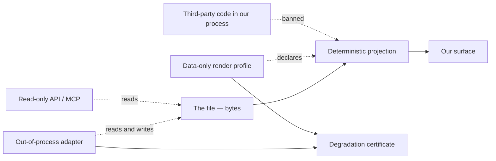

## 86. The plugin ban versus the community moat — an unexamined contradiction

### 86.1 The two positions, stated precisely

| # | Position | Where it lives | Status |
|---|---|---|---|
| A | Community and ecosystem is moat #1 — the one that holds for years and compounds | PRD moat ranking | Settled |
| B | No plugin marketplace; no arbitrary client-side code execution | PRD §546, §3234, banned-list | Settled |
| C | Third-party syntax plugins at runtime are excluded because an uncertified syntax cannot be certified | PRD §546 | Settled |
| D | The only compounding artefact available to us is "certificates and conformance cases contributed against the spec" | PRD §4698 `[inference]` | Settled, never tested |

Position D is the seam. It concedes that B forecloses the normal route to A, and then asserts a replacement without evidence. Nobody has checked whether the replacement is real. This section checks.

### 86.2 What the ban buys — measured

| Evidence | Value | Tag |
|---|---|---|
| Obsidian forum, top 104 tags, 31,048 tagged topics: plugin surface (`dataview` 3,502 + `custom-css` 1,933 + `templater` 741 + `plugin-release` 900) | 7,076 topics = **22.79%** | `[derived from measured]` |
| The two plugins that genuinely require code execution (`dataview` + `templater`) alone | 4,243 topics = **13.67%** of tagged topics | `[derived]` |
| The same two, as a share of the Obsidian active-install proxy (peak single-version downloads, sum 50,284,168) | 2,475,123 = **4.92%** | `[measured 2026-08-30]` |
| Support load per install, code-execution plugins vs ecosystem average | 13.67 ÷ 4.92 = **2.78×** | `[derived]` |
| `custom-css` alone (the "themes only" middle ground, if unsanitised) | 1,933 = **6.23%** of tagged topics | `[derived]` |
| VS Code wiki, *Performance Issues*: "High CPU consumption is often caused by an issue in an extension." | Extensions named the first suspect in the vendor's own triage doc | `[fetched, github.com/microsoft/vscode/wiki/Performance-Issues, 2026-08-30]` |
| VS Code shipped a bisect utility *specifically* to find bad extensions, motivated by "more than 28,000 extensions… not uncommon that users have 50 or more installed" | A whole diagnostic subsystem that exists only because of extensibility | `[fetched, code.visualstudio.com/blogs/2021/02/16/extension-bisect]` |
| Typora's most-requested feature is a plugin system (251 votes), against a product loved partly because it has none | Recorded as `[SS]` in §12 and **not** upgraded to fact here | `[SS]` |

The saving is real and it is a support-cost saving, not a security saving. On the internal deflection model, deleting the plugin class removes roughly a fifth of the inbound question volume of the closest analogue surface, and the two most code-heavy plugins carry 2.78× their weight in that volume. For a solo founder whose support capacity is one person, that is the single largest structural deflection available.

Anti-recommendation: do not quote 22.79% as "22.79% of *our* future tickets". It is a tag histogram from a different product with a different user base and a fifteen-year-old forum; it establishes the class exists and is large, not its size for us.

### 86.3 What the ban costs — the ecosystem, quantified

| Product | Ecosystem size | Read date | Tag |
|---|---|---|---|
| VS Code Marketplace | **135,646** extensions | 2026-08-30 | `[fetched, marketplace.visualstudio.com/_apis/public/gallery/extensionquery, TotalCount]` |
| VS Code, Feb 2021 | 28,000+ | — | `[fetched]` — 4.84× growth in 5.5 years `[derived]` |
| Obsidian community plugins | **7,119** registry entries; **717** themes | 2026-08-30 | `[measured, obsidianmd/obsidian-releases, parsed array length]` |
| Obsidian download stats | 7,085 plugins with stats; **143,261,570** cumulative downloads; peak-version sum 50,284,168 | 2026-08-30 | `[measured]` |
| Raycast | **3,235** extension directories, one open-source monorepo, PR-reviewed | 2026-08-30 | `[measured, GitHub git-trees API, truncated:false]` |
| Figma plugins | Launched **2019-08-01** | — | `[fetched, figma.com/blog/introducing-figma-plugins, datePublished]` |
| Figma Community | Launched **2019-10-22** | — | `[fetched]` |
| Figma, founded 2012, 13M users as of 2025 | Both surfaces postdate the company by seven years | — | `[fetched, encyclopedia summary — secondary]` |

No vendor in this set publishes revenue attributable to its ecosystem, so contribution cannot be quantified in money. What is quantifiable is **surface area and dependency**: VS Code's own blog calls extensions "the true power" of the product `[fetched]`; Raycast's ecosystem *is* its command surface; Obsidian's is 7,119 entries against a core the vendor keeps deliberately small. Figma is the outlier and the useful one — its community and its plugin API both arrived long after the product had won, which means for Figma the ecosystem was a *consequence* of the moat, not its cause `[inference]`.

### 86.4 Did any successful developer tool build a durable community without third-party extensibility?

| Tool | Community artefact | Third-party code in-process? | Verdict |
|---|---|---|---|
| Notion | Templates — data, shared as documents. API is server-side HTTP; the changelog's newest surface is agent sessions over tokens, still out-of-process | No | **Existence proof** `[fetched, developers.notion.com/page/changelog, 2026-08-30]` |
| Figma | Community files, then plugins three years later | Yes, since 2019 | Existence proof *for the first three years* `[fetched]` |
| Homebrew, Docker Hub | Formulae, images — declarative artefacts | No (out-of-process) | Existence proof, different category `[inference]` |
| Typora, iA Writer, Bear, Ulysses | None. Loyal users, no contribution surface | No | Product moat, **not** a community moat `[inference]` |
| VS Code, Vim, Emacs, Sublime, Obsidian, Logseq, Zed | Extensions | Yes | Every large editor community in the category |

The honest finding, and it is the one that hurts: **in the text-editor category specifically, there is no example of a durable community moat without third-party code extensibility.** The existence proofs — Notion, Homebrew, Figma-before-2019 — are all communities built around *data artefacts*, and none of them is an editor. So the ban does not merely inconvenience moat #1; on the available evidence it forecloses the only form of it the category has ever demonstrated, and leaves us betting on a form nobody in the category has demonstrated.

### 86.5 The concentration finding, which changes the shape of the problem

| Cut of the Obsidian ecosystem | Cumulative downloads | Active-install proxy (peak single version) |
|---|---|---|
| Top 10 plugins | 27.08% | 26.90% |
| Top 20 | **39.40%** | **35.00%** |
| Top 50 | 55.93% | 47.50% |
| Top 100 | 68.06% | 58.62% |
| Top 500 | 88.82% | 83.44% |
| Plugins whose best-ever single version never passed 1,000 downloads | — | **4,763 of 7,085 = 67.2%** |
| …never passed 100 | — | 1,823 = 25.7% |

`[measured, community-plugin-stats.json, 2026-08-30]`

Read the top 20 by active-install proxy and sort by what they actually are: `calendar` (5.82%), `dataview` (4.22%), `style-settings`, `kanban`, `remotely-save`, `icon-folder`, `table-editor`, `mind-map`, `periodic-notes`, `highlightr`, `pandoc`, `minimal-settings`, `tasknotes`, `advanced-slides`, `tag-wrangler`, `tasks`, `full-calendar`, `templater`, `better-word-count`, `banners` `[measured]`.

Eighteen of those twenty are a `render:` profile, a theme token, a core editor affordance, sync, or export — all of which the PRD already plans to ship in core `[inference]`. Two are code-execution engines by nature. Of those, Dataview has a declarative subset (the market leader's own answer, Bases, describes views in valid YAML `[measured, PRD §911]`), and Templater does not. **Templater's irreducible arbitrary-code share of the active-install proxy is 0.701%** `[measured]`.

So the ecosystem the ban forecloses is, by installs, mostly a roadmap — and 67.2% of it by count is software nobody installs.

Anti-recommendation: this argues that we can *absorb* the value, not that we can absorb it *quickly*. Eighteen features shipped by one founder against eighteen features shipped by eighteen independent authors in parallel is a throughput argument we lose. Concentration reduces the size of the debt; it does not reduce the delivery risk.

### 86.6 The middle grounds, scored against settled positions

| Option | Creates a third-party asset? | Arbitrary code in our process? | Survives the degradation certificate? | Coherent with settled? |
|---|---|---|---|---|
| Curated in-core request queue | No | No | Yes | Coherent, but it is a roadmap, not a moat — it compounds nothing outside our repo |
| **Data-only extension format** (`render:` profiles + declared views, no code) | **Yes** | No | **Yes** — a declarative profile is certifiable, which is exactly what §546 says a runtime syntax plugin is not | **Coherent** |
| User-authored SKILL.md automations (already planned) | Yes | No code, but *instructions* reach a model with write access | Yes, if every write is a splice under per-op consent | Coherent **only** with the gate; a shared SKILL.md is untrusted input to a privileged agent — the lethal-trifecta shape |
| Themes | Yes | Raw CSS is a network and exfiltration channel (`@import`, attribute-selector `url()`); a fixed token set is not | Yes (presentation only) | Coherent **as tokens**, incoherent as raw CSS — raw CSS re-imports the 6.23% `custom-css` support class `[derived]` |
| **Import/export adapter surface** | **Yes** | No — adapters run out-of-process on bytes | **Yes, and the certificate is the conformance test that makes third-party adapters acceptable at all** | **Coherent**, and it is the artefact §4698 already named |
| Read-only API / MCP server for third-party tools | Yes, outside us | No | Not applicable | Coherent, already planned for agent edits arriving as suggestions |

### 86.7 The security argument, and why it is load-bearing rather than decorative

Both incumbents state the problem in their own documentation, which removes the need to speculate.

- Obsidian: "Due to technical limitations, Obsidian cannot reliably restrict plugins to specific permissions or access levels… Community plugins can access files on your computer… connect to internet… install additional programs." Restricted Mode is on by default; the vendor runs automatic scanning for malware and code-quality issues, publishes a safety scorecard per plugin, and keeps manual review for popular, featured and flagged plugins `[fetched, help.obsidian.md/plugin-security, 2026-08-30]`.
- VS Code: "The extension host has the same permissions as VS Code itself… an extension can read and write files on your machine, make network requests, run external processes, and modify workspace settings." Since release 1.97 a publisher-trust dialog gates first install; the Marketplace signs every extension and the client verifies the signature `[fetched, code.visualstudio.com/docs/configure/extensions/extension-runtime-security and /extension-marketplace, 2026-08-30]`.

The decisive fact is not the risk, it is the **apparatus**: a scanner, a scorecard, a review queue, a signing pipeline, a trust dialog, a revocation path, a private-marketplace product. Two of the best-resourced tools in the category each staff a team for this. A solo Indian private limited company selling a Rs.299/month product cannot `[inference]`.

Zed proves a cheaper answer exists and also proves its limits: extensions compile to `wasm32-wasip2`, capabilities are enumerated (`process:exec`, `download_file`, `npm:install`) and a user can set `granted_extension_capabilities: []` to grant none `[fetched, zed docs, 2026-08-30]`. But Zed's extension surface is deliberately bounded to languages, themes, debuggers, icon themes, snippets and MCP servers `[fetched]` — none of which is "mutate the user's document". And that is the point that decides it for us: **our security boundary is not the process, it is the bytes.** A WASM sandbox protects the machine; it does nothing for the byte-preservation contract, because an extension that can write the document can break the contract from inside any sandbox. Sandboxing is the wrong tool for our threat model.

### 86.8 Verdict

**The ban stands, with one named exception: a data-only, no-code contribution surface — declarative `render:` profiles and out-of-process import/export adapters — published against the degradation certificate as its conformance test.**

What that means concretely: third parties may contribute a profile (a declared view over frontmatter and headings, in YAML, with no expressions, no conditionals, no function calls), an adapter (a binary or script that converts bytes and is scored by our certificate), a conformance case, and a theme expressed as a fixed token set. They may not contribute code that runs in our process, CSS we do not sanitise, or a syntax we cannot certify.

Anti-recommendation: do not present this as "we have a plugin story after all". It is not one. A declarative profile format is a smaller, slower, less generative surface than a plugin API, and it will produce dozens of artefacts where Obsidian produced 7,119. If the marketing needs an ecosystem number in year one, this exception will not supply it, and stretching it to supply one is how the no-code boundary gets breached.

### 86.9 The strongest argument against this verdict

Every durable community in the editor category runs on third-party code, and no declarative surface has ever produced one (§86.4). Worse, declarative surfaces do not stay declarative: Dataview shipped DQL and then shipped `dataviewjs`; Bases describes views in YAML and users are already asking for expressions `[inference from §911, measured]`. The predicted failure is therefore not "the exception is too small" — it is that the exception grows conditionals, then loops, then an escape hatch, and we arrive at a scripting language we did not design, cannot certify, and did not budget a security apparatus for. The clean version of this argument: we will pay the cost of extensibility eventually and get none of its compounding in the meantime, because we refused to design for it while we still had the choice.

The second-strongest: moat #1 may simply be misranked. If the real moat is byte-fidelity and the review loop, then this section's contradiction dissolves by demoting the community claim — which is a documentation fix, not a product one.

### 86.10 Evidence over 12 months that forces a change

| Signal | Threshold | Source | What it forces |
|---|---|---|---|
| "I need X and you won't build it" as a share of support volume | >15% of tickets, rolling quarter | Our own ticket tags | The in-core queue is not absorbing demand — widen the data-only format, or open a sanctioned adapter category |
| Users patching the app bundle or shipping an unsanctioned loader | >1,000 installs of any such artefact | GitHub, community channels | Users are routing around us; sanctioning and bounding beats pretending |
| Parity on the top-20-equivalent categories | any category not at parity within 2 releases of being queued | Our roadmap vs `community-plugin-stats.json` re-measured | Concentration argument (§86.5) has failed; we cannot outbuild an ecosystem alone |
| Declarative `render:` grammar acquires conditionals, loops or function calls | 3 constructs | Our own spec diff | We have built a language by accident — stop, or admit it and fund the apparatus |
| Signups attributable to community artefacts (profiles, adapters, certificates, themes) at month 12 | <5% of the 113,507 free signups the Rs.20L/mo model needs | Attribution in the acquisition funnel | Demote community from moat #1 rather than lifting the ban — the contradiction resolves on the other side |
| A comparable markdown editor ships a capability-listed WASM extension surface and records no data-loss incident in 12 months | 1 clean year | Their public incident record | The security cost estimate was wrong; re-open the process boundary question with a real precedent |
| A single malicious or data-destroying extension incident in Obsidian, VS Code or Zed touching file contents | 1 confirmed | Vendor advisory | Ban is reinforced; publish the incident as positioning, and do not gloat |

Anti-recommendation on the whole table: none of these thresholds should be evaluated by the person who wrote them from memory. Each is a query against a named artefact — our ticket tags, our spec diff, the funnel, the re-measured registry — and any number quoted from this section twelve months from now must be re-derived from that artefact first, because five of the seven rows describe data that does not exist yet.
