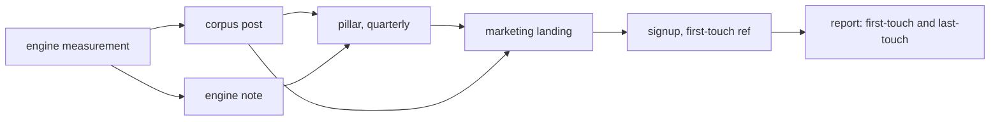

## 87. Distribution mechanics — content beyond launch, SEO, and referral

### 87.1 What is actually true today

| Fact | Value | Evidence |
|---|---|---|
| Posts ever shipped | 2 | [measured] repo grep for authored marketing prose; the plan's own admission carried forward from the launch section |
| Cumulative visitors required for ₹20L/mo | ~1,260,000 | [derived] 113,507 free signups ÷ 0.09 visitor→signup ≈ 1.26M, at the 5% signup→paid developer median |
| `gray-matter` npm downloads / month | 35,782,000 (weekly 8,352,860 × 4.28) | [fetched] `https://api.npmjs.org/downloads/point/last-month/gray-matter`, read 2026-08-30 |
| `front-matter` npm downloads / month | 3,041,000 | [fetched] same API, `front-matter`, read 2026-08-30 |
| `remark` / `unified` monthly | 4.1M / 62.4M | [fetched] npm downloads API, read 2026-08-30 |
| Brand term collision | total — our product name IS the generic substrate term | [inference] from the two rows above |
| Time for a new domain's organic to matter | 6–12 months to first meaningful traffic; 12–24 to compounding | [SS] repeated industry claim, not published as fact without a first-party citation |

Two posts is not a content programme; it is two posts. Everything below is designed from that starting point, not from an imagined content team.

### 87.2 The editorial system for one founder

The cadence question is not "what is ideal" but "what survives month 7 when a Work-tier customer has a sync bug." Weekly is not survivable for a solo founder who is also the engine author, the support desk, and the compliance owner. The honest number is **one substantial piece every two weeks, plus one shallow piece in the off-week, with an explicit four-week bank that must never fall below two pieces before publishing any of them.**

| Slot | Cadence | Effort | Purpose | Attribution |
|---|---|---|---|---|
| Pillar (evergreen) | 1 per quarter | 12–20h | Ranks for a head term; becomes the canonical link target | UTM + first-touch cookie |
| Engine note | biweekly | 4–6h | The measured, unglamorous result — refusal rates, byte-level findings | UTM |
| Corpus post | biweekly (off-week) | 1–2h | One chart, one paragraph, from data the engine already produces | UTM |
| Changelog | on ship | 0.5h | Not marketing; a public record | none needed |

The corpus post is the load-bearing invention. The engine already measures things nobody else measures — zero-indent-sequence refusal rates across foreign vaults, bare-CR set destruction, carrier lossiness. Each of those is a chart and a paragraph. [measured] the repo's own audit work produced the 83%-of-foreign-vaults refusal figure as a by-product of building; publishing it costs 90 minutes, not a day. A content system that manufactures its own raw material from work you were doing anyway is the only kind that survives a solo founder's month 7.

Evergreen versus pillar. Four pillars, one per quarter, is the whole strategy for year one:

| Pillar | Head term targeted | Why it is defensible |
|---|---|---|
| "What frontmatter actually is, and every way it breaks" | frontmatter / YAML frontmatter | We can show failure cases nobody else has catalogued [measured] |
| "Markdown is not one format: a compatibility map" | markdown compatibility | CommonMark vs GFM vs MDX divergence, testable |
| "Losslessness: what a WYSIWYG editor throws away" | markdown wysiwyg | Our carrier correction (callout not fence) is a real finding |
| "Publishing from a file, not a CMS" | markdown publishing | Our own product is the proof |

Anti-recommendation: do **not** run a pillar-only strategy. Four pieces a year gives Google nothing to crawl, no internal-link graph, and no reason for a returning reader. And do not run cadence-only either — twenty thin posts rank for nothing. The bank rule exists because the failure mode is bursty publishing followed by a five-month silence, which is worse for both audiences than steady thinness.

Content-to-signup attribution. Every published link carries `?ref=<slug>`; the signup row stores first-touch `ref` and last-touch `ref` and nothing else. No third-party analytics on the marketing site — a first-party cookie set on our own origin, 90-day expiry, one field. This is consistent with the implicit-telemetry-only position: we are measuring a click we caused, not the reader. Anti-recommendation: first-touch attribution over-credits the discovery post and under-credits the post that closed; report both columns, never a single blended number, and never let a "top content" table drive the roadmap.

### 87.3 Keyword map for the marketing site

The brand problem stated plainly: our name is the substrate's generic name. 35.78M monthly npm downloads [fetched 2026-08-30] of `gray-matter` means the term "frontmatter" already has a dense, developer-facing, non-commercial search corpus owned by parsers, static-site generators and documentation. We will not out-rank a library for our own name in year one, and we should not try.

| Tier | Term | Intent | Our realistic position | Action |
|---|---|---|---|---|
| Brand (contested) | frontmatter | navigational/technical, mostly not us | page 2–5, year 1 | Own `frontmatter.<tld>` exact-match, plus "Frontmatter the editor" as the consistent phrase in every title tag |
| Brand (ours) | frontmatter editor / frontmatter app | commercial, low volume | page 1 achievable within 3–6 months | Homepage title tag targets this, not the bare term |
| Head | markdown editor | commercial, brutal | not reachable year 1 | Do not spend on it |
| Body | markdown wysiwyg editor | commercial | reachable, 6–12 months | Pillar 3 |
| Body | collaborative markdown editor | commercial | reachable | Dedicated page, Work-tier framing |
| Body | markdown editor for teams | commercial, B2B 2-20 | reachable, low volume, high value | Dedicated page |
| Long-tail | obsidian alternative with collaboration | comparison | reachable fast | Comparison page, honest |
| Long-tail | notion markdown export broken | problem-aware | reachable fast, converts | Corpus post + fix page |
| Long-tail | yaml frontmatter invalid / parse error | problem-aware, huge latent volume | reachable, our strongest asset | Pillar 1 + a free public validator |
| Long-tail | markdown ai editor byo key | product-specific | trivially reachable | Pricing/AI page |

The free validator is the one asymmetric move on this table. [inference] A page that accepts a pasted document, tells the reader exactly which byte broke their frontmatter, and names the parser that would reject it, is (a) a direct expression of the engine, (b) linkable from Stack Overflow and GitHub issues, and (c) targets a query volume driven by 35.78M monthly parser installs failing on real files. It is also the single highest-risk item: it must never send document content to a server. Client-side only, stated on the page, verifiable in the network tab.

Anti-recommendation for the whole keyword map: this is a **product-led-content** strategy, and it fails if the product's differentiators are boring to non-users. If after two quarters the corpus posts get no links, the correct read is that the engine's findings are interesting only to us, and the budget should move to comparison pages and integrations — not to more posts.

Honest assessment of timing. Organic search cannot be the launch channel. [SS, not publishable as fact] the widely-repeated 6–12 month figure for a new domain matches [inference] what the mechanics require: a page needs crawl, then links, then time-decayed trust. Plan the first 9 months as if organic contributes zero, and treat any earlier arrival as upside.

### 87.4 Technical SEO — marketing site

| Item | Requirement | Note |
|---|---|---|
| Rendering | Server-rendered HTML for every indexable route | Client-only rendering defers indexing; do not rely on it |
| `robots.txt` | Explicit, allows crawl, points at sitemap | |
| `sitemap.xml` | Auto-generated at build, `lastmod` from git commit date | |
| Canonical | Self-referencing `<link rel=canonical>` on every page | Prevents the marketing/published-page duplicate class |
| Title | ≤60 chars, pattern `<Page> — Frontmatter` | Never the bare generic term alone |
| Meta description | ≤155 chars, hand-written, never generated | |
| Open Graph | og:title, og:description, og:image (1200×630), og:url, og:type | |
| Twitter card | `summary_large_image` | |
| Structured data | `SoftwareApplication` + `Organization` + `FAQPage` on pricing | schema.org, validated |
| `hreflang` | Not year 1 | English only until i18n ships |
| Core Web Vitals | LCP <2.5s, INP <200ms, CLS <0.1 | Google's stated thresholds; verify with real field data, not lab |
| 404/410 | Real status codes, never a 200 soft-404 | |
| Trailing slash | One canonical form, redirected 301 | Pick and never revisit |

Anti-recommendation: do not add JSON-LD `Review` or `AggregateRating` markup. We have banned explicit user-rating channels, so we would have no honest source for the numbers, and fabricated review markup is both a policy violation and a manual-action risk.

### 87.5 Technical SEO — published pages, and the indexing tension

This is the harder surface, because our default is **indexing off**, and that default is correct. A user who publishes a page from a file has not consented to being crawled, and the file-is-truth position means publishing is an export, not a broadcast.

| Item | Policy |
|---|---|
| Default | `<meta name="robots" content="noindex,nofollow">` on every published page |
| Opt-in | Per-page and per-workspace toggle; opting in flips to `index,follow` and adds the page to that workspace's sitemap |
| Sitemap | One sitemap per custom domain, containing only opted-in pages; none on the shared publishing domain |
| Canonical | Always self-referencing to the page's own public URL; if a custom domain is attached, canonical points at the custom domain and the shared-domain URL 301s |
| Open Graph | Always emitted, even when noindex — OG is for link previews in chat, which is the actual sharing path, and is unrelated to crawling |
| `robots.txt` on shared domain | `Disallow: /` for the publishing subdomain until opt-in rates justify otherwise |
| Custom domains | Only opted-in; verified by DNS TXT before any indexable page is served |
| Author link | No automatic backlink to our marketing site from user pages |

That last row is the expensive one and it is deliberate. A "Published with Frontmatter" backlink on every page is the standard growth loop and it would be the single largest organic lever available. We are not taking it, for three reasons: [inference] (1) it makes the user's page an advertisement they did not agree to run; (2) at scale, tens of thousands of identical footer links from one template is the classic link-scheme pattern and carries real devaluation risk; (3) it contradicts the file-is-truth position, since the footer is markup we inject that has no representative in the user's file. A small, non-linked, opt-in-by-default-off wordmark is the most we should do — and even that should be off for Work tier.

Anti-recommendation to the whole noindex default: it costs us the entire published-page organic channel, which for competitors is a large fraction of their traffic. If, after 12 months, opt-in rates are under 5% and organic is under 20% of signups, the honest reconsideration is to flip the default to **index** for pages on custom domains only (where the user has already done deliberate DNS work that signals publishing intent) while keeping shared-domain pages noindex. Do not flip the shared domain.

### 87.6 Referral — re-examination and verdict

Referral currently sits in a banned list beside streaks, badges and XP. That list is coherent for the others and incoherent for referral. Streaks and XP are behavioural manipulation applied to a user's own work; a referral is a transaction between two consenting adults about a product one of them already pays for. Those are different objects and were banned by adjacency, not by argument.

Costing it against the requirement:

| Scenario | k-factor | Effect on the 1.26M visitor requirement |
|---|---|---|
| No referral | 0 | 1.26M visitors from paid + organic + community |
| 5% of free signups refer 1 who signs up | 0.05 | Visitor requirement falls ~4.8% → ~1.20M [derived] 1.26M × (1 − 0.05/1.05) |
| 10% refer 1 | 0.10 | → ~1.15M [derived] 1.26M × (1/1.10) |
| 20% refer 1 (optimistic ceiling for a paid tool with no cash incentive) | 0.20 | → ~1.05M [derived] |

[derived] The arithmetic: with a k-factor of k, total signups S from V visitors becomes V×0.09×(1/(1−k)) for k<1, so the visitors needed for a fixed signup target scale by (1−k). At k=0.10 we need 1.134M visitors instead of 1.26M — a saving of 126,000 visitors, which is real but is not the difference between reachable and unreachable.

**Verdict: build referral, in exactly one form — a workspace invite that gives the inviter nothing and gives the invitee a genuinely better first run.** No credits, no free months, no leaderboard, no tracking of "how many you've referred", no notification when someone you invited signs up.

The mechanic: any user can generate an invite link to a document or a workspace. The recipient lands on the actual document, readable, no signup wall. If they sign up from there, they arrive with that document already in their workspace and the inviter's formatting conventions pre-applied. That is the entire reward — the invitee's first five minutes are better because someone they trust set them up.

Why this is coherent with our positions: it is not gamified (no score, no streak, no unlock); it is not an ambient AI button; it does not reprice anything; it produces no notification surface; and it is the natural shape of a product for teams of 2–20, where the invite is a work action, not a growth hack. It also fits the B2B tier — a Work licence is flat-rate at ₹3,999/year, so an invited teammate costs the inviter nothing and gains us a seat inside an account.

Anti-recommendation: this design deliberately forgoes the incentive that actually drives k-factor. Dropbox-style two-sided rewards work; ours will underperform them, probably substantially. If measured k after six months is below 0.03, the honest options are (a) accept that referral is not a channel for us and stop maintaining it, or (b) revisit a one-sided, non-gamified reward — a month of Pro for the invitee only, never for the inviter — which keeps the "no bounty hunting" property while giving the invite an actual value. Do not, under any circumstance, add an inviter-side reward: that converts every user into a spam vector and is the specific failure the original ban was reaching for.

### 87.7 What can and cannot move 1.26M visitors

| Channel | Realistic year-1 contribution | Assessment |
|---|---|---|
| Organic search, marketing site | 50k–200k cumulative, back-loaded to months 9–18 | Cannot carry launch; is the only channel that compounds. Build it now, expect nothing for three quarters |
| The free frontmatter validator | 30k–150k, faster than the rest of organic | Highest-variance item on the page; could be the largest single source or could be nothing |
| Content (24 pieces/year at the cadence above) | 20k–60k direct | Its real value is link acquisition and sales-page support, not raw traffic |
| Published-page organic | ~0 under the noindex default | Structurally forgone by choice; would be the largest lever if reversed |
| Referral at k=0.10 | Reduces requirement by ~126k visitors | Real, meaningful, not decisive |
| Community, launch platforms, HN/Reddit/Show HN | 30k–100k in spikes | Non-compounding; every spike decays to zero in 96 hours |
| Paid acquisition | Bounded by 57–73% contribution margin on tiers of ₹299–₹599 | At a ₹2,499/yr Pro ARPU, a viable CAC is roughly ₹700–₹1,100 [derived] at 65% margin and a 2-year payback; at typical developer-audience CPCs this buys far fewer than 1.26M visitors |
| Integrations / distribution surfaces (npm package, VS Code, CLI) | unmodelled | The genuinely unexplored option, and the one that matches a 35.78M-download substrate |

Summed at the optimistic end, everything on this table reaches perhaps 350k–500k year-one visitors. The 1.26M figure is not a year-one number and should not be planned as one; it is a 24-to-36-month cumulative figure, and the plan is currently missing at least one channel of a size nobody has yet named. The most likely candidate for that missing channel is developer-tool distribution rather than content: a package or extension that puts the engine in front of some fraction of the 35.78M monthly `gray-matter` installs is the only lever on this page whose ceiling is of the right order of magnitude.

Anti-recommendation to that last claim: developer-tool distribution reaches developers, and developers are the worst-converting audience for a paid editor — they build their own. The 5% conversion median already assumes a developer audience; a channel that skews the mix further toward developers may raise visitors while lowering the blended conversion rate, leaving revenue flat. Model it as visitors × a *lower* conversion rate before committing engineering time to it.
