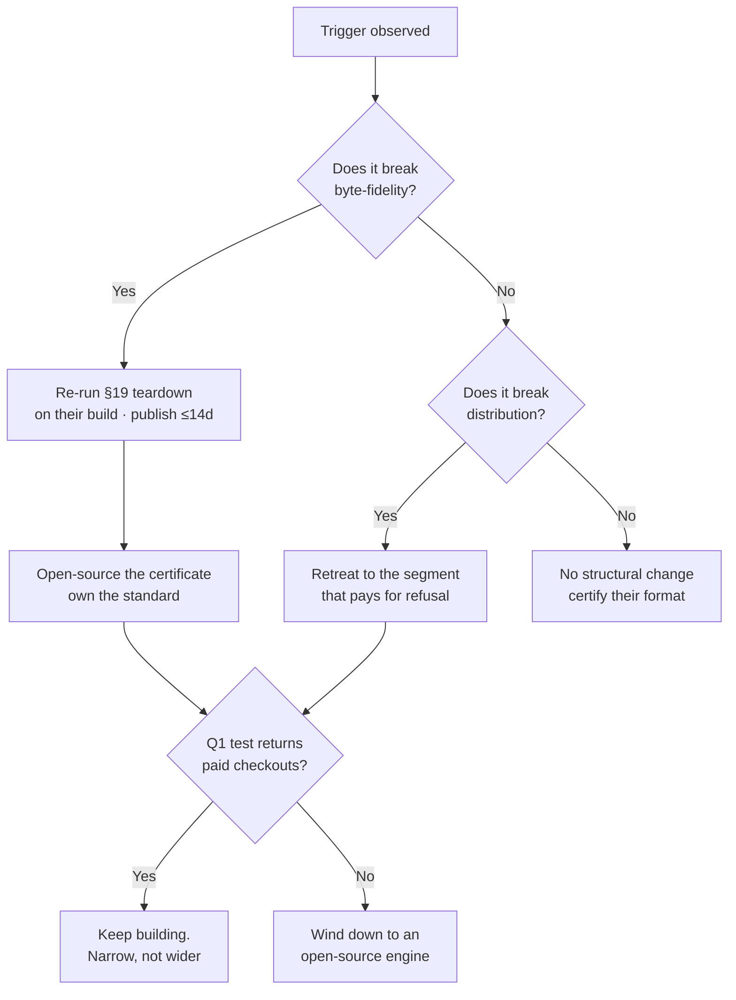

## 88. The competitive war-game

### 88.1 What the incumbents actually shipped — every source opened 2026-08-31

| Party | Source opened | HTTP | What actually shipped, last ~12 months | What is *not* on the list |
|---|---|---|---|---|
| **Obsidian** | `obsidian.md/roadmap/` · `obsidian.md/pricing` · `obsidian.md/changelog/` | 200 | Roadmap board reads **3 Active · 7 Planned · 46 Launched** `[measured on the fetched page]`. Launched includes Bases (+ Bases API, Map/List/Group views, Bases search), Obsidian CLI, headless Sync client, Notion import, CSV→Markdown import, Keychain, mobile UI refresh `[fetched]` | **Zero** roadmap items naming fidelity, byte-exactness, round-trip, or conflict review. `Multiplayer` sits in **Planned**, not Active `[fetched]` |
| **Obsidian Sync** | `raw.githubusercontent.com/obsidianmd/obsidian-help/master/en/Obsidian Sync/Troubleshoot Obsidian Sync.md` | 200 | A **Conflict resolution** setting with two modes — *Automatically merge* (default) and *Create conflict file*. Doc commit **2025-11-28**, "Adds conflict resolution changes"; a follow-up **2026-03-26** "Fix conflict file naming pattern (#1057)" `[fetched, GitHub API]` | Their own doc concedes auto-merge "may sometimes create duplicate text or formatting problems. You will need to fix these manually", and names **Google diff-match-patch** as the algorithm `[fetched]` |
| **Notion** | `notion.com/releases` (`__NEXT_DATA__`) · `notion.com/pricing` · `notion.com/help/export-your-content` | 200 | **10 of the 10** most recent releases, 2026-07-08 → 2026-08-28, are agent/AI/model features — agent edit suggestions, Developer Portal, model selection, Notion Workers, Agents iOS app `[measured]` | Export doc still says **"Callout blocks will be exported as HTML, as there is no Markdown equivalent"** and databases leave as CSV inside a zip `[fetched]`. **Nothing about files on disk** |
| **GitHub** | `github.blog/changelog/feed/` · `/changelog/2026/08/` · GitHub docs source on `raw.githubusercontent.com` | 200 | Latest 10 changelog entries (2026-08-26 → 2026-08-28): 6 Copilot, 4 governance/issues `[measured]`. `github.dev` doc still marked **public preview**, work "saved in the browser's local storage until you commit it" `[fetched]` | No markdown-editor, wiki, or writing-surface entry surfaced in the 2026 or 2025 changelog index under `markdown`/`editor`/`writing` `[measured]` |
| **Anthropic** | `docs.claude.com/en/docs/build-with-claude/files` · `/en/release-notes/claude-apps` | 200 | Files API is **upload-by-`file_id`, workspace-scoped storage** — "Uploaded files are accessible to your entire workspace, not scoped to an end user, conversation, or session" `[fetched]`. Help index lists *Create and edit files with Claude*, Skills, Cowork, Claude Design `[fetched]` | The unit is a **stored blob keyed by id**, not a path in a user-owned tree |
| **OpenAI** | `help.openai.com/…/chatgpt-release-notes` · `openai.com/news/` · `openai.com/index/introducing-canvas/` · `chatgpt.com/release-notes` | **403 · 403 · 403 · 403** | `platform.openai.com/docs/changelog` returned 200 but rendered no parseable dated entries `[measured]` | Canvas removal ~2026-05-28, replaced by in-thread writing blocks, is **`[SS]` — every OpenAI primary source refused with 403.** Do not upgrade it |

**The single most load-bearing thing on this table: Obsidian already shipped a conflict-review escape hatch, and it is free with a $4/month add-on.** `obsidian.md/pricing`, read 2026-08-31: Sync **$4** USD/user/month billed annually ($5 monthly), Publish **$8**/site/month annually ($10 monthly), Catalyst **$25** one-time, Commercial **$50**/user/year `[fetched]`. Notion, same day: Free **$0**, Plus **$10**/member/month, Business **$20**/member/month `[fetched]`.

USD→INR **95.39** on 2026-08-28 `[fetched, api.frankfurter.app]`. So ₹299 = **$3.13** and ₹599 = **$6.28** `[derived: 299 ÷ 95.39; 599 ÷ 95.39]`. **Our entry tier is priced 22% *below* Obsidian Sync** `[derived: (4.00 − 3.13) ÷ 4.00]`. The pricing page cannot claim a category-level price advantage; it is a rounding difference.

---

### 88.2 Scenario A — Obsidian ships byte-exact sync with conflict review

| | |
|---|---|
| **Trigger** | A roadmap item named `Multiplayer` moves Planned→Active, **or** a changelog line pairs "Sync" with "merge"/"conflict"/"three-way", **or** the *Create conflict file* mode becomes the default |
| **Prior work already done** | The hard half. The setting exists since the **2025-11-28** doc commit; a naming-pattern fix landed **2026-03-26** — this is a maintained surface, not an experiment `[fetched]` |
| **Lead time** | **6–12 months from trigger to parity**, and the trigger may lag the ship. Obsidian went 1.9.x → **1.13.8** in roughly the nine months since that doc commit `[fetched, changelog]` — four minor lines. They ship fast |
| **What breaks** | Moat #2 at its centre. §31's whole case is that git's three-way merge refuses where diff-match-patch guesses; if Obsidian swaps the algorithm, our conflict story becomes *a better UI on the same idea*. §27 dates moat #2 at 18–36 months — **this scenario is the specific event that collapses it to under 12** |
| **First 30 days** | (1) Ship the corpus diff publicly against *their new build*, re-running the §19 teardown protocol — the one asset we own that they cannot borrow is the executed measurement. (2) Retire "conflicts you can review" from the pitch; it is now table stakes. (3) Promote the **degradation certificate** (moat #3) to the headline, because it is the claim their architecture still cannot make. (4) Re-run Q1 against the new landscape before spending another point on T0 |
| **Founder-credible?** | **Yes — because the response is measurement and repositioning, not engineering.** Re-running a teardown against a shipped build is days of work. What is *not* credible is out-shipping them on sync itself: they have a paid sync product, a server fleet, mobile clients on both stores, and an installed base |

---

### 88.3 Scenario B — Notion or Coda makes markdown files on disk the store of record

| | |
|---|---|
| **Trigger** | A release note pairing "local" or "folder" with "sync", or a filesystem permission prompt in the desktop app |
| **Lead time** | **18–36 months, and the honest base rate is that it never happens.** Ten consecutive releases are agent features `[measured]`. Their export still cannot represent a callout in markdown `[fetched]` — the loss is in the *block model*, not the exporter, and reversing it means rewriting the database engine that is the product |
| **What breaks** | Less than intuition suggests. §3.1 already concedes their view *is* the data. If they moved, the loss would be **positional, not technical**: the sentence "your notes are files you own" stops being a differentiator and becomes a checkbox. Moat #6 (file-native, already marked non-exclusive) goes to zero |
| **First 30 days** | Do nothing structural. Read their file format and **publish a certification of it** — the moment Notion emits markdown on disk it becomes a *target* for the degradation certificate, and the biggest possible corpus arrives for free. This scenario grows the market we sell into |
| **Founder-credible?** | **Yes, and it is the least dangerous scenario on this list.** A partial move — files as a *mirror*, not a source of truth — is more likely than a full one and is strictly good for us. Guard against one failure mode: rebuilding the pitch around "unlike Notion" when Notion has changed underneath it |

---

### 88.4 Scenario C — GitHub ships a real editor over repo markdown

| | |
|---|---|
| **Trigger** | `github.dev` leaving public preview with a prose mode, or a changelog entry pairing "markdown" with "editor" |
| **Lead time** | **12–24 months.** They own the substrate, the auth, and the distribution — but `github.dev` has been in **public preview** long enough for the doc to still say so on 2026-08-31 `[fetched]`, and its own doc admits work lives in browser local storage until commit — a code-review affordance, not a writing surface. Their entire recent changelog is Copilot and governance `[measured]` |
| **What breaks** | **T1's GitHub App is the piece at risk, not the engine.** If GitHub ships a good editor over repo markdown, our GitHub-backed lane loses its reason to exist for developers — who are precisely the segment most likely to believe a fidelity claim. Distribution risk (§50.2, 4×5) fires with it, because GitHub *is* the distribution |
| **First 30 days** | (1) Verify whether their editor round-trips. Every editor framework in §19 is lossy by construction, and a GitHub prose editor built on ProseMirror or Lexical inherits that — **run the teardown, publish the result within 14 days**. (2) If it *is* lossy, this is a gift: the largest markdown corpus on earth now has a named fidelity problem. (3) If it is byte-exact, retreat from the developer lane to the segments where the vault is not a repo — research, §22 |
| **Founder-credible?** | **Partly.** The teardown is credible. Competing with GitHub for developer mindshare is not, and any plan that reads "we out-execute GitHub on the repo surface" is fantasy. The credible move is a segment retreat, and it must be pre-decided — it is not a decision to make in week one of a panic |

---

### 88.5 Scenario D — Anthropic or OpenAI ships a filesystem-backed document surface

| | |
|---|---|
| **Trigger** | A first-party surface that writes to a **user-owned path** rather than a vendor blob store |
| **Where they actually are** | Anthropic's Files API is explicitly workspace-scoped storage keyed by `file_id`, with the doc warning that any workspace key can read any workspace file `[fetched]`. That is a blob store, not a filesystem. **Claude Code is the counter-example and it already exists** — it writes real files on a real disk `[inference]` |
| **Lead time** | **3–9 months. The shortest fuse on this list.** The capability is shipped; only the packaging is missing. OpenAI's direction is unverifiable here — four primary sources returned **403** `[measured]` |
| **What breaks** | Moat #4 (provenance) first: a first-party surface writes its own attribution and ours becomes redundant metadata. Then §11's AI layer, then the §12 capture loop. **The engine survives** — a model writing markdown produces exactly the constructs our engine certifies |
| **First 30 days** | (1) Stop building anything a model vendor could ship as a feature; that is the whole of §11 and §12. (2) Reposition as the **verification layer under** their output — §3.3's declared structural hedge, now activated. (3) Ship the certificate as an MCP tool their surface can call, which converts a competitor into a distribution channel |
| **Founder-credible?** | **Yes — this is the one scenario the plan pre-committed to.** §3.3 already says "if 'delegate, don't edit' wins, the durable asset is the verification layer, not editor chrome." The response is a roadmap deletion, and deletions are the one move a solo founder executes faster than a team. **The failure mode is refusing to make the deletion**, not being unable to |

---

### 88.6 Scenario E — a funded startup ships the same thesis with eight people

| | |
|---|---|
| **Trigger** | A launch pairing "byte-exact", "lossless", or "never rewrites your file" with markdown. **No such company was found** — one search returned no named target `[SS]`, so this is a hypothesis, not an observation |
| **How buildable is our moat?** | Uncomfortably. `yaml` does **202,359,392** downloads/week and preserves comments; `@lezer/markdown` does **4,789,610**; `gray-matter` does **8,940,668** — `yaml` outruns `gray-matter` by **22.63×** `[fetched, api.npmjs.org, week 2026-08-23→08-29; derived: 202,359,392 ÷ 8,940,668]`. **Every dependency our engine needs is free, popular, and maintained.** §27 already concedes the work is "hard but finite and increasingly LLM-assistable" |
| **Lead time** | **6–9 months to feature parity; 0 months on the claim.** They can *say* byte-exact on day one. §68 exists in this record precisely because saying it and proving it are different |
| **What breaks** | Moat #2 and #3 simultaneously — and #3 is worse, because §27 says the certificate has **"zero defensibility if the certificate is not independently checkable"**, and a funded team can publish a checkable one faster than we can. Moat #1 (community) is the intended counter and **it does not exist yet** |
| **First 30 days** | (1) Run their build through the §19 protocol and publish. A funded team ships a claim; we ship a measurement, and eight people do not make a lossy architecture lossless. (2) **Open-source the certificate format immediately** — if commoditisation is coming, own the standard rather than lose the exclusive. (3) Compete on the corpus, not the feature: 8,513 pinned files and an 83% foreign-refusal number are evidence they must reproduce, not copy |
| **Founder-credible?** | **The measurement response is credible. Everything else is not.** Eight people out-ship one person on surface area, always. The only survivable position is being *narrower and more provably correct*, and that requires the discipline to not chase their feature list — which is the hardest thing on this page to actually do |

---

### 88.7 Scenario F — nobody moves, and the category never forms

**This is the highest-probability scenario on the page and the only one with no opponent to blame.** §50.2 already carries it as a 4×5 risk: *"Byte-fidelity may be a claim no buyer prices."* §66 makes it Q1 — *does anyone pay for fidelity?* — and the record's own verdict is that **"answering Q1 wrong is the only one of the three that cannot be recovered by working harder"** `[fetched, §66 L12704]`.

| | |
|---|---|
| **Trigger** | The absence of one. Demo engagement without conversion; a priced page with traffic and no checkouts; 60 days of zero organic signups (§50.2's own early warning) |
| **Lead time** | **R0 is ~9 weeks and everything downstream assumes yes** `[fetched, §28]`. Every week spent on T0–T3 before Q1 is answered is a week wagered on an untested premise |
| **The strongest evidence against us, opened today** | Obsidian's fidelity problem is **known, documented by Obsidian itself, and priced at zero**. Forum topic 94732 — "Obsidian Sync incorrectly duplicates sections of files", created 2025-01-12, **105 posts, 4,347 views**, last post 2026-05-26 `[fetched, forum.obsidian.md, read 2026-08-31]`. Four thousand views over nineteen months is a real problem that **did not produce a market**. Obsidian's answer was a free checkbox in a $4/month add-on, and the thread went quiet |
| **The strongest evidence for us** | That Obsidian *built the checkbox at all*, and then fixed its naming pattern four months later `[fetched]`. Companies do not maintain features nobody uses. But "users want conflict control" is a weaker claim than "users pay a second subscription for conflict control" |
| **First 30 days** | Exactly what §66 prescribes and nothing else: **a priced landing page carrying the corpus result and a real checkout, run against HN and r/ObsidianMD, before R0 finishes.** Cost: days. Success condition stated in advance, in writing, before the page goes up |
| **Founder-credible?** | **Yes — it is the cheapest scenario to test and the only one currently untested.** The fantasy is not the response; the fantasy is the belief that finishing R0 first makes the answer more likely to be yes |

---

### 88.8 The moat matrix

SURVIVES = still true and still scarce after the move. ERODES = still true, no longer scarce. GONE = no longer a reason to choose us.

| # | Moat (§27 rank) | A · Obsidian sync | B · Notion files | C · GitHub editor | D · Model vendor | E · Funded rival | F · Nobody moves |
|---|---|---|---|---|---|---|---|
| 1 | **Community / ecosystem** | GONE — theirs is built, ours is not | SURVIVES — different audience | ERODES — GitHub *is* the developer community | SURVIVES — orthogonal | ERODES — funding buys presence, not loyalty | **GONE — a community needs a reason to gather** |
| 2 | **Byte-fidelity engine** | **ERODES** — same guarantee, from a vendor with a sync fleet | SURVIVES — blocks stay lossy | ERODES only if their editor round-trips; **run the teardown before assuming** | SURVIVES — models generate the constructs we certify | **ERODES** — every dependency is free (`yaml` at 202M/wk) | ERODES — a moat nobody values is scenery |
| 3 | **Degradation certificate** | SURVIVES — architecturally out of their reach | SURVIVES | SURVIVES | SURVIVES — becomes *more* valuable | **GONE unless we open it first** — §27: zero defensibility if not independently checkable | ERODES — correct and unsold |
| 4 | **Provenance / byte attribution** | ERODES | SURVIVES | ERODES | **GONE** — first-party attribution beats third-party | ERODES | ERODES |
| 5 | **Brand** | ERODES — "frontmatter" is the substrate's generic name | SURVIVES | ERODES | SURVIVES | ERODES | GONE |
| 6 | **File-native / no lock-in** | GONE — already theirs | **GONE** | GONE | ERODES | GONE | GONE — never was exclusive |
| 7 | **Switching cost** | GONE | GONE | GONE | GONE | GONE | GONE — §27 calls it the anti-moat, by design |

**Read the rows, not the cells.** Moat #7 is GONE in all six columns because it was never a moat. Moat #6 is GONE or ERODES in all six. Moat #3 survives five of six and dies only in the scenario where we fail to give it away — **which makes open-sourcing the certificate format the single highest-leverage defensive act available, and it costs nothing but the exclusive we were never going to keep.** Moat #2 — the thing the entire R0 lane is built to produce — **survives outright in only two of six columns.**

Every green cell in row 1 depends on a community that §27 records as not existing. **A moat that only holds while the incumbent is asleep is scheduling, not defensibility**, and rows 2, 4, 5 and 6 are scheduling.

---

### 88.9 The decision tree

---

### 88.10 What to instrument before any of this fires

| Signal | Source, checkable weekly | Fires which scenario |
|---|---|---|
| `Multiplayer` moves Planned→Active on `obsidian.md/roadmap/` | fetched today at 3 Active / 7 Planned / 46 Launched `[measured]` | A |
| Obsidian changelog line pairing Sync with merge/conflict/three-way | `obsidian.md/changelog/` | A |
| Commit touching `en/Obsidian Sync/Troubleshoot Obsidian Sync.md` | GitHub API, last change 2026-05-13 `[fetched]` | A |
| A Notion release naming "local", "folder" or "disk" | `notion.com/releases` `__NEXT_DATA__` — 10/10 recent are AI `[measured]` | B |
| `github.dev` doc losing "public preview" | GitHub docs source on `raw.githubusercontent.com` `[fetched]` | C |
| An Anthropic or OpenAI surface writing a **user-owned path** | Anthropic's Files API is workspace-blob today `[fetched]`; **OpenAI is unobservable by curl — all four sources 403** `[measured]` | D |
| Any launch pairing "byte-exact"/"lossless" with markdown | none found `[SS]` | E |
| **Zero paid checkouts on the Q1 page after 60 days** | our own funnel — **does not exist yet** | **F** |

**Seven of the eight signals watch someone else. The eighth is the only one that decides whether the other seven matter, and it is the one not yet instrumented.** Scenarios A through E are recoverable by publishing a measurement or deleting a roadmap lane — both of which one founder can do in under a fortnight. Scenario F is not recoverable at all, it is the most likely, and the test costs days. **Run Q1 before R0 closes.**
