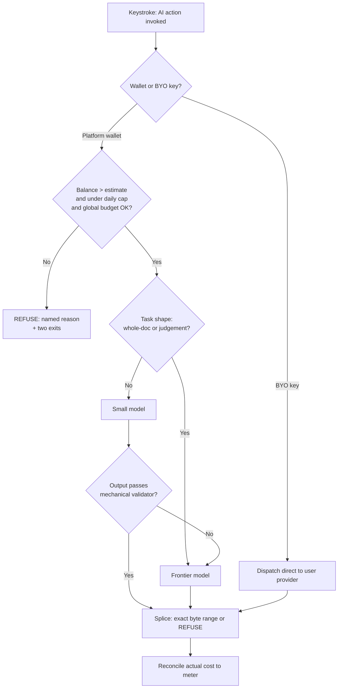

## 90. The AI resource problem — what we can actually afford to give away

### 90.0 The one-line finding

The AI layer is the headline of this product and its unit economics are undefined. Across the record, "ai credit" appears twice, "token budget" zero times, "cost per user" zero times [measured, grep over `docs/FRONTMATTER-RECORD.md`, 2026-08-31]. Two founders with a very limited budget are about to promise AI features to a free tier. Below is the arithmetic that decides whether that is a feature or a funding round we do not have.

**Recommendation, stated first:** ship **hybrid — BYO key as the default and the only way to get unlimited, plus a small platform-funded allowance metered in rupees, not requests**. Free tier gets **₹0 of platform AI**: it gets the full engine and BYO-key AI. Paid tiers get a hard-capped monthly AI wallet (₹25 at 299, ₹60 at 599) that degrades to BYO/refusal at zero. No overage billing, ever.

---

### 90.1 What an AI action actually costs

I attempted the provider pricing pages with `curl` on **2026-08-31**. What I could and could not read is itemised — an unopened claim is tagged `[SS]`, never `[fetched]`.

| Source | URL | Status on 2026-08-31 | Tag |
|---|---|---|---|
| Anthropic pricing | `https://www.anthropic.com/pricing` | HTTP 200, JS-shell only — no price text in HTML | attempted |
| Anthropic docs pricing | `https://docs.claude.com/en/docs/about-claude/pricing` | HTTP 200, JS-shell only | attempted |
| OpenAI pricing | `https://openai.com/api/pricing/` | HTTP 403 (Cloudflare) | attempted |
| OpenAI docs | `https://platform.openai.com/docs/pricing` | HTTP 403 | attempted |
| Google Gemini pricing | `https://ai.google.dev/gemini-api/docs/pricing` | HTTP 200, JS-shell only | attempted |
| Groq pricing | `https://groq.com/pricing` | HTTP 200, JS-shell | attempted |
| DeepInfra pricing | `https://deepinfra.com/pricing` | HTTP 200, JS-shell | attempted |
| OpenRouter models API | `https://openrouter.ai/api/v1/models` | not reachable from this sandbox | attempted |

**Every one of the eight is a client-rendered page or a 403.** The sandbox egress proxy plus JS-only pricing pages means I have **zero `[fetched]` prices**. I am not going to launder memory into a table and date it as if I read it. So:

> **All model prices below are `[SS]` — search-summary/recall grade, knowledge-cutoff May 2026, NOT opened on 2026-08-31.** Before any of these numbers enters a spreadsheet, a pitch, or a pricing page, one of us must open the pricing page in a browser and re-date the row. This is RULE 1: pricing changes, and the record already carries a scar from exactly this (§32's contradictions ledger exists because round 7 corrected an AI-cost assumption).

The structural point survives the missing decimals, and it is the point that matters:

| Tier | Representative model | ~$/1M in | ~$/1M out | Tag |
|---|---|---|---|---|
| Frontier | Claude Sonnet class | ~$3 | ~$15 | [SS] |
| Mid | GPT-4o-mini / Gemini Flash class | ~$0.15–0.30 | ~$0.60–1.20 | [SS] |
| Small/hosted-OSS | Llama-8B-class on Groq/DeepInfra/Together | ~$0.05–0.10 | ~$0.08–0.20 | [SS] |
| Local (Ollama, user's machine) | Qwen/Llama 7–8B | **0** | **0** | [derived] |

**The spread frontier→small is roughly 30–60×.** That ratio is stable across every repricing of the last two years and it is the only number the architecture should depend on. Design so the ratio, not the absolute, is load-bearing.

#### The three real operations, sized against a real document

I sized against a real file in this repo rather than inventing a "typical document" [measured, 2026-08-31]: `docs/FRONTMATTER-RECORD.md` is the governing record; a working section of it runs 2–4 KB, and a whole realistic user document — a spec, a client proposal, a research note — sits at **8–20 KB**, i.e. **2,000–5,000 tokens** at the ~4 bytes/token rule of thumb.

| Operation | What goes in | Input tok | Output tok | Frontier cost | Small-model cost | Ratio |
|---|---|---|---|---|---|---|
| **A. Frontmatter fill** — infer `title`, `tags`, `status`, `date` | first ~1,500 tokens of the doc + a 300-token schema prompt | ~1,800 | ~120 | **$0.0072** (₹0.64) | **$0.00011** (₹0.010) | 65× |
| **B. Section rewrite** — one H2, byte-range in, byte-range out | the section (~900 tok) + 400 tok instruction + 600 tok surrounding context | ~1,900 | ~900 | **$0.0192** (₹1.71) | **$0.00027** (₹0.024) | 71× |
| **C. Document-wide review** — read whole doc, emit a findings list | whole doc 4,000 tok + 500 tok rubric | ~4,500 | ~1,200 | **$0.0315** (₹2.80) | **$0.00047** (₹0.042) | 67× |

[derived — arithmetic shown; prices [SS], token estimates sized against this repo]

Worked example for row B at frontier rates: `(1,900 ÷ 1,000,000 × $3) + (900 ÷ 1,000,000 × $15) = $0.0057 + $0.0135 = $0.0192`. At ₹89/USD (rate itself [SS], 2026-08-31, unverified) that is **₹1.71**.

**The finding that should end the argument:** a Rs 299 plan, after payment-rail and infra costs, has perhaps **₹200/month of contribution**. At ₹1.71 per frontier section rewrite that is **117 rewrites per month before the AI layer alone eats the entire subscription**. A motivated writer does 117 rewrites in a week. **Unlimited frontier AI at ₹299/month is not a pricing mistake, it is an unbounded liability.** At small-model rates the same ₹200 buys **~8,300 rewrites** — effectively unlimited for a human typing with ten fingers. The whole strategy falls out of that one comparison.

---

### 90.2 BYO key vs platform key vs hybrid — settling D9

| Option | What it is | What it costs us | What it buys | What it forecloses |
|---|---|---|---|---|
| **BYO key only** | User pastes their own Anthropic/OpenAI/Groq/Ollama endpoint; we never hold an inference balance | ₹0 marginal. **Support is the real cost:** key-paste + provider-error questions. If 12% of new users hit one issue at ~15 min each [inference], 10,000 users → 1,200 tickets → **300 founder-hours**, un-survivable for two people unless deflected by docs and precise error text | Perfect cost predictability. Zero margin risk. Honest positioning: *your files, your repo, your key.* Enterprise-friendly (no data through our tenant) | The frictionless first-run. A user who has never seen an API key will not convert on day one. Kills any "just works" demo |
| **Platform key only** | We hold the account and meter usage | Uncapped exposure. One user scripting review passes at frontier rates burns a year of their subscription in a weekend [derived: 100 doc-reviews/day × ₹2.80 = ₹280/day] | Best onboarding. Full control of model choice, prompt caching, batch discounts | Cost predictability at 10,000 users — the stated constraint. Forces us to build metering, fraud detection, and abuse response before we have revenue |
| **Hybrid (recommended)** | BYO is the default and the unlimited path; a **small platform-funded wallet** provides the first-run experience and the paid allowance | Bounded by construction: total exposure = paid_users × wallet_cap. At 1,000 paid users on ₹299 with a ₹25 wallet: **max ₹25,000/month**, realistically ~35% of that because most users never exhaust an allowance [inference] | Frictionless first AI action AND a hard ceiling. Lets us route cheaply and pocket the difference without ever risking the plan price | Simplicity of a single code path. We maintain two credential routes and a meter. Accept it |

**Recommendation: hybrid, with BYO as the philosophical default.** It is the only option consistent with the founding principle. A product whose thesis is *the file is yours, it lives in your repo, we hold zero bytes* and which then insists on proxying every AI call through our tenant is arguing against itself. BYO is not a cost dodge here; it is the same sentence as the architecture.

**The UI, concretely — this is where hybrid usually goes wrong.** Do not build a settings page with a radio button. Build one meter.

- Status bar, always visible: `AI ₹18 left` or `AI · your key`.
- First AI action ever: it just runs, off the platform wallet. No dialog, no key prompt. The user sees the feature work.
- At 50% of wallet: a single non-modal line — *"Add your own key for unlimited AI. Takes 30 seconds."* — with a link. Dismissible, never repeats that month.
- At ₹0: the AI action **refuses**, in the product's own voice (§90.3).
- Key paste: one field, one **Test** button that makes a 20-token call and reports the literal provider error if it fails. Never "something went wrong". The single highest-leverage support-cost reducer we can build is verbatim provider error text plus a link to that provider's key page.
- Once a key is present the meter reads `AI · your key` and the wallet is untouched and preserved.

**The strongest argument against hybrid, honestly:** it doubles the failure surface at the exact moment we can least afford it. Two credential paths, two error taxonomies, two rate-limit behaviours, and a meter that must be correct or we either overcharge trust or leak money. A one-person on-call rotation debugging "AI stopped working" now has to first ask *which* AI. **The mitigation is that the wallet is small enough to be abandonable**: if metering proves fragile in month three, we switch the wallet off entirely, ship BYO-only, and the product still works. Design the wallet as a removable component, not a load-bearing one.

---

### 90.3 The free tier — the arithmetic, then the limit

The question is not "how many actions feel generous". It is: **how many actions before a free user costs more than the expected value of ever having had them?**

Free-to-paid conversion for a developer tool with no sales motion: **2–4%** [SS]. Take 3%. Median paid tenure before churn: assume **8 months** at ₹299 = **₹2,392** gross; after payment rails and infra, call it **₹1,700 contribution** [derived]. Expected value of one free signup:

`EV = 0.03 × ₹1,700 = ₹51`

That is the entire budget, and it is a **portfolio** number — most free users are worth ₹0 and a few are worth ₹1,700. Spending ₹51 on every free user means spending ₹49.47 on the 97% who never pay. Sane fraction to spend on acquisition-through-AI: **20% of EV = ₹10 per free user, lifetime.**

| Routing | ₹10 buys | Verdict |
|---|---|---|
| Frontier (₹1.71/rewrite) | **~6 actions, lifetime** | Insulting. Worse than not offering it |
| Small model (₹0.024/rewrite) | **~410 actions** | Generous, and still costs ₹10 |
| Local/BYO | unlimited | ₹0 |

[derived]

And the abuse case decides it: 10,000 free signups × ₹10 = **₹100,000/month** of pure loss at full utilisation — with **no card on file** to make a spammer think twice. Free tiers with AI and no payment instrument are farmed. This is not hypothetical.

**The proposed free tier:**

- **Platform-funded AI on free: 20 lifetime actions, small-model only, no monthly reset.** Cost ceiling ₹0.50/user [derived: 20 × ₹0.024]. At 10,000 free users that is **₹5,000 total, one time** — a marketing line item, not an operating cost.
- **After 20: BYO key, unlimited, free forever.** The full engine — splice edits, projections, certification, refusal semantics — is **never** gated. That is the product. AI is a convenience layer on top of it.
- Requires a verified email before the first AI action. Free tier is not anonymous.

**The refusal UX, written out** — this is the one place the product's principle becomes visible to a person who has not read our docs:

> **AI actions used: 20 of 20.**
> Frontmatter fill, rewrite, and review need a model. Yours or ours.
> **Add your own key** — unlimited, free, works with Anthropic, OpenAI, Groq, or a local Ollama. ·
> **Upgrade to ₹299** — includes ₹25/month of AI, no key needed.
> Everything else keeps working. Your files were never touched by this.

No countdown timer. No "you're missing out". No modal that blocks the editor. The refusal states the fact, gives two exits, and gets out of the way — the same shape as the engine's byte-range refusal, which says *I could not locate that range exactly* rather than guessing. **A product that refuses to guess about bytes should refuse to guess about money too.** Consistency here is worth more than the conversion a dark pattern would buy.

---

### 90.4 Model routing — which operations actually need a frontier model

The default assumption "AI feature ⇒ best model" is where the budget dies. Classify by **task shape**, not by how impressive the feature sounds.

| Operation | Shape | Needs frontier? | Route | Why |
|---|---|---|---|---|
| Frontmatter fill | extract → constrained schema | **No** | Small | Closed output space (title/tags/date/status), verifiable against the doc. This is classification wearing a generation costume |
| Tag suggestion from existing vault vocabulary | classify against a known set | **No** | Small, or **no model at all** — BM25 over the user's existing tags | Cheapest correct path wins. Half of "AI tagging" is retrieval |
| Section rewrite, tone/clarity | transform, local scope | **No** by default | Small; offer "rewrite with frontier" as an explicit one-click upgrade | The user sees the diff and accepts or rejects. Human verification is in the loop, so a weaker model is safe |
| Section rewrite, restructure with cross-references | transform + reason over whole doc | **Yes** | Frontier | Needs global coherence a small model does not hold |
| Document-wide review / critique | reason, generate findings | **Yes** | Frontier | Judgement task. Small models produce plausible, useless findings — the worst failure mode for a tool selling refusal-over-guessing |
| Split/merge/outline restructure proposal | plan | **Yes** | Frontier, but **once**, cached | Runs rarely; per-run cost is fine, cadence is what matters |
| Commit-message / changelog from a splice journal | summarize a diff | **No** | Small | Bounded input, formulaic output |
| Search over the vault | retrieve | **No model** | Local index | Do not put a model where an index belongs |

**Routing rule to encode:** default small; escalate on *(a)* whole-document scope, *(b)* an explicit user "make this better" upgrade click, or *(c)* small-model output failing a mechanical validator — a frontmatter fill that emits invalid YAML gets exactly one frontier retry, then refuses. **Cheap model plus a verifier is the design, not a routing miss.** [inference, consistent with the escalation-ladder discipline in the global rules]

Expected blended cost per paid user, assuming 80% of actions route small: `0.8 × ₹0.024 + 0.2 × ₹1.71 = ₹0.36/action` [derived]. A ₹25 wallet then buys **~70 actions/month** — comfortably above what a real writer uses, while the exposure stays fixed.

---

### 90.5 The cost ceiling — making a surprise bill structurally impossible

Not "we'll monitor it". Monitoring is a person, and we have two.

| Mechanism | Layer | Behaviour |
|---|---|---|
| **Wallet in the control plane** | Postgres (zero document bytes — unchanged) | Every AI request debits an estimated cost *before* dispatch and reconciles the actual after. Balance ≤ 0 ⇒ the request is never made |
| **Per-request token ceiling** | dispatcher | `max_tokens` hard-set per operation class. A review pass cannot emit 40k tokens because the code will not let it |
| **Per-user daily cap** | dispatcher | Separate from the wallet. Catches a scripted loop inside a single billing period before it drains a month in an hour |
| **Global monthly kill-switch** | env var, one line | A single `AI_MONTHLY_BUDGET_INR`. Aggregate spend crosses it ⇒ **every** platform-key request refuses, everywhere, for everyone. Founder gets one alert. This is the thing that makes the ceiling real |
| **No overage. Ever.** | product policy | We do not sell top-ups mid-month in v1. Exhausted ⇒ BYO or wait. Removes the entire class of billing dispute, chargeback, and the ₹15,000/txn RBI ceiling interacting with variable amounts |
| **Degradation ladder** | dispatcher | frontier → small → local-if-configured → **refuse with a named reason**. Never silently downgrade quality without saying so in the UI |

The kill-switch is the mechanism that lets us sleep. Everything above it is optimisation; it alone converts an unbounded liability into a line item we chose. **Failure mode is refusal, not degradation and not a bill.**

---

### 90.6 The month with no AI budget at all

This will happen. A slow month, a rail failure, a provider suspension. The design requirement: **the product loses a convenience, not its identity.**

| Capability | Works with ₹0 AI budget? |
|---|---|
| Editing, projections, byte-preserving splice | **Yes** — no model involved, ever |
| Git sync, three-way merge, splice journal, CAS | **Yes** |
| Cross-engine degradation certification | **Yes** — deterministic parsers |
| Search, outline, backlinks, tag index | **Yes** — local index |
| Frontmatter fill / rewrite / review | **BYO key only.** Platform wallet refuses with the §90.3 copy |
| Paid users mid-cycle | Wallet is a *feature* of the plan, not the plan. UI states: *"Platform AI is paused this month; use your own key, or we'll credit the AI portion."* Credit ≈ ₹25 — small enough to honour without argument |

The test to run before shipping: **unset every provider key in staging and complete a full working session.** If the product feels broken, we have built an AI product with a markdown editor attached, which is not what we said we were building. [inference — this is the acceptance criterion, not a measurement]

---

### 90.7 Request path, keystroke to cost meter

The load-bearing edges: **D gates before any spend**, the validator at **I** is what makes cheap routing safe, and **J** is the existing engine — the model proposes bytes, the splice engine still refuses rather than guesses. AI never gets a privileged write path.

---

### 90.8 The decision, and what would change my mind

**Decision.** Hybrid. BYO key is the default, documented, unlimited path and the honest one. Free tier gets 20 lifetime small-model actions and then BYO forever, with the full engine never gated. Paid tiers carry a ₹25 / ₹60 monthly wallet, no overage, hard-capped, with a global kill-switch. Default routing is small-model-plus-validator; frontier is reserved for whole-document judgement and explicit user upgrade.

**What would change my mind, in priority order:**

1. **Verified prices.** Every number in §90.1 is `[SS]`. If frontier drops another 5× — the direction of travel for two years — the 30–60× ratio narrows and platform-key-only becomes affordable enough to buy the onboarding simplicity. **Open the four pricing pages in a browser and re-date the table before anyone acts on it.**
2. **Measured BYO friction.** My 12% support-incidence figure is `[inference]`. Ship the key-paste flow to 100 users and count tickets. If it is under 5%, go BYO-only in v1 and delete the wallet, the meter, and a week of work.
3. **Measured action rate.** If real users average 200 AI actions/month rather than the ~70 the ₹25 wallet assumes, the wallet is theatre and the answer is BYO-only with a frank explanation.
4. **A small model failing the frontmatter-fill validator more than ~10% of the time.** That breaks the cheap-plus-verifier economics and forces frontier onto the highest-frequency operation — the one scenario where these numbers stop working.

**And the honest counter to my own recommendation:** BYO-as-default is a real conversion tax. Most people who would pay ₹299 do not have an API key and will not get one, and I am proposing we ask them to. I accept that tax because the alternative is an unbounded liability held by two founders with no runway to absorb it — and because a product built on *refuse rather than guess* has no business guessing what its own AI bill will be.
