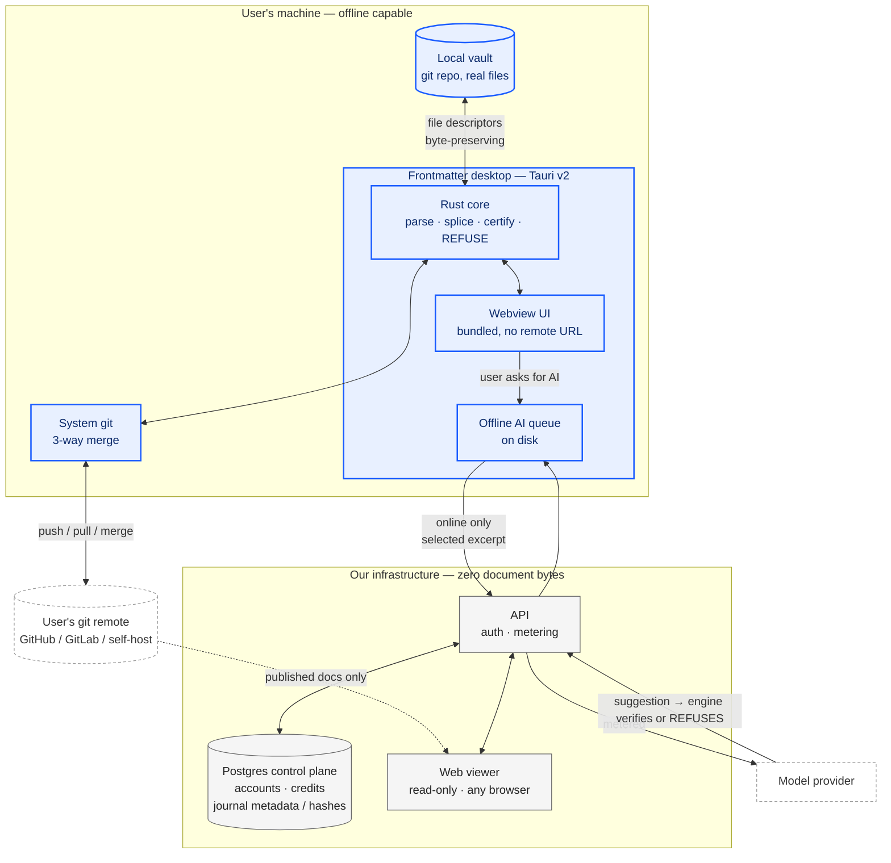

## 91. Offline, online, or both — and how the app reaches your files

### 91.1 The fork, stated once

The record contains 89 mentions of Tauri and zero decisions about file access. That gap is not an oversight in the writing — it is the decision itself, deferred. Everything downstream of it changes shape depending on the answer: what the MVP is, what a free tier costs, whether DPDP applies to document bytes at all, and whether "the file is the only source of truth" is a product property or a slogan.

The plain question: a user has `~/work/handbook/` on their laptop — 400 markdown files, a git repo, some of it confidential. Our engine locates a byte range and splices it. **Which process on which machine has a file descriptor open on that file?**

Only three answers exist. A process on their machine (desktop app, or daemon). A process in their browser holding an OS-granted handle (File System Access API). Or a process on our server operating on a *copy* obtained by git clone. There is no fourth. Every architecture below is one of these three, or a composition.

[measured] Current repo state, read 2026-08-31: the Tauri shell in this repo is a remote-URL wrapper. `tauri.conf.json` points the window at a hosted origin; there is no `fs` capability in the capability set, no local file dialog, no `$HOME` scope. That is a chrome-less browser in an app icon. It ships nothing offline, reads no local file, and inherits every network dependency of the web app while adding a code-signing burden and two update channels. Calling it "we already have a desktop app" in a planning conversation would be the single most expensive false premise available to us.

### 91.2 The five options

| Option | What it is | What it costs to build + operate | What it buys | What it forecloses |
|---|---|---|---|---|
| **A. Browser + File System Access API** | Web app asks the OS for a directory handle; reads/writes the real files in place | Low build (~2 weeks for a picker + handle persistence + permission re-prompt UX). Operating cost near zero — no binaries, no signing, no update channel. Support cost is the killer: Safari and Firefox users get a fundamentally different product | Zero-install. One codebase. Files genuinely never leave the device for edit operations | Forecloses Safari/Firefox as first-class. Forecloses iOS entirely. Forecloses background/scheduled work (no handle without a tab open) |
| **B. Tauri v2 with real fs capability** | Ship a signed binary; Rust side owns the file descriptors; webview is the UI | Medium build (4–8 weeks to go from remote-wrapper to real: capability config, scoped fs, watcher, git). Operating: code-signing (Apple $99/yr, Windows cert), an update server, crash reports, per-OS bug matrix | True offline. Real fs watching. Can run the engine locally with no network. Legally the strongest posture — bytes never transit | Forecloses "send someone a link". Every user must install. Two founders now maintain three OS targets |
| **C. Web + git as transport** | Server clones the repo, splices, commits, pushes. User's local disk untouched | Low build (we already need git three-way merge). Operating cost is the trap: clone storage, per-user compute, egress | Works in every browser, on phones. No install. Team/CI-shaped from day one | Forecloses offline entirely. Forecloses non-git folders (a plain Obsidian vault is out). Puts document bytes on our infrastructure — changes the legal product |
| **D. Local daemon + web UI** | Small local binary exposes a loopback API; web app talks to `localhost` | High build (binary + install story + a loopback origin/CORS/auth design that isn't a vulnerability). Operating: same signing burden as B, plus a hostile-review surface | Web UI convenience with local file truth | Forecloses simplicity. You paid the install cost of B and got a weaker product |
| **E. Hybrid — desktop primary, web viewer** | B for editing; a thin web surface for read/share/review that never touches local files | B's cost plus a constrained web surface (~2 weeks incremental if the viewer is genuinely read-only) | Install-gated depth, link-shareable breadth. Two honest promises instead of one dishonest one | Forecloses a single unified "everything works everywhere" story. Requires saying no to feature requests on the web side, repeatedly |

### 91.3 The browser support question, measured

[fetched] MDN File System API compatibility, `developer.mozilla.org/en-US/docs/Web/API/File_System_API`, read 2026-08-31: `showDirectoryPicker()` and the writable-stream path are Chromium-only. Firefox and Safari expose the read-side `FileSystemHandle` interfaces via drag-and-drop and the Origin Private File System, but **not** `showDirectoryPicker()` and **not** `FileSystemFileHandle.createWritable()` on user-visible directories. Safari's position has been stable for years: OPFS yes, arbitrary user-directory write access no.

[derived] What that means for us, arithmetic shown. Take a generous Chromium share of desktop browsing at ~70%, and assume our audience (developers, technical writers, ops people) skews higher — call it 80%. Then 1 in 5 desktop visitors who click "Open my vault" gets a dialog that says *your browser cannot do this*. At 10,000 users that is 2,000 people whose first experience of the product is a refusal — and note the cruelty of it: **we are the "refuse rather than guess" product, and this refusal is not principled, it is a browser gap.** Users do not distinguish. Every one of those is a support ticket for a two-person company. The fallback — "upload your files" — is not a fallback; it is a different product with a different legal surface, and it silently breaks the founding invariant that the file on disk is the only source of truth.

[inference] Option A therefore cannot be the *only* answer. It can be a legitimate zero-install on-ramp for the Chromium majority, but it cannot carry the promise.

### 91.4 What actually breaks offline, per option

This is the table the two of you should argue over, because it is where the AI ambition collides with the file-access decision.

| Capability | A (browser+FSA) | B (Tauri real) | C (git transport) | E (hybrid) |
|---|---|---|---|---|
| Open, read, render a vault | Offline OK (Chromium) | Offline OK | Requires network | Offline OK |
| Byte-preserving splice edit | Offline OK | Offline OK | Requires network | Offline OK |
| Degradation certification (cross-engine) | Offline OK — pure computation | Offline OK | Network | Offline OK |
| Structural refusals (zero-indent sequences, bare CR, SAFE_KEY) | Offline OK | Offline OK | Network | Offline OK |
| Git commit / branch / merge | Needs a JS git impl in-tab; heavy | Offline OK — shell out to real git | Server-side | Offline OK |
| AI: rewrite, summarise, extract | **Network required** | **Network required** | Network required | Network required |
| AI: queued, resumes on reconnect | Hard — tab must stay open | Natural — local queue on disk | N/A | Natural |
| Credit balance / entitlement | Server | Server, cached locally | Server | Server, cached locally |
| Scheduled/background automation | Impossible | Possible | Possible (server cron) | Possible |

The load-bearing row is the AI one, and it is the same in every column: **no AI feature works offline, in any architecture, at our budget.** Local inference is not available to us — [inference] a model small enough to ship in a Tauri bundle and run on a mid-range laptop is not a model that can be trusted to produce a splice that our own engine would rather refuse than guess about. Shipping a weak local model into a product whose entire differentiation is "refuse rather than guess" would be self-refuting. So the honest framing for the founders' whiteboard is:

> **The engine is offline. The intelligence is online. They are different products stacked on one file.**

That is not a compromise, it is a clean seam, and it is the seam to design the whole MVP around. Everything deterministic — parse, render, splice, certify, refuse — runs on the user's machine with no network and no cost to us. Everything probabilistic — the AI-OS layer, the automations — is a metered network call. The free tier is then not a loss leader; it is the deterministic engine, which costs us **zero marginal rupees per user** because it runs on their CPU.

[derived] Cost check at both scales. 100 users on Option B: our recurring spend is a Postgres control plane and an object store for nothing but metadata — realistically the free/hobby tier of a managed Postgres plus an Apple developer account at $99/yr, amortised to under ₹1,000/month total. 10,000 users on Option B: same Postgres (control plane rows only — no document bytes, per the settled decision), plus AI inference metered against paid tiers only. Compare Option C at 10,000 users: every user's repo cloned to our disk, every render a server CPU cycle, every save a push. Storage and egress scale linearly with adoption while the free tier scales linearly with adoption *and* pays us nothing. Option C's free tier is a liability that grows; Option B's free tier is free.

### 91.5 The legal surface — decision D8, answered

The record leaves D8 open. It should be closed here, because it is not really a legal question, it is an architecture question with legal consequences.

[inference, grounded in the structure of both regimes] Under India's DPDP Act, obligations attach to a Data Fiduciary that *determines the purpose and means of processing personal data*. Under GDPR the equivalent hinge is Art. 4(2) "processing" — an operation performed *on personal data*. If a user's document bytes never reach our infrastructure, we are not processing those bytes. We remain a fiduciary for the account data we obviously do hold (email, billing, credit ledger, telemetry), and that is a small, well-understood, entirely manageable surface.

The moment document bytes land on our servers — Option C, or an "upload your files" fallback in Option A — the surface changes category. Now a user's HR handbook, patient notes, or unreleased contract is data we process. That pulls in breach-notification duties, data-residency questions for EU customers, sub-processor disclosure for every AI vendor in the path, and a DPA that enterprise buyers will actually read. [inference] For a two-person company selling globally from India, this is the difference between a one-page privacy policy and a compliance function.

There is a second-order effect that matters more commercially than legally: **"your documents never leave your machine" is a sentence a competitor with a server-side architecture cannot say.** It is the single strongest differentiator available to us, it costs nothing to maintain once the architecture is right, and it is the reason a regulated-industry buyer would choose us over a better-funded incumbent. Option C spends that asset on day one.

Caveat, stated honestly: AI features send *excerpts* to a model provider. The claim must therefore be precise — "your files stay on your device; only the specific text you ask the AI about is sent, and only when you ask" — with a visible pre-flight showing exactly which bytes are about to leave. That pre-flight is itself a feature, and it is only buildable when the default is local.

### 91.6 Recommendation: E — Tauri v2 desktop as the product, web as a read-only viewer

Build Option B properly and add the constrained web surface of Option E. Concretely:

1. **Replace the remote-URL Tauri shell with a real local-first app.** Bundle the frontend, declare a scoped `fs` capability over user-chosen directories, shell out to the system `git`, run the engine in-process. This is the MVP.
2. **The deterministic engine ships in the free tier and works with the network cable unplugged.** Open a vault, render, splice, certify, refuse, commit. No account required to do any of it.
3. **AI is a metered online call from the desktop app to our API.** Account required. Credits live server-side in the Postgres control plane — never on the client, because a client-held balance is a client-forgeable balance. The desktop app caches the *entitlement* (tier, remaining credits as of last sync) for display and optimistic UX, and the server is authoritative at spend time.
4. **What syncs: not documents.** The control plane holds account, subscription, credit ledger, and the append-only splice journal *metadata* (operation hashes, timestamps, device id, CAS tokens) — never bytes. Multi-device convergence is the user's own git remote doing three-way merge, exactly as settled. Our journal exists to detect and refuse a conflicting splice, not to reconstruct a document.
5. **The web surface is a viewer and a share target only.** Render a document someone published, review a diff, read the docs, manage billing. It never opens a local vault, so it never needs File System Access, so Safari and Firefox work perfectly on the surface where breadth matters.
6. **File System Access is a later, optional on-ramp** — a "try it in your browser" path for Chromium users that lowers the trial barrier. Explicitly not the product, explicitly labelled as limited.

**The strongest argument against this recommendation, stated fairly:** *installation is a conversion cliff, and we are two people with no distribution.* A web app converts a curious visitor in one click; a desktop app asks for a download, an OS security dialog ("unidentified developer" until signing is sorted), and a trust decision — before the person has seen a single thing the product does. The record's own distribution arithmetic — ₹20L/month requiring on the order of 1.26M visitors — is brutal *before* you multiply by an install-step drop-off. Every honest funnel I have seen puts download-to-activate well below click-to-activate. Choosing E means accepting a materially smaller top-of-funnel in exchange for a defensible product, and betting that the users who *will* install are the ones who pay ₹599 rather than the ones who bounce from a free tier.

That argument is real and I would not wave it away. Two things blunt it. First, the web viewer preserves the shareable-link surface, so the *content* our users publish still spreads at web scale even though the *editor* does not. Second, and more decisive: the alternative that avoids the cliff — Option C — cannot deliver byte-preserving local splices at all, because it never touches the user's file. It touches a clone. And a product whose founding principle is "the file is the only source of truth" cannot ship an architecture in which the file we edit is a copy on someone else's computer.

**What would change my mind — write these down as falsifiable tests, not opinions:**

- If a 50-person cohort study shows download-to-first-splice conversion below ~15% while a Chromium-only FSA web trial exceeds ~40%, the on-ramp becomes the product and the desktop app becomes the pro tier.
- If Safari or Firefox ships `showDirectoryPicker()` with a writable path, Option A's structural objection collapses and A+E beats B+E on cost.
- If the first ten paying customers all say they want a *team* surface (review, comments, approvals) more than a local one, that is Option C's argument and it deserves a rehearing.
- If code-signing and the three-OS support matrix consume more than ~15% of one founder's time in the first quarter, the operability constraint has been violated and we should retreat to the web viewer plus FSA.

### 91.7 Direct answers to the two questions asked

**"If it is an online app, how does it reach the user's local project files at all?"** — It does not, and it cannot. A web page has no ambient filesystem access; the only bridges are (a) an explicit OS-mediated handle via File System Access, which exists in Chromium only, (b) a local process the page talks to over loopback, which is Option D and costs an install anyway, or (c) a copy obtained by git clone, which is not their file. Anyone claiming an online markdown editor "edits your local files" is doing one of those three, and only the first is genuinely local. This is precisely why the fork must be settled before the feature list: half the features people will want to write on the whiteboard silently assume (a) or (c).

**"If it is offline-first, how do AI features work, where do credits live, what syncs?"** — AI features are online-only, gated on an account, and fail *visibly* rather than degrading: with no network the app says "AI is unavailable offline" and queues the request to disk, resuming on reconnect. Credits live server-side in the Postgres control plane and are authoritative there; the client caches a display balance and reconciles on every call. What syncs is account state, entitlement, and splice-journal metadata — hashes, not bytes. Documents converge through the user's own git remote, which we drive but do not host. If a user never signs in, the entire deterministic engine still works forever, offline, for free.

### 91.8 The chosen topology

The diagram encodes the seam: everything inside the blue boundary runs with the network down and costs us nothing per user. Everything in grey is metered and holds no document bytes. The two dotted external systems are the user's own git host — which we never replace — and the model provider, which sees only the excerpt a user explicitly submits.

### 91.9 What this settles, and what it opens

**Settled by this section, if the founders accept it:** D8 closes as *documents never reach our infrastructure*. The Tauri shell's current remote-URL form is a known defect, not an asset, and rebuilding it is MVP work rather than a later phase. The free tier is defined as the complete deterministic engine and is structurally free to operate. Safari and Firefox are supported on the viewer and unsupported for local editing, permanently and by design rather than by accident.

**Opened by it, and needing its own decisions:** the code-signing and auto-update pipeline for three OS targets, run by one person on call. The exact pre-flight UI that shows a user which bytes are about to leave their machine before an AI call. Whether the offline queue is worth building in MVP1 or whether "AI needs network" is simply a message. And the sharpest open question — whether an iOS or Android surface is ever possible under this architecture, because on those platforms the answer to "how does it reach your files" is different again, and the honest current answer is that it does not.
