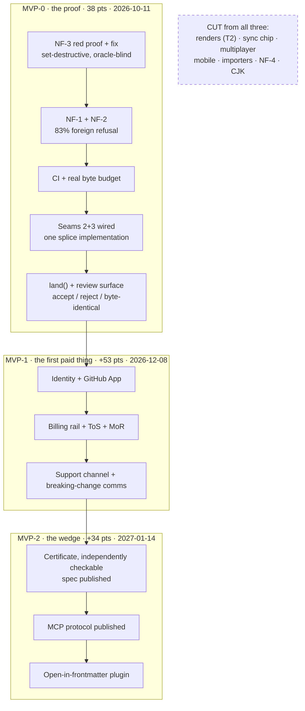

## 95. MVP, MVP1, and the cut lines

`grep -c "MVP"` over the five Tier-1 documents at HEAD `484f579` returns **0, 0, 0, 0, 0** — RECORD, PRD v2, DEV-PLAN, BUSINESS, ENGINE [measured, 2026-08-31]. The plan has lanes (R0, T0–T4), a critical path, seven milestones and a calendar to 2027-06-04, and it has never once drawn the line at what ships **first, to one stranger who is not us**. §28.6 is a completion schedule. This is the cut schedule, and the two disagree.

### 95.1 The three stages, and the shape of the argument

| | MVP-0 — the proof | MVP-1 — the first paid thing | MVP-2 — the wedge |
|---|---|---|---|
| **What it is** | One demo that makes a stranger say "I need that on my repo" | The smallest thing we can charge ₹299 for without embarrassment | The smallest thing an incumbent cannot copy in a quarter |
| **What it costs** | 38 pts ≈ **41 calendar days** → **2026-10-11** | +53 pts, cumulative 91 ≈ **99 days** → **2026-12-08** | +34 pts, cumulative 125 ≈ **136 days** → **2027-01-14** |
| **What it buys** | Evidence that byte-exactness is a felt need, not a founder aesthetic | The only honest churn signal that exists (§17: "refunds and non-renewals — the only hard churn number available") | 12–36 months of hold-time (§27 ranks 2 and 3) |
| **What it forecloses** | Nothing — it is throwaway by construction | Free-tier generosity: whatever ships free at MVP-1 can never be taken back (§24.6 "never reprice opaquely") | Nothing, if the certificate spec is published; everything, if it is not |

Dates are §28.6's own conversion, **1 pt ≈ 1.09 calendar days**, applied from 2026-08-31 [derived]. The rate's stated basis is one XL (16 pts) ≈ 14–21 calendar days solo, midpoint 17.5 → 1.09; §28.6 asserts the measured 25% active-day density is already inside it, not a multiplier on it. **State the assumption when you argue with the date: if burstiness is a multiplier rather than an inclusion, every date below is 4× wrong.**

One arithmetic disagreement to settle before either founder quotes a number: §28.1's thirteen R0 rows carry sizes summing to **50 points**, while §28's header says **58** [derived, computed here: 4+2+4+8+2+0+4+4+8+4+4+2+4]. Either a row is unlisted or the total is a mis-sum. Eight points is nine calendar days.

### 95.2 MVP-0 — the proof

**The single demo: the rejection.** Point an agent at a real repository. Let it make a six-file change. Reject one hunk. Then run `git diff` and show that the rejected file is **byte-identical** to what it was before the agent touched it — not "looks the same", identical. Then do the same thing in the competitor and show what happened to the reference-link definitions.

Why this one and not a prettier one: it is the only demo where the *absence* of an event is the product. Every other candidate — the kanban drag, the calendar, the published site — is a thing three free tools already do, and the audience correctly reads them as table stakes. The rejection demo is the thesis (§5) running backwards, and its baseline is measured, not asserted: Hubble.md regenerates the whole body, deletes reference links along with their visible text, and is not even a fixed point [measured, RECORD §16.3].

| MVP-0 ships | Size | Why it is in |
|---|---|---|
| **NF-3** — bare-CR frontmatter fence, set-destructive and oracle-blind | M/4 | A demo of correctness cannot ship on a writer with a known silent-destruction path |
| **NF-1 + NF-2** — zero-indent sequence, flow-seq close | M+S/6 | 83% aggregate foreign-vault refusal [measured, §50.1]. A stranger's repo *is* a foreign vault |
| **CI, and one deliberate red run first** | S/2 | §28.4 M0. Four gates in this repo already reported green while blind [measured, §28.7 risk 5] |
| **Real byte budget** replacing the `npm run budget` stub | S/2 | Currently a stub in a product selling document CI |
| **Seams 2 + 3** — one splice implementation behind every write | L/8 | Today one symbol from one of thirteen MDMAX files reaches product code [measured, §7.3] |
| **`land()` + a review surface** with per-hunk accept/reject | L+L/16 | The demo itself |
| **Total** | **38 pts** | **≈ 41 days** |

**Deliberately absent, and say so on the page:** no sign-up, no hosted anything, no billing, no sync, no mobile, no kanban, no calendar, no publishing, no import, no NF-4 quoted keys, no CJK, no certificate UI, no design-system reconciliation. MVP-0 has no free tier because it has no tiers. It is a binary, a repo, and a five-minute screen recording.

**The honest answer to "why not a text editor plus git".** For one person editing their own prose: *there is no reason, and we should say that out loud.* `git diff` plus VS Code is sufficient and free, and any pitch that pretends otherwise will be dismantled in the first Hacker News thread — §26 already records that every Show HN calling itself a markdown editor becomes a thread of free alternatives. The buyer is the person who is **not** the only author of their files: three agents writing into two hundred documents, where `git diff` faithfully shows a 400-line rewrite and tells you nothing about what was *dropped inside it*, and where "reject" in every other tool means "revert to the last commit and lose the four good changes too". Git gives you history. It does not give you refusal, and it does not give you a per-hunk reject that is provably a no-op.

**Exit criterion — observable, not felt.** Ten people who are not friends, family, or in our Discord, each given the binary and their own repository. **Six of ten run it on a repository we have never seen, and at least three ask, unprompted, some form of "can I point this at work".** Recorded as a tally with names and dates, not a feeling. Falsifier: if fewer than three ask, the thesis is aesthetic and MVP-1 must not be started.

**The cut line — the three most likely to be argued back in:**

| Argued-back-in feature | The argument for it | Why it stays out |
|---|---|---|
| **The kanban / calendar renders** | "It is the visible proof of the projection law, it demos in four seconds, and most of the code exists" | It demos the wrong thing. A board over markdown is Obsidian Bases, shipped, free, and already the default expectation (§16.3). Showing it first re-categorises us as a note-taking app and the rejection demo becomes a footnote. §28 already puts T2 **off the critical path entirely** |
| **A sign-up and a waitlist** | "We will never get the ten strangers back without an email address" | §17 bans the weekly digest and names adding an email field to enable one "the single worst trade in this document". Ten names in a text file is not a CRM problem. An auth flow at MVP-0 is 16 points spent on a spreadsheet |
| **NF-4 quoted-key support** | "`date created` appears in 812 of 957 files in one real vault — the engine cannot address a normal person's frontmatter" [measured, §50.1] | It is a design decision on Unicode key equality wearing a regex costume (§28.7 risk 3), it is the one R0 unit an agent cannot start, and MVP-0's demo edits *body spans and known keys*. Write the one-page NFC/NFD decision during MVP-0 — do not build against it |

### 95.3 MVP-1 — the first paid thing

The unresolved question underneath MVP-1 is not a feature. It is that **§24's free tier is generous and Pro is thin**: free gets the full editor, unlimited documents, offline, the splice guarantee, and BYO-key AI unmetered; ₹299 gets "publish extras, live editing, hosted convenience, small metered AI". Three of those four are things a developer will decline on principle.

| Option for the ₹299 line | What it costs to build | What it buys | What it forecloses |
|---|---|---|---|
| **A · Hosted, metered agent review** — we run the model, the meter is in dollars, BYO-key stays free forever | Low. The review surface is already MVP-0 | The only line with real marginal cost, so charging is *honest*, and §25's cap of $0.40/paid-user/mo makes the margin predictable | Nothing, provided §24.6 holds: dollars not credits, never repriced opaquely |
| **B · Hosted sync + conflict inbox** (T0, 32 pts) | High. §28 calls it one creative target that must not be fanned out | Real value for the non-developer segment | 32 points, and it competes with git — which the target user already has and already trusts |
| **C · Publishing / multi-site** | Medium | A visible artefact to show a friend | Puts us against Obsidian Publish at **$8/site annual, per site not per user** [fetched, §24.2] — a worse price on a worse product |

**Recommendation: A.** Charge for the compute we actually spend, keep BYO-key unmetered free at every tier, and do not build hosted sync for MVP-1. **The strongest argument against, stated honestly:** §28.3 puts T0 on the critical path *before* T1, and a paid tier whose only content is metered inference is one Anthropic price cut away from being worthless — §50.1 rates "LLM price/model deprecation" at L4/I4 with cost-per-active-user drift >20% as the early warning. If that drift fires, option B is the fallback and it is 32 points we will not have started.

**The non-features. These are the actual MVP-1 work, and none of them is a feature.**

| Non-feature | The decision, with the number |
|---|---|
| **Billing rail** | Dodo India domestic is **4% + 15¢**, subscriptions **+0.5%**, and the India row reads "+international payment fees" against a separate **+1.5%** international line [fetched 2026-08-31, dodopayments.com/pricing]. On ₹299 at ₹95.39/$ that is **₹27.76 = 9.29%**, or **₹32.25 = 10.79%** if the 1.5% applies [derived]. Lemon Squeezy is **5% + 50¢** [fetched 2026-08-31, lemonsqueezy.com/pricing] |
| **The payout trap nobody has added up** | Same page: payouts are free, but **$5 if the payout is under $1,000**, and **USD SWIFT payouts for non-US businesses are $25**. At 100 paying Indians that is $313.45/mo gross and up to **$30 in payout fees = 9.57% on top of the 9.29%** [derived]. Payout fees do not fall below 5% of gross until **$600/mo ≈ 191 paying users at ₹299** [derived]. Confirm with Dodo whether the two stack before pricing anything |
| **Recommendation** | **India domestic on Razorpay (2.36% [§24.4], INR settlement, no SWIFT, UPI at checkout), global on an MoR.** Do not open global paid until gross clears $600/mo. Against it: two rails, two reconciliations, and §51 wants an MoR before the first paid signup — which Razorpay is not, so the Indian entity carries GST on domestic sales itself. That is a CA question, not an engineering one, and it is on the critical path |
| **Support channel** | 232 tickets/mo = **46.4 founder-hours** at 10,000 users [§25.1]. §25's own conclusion: *support, not compute, is the wall.* One email address, published response window, no chat widget |
| **ToS, privacy, MoR, EU Art. 27 representative** | §28's INFRA/LEGAL block, 25 pts, all **buy**. These are vendor-clock date-gates, not effort-gates — start them the week MVP-0 exits |
| **A way to tell users about a breaking change** | §81's finding is that **there is no channel at all, and that is a defect, not a gap.** The version-check request the app already makes (§17) is the only existing pipe. Make it able to carry one signed, dismissible, in-product notice. Not email. Not a digest |
| **Design-system reconciliation** | `globals.css` is byte-identical to sgnk-md's, ships `--accent: #18181b` instead of `#1a5cff`, and carries a `body-faint` token at **2.14:1, failing WCAG AA**, in the shipped set [measured, §7.4]. Free to fix, embarrassing to charge money in front of |

**Exit criterion.** §28.4's M7, tightened: **one paying non-founder account, acquired without a founder in the loop, that renews once.** One renewal, not one charge — under the RBI regime the bank sends a pre-debit SMS 24 hours ahead, the customer can decline any single debit, and there is **one attempt with no retry ladder** (§82.3). A first charge proves willingness to try. A second charge proves the rail works.

**The cut line at MVP-1:**

| Argued back in | The argument | Why it stays out |
|---|---|---|
| **Mobile read + light edit** | §16.2 ranks it the **#1 churn-risk gap**; every competitor opened has a first-class mobile story | It is an L against a paying population of one, and §16.5 is explicit that mobile is a *different surface, not a shrunken one*. It is an MVP-2 item that will feel like an MVP-1 item |
| **The ChatGPT / Claude importers** (T4) | It is the acquisition mechanic — people arrive with a conversation, not a repo | Import is how you get users you cannot yet serve. M6's own DoD requires the verification report to enumerate every dropped construct by count; that is a full lane, not a funnel patch |
| **Annual billing at ₹2,499** | It cuts the Dodo fee from 9.29% to **5.07%** and turns twelve one-attempt renewal events into one [derived] | §82.3's own anti-recommendation: one renewal a year is one lumpy, high-variance churn event aimed at a customer at their least persuadable. Offer annual only *after* the first monthly cohort has actually renewed twice — otherwise you have bought twelve months of silence about whether anyone wanted it |

### 95.4 MVP-2 — the wedge

Useful and defensible are different products. §27 ranks the moats by hold-time and the ranking is unkind: community is #1 and **does not exist**; switching cost is #7 and is **near zero by design** — the anti-moat, deliberately. What is left is engine depth (18–36 months) and the degradation certificate (12–24 months), with a warning attached: **"zero defensibility if the certificate is not independently checkable."**

| MVP-2 ships | Size | Why it is the wedge and not a feature |
|---|---|---|
| The certificate as a **published spec plus a verifier anyone can run against our output** | L/8 | An unverifiable certificate is marketing. A verifiable one is a standard, and setting the standard is the win condition even when it commoditises |
| The **MCP protocol and session format, published** | M/4 | §16.3's machine-write zones are categorical today. Published, they become something other tools implement *toward us* |
| **Open-in-frontmatter** plugin | L/8 | The distribution play. Relay shipped 172,544 downloads of a commercial service's bridge plugin [SS]. Channel discipline is settled: "integrates with your vault", never "Obsidian competitor" |
| Importers + promotion loop | L+M/14 | Only now, when there is something to promote users *into* |

**Exit criterion.** A third party we did not pay runs `mdmax cert` against a document we did not produce, publishes the result, and the verdict matches ours. Second, weaker but observable: one repository on GitHub, not ours, whose CI invokes the certificate.

**The cut line at MVP-2:** real-time multiplayer (§16.4 marks it **never in v1**; it costs a CRDT layer that fights byte-preserving splices head-on, and CRDT sync is settled out); a plugin marketplace (settled against, and §86 records the ban and the community moat as a genuine unresolved tension — do not resolve it by quietly shipping a marketplace); and the graph view, against which the record holds the hardest single measurement in the document: **zero of 89 feature requests mentioned it, and all 45 transclusions in 25 MB of our own vault were documentation of the feature, never use** [measured, §6.2].

### 95.5 The engine tension, named

The differentiation is the engine, and §28.6 puts **R0 alone at 9 weeks before anything a user can see** — 58 pts, 2026-08-29 → 2026-10-31 — and then adds, correctly, that this is "the part most likely to be wished away."

The tension is real and it does not have a clean resolution. What it has is a **split**. Of R0's thirteen rows, six are a correctness *floor* the demo cannot ship without (NF-3, NF-1, NF-2, CI, the byte budget, seams 2–3 = 22 pts ≈ 24 days) and seven are engine *completeness* (NF-4, the six construct detectors, CJK, CSS, Tier 3/4 residue, the decisions). Running the floor and then MVP-0's agent path gets the first stranger in front of the product at **41 days instead of 63**, and the deferred seven cost nothing at MVP-0 because the demo runs on the demonstrator's own repository, not on the 83% tail.

**The strongest argument against this split, which the other founder should make:** §7.3 carries an explicit instruction — *do not wire seam 2 before NF-1 and NF-3 land*, because at the measured refusal rate the write gate rejects 83% of foreign vaults, "an availability incident wearing a correctness costume." My split respects that ordering. What it does not respect is the possibility that the 83% is not one bug. §28.7's risk #1 says so plainly: the claim that NF-1 recovers 99.98% is an **inference from bucketing refusal causes, not a measured result of the patched writer**, and the stated early warning is that the first patched run refuses more than 10 files. If that fires, MVP-0 does not slip by a week — the demo has no floor to stand on, and the honest response is to stop and re-derive, not to ship a demo that refuses the stranger's repo on stage.

### 95.6 What we are betting, and what tells us we lost while there is still time

| Stage | The bet | The falsifier — observable | When it fires | If it fires |
|---|---|---|---|---|
| **MVP-0** | Byte-exactness under agent editing is a felt need, not a founder aesthetic | Of 10 strangers given the binary, **fewer than 3** ask to point it at their own work | Day 41–55 | Stop. This is §50.2's "byte-fidelity may be a claim no buyer prices" (L4/I5) landing. Do not start MVP-1 |
| **MVP-0** | The 83% refusal is one bug, not a class | First patched corpus run refuses **>10 of 7,969**, or residual **>2** | Day 10–14 | Re-derive before building anything on top. The fidelity claim rests on this number and it is currently an inference (§28.7 #1) |
| **MVP-0** | Our own gates can see | CI passes on a **deliberately broken** commit | Day 2 | Four gates in this repo have already reported green while blind. Fix the gate before trusting one green |
| **MVP-1** | Someone pays for hosted inference over a file they own | 60 days with a working checkout and **zero non-founder paid signups** | Day 99–160 | §50.2's "no distribution channel" (L4/I5). The response is distribution, not features — the corpus numbers are the marketing asset |
| **MVP-1** | The rail works in India | The first cohort's **second** charge fails at >20%, or payout fees exceed 15% of gross | Day 130–160 | Switch India to Razorpay domestic before adding a single feature. §82.3's one-attempt regime is not a bug we can fix in product |
| **MVP-1** | Free is not so generous that Pro is pointless | Free-to-paid conversion **under 2%** at n≥200 free users | Day 160+ | §25.2's developer-focused median is 5%, half the non-developer rate; we chose the hard half deliberately. Under 2% means the free tier ate the paid one, and §24.6 forbids taking it back |
| **MVP-1** | Support is survivable solo | Ticket mix crosses **30% "my key doesn't work"**, or response time drifts past the published window twice | Day 120+ | §25's wall arrives early. Key-validation at entry and ≤200-char actionable errors, before growth |
| **MVP-2** | The certificate is a standard, not a slogan | **90 days** after publishing the spec with **zero** third-party runs | Day 220+ | §27's own warning has fired: zero defensibility. Fall back to engine depth (rank 2) and stop describing the certificate as a moat in any external document |
| **MVP-2** | Distribution exists through the vault ecosystem | Plugin listed and **under 500 installs in 60 days** against Relay's 172,544 [SS] | Day 250+ | The channel-discipline framing was wrong or the plugin is the wrong artefact. Re-run §26 before spending on content |
| **All three** | The founder can hold the pace | **Two consecutive weeks with zero commits** (§28.7 #6: 8 active days in 32) | Continuously | This is the L5/I5 row in §50.3. It is the bet most likely to be lost and the one with no product response |

The table's uncomfortable property is that **the two cheapest falsifiers fire first** — CI at day 2, the corpus at day 14 — and both are about whether our own instruments can see. That ordering is not an accident of scheduling. It is the only sequence in which the later, expensive bets are worth making at all.
