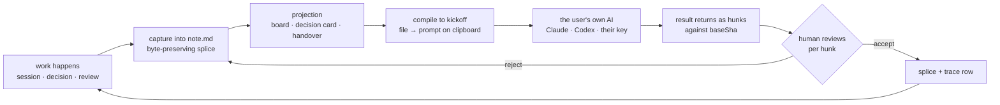

## 98. The fusion — what an AI-native markdown editor actually is

### 98.1 The claim, with its mechanism and its falsifier

> **frontmatter is a markdown editor whose output is machine-actionable. It produces the artefacts of product development — handovers, decision records, flows, kickoffs — as plain files in the user's own repo, and then compiles those files into the prompt that makes someone else's AI do the work well. The editor is the product. The AI is what the files are for.**

Three mechanisms make that a claim rather than a mood:

1. **The file is the only source of truth, so the AI has no privileged channel.** An agent edit is a splice against `baseSha` — the identical path a human takes dragging a card (§5). The model gets *fewer* rights than the person, not more.
2. **Markdown is the cheapest lossless carrier of a reviewable change.** Measured below: 6.8×–10.6× fewer tokens than a block-JSON document model, and a one-word edit that shows as 2 changed lines instead of 24.
3. **We do not pay for the expensive half.** The compiled kickoff prompt runs on the user's own subscription. Measured below: a 40-turn agentic session at the p50 turn observed on this machine costs **$5.45 on Haiku 4.5 / $10.90 on Sonnet 5** — **87% / 174% of one month of Rs 599 gross revenue** `[measured]` `[derived]`. That single number is why the handoff is a prompt and not a runtime.

**Falsified by:** users generating handovers but never compiling a kickoff (paste-rate below 1/user/month at day 90), *or* the compile step proving equally good when fed a Notion export — which would mean the file format was never load-bearing and this is a prompt-template company.

---

### 98.2 The test that separates bolted-on from AI-native

Most products claiming the second are the first. Three tests, all executable in an afternoon on a competitor's build.

| # | Test | Bolted-on answer | AI-native answer | Where we stand |
|---|---|---|---|---|
| **1** | **The delete test.** Remove every model key. What breaks? | A view breaks, a link dies, a document stops rendering — the AI was load-bearing infrastructure | Only the AI verbs disappear. Board, calendar, site, links all still work | §11.6 states this as the user-facing promise; it is enforced by the projection law, not by discipline |
| **2** | **The path test.** Diff the write path of an AI edit against a human drag-a-card edit | Different code paths, different undo stacks, provenance only on one | One splice writer, one undo stack, one review surface, one `Co-authored-by` trailer | §13: hunks from humans, agents and sync conflicts share a grammar |
| **3** | **The addressability test.** Ask what the AI changed. | "It regenerated the block" — a block id and a new value | A byte range, quoted, with the certificate that untouched bytes are byte-identical | The engine's law: locate the range, replace exactly those bytes, **REFUSE rather than guess** |

Test 3 is the discriminating one, because it is the only one a block-store product cannot pass by adding features. If your unit of change is a block object, "what changed" has no answer finer than the block. The measurement in 98.3 is that difference, priced.

Two honest readings from the record. Notion's shipped surface is *Edit with AI* on a highlighted range `[fetched, §11.2]` — that passes test 1 and fails test 3. Cursor and Windsurf both regressed per-hunk control and were publicly burned `[fetched, §13]` — they failed test 2 after passing it. And the largest file-native editor in the category ships **zero occurrences of the token "AI" across 9,502 chars of its full roadmap** `[measured, §11.1]` — it passes test 1 by abstention. There is no incumbent holding all three.

---

### 98.3 Why markdown specifically, measured

Three real documents from this repo, each a genuine product-development artefact, converted to four alternative representations and tokenised with `tiktoken 0.14.0`, encoding `o200k_base`. HTML via `marked` (GFM). AST via `mdast-util-from-markdown` with the GFM and frontmatter extensions. Block JSON modelled on the Notion block object — the envelope fields (`parent`, `created_time`, `last_edited_by`, `has_children`, `archived`, `in_trash`) and the `rich_text` / `annotations` / `plain_text` inline shape all confirmed present on `developers.notion.com/reference/block` `[fetched, 2026-08-31, HTTP 200]`; the serializer reproducing them is mine `[inference]`.

| Document (real path) | markdown | HTML | mdast JSON | block JSON, minimal | block JSON, as returned |
|---|---|---|---|---|---|
| `docs/adr/0001-adopt-hexagonal-architecture.md` | **611** | 810 (1.33×) | 1,771 (2.90×) | 5,096 (8.34×) | 9,779 (**16.00×**) |
| `docs/FRONTMATTER-DECISIONS-2026-08-29.md` | **4,472** | 6,302 (1.41×) | 11,716 (2.62×) | 35,744 (7.99×) | 59,159 (13.23×) |
| `HANDOFF-graph-engineering-research-2026-07-30.md` | **13,356** | 17,302 (1.30×) | 26,684 (2.00×) | 84,782 (6.35×) | 125,814 (9.42×) |
| **Total** | **18,439** | 24,414 (1.32×) | 40,171 (2.18×) | 125,622 (6.81×) | 194,752 (**10.56×**) |

`[measured, 2026-08-31]`

Caveat stated before anyone quotes it: `o200k_base` is OpenAI's tokenizer. Claude's is not public, and Anthropic's own pricing page says Claude 4.7+ models use a tokenizer producing "approximately 30% more tokens for the same text" `[fetched, docs.claude.com/…/pricing.md, 2026-08-31]`. The *ratios* are the finding, and they hold across three documents of very different shape.

**Consequences that are not abstract:**

- **Context fit.** A 200k window holds **14.97** copies of that handover as markdown and **1.59** as returned block JSON `[derived]`.
- **A diff is reviewable.** Same ADR, two real edits, JSON pretty-printed at indent 2 so the line comparison is fair:

| Edit | markdown | HTML | mdast JSON | block JSON |
|---|---|---|---|---|
| `**Status:** Accepted` → `Superseded` | **2 lines / 50 B / 14 tok** | 2 / 90 / 28 | 2 / 82 / 18 | **24 lines / 694 B / 168 tok** |
| one word mid-paragraph | **2 lines / 174 B / 27 tok** | 2 / 182 / 31 | 2 / 222 / 42 | **24 lines / 1,006 B / 216 tok** |

`[measured]` A status flip — the single most common product-development edit there is — is 14 tokens of review surface in markdown and 168 in a block store, because changing one word rewrites the whole `rich_text` array. That is the review surface of §13 becoming affordable or not.

- **A file is addressable.** `docs/adr/0001-…md#L3` is a durable name a CI job, an MCP server and a stranger all resolve. A block id resolves only inside one vendor.
- **The unit economics.** Haiku 4.5 **$1/$5 per MTok**, Sonnet 5 **$2/$10** (the scheduled 2026-09-01 rise to $3/$15 "will not occur"), cache hits $0.10 / $0.20 `[fetched, 2026-08-31]`. USD/INR **95.39** `[fetched, frankfurter.app, rate date 2026-08-28]`, so Rs 299 = **$3.135** and Rs 599 = **$6.279** gross `[derived]`. Allocating 30% of Rs 299 gross to inference buys **163 toolbar operations/user/month on markdown and 18.3 on block JSON** `[derived]` — an 8.90× difference that decides whether the free tier exists.

**The honest counter-evidence.** "Models are trained on markdown" is too glib to publish. Anthropic's current prompting guidance recommends **XML tags** for structuring prompts, and states that "removing markdown from your prompt can reduce the volume of markdown in the output" `[fetched, docs.claude.com prompting best practices, 2026-08-31]`. The defensible version is narrower and survives: **markdown is the carrier, XML is the envelope.** Our compile step emits markdown *content* inside XML *section* tags, which is exactly what that guidance asks for and costs nothing extra.

---

### 98.4 The loop

| Station | Who acts | Deterministic | Cost to us | Why it is here |
|---|---|---|---|---|
| Capture | human, AI verb optional | writer: yes | $0.0058/op median `[derived, §11.3]` | §11.2 rank 1, the only capability with strong retention evidence |
| Projection | software | **yes, zero model calls** | $0 | §5 — deterministic projections out-install every AI capability combined by **7.25×** `[derived, §11.1]` |
| **Compile to kickoff** | **human presses it** | **yes, zero model calls in the default path** | **$0** | The fusion point. A template + the file, not a generation |
| Their AI | their key, their subscription | no | **$0** | The 40-turn measurement below |
| Return as hunks | software | yes | $0 | §13, one grammar for every change |
| **Review** | **human, per hunk, non-skippable** | n/a | $0 | **58.7%** of ~33,000 developers do not plan to use AI for committing and reviewing `[fetched, §11.4]` |
| Splice + trace | software | yes | $0 | `REFUSED_CONFLICT` on `baseSha` drift; the chip reads *unattributed* rather than guessing — **78.637%** of our own trace rows carry `skill: "unknown"` `[derived, §62.2]` |

**Where the human sits, and where they must.** Two gates, both of which the human already wants to hold. At **compile**, they decide what the prompt says before it leaves. At **review**, they accept bytes one hunk at a time. Everything between those two gates may be automated; neither gate may be skipped for agent-authored bytes, and there is no "apply all".

**Why the compile step is free, and why that is the whole business.** Generating a kickoff prompt from that 13,356-token handover on Haiku 4.5 costs **$0.01736**; at 4/month × 10,000 users that is **$694/mo, 2.21% of gross** `[derived]` — affordable, and the template path is $0. What is *not* affordable is the work the prompt triggers. Across **2,346 trace rows carrying a fresh/cache token split** on this machine, the p50 turn costs **$0.1363 (Haiku 4.5) / $0.2725 (Sonnet 5)**, p90 **$0.4683 / $0.9365** `[measured, ~/.sgnk/traces, 2026-08-31]`. Forty turns at p50: **$5.45 / $10.90** — against Rs 599 = $6.279 gross. Stated plainly: **one agentic session costs more than the subscription.** That workload is an agentic *coding* harness, not a document editor `[caveat]` — but it is precisely the workload the kickoff prompt hands off, which makes it the right number for this decision and the wrong number for anything else.

---

### 98.5 The category, picked

| Candidate | Competitor set | Buyer | Purchase moment | Verdict |
|---|---|---|---|---|
| **Editor** | Obsidian, iA Writer, Typora, Zed, Bear | the individual who writes | "my files, better" — self-serve card | **PICK** |
| AI workspace | Notion, Coda, Mem, Tana | team admin | seat expansion | Reject — loses on breadth, invites the project-manager comparison we refuse (§11.4) |
| Context layer | Cursor rules, MCP servers, vector DBs | platform/AI engineer | none — it is a feature | Reject — no visible artefact, no purchase moment |
| Product-development tool | Linear, Jira, Productboard | PM / eng lead | annual, procurement | Reject — that buyer wants tickets; two founders cannot serve procurement |

**We are an editor.** Not a hedge — it fixes everything downstream. Competitor set: Obsidian first. Buyer: one person with a card, which is the only buyer Free / Rs 299 / Rs 599 addresses and the only one operable by one person on call. The AI and product-development halves are what the editor is *for*, and they belong in the second sentence of the pitch, never the first.

**Live with the cost.** "Editor" is a small-ticket, high-churn category whose strongest competitor is free for individuals. We are choosing the harder revenue shape in exchange for a coherent buyer.

---

### 98.6 What this is not

| Not | Because |
|---|---|
| **Not Notion** | Notion made the app the source of truth. The 10.56× token measurement above is what that costs an AI reading your work `[measured]` |
| **Not a project manager** | AI may propose a status change; the human commits it. **75.8%** decline AI for deployment `[fetched, §11.4]`. No sprints, no assignees, no burndown |
| **Not a chat wrapper** | There is no vault chat, no persistent semantic index — it costs **$38.79/user/month** at 100 saves/day and the market leader's most-discussed open issues are all silent index failure `[derived + measured, §11.3–11.4]` |
| **Not an IDE** | No arbitrary client-side code execution, ever. The compile step ends at the clipboard |
| **Not a model vendor** | We do not resell inference below Rs 599. Teams bring their own keys, as the founders specified |

---

### 98.7 Recommendation, and the strongest case against it

**Recommendation: ship the fusion as one visible command — `Compile to kickoff` — in a markdown editor, and ship nothing else new for it.**

Every feature below names its person and their frequency, per the discipline. Anything I could not name, I cut, and the cuts are listed.

| Feature | Who uses it | How often | Kill rule |
|---|---|---|---|
| Toolbar verbs on a selection | the person writing the document | several times per writing session | <20% strong acceptance at 90 days (§11.5) |
| **Compile to kickoff** (open file + named siblings → prompt on clipboard) | the lead starting a piece of work | assumed 4×/month — **unmeasured, this is the bet** | <1 paste/user/month at day 90 |
| Per-hunk review of returned work | anyone accepting an agent edit | every single time | never — it is the gate |
| Handover / decision templates as ordinary `.md` | the person ending a session | weekly | <1 use/user/month |
| `mdmax cert --fail-on=BROKEN` in CI | the repo owner | once at setup, then only on failure | B2B only |

**Cut, explicitly:** ambient related-notes; ghost text; vault-wide chat; a settings page called AI; any composite health score; multiplayer presence; anything needing a second index. Also cut: reselling inference on Free and Rs 299.

**The strongest argument against.** The kickoff prompt is not defensible. It is a template plus a file concatenation — a few hundred lines. Anthropic and OpenAI both ship repo attachment already; the day the paste becomes a connector, the fusion evaporates and we are an editor with a nice writer. And the demand evidence is **zero rows**: this repo holds 264 tracked markdown files and 1,848,994 words in `docs/` `[measured]`, and not one observation of a human pasting a compiled prompt. Against three tests, one measured 10.56× and a $10.90 session, we have an unmeasured behaviour carrying the entire thesis.

The reply is only half a reply, and the founders should hear it as half. What is defensible is not the prompt — it is that the *file is worth compiling*: the byte-preserving writer, the degradation certificate, the review surface that accepts a returning hunk safely. A connector that attaches a repo still has to write back, and writing back into prose is where every competitor has been publicly burned. But that argument concedes the honest shape of this bet: **the fusion is a distribution story wearing an engineering story's clothes.** The engineering is real and it is ours. The distribution is a hypothesis with an n of zero, and it should be tested in the next 90 days with a paste counter, not defended in another document.
