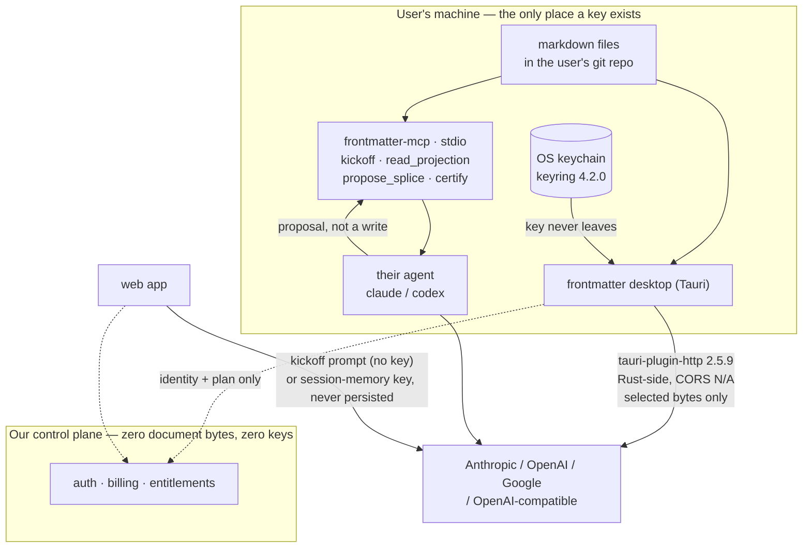

## 100. Running the user's own model — provider keys, and AI inside the editor

**The claim.** BYO keys are not the AI strategy. They are the *fallback* for the ten percent of users who want the model inside the editor. The AI strategy is the kickoff prompt — a document the user pastes into the agent they already pay for, which costs us exactly zero tokens and zero liability. Everything below is engineering for the minority case, sized so it never becomes the majority case by accident.

Every provider fetch below was read with `curl` at **2026-08-30 20:22 UTC** (`date` header on the responses). `WebFetch` is gated here; `curl` was not, and every host answered.

### 100.1 The provider matrix

| Provider | Default model id + price /MTok | Browser-origin call? | Rate-limit shape | BYO under their terms |
|---|---|---|---|---|
| **Anthropic** | `claude-haiku-4-5` **$1 in / $5 out**; `claude-sonnet-5` **$2/$10**; `claude-opus-5` $5/$25; `claude-fable-5` $10/$50. Cache read 0.1×, batch 50% `[fetched]` | **Yes, but opt-in and named "dangerous"** — see below `[measured]` | 429 + `retry-after`; RPM/ITPM/OTPM; `anthropic-ratelimit-{requests,input-tokens,output-tokens}-{limit,remaining,reset}` `[fetched]` | Commercial Terms **A.1** grants use "including to power products and services Customer makes available to its own customers and end users"; **D.5** "Customer is responsible for all activity under its account" `[fetched]` |
| **OpenAI** | `gpt-5.6-luna` **$0.20/$1.20**; `gpt-5.6-terra` $2.00/$12.00; `gpt-5.6-sol` $4.00/$20.00; `gpt-5-nano` $0.05/$0.40 `[fetched]` | **Yes, unconditionally** `[measured]` | RPM/RPD/TPM/TPD, org **and** project scoped; `x-ratelimit-*`, `Retry-After`; tiers Free→5, $100/mo → $200,000/mo `[fetched]` | **Unresolved.** `openai.com/policies/services-agreement/` and `/business-terms/` both returned **HTTP 403** to curl `[measured]`. Lawyer question, not a founder question |
| **Google** | `gemini-3.7-flash` **$0.75/$3.75** through 2026-12-31, **$1.50/$7.50** from 2027-01-01. Free tier: **free of charge**, and the same table says *"Content used to improve our products: **Yes**"* `[fetched]` | **Yes, unconditionally** `[measured]` | Free tier real but throttled; paid tier for volume `[fetched]` | Terms page fetched; the BYO-specific clause was not located in what I pulled `[SS]` |
| **The OpenAI-compatible tail** | OpenRouter, Groq, Ollama, LM Studio, vLLM | **OpenRouter and Groq: `access-control-allow-origin: *`, HTTP 204 preflight** `[measured]` | Vendor-specific | One adapter covers all of them |

**The CORS answer, measured rather than assumed, because it decides the architecture.**

- **Anthropic gates CORS on a header whose name is an argument against using it.** Preflight to `POST /v1/messages` with `Access-Control-Request-Headers: content-type,x-api-key,anthropic-version` → **HTTP 400, no `access-control-allow-origin`**. Add `anthropic-dangerous-direct-browser-access` to that list → **HTTP 200, `access-control-allow-origin: *`, `access-control-allow-credentials: true`, max-age 600**. A real `POST` carrying the header from `Origin: https://evil.example.com` with a junk key returned **401 with `access-control-allow-origin: *`** — the browser could read it. `[measured]`
- **OpenAI reflects any origin verbatim, with no opt-in and no warning.** Tested `https://app.frontmatter.dev`, `https://evil.example.com`, `http://localhost:1420`, and literal `null` — all four came back as `access-control-allow-origin: <that exact origin>`, `access-control-allow-headers: content-type,authorization`, max-age 86400. `[measured]`
- **Google behaves identically** — same four origins reflected, `access-control-allow-headers: content-type,x-goog-api-key`. `[measured]`

So the browser is not the blocker. **The constraint is not technical, it is custodial**, and Anthropic spelled that out by making you type the word `dangerous` to get the header. A key pasted into a web page is a bearer credential sitting in a document renderer that renders untrusted markdown.

Two rate-limit details that will otherwise cost a support day each. Anthropic's **spend limit** returns **HTTP 400 `invalid_request_error` with `error_code: enforced_spend_limit_reached` and no `retry-after`** — SDK auto-retry loops on it forever `[fetched]`. And OpenAI's limits are **organisation- and project-scoped, never user-scoped** `[fetched]`, so one team key shared across eight editors is one bucket; the eighth person to hit "summarise" gets a 429 caused by a colleague. The published per-model row for Haiku 4.5 reads 1,000 RPM / 2,000,000 ITPM / 400,000 OTPM `[fetched; I did not pin which tier label owns that row]`.

### 100.2 Where the key lives

| Custody | Failure mode, named | Verdict |
|---|---|---|
| **Browser `localStorage`** | One XSS in a markdown renderer reads it. We render user-supplied markdown by definition. `localStorage` also survives logout and is readable by any script on the origin | **Refuse** |
| **Browser session memory only** (re-entered per session, never persisted) | Annoying — retyped on every reload. But the blast radius is one tab-lifetime, and nothing is at rest | **Allow on web, with the friction visible** |
| **OS keychain via Tauri** (`keyring` 4.2.0, 22.5M downloads; or `tauri-plugin-stronghold` 2.3.1) `[fetched crates.io]` | User loses it on machine change; no team sharing. Both are correct behaviours for a credential | **Recommended** |
| **Our server, envelope-encrypted** | We hold a bearer credential to someone else's spend. A breach is not "documents leaked", it is "we ran up your Anthropic bill". DPDP s.8(5) reasonable-safeguards ceiling is **₹250 crore** `[fetched, §51.1]`. §51.4 already says keys must be *"never returned to the client after entry"* and *"do not co-locate the key store with the document store"* — true, and still an inherited liability | **Refuse at v1** |
| **Never stored** | Nothing to leak, nothing to run | **The default, and the free tier** |

**If a key transits our server we inherit a liability we do not want and are not paid for.** ₹299/month does not buy a credential-custody incident. The desktop keychain is not a compromise — it is the only shape where the worst case is confined to one laptop the user already trusts.

### 100.3 The three deployment shapes

| Shape | Who holds the key | Our marginal cost | Document bytes leaving the device | DPDP / GDPR posture |
|---|---|---|---|---|
| **Fully local** — Tauri holds the key, `tauri-plugin-http` 2.5.9 makes the call from Rust, CORS never applies `[fetched]` | OS keychain | **₹0** | Only the selected byte range, direct to the provider the user chose | **Best.** We are not a processor for that call at all. No Art. 28 chain, no s.16 transfer question, nothing to disclose in a DPA because nothing reaches us |
| **Proxied** — our Worker holds the key and calls out | Our KMS | Egress + compute + on-call + custody | Document bytes cross our infrastructure | **Worst.** We become processor for document content *and* custodian of a payment-bearing credential. DPDP s.16 is a blacklist, GDPR Ch. V is an allowlist — §51.2 already records that a single storage architecture cannot satisfy both by accident |
| **Hybrid** — local key by default; our metered credits on a cheap model for people with no key | Both | Bounded by the meter | Only for metered ops the user explicitly triggers | Workable, if the metered lane is one model, one region, one retention policy — and disclosed as its own processor |

The DPDP/GDPR answer is unambiguous and it is the cheap one. **Fully local is not the frugal compromise; it is the compliant design that happens to also be free.**

### 100.4 Codex, Claude Code and the CLI-agent question — feed, do not replace

**Feed it. Replacing it is a fight we lose on capital, and it is also the wrong product.**

The decisive fact is one we already settled: **documents live in the user's git repo and never move.** A developer running `claude` or `codex` in that repo is *already reading our output* — no integration, no key, no adapter, no consent screen. We do not have to earn distribution into their agent; we are already inside it the moment they save a file.

That reframes the whole question. An in-app chat window would be us rebuilding, at two founders and a very small AI budget, a worse copy of a tool the user has open in the next terminal tab and pays for separately. The record already refuses this shape from a different direction: §11.4 refuses ambient AI buttons and ghost text; §11.2 ranks *transformation verbs on a selection* first and *chat* nowhere.

The measured asymmetry:

| | Replace the CLI agent | Feed it |
|---|---|---|
| Tokens we pay for | All of them | **Zero** |
| Engineering | Chat UI, streaming, history, tool loop, key custody, abuse | One button + one stdio server |
| Competitors | Anthropic, OpenAI, Cursor, GitHub | None — nobody ships the *inputs* |
| Fails when | Their model is better than ours next week | Never; better agents make us better |

The kickoff prompt is the product thesis and it is also, conveniently, the zero-cost path. A user finishes a decision record in frontmatter, clicks **Copy kickoff prompt**, and pastes a document into whatever they already run. Our AI budget spend for that transaction: **₹0**.

### 100.5 MCP — yes, as a narrow stdio server

`modelcontextprotocol.io/llms.txt` shows the current spec era as **2026-07-28** `[fetched]`. Both target agents are already clients:

- **Codex**: *"The ChatGPT desktop app, Codex CLI, and IDE extension support MCP servers and share MCP configuration"* — stdio and streamable HTTP, config in `~/.codex/config.toml` or a project-scoped `.codex/config.toml` (trusted projects only) `[fetched]`.
- **Claude Code**: `claude mcp add [options] <name> -- <command> [args...]`, plus `--transport http|sse` `[fetched]`.

MCP's own taxonomy fits our architecture exactly: **Resources are application-controlled and read-only; Tools are model-controlled and can write; Prompts are user-controlled templates** `[fetched, server-concepts]`. Our splice engine already refuses rather than guesses, which is precisely the contract a model-controlled write tool needs.

**Recommendation: ship `frontmatter-mcp`, stdio, local, four tools, no OAuth, no key, no network.**

| Surface | MCP kind | Who uses it, how often |
|---|---|---|
| `kickoff(doc)` → the pasteable prompt | Prompt | The developer starting a task from a spec. **2–5× per week** per active builder |
| `read_projection(view, filter)` → the board/calendar/table as data | Resource | Any agent asked "what is unblocked?". **Every agent session in that repo** |
| `propose_splice(path, range, bytes, baseSha)` → a *proposal*, never a write | Tool | The agent that wants to edit a doc. §11.2 ranks this #3 and notes users are filing *"Improve Agent Mode review and consent controls"* against the market leader |
| `certify(path)` → the degradation certificate | Tool | The agent about to hand a file to another renderer. **Rare, high-value** |

**And the thing we must not build:** MCP's security doc devotes its first attack to the **confused deputy** — an MCP *proxy* server holding a static client ID to a third-party API, with dynamic client registration and consent cookies `[fetched]`. A hosted frontmatter MCP server holding users' provider keys is that diagram. Local stdio, no credential, sidesteps the entire class.

### 100.6 What breaks when the user has no key and no budget

Nothing that matters, and this must stay true.

Everything ranked as *deterministic projection* — the board, the calendar, the table, the outline, the certificate — is a reversible projection of bytes and owns no state. It has no model in it. §11.1's evidence is that this is also what people actually install: **deterministic projections out-install every AI capability combined by 7.25×** `[measured]`. The keyless user gets the 7.25× and loses the 1×.

The keyless path, in order:

1. **Kickoff prompt.** Works with zero key, zero account, zero budget. This is the headline.
2. **Google's free tier**, if they want in-editor verbs and have no card — `gemini-3.7-flash` at **free of charge**, with the trade stated in plain words on the same screen: *"Google's free tier says content is used to improve their products. Your paid key is not."* `[fetched]` Refusing to say that out loud would be the dishonest version.
3. **Nothing else.** No hosted credits on Free.

Why no free credits, with the arithmetic. §11.3 measures a p90 summarise at **$0.0058** on Haiku 4.5. Twenty per user per month = **$0.116** `[derived]`.

| Users | Our monthly cost at 20 free ops |
|---|---|
| 100 | **$11.60** ≈ ₹1,107 `[derived, ₹95.39/$]` |
| 1,000 | $116 ≈ ₹11,065 |
| 10,000 | **$1,160 ≈ ₹110,652** |

A ₹299 Pro subscription nets ₹291.94 after Razorpay's 2.36% `[derived, §24.4]` = $3.06, which funds **26 free users** at that rate `[derived]`. It is affordable at 100 and it is a payroll line at 10,000 — and you cannot withdraw it once shipped. This is exactly why §24 already puts **"BYO-key AI unmetered, zero hosted credits"** on Free. Confirmed rather than revised.

### 100.7 The topology

### 100.8 The recommendation, and the case against it

**Recommend:** desktop-held keys in the OS keychain, provider calls made from Rust so CORS never enters the design, a four-tool local stdio MCP server, the kickoff prompt as the free and headline path, and **no key ever touching our infrastructure at v1.**

**Features I am cutting, and saying so:** the in-app chat window (duplicates a tool the user already runs; no named person, no named frequency); team key pooling on our server (names a liability, names no user — and OpenAI's limits are org-scoped, so pooling manufactures 429s between colleagues `[fetched]`); a forty-model picker (one default per provider, advanced users edit a config line); a streaming token-cost HUD; and our own AI gateway. Five features, zero named users between them.

**The strongest argument against.** Desktop-only key custody means the **web app**, which is where every new user actually lands, has no in-editor AI at all — and the two founders' own §90 architecture is a Next.js app with the desktop as a thin shell today (`frontendDist: "https://md.sgnk.ai"` `[measured, §90.1]`). We would be recommending that the primary surface be the weaker one. The measured CORS results say browser-direct calls *work* on all three providers with no server; refusing them is a judgement call about custody, not a technical necessity, and a competitor who takes the risk ships in-browser AI while we ship a copy button.

I hold the recommendation anyway, for one reason: the web surface still gets the kickoff prompt, which is the thesis, and the thesis costs nothing. The honest concession is the session-memory key on web — no persistence, retyped each session, friction fully visible — for the user who insists. If the browser lane out-converts the desktop lane by more than 3× over ninety days, that is the signal to revisit, and the revisit is *still* not our server; it is a persisted browser key with a documented XSS blast radius and a rotation reminder.

**Falsified by:** BYO-key setup completion below 40% among users who click "connect a model" (the flow is too hard and the credits argument returns), or the MCP server going unconfigured by more than 80% of desktop users after ninety days (we built plumbing nobody wired).
