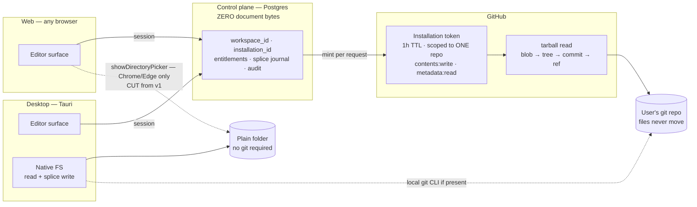

## 101. Reaching the work — GitHub, folders, and what the product is allowed to touch

**The claim: we ask for exactly three permission lines, we never ask for a fourth, and we get pull-request safety without paying for the pull-request permission.** The access story is not plumbing. It is the first thing a stranger judges us on, it is the whole of the B2B security review, and — because our only defensible promise is *we do not corrupt your files* — the permission set is the promise, written in a form GitHub enforces for us. A product that says "byte-preserving" while holding `workflows: write` is lying in a way an org owner can read off a screen.

### 101.1 The three lanes, and which one is real

| Lane | Who reaches the files | Browser support | v1 verdict |
|---|---|---|---|
| **GitHub App** | Server mints a 1-hour installation token, reads a tarball, writes blobs/trees/refs | All browsers | **Ship. The default and, for v1, the only web path** |
| **Local folder, desktop** | Tauri process reads and splices bytes directly | n/a | **Ship in the desktop build only** |
| **Local folder, web** | `showDirectoryPicker()` | Chrome 86+, Edge (mirror), Chrome Android 132+; **Firefox: not supported. Safari: not supported. iOS Safari: mirrors Safari, so not supported** — and the whole API is still flagged `experimental: true`, secure-context only [fetched, MDN browser-compat-data `api/Window.json`, `main`, 2026-08-31] | **Cut.** See §101.5 |

### 101.2 The GitHub App — the exact ask, from the docs

GitHub Apps hold **no permissions by default**; they carry only an implicit read of *public* resources when acting on behalf of a user. Permissions come in four classes — repository, organization, enterprise, account — and the class you request decides who is allowed to say yes [fetched, docs.github.com/apps/creating-github-apps/registering-a-github-app/choosing-permissions-for-a-github-app, 2026-08-31].

| Permission | Level | What it buys | Who needs it, how often |
|---|---|---|---|
| `contents` | **write** | Everything: read bytes, write splices, create blobs/trees/**refs**, HTTPS git access as `x-access-token:TOKEN` [fetched, same page, "Choosing permissions for Git access"] | Every user, every save |
| `metadata` | **read** | Force-granted whenever any other permission is requested; repo listing | Every user, at install |
| `emails` (account) | **read** | Billing contact only | Every paying user, once |
| `pull_requests` | *not requested* | `/pulls` | — see §101.4, we do not need it |
| `workflows` | *not requested* | Writing under `.github/workflows/` | Refused permanently |
| `administration` | *not requested* | Repo deletion, collaborators | Refused permanently |
| **Any organization permission** | *not requested* | — | **Refused for a commercial reason, not a security one** |

That last row is the highest-leverage sentence in this section. GitHub's own rule: *"Repository admins can install GitHub Apps in the organization that owns the repository if the app does not request any organization permissions nor the 'repository administration' permission"* [fetched, docs.github.com/apps/using-github-apps/installing-a-github-app-from-a-third-party, 2026-08-31]. Request one org permission and every install in every company routes through an org owner and a ticket. Request none and Nina (P2) installs Frontmatter on the docs repo she already admins, alone, in forty seconds. **Zero organization permissions is a distribution decision that happens to also be a security decision.**

Token mechanics, all [fetched] from `rest/apps/apps` and the installation-token guide, 2026-08-31:

| Fact | Consequence for us |
|---|---|
| Installation tokens **expire after 1 hour**; an expired token returns `401` | Mint per request, cache under a minute, never persist |
| `repositories` / `repository_ids` narrow a token to specific repos at mint time | One repo open in the editor → one repo in the token. A compromised token reaches one vault, not the installation |
| `permissions` at mint time may be a **subset** of what was granted | Read-only surfaces (search index, publish preview) mint `contents: read` even though the App holds write |
| Since **2026-04-27** GitHub is rolling out a stateless `ghs_APPID_JWT` token format | Anything that assumed a fixed `ghs_` length breaks. Store as opaque text |
| Changing the App's permissions later **prompts every installation owner to re-approve; unapproved installs keep the old permissions** | The permission set is effectively frozen at launch. Adding `pull_requests` later is a re-consent campaign across the whole base, not a deploy |
| Rate limit: installation floor **5,000 req/hr**, +50/hr per repo above 20 repos, +50/hr per user above 20 users, **hard cap 12,500**; 15,000 on GitHub Enterprise Cloud | See the arithmetic below |

**[derived] The rate limit forbids the obvious design.** The founder's own `md` vault holds **5,832 `.md` files** across **5,541 directories**, max path depth 19, **88,137,142 bytes** of markdown [measured 2026-08-31 by `find`/`cat`]. Reading it one file at a time through `GET /contents/{path}` costs 5,832 calls plus a tree call = **5,833**, which is **1.17× the 5,000/hr floor**. It cannot complete inside an hour. The product must read via tarball or a single recursive tree call and write via blob/tree/ref — which is what the current code already does (`/zipball/{branch}`, `/git/blobs`, `/git/trees`, `/git/refs/heads/{branch}`) [measured, `src/shared/infrastructure/github/client.ts`, `src/modules/repository/infrastructure/github-writer.ts`]. Today it does all of that through **one global PAT, `GITHUB_REPO_TOKEN`** [measured, `client.ts:30`]. That PAT is the single largest unshipped liability in the repo.

### 101.3 The consent screen is a conversion surface

The user sees: our app name and avatar, the permission lines, and a repository chooser — *All repositories* or *Only select repositories* — and they grant what is listed [fetched, install-from-third-party page]. Our screen reads, in full:

> **Frontmatter** would like permission to:
> · **Read and write** repository contents · **Read** metadata · **Read** email addresses

Three lines. No "act on your behalf", no organization block, no administration. Compare the alternative we are not shipping: OAuth `repo` is all-or-nothing across *every* repository the user can reach, does not expire, and is invisible to an org owner per-repo. **The App screen is not scarier than the OAuth screen; it is shorter, and it has a repo picker on it.** The one honest cost is a second step — authorize, then install — and an install that can be abandoned. We handle that with a `setup_url` redirect *and* an `installation` webhook, both idempotent on `installation_id`, so a closed tab does not lose the install.

The pre-install page we control does the real work, and it is one screen:

> Frontmatter can only touch the repositories you pick. It cannot delete a repository, change who has access, or edit anything in `.github/workflows/` — we deliberately did not ask for those. Every write is a commit you can read, revert, or blame. Revoke us in one click from your GitHub settings.

That last sentence converts Ondrej (P5) and his security reviewer in one read, and it is checkable — which is the only kind of marketing this product is allowed to do.

### 101.4 PR-based writing versus direct commits

The architecturally honest position is that a product promising not to corrupt files should propose changes rather than apply them. The trap is that a pull request per save is unusable, and `pull_requests: write` is a fourth consent line that we can never add later without re-consenting the entire base.

**The resolution: create a branch, push splices to it, and hand the pull request back to the user.** Creating a ref is `/git/refs` — inside `contents: write`. Opening the PR is the user clicking GitHub's own compare banner. We get review-before-merge at **zero additional permission** [fetched for the permission mapping; the compare-banner behaviour is [SS], unopened].

| Write mode | Permission | Latency | Who uses it, how often | Verdict |
|---|---|---|---|---|
| Direct commit to default branch | `contents: write` | ~1 commit | **Devraj (P1) and Sena (P4)**, on a solo repo, dozens of times a day | **Default when the repo has one human contributor** |
| Commit to a named working branch | `contents: write` | same | **Nina (P2)**, on the shared docs repo, every session | **Default when the repo has more than one contributor** |
| Branch + we open the PR ourselves | `contents` + **`pull_requests: write`** | same | Nobody, in v1 | **Cut.** Buys a button, costs a permission line and a re-consent campaign |
| Fork-and-PR | `contents` on a fork | slow | Nobody | **Cut** |

The rule, stated once: **we never write to a branch the user did not name, and we never write to a protected branch — we branch and say so.** A refusal here is the same refusal the splice engine makes on an ambiguous range, moved up a layer.

Honest cost: branching is a worse experience than saving. Kabir (P3) editing a client handoff does not want a branch. That is why the contributor count decides it, not us.

### 101.5 Local folders without GitHub

Not everyone has a repo, and the web platform does not solve it. `showDirectoryPicker`, `showOpenFilePicker` and `showSaveFilePicker` are all Chrome 86 / Edge (mirrored) / Chrome Android 132, **`version_added: false` on both Firefox and Safari**, and all three still carry `experimental: true` [fetched, MDN BCD `api/Window.json`, `main`, 2026-08-31]. A "open a folder in your browser" feature would work for some users and be invisible for others, on the one surface where a broken promise is most expensive.

**Recommendation: the desktop build owns the plain-folder lane; the web build owns the GitHub lane; neither pretends to be the other.** Tauri reads and splices real bytes with no API, no rate limit and no token. If the folder happens to contain `.git`, we shell out to the local git — we already banned `isomorphic-git` on mobile for measured reasons (§31). If it does not, the file is still the source of truth and history is the user's filesystem; we say that plainly rather than inventing a shadow history.

**Cut, and named as cut:** browser folder access via OPFS import. It copies the vault into the origin's private storage, which makes a second copy of the truth — a direct violation of the projection law — for a user who cannot see the copy. Nobody asked for it. It is cut.

### 101.6 The structure we expect versus the structure we impose

| Requirement | Status | Cost if we got it wrong |
|---|---|---|
| At least one `.md` file, anywhere | **Required** | none |
| Valid UTF-8 | **Required** — `decodeStrict` refuses, never repairs [measured, live] | A refusal on first open is our worst possible first impression |
| Frontmatter present | **Not required** | 18.74% of the founder's own frontmatter blocks are invalid YAML [measured, §7.1] |
| A specific folder layout | **Not required** | This is the whole game |
| `.frontmatter/` sidecar | **Optional**, created only on first use of a feature that needs it, never on connect | A directory we create at connect time is a tool that moved in |
| Files in the repo root | **Not required** | The `md` vault has 35 root-level `.md` of 5,832; `knowledge` has 3 of 602 [measured] |

Real vault shapes, measured on this machine 2026-08-31: `md` — 5,832 `.md`, 5,541 directories, max path depth 19. `knowledge` — 602 `.md`, 122 directories, depth 13. **Any product that requires a flat structure, a `docs/` root, or a naming convention is asking for a migration these two vaults would never survive.** The minimum is: *point at a repo, we read every `.md` under the root you choose, nothing moves.* Everything else — a `boards/` folder, `status:` in frontmatter, a kanban column key — is convention that unlocks a view, and a vault that lacks it simply does not get that view.

### 101.7 Monorepo, multi-vault, submodules

| Case | Behaviour | Rationale |
|---|---|---|
| Monorepo, docs in `packages/docs/` | User picks a **root path** at connect; we read below it only | One extra field on the connect screen. Nina (P2) uses it once |
| Multiple vaults | One workspace = one repo + one root path. Switch, never merge | Merging two vaults into one tree invents a namespace we would then have to write down |
| Two repos open at once | **Cut.** Not in v1 | Nobody named it; it doubles the token, cache and conflict surface |
| **Submodules** | **Refuse, with the path named.** We read the gitlink, we never traverse it | A submodule is a different repository with a different installation. Writing through one commits to a repo the consent screen never mentioned. This is a consent violation, not a limitation |
| Symlink escaping the root | **Refuse** | Same reason, cheaper attack |
| Path under `.github/workflows/` | **Refuse:** "this path needs the Actions permission, which Frontmatter does not hold" | We chose not to hold it. Holding it would make a prompt-injected AI action able to rewrite CI and exfiltrate repository secrets |

### 101.8 The permission ladder

| Capability | Least permission that achieves it | Verdict |
|---|---|---|
| Read one file | `contents: read`, token scoped to one repo | Ship |
| Read the tree / build search | `contents: read` + `metadata: read`, **tarball or one recursive tree call** | Ship — per-file reads are rate-limit-infeasible (§101.2) |
| Write one file | `contents: write` + base blob SHA as compare-and-swap | Ship |
| Write many files atomically | `contents: write` via blob → tree → commit → ref | Ship |
| Create a branch | `contents: write` (`/git/refs`) | Ship |
| Open a PR | `pull_requests: write` | **Refuse in v1.** Branch and hand off |
| Read CI status on a doc | `checks: read` | **Refuse.** Nobody named the person |
| Edit a workflow | `workflows: write` | **Refuse permanently** |
| List org members for seats | any organization permission | **Refuse.** Costs us the repo-admin self-serve install |
| Delete a repo, change collaborators | `administration: write` | **Refuse permanently** |

### 101.9 The access topology

### 101.10 Recommendation, and the strongest case against it

**Recommend:** one GitHub App requesting `contents: write`, `metadata: read`, `emails: read` and **nothing else, ever**; installation tokens minted per request and scoped to the single open repo; tarball reads and blob/tree/ref writes; direct commits on single-contributor repos, a named branch on shared ones, and the pull request handed to the user rather than opened by us; the plain-folder lane shipped only in the desktop build; submodules, symlink escapes and `.github/workflows/` refused by path with the reason named. Delete `GITHUB_REPO_TOKEN` before the first external user.

**The strongest argument against:** by refusing `pull_requests: write` we have chosen a permission set we can never widen without re-consenting every installation, and the thing we gave up is exactly the flow that makes us safe for teams. Nina's reviewer wants a PR with a title, a body listing the splices, and a check that the degradation certificate is clean. "Go click the banner GitHub showed you" is not that product; it is us optimising our consent screen at the expense of her workflow — the same shape of trade Obsidian made when it chose fuzzy patching so users would never see a conflict. If B2B is the revenue, `pull_requests: write` belongs in the *launch* permission set, taken once while the installed base is small enough that re-consent is a non-event. That decision has a deadline, and the deadline is the first paying team.
