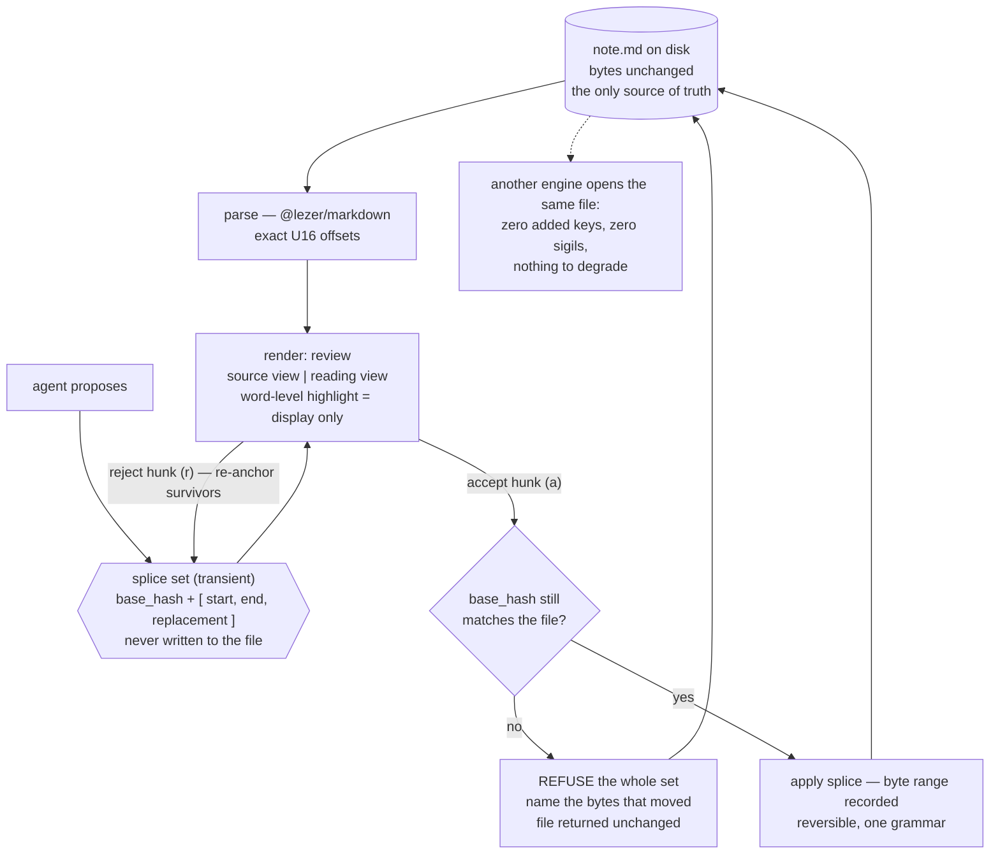

Reconcile verified (18th, unchanged): `~/.claude` HEAD `6e390828`, frontmatter HEAD `484f579`, no commits from this run; the dirty `skills-src/` paths and `settings.json` are pre-existing.

---

**The one-line finding: the founder's repeated example is the least-demanded render measurable anywhere — decision records are 563 downloads out of 143,283,562 in the Obsidian registry (0.0004%), 3 plugins out of 7,079, 0 of 1,600 Reddit posts, and 23 comments in Hacker News history — while the render nobody in the record has named as a candidate priority, the review surface over a proposed edit, has 452 issues in one repo, 84.5% of them filed in 2026.**

---

### The inconvenient part, before the ranking

Two findings cut against building a render suite at all.

**1. A third of the demand for the winning render is a demand to leave your product.** I pulled all 452 `anthropics/claude-code` issues with "diff" in the title and classified them by keyword (buckets overlap; 60.4% matched at least one). [measured]

| Bucket | n | % of 452 |
|---|---|---|
| Open it in my IDE's diff tool (VS Code, JetBrains, Monaco, editor tab) | 146 | **32.3%** |
| Readability / rendering / theme / layout / collapse | 115 | 25.4% |
| Per-hunk accept / reject / inline approval | 54 | 11.9% |
| Diff missing, bypassed, or silently absent | 29 | 6.4% |
| Wrong or stale baseline | 20 | 4.4% |
| *Feature-request-shaped* | *159* | *35.2%* |
| *Created in 2026* | *382* | *84.5%* |

The single largest bucket is people asking for the diff to appear somewhere else. Any render we build competes with an IDE the user already has open. [inference]

**2. The audience you measure decides the answer, and the two audiences disagree completely.** Same eight render concepts, two populations, denominators stated. [measured]

| Render concept | Obsidian registry share of 143,283,562 downloads | r/ObsidianMD posts (n=1,600) | `claude-code` issues (n=88,112) |
|---|---|---|---|
| Query / database view (Dataview, Bases) | 5.0% | **15.88%** | — |
| Task / checklist | 5.6% | 6.75% | 0.12% (`task list`) |
| Table | 3.4% | 4.62% | 0.14% |
| Diagram incl. canvas | 8.8% | 4.38% | 0.012% (`mermaid`) |
| Calendar / timeline / gantt | 6.0% | 2.62% | 0.005% (`roadmap`) |
| Kanban / board | 2.3% | 2.44% | 0.006% |
| **Diff / review / compare** | **0.26%** | **0.81%** | **0.51% diff + 0.79% review + 0.47% accept** |
| Decision record / ADR | **0.0004%** | **0.00%** | — |

Frames: Obsidian registry snapshot 2026-08-31, 7,079 plugins carrying both metadata and stats. r/ObsidianMD via the arctic-shift archive, 1,600 posts, 2025-09-01 → 2025-10-03 — a **33-day census, not a year**; the archive dropped requests after that and I am not going to call a month a year. `reddit.com/*.json` returns HTTP 403 here, consistent with prior rounds. GitHub search unauthenticated, `in:title` only, so every issue number is a title-substring count and undercounts bodies.

A self-caught correction that matters: `plan in:title` in `claude-code` returns **2,451**, which looks like the biggest signal on the page. Reading the top 100 by comment count, most are billing ("Max plan", "plan upgrade payment fails"). The honest counts are `"plan mode"` **803 (0.91%)** and `"plan file"` **175 (0.20%)**. [measured, self-corrected] A word that means two things is not a measurement.

---

### The eight candidates, scored

| # | Render | Who looks | How often | Replaces | Build | Round-trips? | Degrades? | Verdict |
|---|---|---|---|---|---|---|---|---|
| 1 | **Review over a proposed edit** | anyone with an agent | every agent turn | the IDE diff tab; `git diff` | S — a viewport on the splice list | Exactly — accept *is* a splice | **Perfectly: adds zero bytes** | **SHIP** |
| 2 | Table editor over a GFM table | writers, analysts | weekly | table-editor-obsidian (3,153,561) | S | CELL-SET byte-exact, with named hazards | The table itself | Keep, v1.1 |
| 3 | Checklist with real state | everyone | daily | nothing | XS | 1-byte `[ ]`→`[x]` | Native GFM | Keep — but it is an interaction, not a render |
| 4 | Kanban from frontmatter | PM-ish users | daily-ish | obsidian-kanban (2,607,917) | S | BODY-MOVE provable | `
<h2>render: board</h2>` | Cut from v1 |
| 5 | Dependency / reference graph | maintainers | on merge | our own `check-refs` | M (vault index) | NONE — read-only | n/a | Cut as a render; ship as a gate |
| 6 | Roadmap / timeline from dates | founders, weekly | weekly | Gantt plugins | M (vault index, C2) | KEY-SET on drag | Dated headings | Cut |
| 7 | Flow diagram from a list | doc readers | rarely | mermaid, which GitHub renders | M–L (layout engine) | NONE | To source code | Cut |
| 8 | Decision flow / decision card | almost nobody | almost never | ADR templates | S | BODY-MOVE | Heading section | **Cut — the evidence is brutal** |

---

### Why five die

**Decision flow / decision card (8).** This is the founder's recurring example and it has the weakest evidence in the round. Three plugins in a 7,079-plugin registry match `adr|decision record`, with 437, 84 and 42 downloads — the largest is a coding-agent memory plugin that merely mentions architecture decisions in its blurb, so the only genuine ADR-authoring plugin (`madr`) has **42 downloads, ever**. [measured] Zero of 1,600 Reddit posts mention ADRs. The prior round's ADR census found the median repo writes 5.5 records in one sitting, spans 24.5 days, and 59% add none after the first month. The card is not hard to build; there is no one to build it for. What survives is the *mechanism* — a card is a heading section plus a `render:` switch, and the profile machinery costs the same whether we ship one profile or nine. Ship the mechanism, do not lead with this profile.

**Flow diagram from a list (7).** I pulled 1,684 HN comments matching mermaid across 2025-01-01 → 2026-08-31 and recounted literally: **867** contain the string. Negative-marker comments 97 (11.2%), positive 84 (9.7%) — a ratio of **1.15:1**, i.e. mermaid is fine and nobody is desperate. **17.9% co-mention an LLM**, and the pattern in those is always the same direction: the model writes the mermaid, a renderer draws it. [measured] The complaints that exist are about the layout engine — one commenter, 2025-01-17, on why people use it at all: it is "low friction and most editors support it" ([42743436](https://news.ycombinator.com/item?id=42743436)), immediately followed by a complaint about its layout. Another, 2025-01-18, after asking Claude for a diagram: "The resulting mermaid source had a syntax error" ([42749563](https://news.ycombinator.com/item?id=42749563)). In `mermaid-js/mermaid`, 55 of 3,806 issues (1.4%) name a syntax error in the title and 37 (1.0%) a parse error. So the two things we could add are a better layout engine (a graph-layout research problem, the opposite of trickily cheap) or syntax repair (guessing, which the engine's charter forbids). GitHub, GitLab and Obsidian all render mermaid already. `mermaid in:title` in `claude-code`: **11 of 88,112**. Cut.

**Roadmap / timeline (6) and dependency graph (5).** Both need a vault-wide index, which §9.3 correctly prices as the first surface costing real architecture. `roadmap in:title` returns 4 issues in 88,112. The dependency graph is the interesting cut: this repo's own `check-refs.mjs` found real defects, which is exactly the trap — *it found them as a failing check, not as a picture*. A red CI line naming the broken reference is strictly more useful than a force-directed graph, costs a fraction, and needs no render at all. Ship it as a gate. The record already measured zero of 89 feature requests mentioning graph view.

**Kanban (4), and whether a read-only board crosses the PM line.** Argued honestly: a read-only board is genuinely not project management. It has no assignees, no scheduler, no notifications, no permissions, no rollup. It is `GROUP BY status:` with rounded corners, and refusing it on principle would also refuse the table view, which nobody wants to refuse. The line is not read-versus-write; it is **whether the view acquires facts the file does not contain**. A board that reads `status:` is a projection. A board that adds a swimlane, a WIP limit or a due-date reminder has acquired state with no textual home, and is a PM tool. The boundary is defensible and the board sits on the safe side of it. It still loses v1, on audience: 2.3% of registry downloads, 5 issues in 88,112, and it is the most crowded shape in the category — the record's own falsifier (Obsidian shipping a first-party board first) is unresolved. Second profile, not first.

---

### The one that ships: `render: review`

**Every other candidate must buy its place in the file with a `render:` key. This one costs zero bytes.**

That is the argument, and it is measurable. §9.3 measured that a single frontmatter key `render: board` degrades to `
<h2>render: board</h2>` in marked 16.4.2, markdown-it 15.0.0 and commonmark 0.31.2 — a setext H2 outranking the document's own H1, roughly 15 characters of junk per key. The review render adds **no key, no fence, no sigil, no body construct**. During review, the file on disk is byte-identical to what it was before the agent spoke. There is nothing to degrade because there is nothing there. Every competing render is a bet that the junk is worth it; this one has no bet to lose.

The second argument is that it is not a new subsystem. Principle 6 already says *one grammar for every change — human suggestion, AI edit, sync conflict*. A proposal is a splice set: `{base_hash, hunks: [{start, end, replacement}]}` in the engine's existing `U16Offset` space. The review render is the **viewport on a data structure the engine has to produce anyway**. The cost is the display layer, not the model.

**The source.** Unchanged. `docs/spec.md` at hash `a1b2…`.

**The proposal.** A transient sidecar the render never persists and never writes into the document: hunks, byte ranges, replacement text, plus the base hash. It exists between the agent speaking and the user deciding, and then it is gone. This is the one place a sidecar is legitimate under the projection law, because the law forbids a *view* owning state — here the state is the input, not the view, and its lifetime is one decision.

**The view.** Two toggles, no configuration. *Source* shows the byte ranges in monospace, which is what a reviewer of a splice engine deserves. *Reading* renders both sides and highlights at word granularity inside the changed block — presentation-only, never on the write path. This distinction is load-bearing: the memory note records diff-match-patch measured **non-idempotent while returning true**, so a fuzzy patcher must never touch bytes. Exact offsets write; Myers over a few hundred characters decorates. That is the "trickily cheap" property the founders want — O(1) per hunk on the write path, and the expensive-looking part is a discardable few-hundred-character computation.

**The interaction.** `j`/`k` between hunks, `a` accept, `r` reject, `e` edit-then-accept. Accept applies the splice and records the byte range. Reject drops it and re-anchors the survivors — offset arithmetic the engine already owns.

**The refusal, which is the whole product in one gesture.** If the file's hash no longer matches `base_hash`, refuse the entire set and say which bytes moved. Two shipped bugs in the market leader are exactly this failure: #87943, sequential edits diffing "against a stale snapshot", and #90196, a compare view baselining "against repo default branch, not the branch selected at session start". A third, #90599, reports that bypass mode routes edits through `sed` and heredocs, "silently removing all edit diffs". A refusal engine cannot ship any of those three. This is the only candidate where the differentiator *is* the refusal rather than the rendering.

**Demand, in the audience we actually sell to.** In `claude-code`: `review` 694 (0.79%), `accept` 410 (0.47%), `diff` 452 (0.51%), `suggestion` 260 (0.30%). Across all of GitHub, `"word diff" in:title` returns **873** issues, `"semantic diff"` 500, `"markdown diff"` 393, `"rich diff"` 176 — a real, un-owned appetite for diffs that understand prose. The most-commented requests are specific and unbuilt: #61794 "per-hunk accept/reject diff UI for file edits" and #78238 "reviewable diff/changeset after auto-accepted edits". [measured, 2026-05-23 and 2026-07-16]

**The honest counter, restated so it is not buried.** 32.3% of that demand is for the diff to open in VS Code or JetBrains. We do not win those users. We win the ones whose artefact is a *document* — a spec, a handover, a plan — where an IDE line-diff is the wrong instrument, and where 84.5% of the complaints are less than nine months old. The Obsidian registry says review plugins are 0.26% of downloads, and that number is real and should stay on the page; it describes note-takers who have no agent proposing edits. That population is changing fast: `realclaudian` (1,958,668) and `copilot` (1,783,652) are both top-20 plugins in the whole registry, and AI/agent plugins are 759 of 7,079 (10.7%) and 6.1% of downloads. [measured]

---

### WHAT THIS MEANS FOR THE PRODUCT

- **Build `render: review` as the v1 render, and build it as a viewport on the splice list, not as a diff feature.** Its unique property is that it adds zero bytes to the file, so it is the only candidate with no degradation cost at all. Sell the refusal — a stale-base rejection — as the headline, because three separate shipped bugs in the market leader are that exact failure.
- **Do not build the decision card first, and say so out loud.** 42 downloads for the only genuine ADR plugin in a 143.3M-download registry, 0 of 1,600 Reddit posts, 3 of 7,079 plugins. Ship the profile *mechanism* (a `render:` switch over a heading section) and let the decision card be one cheap configuration of it, never the demo.
- **Kill the flow-diagram render.** Mermaid sentiment on HN is 1.15:1 negative-to-positive across 867 literal mentions — nobody is in pain, GitHub already renders it, and the only two improvements available to us are a graph-layout engine or syntax guessing, one of which is expensive and the other of which the engine's charter forbids.
- **Demote the dependency graph from a render to a CI gate.** It caught real defects in this repo as a failing check. A picture would have caught the same defects later and cost a vault index.
- **Reclassify the checklist as an interaction, not a render.** The `[ ]`→`[x]` splice is one byte, has a textual home, degrades natively, and needs no `render:` key. It should be free in the existing preview, not a surface.
- **Ship the table editor second, with its hazards written into the certificate.** 3,153,561 downloads and 4.62% of Reddit posts justify it; §9.5's measured round-trip hazards (escaped pipes, CJK display width, silently padded ragged rows) mean it must ship with a per-construct degradation statement rather than a promise of fidelity.
- **Watch one number to know if the review bet is wrong.** If "open it in my IDE"-shaped requests keep outgrowing in-product diff requests in the agent ecosystem, the correct product is an export that hands a splice set to someone else's review surface — not a render at all.
