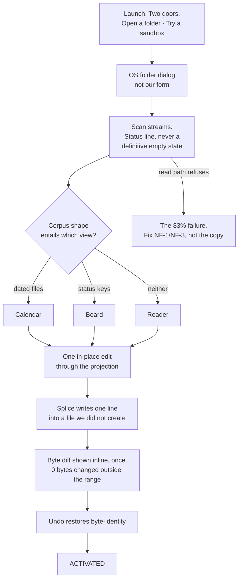
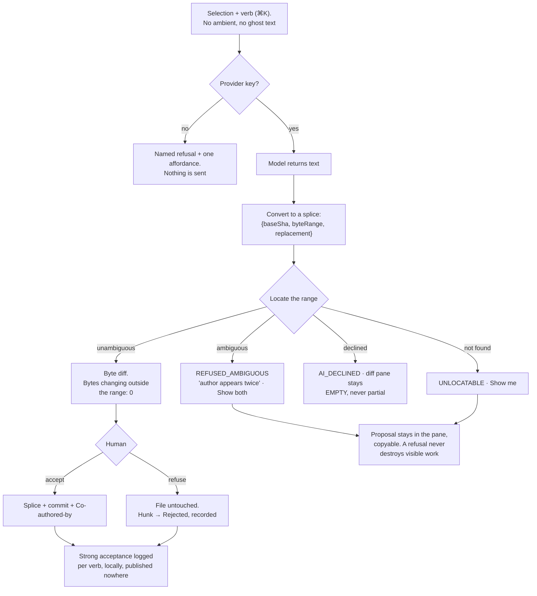

Reconcile verified: `~/.claude` HEAD `6e390828`, frontmatter HEAD `484f579`, unchanged; 19 dirty paths pre-existing. Read-only session, no writes, no commits.

---

**One line: five of the six flows begin with the same step, that step currently fails 83% of the time, and the flow the record is proudest of — generate a handover — is the one the pain evidence says to demote from a button to an outcome.**

---

**The number that governs every flow.** The engine refuses 6,613 of 6,614 foreign files on zero-indent block sequences, 83% aggregate `[project-measured, docs/FRONTMATTER-MASTER-PLAN-2026-08-28.md:135; not re-verified]`. §18's `Z` target is ≥99.9%; today it is 17%. Flows 1, 2, 4, 5 and 6 all open with "point at a folder you already own". [derived] A user who tries ten of their own folders meets the refusal in **8.3 of them**. §74.3 already names the arithmetic and the remedy: fix NF-1 and NF-3, do not soften the refusal. Every "most likely to lose the user" step below is downstream of that one, and I have marked where it is the real cause rather than the flow's own design.

**The second constraint, from this round's pain research.** Person-to-person handoff is 18 of 2,540 Reddit posts (0.7%) and 81 of 88,109 claude-code issues (0.09%); AI-plus-documents runs 6.7:1 negative across 33,647 posts; the only empirical study of AGENTS.md files finds LLM-generated ones *marginally negative* on task success. So no flow below may end in "here is a document we wrote for you." Each ends in a **file the human adjudicated**, and the artefact's length is a function of the evidence, never of a model's verbosity.

---

### Flow 1 — First run to first value

| # | State | User sees | System does | Failure, and what it looks like |
|---|---|---|---|---|
| 1 | Cold | Two doors: **Open an existing folder** (primary), *Try a sandbox* (secondary). No email, no OAuth, no tour, no What's New `[fetched: NN/g, §17]` | Nothing. No network call | None available |
| 2 | Picking | The OS dialog — not a form we drew | Requests read access | Permission denied → one line, one button, no modal |
| 3 | Scanning | A status line that counts up: files found, projections available, projections unavailable **and why** | Streams the walk; `decodeStrict` refuses rather than repairs | **The killer.** Today: "163 of 1,040 files could not be read." That is the 83%. Never show a settled empty state mid-scan `[fetched: NN/g names this the most damaging empty-state pattern]` |
| 4 | Landed | The view the bytes entail — calendar, board, or reader. Disabled-but-visible siblings in the selector | Segments implicitly by corpus shape. **Asks nothing** | Ambiguous corpus → reader, always. Never a "which view?" dialog: that is M3, rejected |
| 5 | Empty projection | The board on a corpus with no `status:` names the key it looks for, shows the exact line, offers one button that adds it to one file | Pull revelation, not push `[fetched: NN/g guidelines 2–3]` | If the file refuses the write, the button must not have been offered — entailment, not prediction (M8) |
| 6 | The "oh" | Drag one card, or type one cell. The row moves; the file changes | Splice against `baseSha`; inline byte diff, once | `UNSAFE_KEY` / `REFUSED_AMBIGUOUS` → field stays open with typed text intact, §40 four-slot template |
| 7 | Confirmed | ⌘Z. The file is byte-identical to before | Reverse splice | If undo is not byte-identical, the product has no thesis. `R` = 100%, non-negotiable |

**Six steps, two clicks and one drag, and no form.** The defence is structural, not taste: a form at first run adds a *concept* (C ≤ 3: file, folder, view) and a *disclosure level* (D ≤ 2), and §18 rejects M3 staged disclosure outright — "everyone pays the sequence every time." §17 additionally bans the consent modal in this exact slot. There is no legal or technical requirement for a single field before step 7, because there is no account, no server call and no key needed to reach it.

**Most likely to lose the user: step 3.** Not the design — the `Z` number. **What we do:** ship NF-1 and NF-3 first, and *split the read path from the write path* so that a construct the writer cannot address never blocks the reader. The honest status line until then is a guarantee, not an apology: "1,040 files open. 163 use a list style the editor will not edit yet. None have been modified."

---

### Flow 2 — Work in the vault → handover or decision record → committed

The pain evidence is hostile to this flow as usually built: 89 Show HN launches of exactly this artefact in 20 months, median 2 points, 88 of 89 under 50; 59% of ADR repos add zero records after the first 30 days; the 2026 ADR "renaissance" is machine-authored at 247 records in a single day. So the trigger is not a button.

| # | State | User sees | System does | Failure |
|---|---|---|---|---|
| 1 | Working | Nothing. **No "Generate handover" action exists on the home surface** | Watches `derives_from: <id>@<sha>`; when an upstream doc changes, downstream flips to `stale` | A trigger that fires too often becomes chrome and is muted |
| 2 | Prompted | A single line in the strip: "3 decisions were made in files this week that no record cites." One affordance: `Assemble` | Enumerates *citable events only*: commits, resolved hunks, loop-doc state transitions | Nothing citable → **no offer is made**. Silence is the correct output |
| 3 | Assembling | Progress on a real corpus, not a spinner | Every candidate paragraph is bound to a byte range or a sha. Model writes prose *around* citations, never facts without one | Model produces an uncited claim → paragraph is emitted with a `no source` badge and excluded from bulk accept |
| 4 | Proposed | The draft lands in `.frontmatter/inbox/`, `state: draft` — **never into the curated vault** (§12) | `land()` with `base_version` | `REFUSED_CONFLICT` if the target drifted; the file is shown, not silently rebased |
| 5 | **Approving** | The review surface. Per-hunk accept, filtered by author *including the agent* (§13). `Accept all` is **disabled while any uncited paragraph remains** | Adjudication ladder; resolution is an authored thread event, never a silent boolean | Bulk-accept without preview is the Cursor/Windsurf regression that got publicly burned |
| 6 | Committed | One commit, `Co-authored-by`, `derives_from` ledger appended | Accept = splice against `baseSha` | Reject = file untouched, quote preserved |

**Where the human approves: step 5, per hunk, and the approval is the artefact.** `approved.mode ∈ {explicit, timer, policy}` is recorded, so a rubber-stamped record is visibly rubber-stamped (Jules auto-approves on a timer; we make that legible rather than impossible).

**Most likely to lose the user: step 5, by length.** A 3,000-word generated handover is precisely the artefact r/ProductManagement describes at 6.7:1 negative — *"now I spend my days reviewing AI generated garbage and re-writing it"* [fetched, redd.it/1up64mw, 2026-07-06]. **What we do:** cap the proposal at what is cited. If four decisions are evidenced, the record has four sections. A missing section is rendered as a refusal in §40's shape — "No Decision section. There is no record of an alternative being rejected." — not as filler.

---

### Flow 3 — Kickoff prompt: the user's task, the user's agent

This is the flow with a genuine vacancy. Across 11 surveyed systems the prompt is persisted by **zero** and verification by **zero durable implementations** (§14.4). It is also the only flow that costs us no AI spend, which matters at ₹299.

| # | State | User sees | System does | Failure |
|---|---|---|---|---|
| 1 | Task in hand | Selects a spec section or a task row. ⌘K → `Prepare a task for my agent` | — | Nothing selected → the command is not offered |
| 2 | Composing | A preview pane: the ask, `constitution.md`, the exact files with shas, the verify criteria | Writes `.frontmatter/loop/<id>/prompt.md`, `state: draft` | Files exceed a budget → `BUDGET_BYTES`, names the constant, offers "first section only" |
| 3 | Ready | **One button: Copy.** Clipboard carries the prompt plus one line telling the agent how to return the result | No model call, no key required | Clipboard blocked → the file path is shown; the prompt is on disk regardless |
| 4 | **Outside** | They paste into Claude Code / Codex / Cursor. Our app shows the loop doc waiting, not a spinner | Nothing runs | We cannot see failure here at all, and must not pretend to |
| 5 | Return, path A | The agent calls `land(path, type, body_md, base_version)` | Read-before-patch on `base_version`; LANDED → inbox lane | Drift → `REFUSED_CONFLICT`; the agent is told to re-read, not merged over |
| 6 | Return, path B | A plain **"Paste your agent's output here"** box | Same splice, same review surface | The user pastes prose with no target → `NEEDS_TARGET`, one picker |
| 7 | Reviewed | Hunks. Accept → splice + commit | Appends a `verify.md` row: `{claim, command, exit_code, output_digest, at}` | No command was run → the row records *unverified*, and says so |

**Most likely to lose the user: step 3→4, the paste.** Two reasons, one of which we must not paper over. The user leaves our surface; and HANDBOOK.md (arXiv 2607.25398, 824 criteria, 65 tasks) measures the strongest model at **36.2%** adherence to a perfect, expert-written standing document. **What we do:** do not sell adherence — we cannot deliver it and the benchmark says nobody can. Sell the round trip: the result comes back *addressable, diffable and refusable*. And ship path B (step 6) before path A, because most users will not install an MCP server on day one and a flow whose only return path is an integration is a flow with a cliff in the middle.

---

### Flow 4 — The AI edit: propose, diff, accept or refuse, commit

| # | State | User sees | System does | Failure |
|---|---|---|---|---|
| 1 | Selection | A verb list in ⌘K, scoped to the selection. **No AI button at rest** (V0 = 9 forbids it) | — | An ambient suggestion spends trust the product cannot refill — 3.1% of ~33,000 developers highly trust AI output `[fetched, SO 2025]` |
| 2 | Keyed | If no BYO key: one refusal, one affordance | Nothing is transmitted | — |
| 3 | Proposed | The proposal text, not yet a diff | Converts output to `{baseSha, byteRange, replacement}` | Model returns a whole rewritten file for a two-sentence ask → treated as `rewrite` mode, and labelled as such |
| 4 | **Located** | Either a diff, or a refusal in §40's four slots | Locate-or-refuse. Never guess | This is the soul: `REFUSED_AMBIGUOUS`, `UNLOCATABLE`, `AI_DECLINED` |
| 5 | Diffing | Byte-level. And one line that is the whole product: **bytes changing outside the selected range: 0** | — | Show it as an artifact, never badge it (§40) |
| 6 | Adjudicated | Accept / Refuse per hunk | Accept = splice + commit. Refuse = untouched | Auto-repair on refusal is the one move that forfeits the position (ESLint fix-vs-suggestion boundary) |
| 7 | Measured | Nothing | Strong acceptance per verb, local. Kill a verb below 20% | Ansible Lightspeed's 49.08% is a ceiling for a *constrained* verb, not a target `[fetched, arXiv 2402.17442]` |

**Most likely to lose the user: step 4, when the model produced something good and the engine will not place it.** This is where "refuses rather than guesses" reads as "your product is broken." **What we do:** three things, in order. Give splice the discriminated-union return it does not have — today a refusal is byte-identical to a successful no-op across **20 `return src` sites**, and `PropertiesPanel.tsx` drops it at `if (!onEdit || next === content) return;` `[measured, §40]`; keep the proposal alive and copyable so a refusal never destroys visible work; and name the recoverable act ("`author` appears twice here. Delete one, then try again"), never the mechanism. `git`'s own counter-example is the standard: `fatal: refusing to merge unrelated histories` is 44 characters and never names the flag that fixes it.

---

### Flow 5 — The conflict: two devices, divergent edits. T0.

| # | State | User sees | System does | Failure |
|---|---|---|---|---|
| 1 | Offline ×2 | `Saved` on both. Never "Fully synced" | Local `base_bytes`, `working_bytes`, splice journal | Forum topic 116380: a sync UI reported "Fully synced" while 10–15 characters were missing `[fetched]`. Never ACK without a digest match |
| 2 | Reconnect | Nothing | Fetch bytes + etag | — |
| 3 | Merge | **Nothing, in the majority case.** Disjoint paragraphs merge silently | diff3 over the **stored true base** — never a diff against the winner | `--union` is banned in every code path: M6 shows it emitting a document with two `title:` keys, exit 0 `[measured]` |
| 4 | Divergent | The save chip flips `Saved` → **`Conflict`**. One of three states already in V0 | Writes `note (conflict laptop rev 412).md` holding *your* bytes; server bytes remain the file | Never write `<<<<<<<` into the user's `.md`. M9: a file already containing markers produces nested, unparseable output |
| 5 | **Resolving** | Two panes: **This device** / **The other device**. The differing region highlighted. Three buttons: `Keep this` · `Keep that` · `Keep both`. **Zero git vocabulary** — no merge, HEAD, rebase, branch, ours, theirs | Chosen bytes CAS-uploaded | If CAS fails, return to step 2. Another device won; say so in one line |
| 6 | Done | Chip returns to `Saved`. The conflict copy stays until dismissed | Journal records the resolution | Nothing is deleted, either way |

**Most likely to lose the user: step 4 — the conflict occurring at all.** M8 is the evidence against our own position: `item\t` versus `item␣␣` produces conflict markers for a divergence no human can see `[measured]`. If our conflict rate materially exceeds Obsidian's, "refuses rather than guesses" reads as "loses my flow" and the churn is never attributed to it. **What we do:** sentence-normalised token stream before diff3 so raw-line granularity does not conflict on every co-edited paragraph; whitespace-only divergence resolved toward local bytes and recorded in the journal rather than raised; and ship **conflicts per 1,000 syncs, sliced by cause, as a published metric with a budget**. If the budget breaks, the fix is finer granularity — never a fuzzier apply, which is measurably how `diff-match-patch` produces `one two three four four` and returns `true` `[measured]`.

---

### Flow 6 — A second person picks up the work

| # | State | User sees | System does | Failure |
|---|---|---|---|---|
| 1 | Invited | A repo, not an account. She clones or opens the folder | — | An invite that requires our server to work has made git a decoration |
| 2 | First run | Flow 1, with one difference: `.frontmatter/` already exists, so the entailed view is immediate | Same scan, same refusal risk | Same 83% exposure. Her first impression is our worst number |
| 3 | **Orienting** | Not a document. **The open-state list**: unresolved hunks, loop docs by `state`, `verify.md` rows, and anything `stale` | Derived at read time from files, never stored | If she lands on a stale generated handover, we have reproduced the AGENTS.md finding — LLM-written context files are *marginally negative* on task success |
| 4 | Coordinating | Presence badge, no cursor: "Sagnik has this file open, last edit 2m ago" | Ephemeral | Live cursors create the fishbowl and cost $5.28/user/month at 2h/day — above both price tiers `[derived, §34]` |
| 5 | Working | A branch. Her edits arrive to him as hunks, same grammar as AI edits and conflicts | Splice + `Co-authored-by` | No document freezes; governance is branch-protection semantics |
| 6 | Handing back | A handover is **generated on demand as a projection over open state**, never stored | — | A stored handover is stale the moment it is written; `stale_after` and `derives_from` make that visible instead of requiring someone to notice |

**Most likely to lose the user: step 3.** The evidence says she does not want a document — 0.7% of Reddit posts, 0.09% of claude-code issues — she wants to know what is unfinished, and *"why would I read your AI-generated documentation when I can ask my AI to read the code?"* [fetched, HN 49008803, 2026-07-22]. **What we do:** make the pickup surface derived state, and make the handover a *render* of it. The document is the export, not the record.

---

### The six loss points, in one place

| Flow | Step | Cause | Fix |
|---|---|---|---|
| 1 First run | 3, the scan | `Z` = 17% | NF-1, NF-3; split read path from write path |
| 2 Artefact | 5, review length | Slop fatigue, 6.7:1 negative | Length = f(evidence); bulk accept gated on citations |
| 3 Kickoff | 3→4, the paste | Leaves our surface; 36.2% adherence ceiling | Ship the non-MCP return path first; sell the round trip, not obedience |
| 4 AI edit | 4, locate-or-refuse | Refusal is byte-identical to a no-op at 20 sites | Discriminated union return **before** this flow is built |
| 5 Conflict | 4, conflict occurs | M8, invisible whitespace divergence | Sentence-normalised diff3; publish conflicts/1,000 syncs |
| 6 Team | 3, orienting | Stale authored handover | Pickup = derived open state; handover is a projection |

---

**WHAT THIS MEANS FOR THE PRODUCT**

- **Do not ship any of these flows until NF-1 and NF-3 land.** Five of six open with a folder scan that currently fails 83% of the time; every flow above inherits that as its first failure. Surface work before `Z` is decoration on a broken door.
- **Give splice the `{ok:false, reason, at, detail, hint}` return before building Flow 4.** A refusal that is byte-identical to a no-op at 20 sites cannot be rendered, so the product's soul is currently unbuildable. This is the single highest-leverage engineering item in the set.
- **Kill the "Generate handover" button.** Make generation an *outcome* of staleness detection with an offer that is silent when there is nothing citable. The artefact this product plans to sell has been launched 89 times on HN with a median of 2 points; the shape that has never been tried is evidence-assembled and human-adjudicated.
- **Build the kickoff-prompt flow, and build the paste-back return path before the MCP one.** `prompt.md` is persisted by 0 of 11 systems and `verify.md` by 0 of 11; that is the only true vacancy the survey found, and it costs us no inference spend at ₹299.
- **Ship the conflict UI with a three-word vocabulary and publish conflicts per 1,000 syncs.** T0 is not won by a good merge algorithm; it is won by a non-expert seeing `Keep this / Keep that / Keep both` and never seeing `<<<<<<<`. The metric is the falsifier for the whole git-merge decision.
- **The team flow should not produce a document at all.** Derived open state is the pickup surface; the handover is its export. This is the one place the evidence says our stated thesis is wrong in shape, not just in emphasis.
