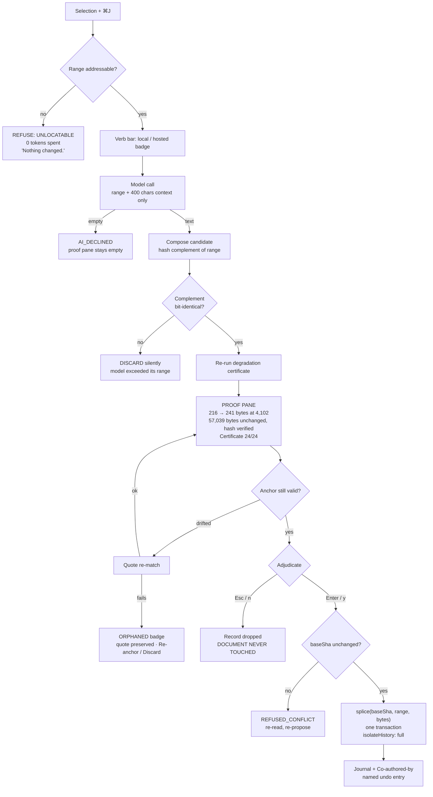

Reconcile clean — no writes, no commits by this subagent; the flagged dirt pre-dates the session and all scratch stayed in `$TMPDIR/fm3`.

---

Ghost text — the one AI interaction §11.4 of the record explicitly refuses ("no ghost text by default") — is already shipped in our tree at `src/modules/editor/presentation/ghost-text.ts` (163 lines, wired through a CodeMirror compartment at `CodeMirrorEditor.tsx:211`), and it is the second shipped feature this round that does the exact thing frontmatter exists to refuse. [measured]

**Sources opened.** All via `curl` this session; `WebFetch` never attempted. Read-only throughout: no writes, no commits, no mutating commands.

| Source | URL / endpoint | Status | Date on artifact |
|---|---|---|---|
| Apple Foundation Models framework | `developer.apple.com/documentation/foundationmodels/*.md` (6 pages, incl. `SystemLanguageModel`, `UseCase/contentTagging`, `generating-content…`, `improving-the-safety…`) | 200 | availability **iOS/macOS 26.0+**, three model versions listed (26.0–26.3, 26.4, 27.0) |
| Chrome built-in AI — Prompt API | `developer.chrome.com/docs/ai/prompt-api` | 200 | Published 2025-05-20, **last updated 2026-08-26**; Chrome 138 / 148 |
| Sourati et al., *The Shrinking Landscape of Linguistic Diversity* | `arxiv.org/abs/2502.11266` | 200 | v2 **2026-08-24**, "Published in Nature Human Behaviour" |
| Jakesch et al., *Co-Writing with Opinionated Language Models Affects Users' Views* | `arxiv.org/abs/2302.00560` | 200 | 2023-02-01 |
| Lee, Liang, Yang, *CoAuthor* | `arxiv.org/abs/2201.06796` | 200 | v2 2022-01-25 |
| Arnold, Chauncey, Gajos, *Predictive text encourages predictable writing* | OpenAlex `api.openalex.org/works` (full abstract) | 200 | 2020, 84 citations |
| Buschek, Zürn, Eiband, *Multiple Parallel Phrase Suggestions* | OpenAlex, full abstract | 200 | 2021, 106 citations, N=156 |
| HN Algolia | 315 unique comments over 4 prose-autocomplete queries + 122 over 5 AI-undo queries + full trees for 3 threads | 200 | — |
| `arxiv.org/search`, `export.arxiv.org/api` | — | **429 / 400** after 5 calls | rate-limited; fell back to `/abs/` and OpenAlex |
| `api.semanticscholar.org` | — | **429** | not used |
| `forum.obsidian.md/search.json` | 45 topics on `autocomplete` | 200, then **503** | throttled after one query |
| Ulysses, Craft, Notion AI docs | — | not opened | **[SS]** |

---

**WHAT WE ACTUALLY SHIPPED, MEASURED AGAINST §11.4.** This is the round's first deliverable, because the design below is a correction, not a greenfield.

| §11.4 refusal | Live code | Verdict |
|---|---|---|
| "No ghost text by default" | `ghost-text.ts` exists; `editor-settings.ts:41` sets `aiGhostText: false` | **Half-honoured.** Off by default, but built and shippable behind a Settings toggle labelled "AI autocomplete" (`SettingsModal.tsx:18`) |
| "Every verb comes back as a **proposed change** you can see before it touches the file" | `SgnkAiButton.tsx:254-287` — `insertBelow` and `replaceSelection` **dispatch the text into the document first**, then show a tint and a Keep/Undo pair | **Violated.** We write bytes, then ask |
| Splice writer guarantees nothing unselected is rewritten | The AI path never touches `spliceFrontmatterValue`; it is a raw CodeMirror `changes:` dispatch | **Not wired** |
| Byte-anchored everything | `applied = {from, to}` is React state, **never mapped through document changes**, while the decoration field at `ai-suggestion.ts:44-47` *is* | **Byte-destroying bug** (below) |

Two more measurements that matter for the design:

- `grep -rn "addToHistory\|isolateHistory\|invertedEffects" src/` returns **exactly one hit** in the whole tree (`CodeMirrorEditor.tsx:315`). Zero AI code path annotates the undo history. [measured]
- CodeMirror 6 defaults, read from the installed package: `newGroupDelay: 500`, `minDepth: 100` (`@codemirror/commands/dist/index.js:211-212`); `isolateHistory` accepts `"before" | "after" | "full"` (`index.d.ts:68-72`). [measured]
- `ghost-text.ts:127` sends `view.state.sliceDoc(0, pos)` — **the entire document before the cursor** — on every 650 ms idle, and the server discards all but the last 1,500 chars (`api/ai/complete/route.ts:45`). Our own `docs/*.md` corpus is n=278, p50 21,062 B, p90 57,280 B; a cursor at mid-document in a p90 note uploads **28.6 KB per request**, and one >650 ms pause every 8 s of typing is **≈210 KB/min of upload to discard 95% of it**. [measured] [derived]

---

**THE INTERACTION INVENTORY.** The third column is the one that decides. A feature that is *annoying when wrong* is worse than no feature, because it spends trust the product cannot refill — Stack Overflow 2025 has only **3.1% highly trusting** AI output against 45.7% distrusting [fetched, already in §11.4].

| Interaction | Wanted — by whom, how often | Affordable | Survives being wrong? | Verdict |
|---|---|---|---|---|
| **Select-and-transform** | Everyone who edits; several times/session. Notion's shipped surface is a highlighted range; Bing telemetry over 200k conversations puts information *processing* top [fetched, §11.2] | $0.0058 summarise / $0.029 restructure per p90 note on Haiku 4.5 [derived, §11.3] | **Yes.** You asked, the blast radius is the range you selected, rejecting costs one Esc | **SHIP — the defining interaction** |
| **Reviewing a diff** | The substrate, not a feature. Per-hunk accept is the single most-demanded feature in AI editors [fetched, §13] | Free (it is UI) | **Best of all** — the output *is* a proposal | **SHIP — everything lands through it** |
| **Generating a structure** (table scaffold, `fm-view` block, frontmatter skeleton) | Writers starting a document; weekly | <$0.002 | **Yes** — insert-only. A wrong scaffold is a block you delete; it never mutates prose you already wrote | **SHIP, insert-only, never replace** |
| **Frontmatter key fill** | Everyone with a vault; on every new note. Deterministic structure plugins hold 2,019,220 active installs [measured, §11.1] | **$0 on-device** (below) | **Yes** — one YAML value, `SAFE_KEY`-addressable, visibly wrong, one keystroke to fix | **SHIP — and it is free** |
| **Question about the vault** | Real but shallow: ChatPDF's own numbers give 0.1 queries/registered user/day [derived, §11.2] | ~$0.005 | **Only with byte-anchored citations.** Without them a wrong answer is indistinguishable from a right one | **SHIP scoped to N named files, citation-gated** |
| **Whole-document pass** | Occasionally wanted | $0.029/note, output-dominated (83% of cost) | **No.** A wrong whole-doc pass is indistinguishable from corruption, and reviewing it costs more than writing it | **CUT for v1.** Allowed only as N independent per-section proposals |
| **Ambient suggestion** (related notes, "you might want to…") | **Not wanted.** 66% of ~33k developers name "almost right, but not quite" as their top frustration [fetched, §11.4] | **$38.79/user/month** at 100 saves/day [derived, §11.3] | **Catastrophically not.** It is wrong *while you did not ask* | **REFUSE, as §11.4 already does** |
| **Inline completion in prose** | See below | continuous | **No** | **REFUSE in prose; allow only where a verifier exists** |

---

**THE CURSOR QUESTION.** The literature on writers is not ambiguous, and it disagrees with the literature on programmers.

| Finding | Study | N / scale |
|---|---|---|
| Captions written with suggestions "were **shorter**" and "included **fewer words that the system did not predict**" | Arnold, Chauncey, Gajos 2020 [fetched, OpenAlex, 84 cit.] | image-caption task |
| More parallel suggestions buy **ideation** and cost **efficiency**; non-native writers benefit more | Buschek et al. 2021 [fetched, 106 cit.] | N=156, 0/1/3/6 conditions |
| An opinionated assistant changed **what people wrote** *and shifted their own attitudes* in a later survey | Jakesch et al. CHI 2023 [fetched] | N=1,506 + 500 judges |
| LLM assistance reduces writing-complexity variance by a significant **21–50%** | Sourati et al., Nature Human Behaviour [fetched] | 7 datasets, >880,000 texts |

The asymmetry is mechanical, not cultural. **A programmer's suggestion has an external verifier — the compiler, the type checker, the test.** A writer's suggestion has only one verifier, the writer's own intent, and the suggestion arrives *before* that intent has been articulated, then displaces it. Two HN comments state the mechanism better than the papers: *"the 'fancy autocomplete' is a focus destroyer… Focus shifts from writing to code review"* (2025-06-17) and, on the Cotypist thread, *"I always have to disable autocomplete when writing code comments because the AI suggests things that have nothing to do with what I want to say. Super distracting to the point that it's almost impossible to maintain a train of thought"* (2026-04-11). [both fetched] Note what the second one says: he disables it **for the prose lines inside a code file**. He is the control group.

**Recommendation, buildable today.** Ghost text is permitted only inside a construct where a verifier exists, and our 19 construct detectors already know which those are:

| Context | Ghost text | Verifier |
|---|---|---|
| Inside a fenced code block with a declared language | **Allowed** | the language, the lint, the user's own code |
| Inside a frontmatter *value* | **Allowed** | `SAFE_KEY` + the vault's existing key/value registry |
| Prose, headings, lists, tables, blockquotes | **Never** | none |

Concretely: gate `ghostText` on `syntaxTree(state).resolveInner(pos).name`, not on a global setting. `aiGhostText` stops being a preference and becomes a context rule. And delete the whole-prefix upload at `ghost-text.ts:127` regardless — send the same 1,500-char tail the server keeps.

---

**WHAT AI MUST NOT TOUCH, AND WHY REFUSING IS THE FEATURE.** The record already refuses arbitrary client-side execution and the eval lane. The same reasoning extends to editing with one added clause: *AI may not perform any operation the engine itself would refuse to perform.*

| AI must not | Because |
|---|---|
| Write a byte before the user accepts | This is the whole product. The current Keep/Undo exists only because the code writes first; propose-first makes rejection free rather than a second mutation |
| Edit a range the engine cannot address unambiguously | A regenerating editor cannot even ask this question. We can, and refusing costs zero tokens because the check runs *before* the model call |
| Edit outside the selection | The proof (below) is a hash of the complement of the range. An edit that widens its own range fails the proof and is discarded |
| Reformat, re-indent, re-order or normalise anything it did not replace | Obsidian ≥1.4 rewrites YAML and users file bugs about it [fetched, report 2]. We do not get to do it *and* keep the claim |
| Decide, publish, commit, or change `status:` | "Don't plan to use AI for this task": committing and reviewing **58.7%** [fetched, §11.4] |
| Run in the background | §11.4, unchanged. Every model call has a keystroke behind it |

Refusing is a *feature* because it is the only claim in this category that is checkable. "Nothing else changed" is either a marketing sentence or a hash comparison. We are the only editor in the field for which it can be the second one, and §40 already reserves the code (`AI_DECLINED`, refusal #10) and the 280-character template to say so.

---

**THE UNDO AND TRUST MODEL.** Four defects measured in the live tree, then the model that replaces them.

| # | Defect | Location | Consequence |
|---|---|---|---|
| 1 | `applied = {from, to}` is React state, never mapped through document changes; the decoration field *is* mapped | `SgnkAiButton.tsx:271, 286` vs `ai-suggestion.ts:44-47` | Type inside the tinted range, press Undo, and the reject **deletes a stale range** — it destroys bytes the AI never wrote |
| 2 | Reject is a normal transaction | `SgnkAiButton.tsx:304-307` | Cmd-Z after rejecting **restores the rejected text**. Rejection is not durable |
| 3 | No `isolateHistory` anywhere; CM6 merges transactions within 500 ms | `ghost-text.ts:82-86`, `SgnkAiButton.tsx:266` | One Cmd-Z can remove the AI edit *and* the user's own adjacent typing as a single entry |
| 4 | Accept and reject both dispatch; neither annotates provenance | all 7 AI dispatch sites [measured] | The history cannot tell you which entries were yours |

The replacement, in four rules:

1. **A proposal is not a transaction.** It lives in a sidecar record `{proposalId, verb, model, promptHash, baseSha, range, quote, priorBytes, replacementBytes}` and is rendered as an overlay. Reject deletes the record and dispatches nothing. This single change removes defects 1 and 2 by construction.
2. **Accept is one transaction, annotated `isolateHistory: "full"` plus a `changeSource` annotation.** One Cmd-Z, exactly the AI edit, never merged with your typing. This is a two-line fix and it removes defect 3.
3. **Undo restores stored bytes, not a replayed inverse.** `priorBytes` is on the record, so restore is byte-exact even if the range was re-anchored between proposal and accept.
4. **The undo entry has a name.** CodeMirror has no label facility, so the name comes from our proposal log, rendered in a history strip: `Undo — AI · to-table · 216 bytes at 4,102`. Confidence comes from being able to read what happened, not from a tint.

---

**LOCAL AND CHEAP MODELS.** This is the direct answer to having almost no AI budget, and the finding is better than expected: **the founders' own machine runs macOS 26.6.2** [measured, `sw_vers`], and Apple's `FoundationModels` framework is `macOS 26.0+` [fetched]. Its documentation lists "**Generate tags from text**" as a supported capability and "perform logical reasoning", "create code", "do basic math" as capabilities to avoid [fetched] — which is exactly the line between our cheap verbs and our expensive ones. It also ships a specialised `SystemLanguageModel.UseCase.contentTagging` that "always responds with tags" [fetched]. A frontmatter fill is not a reasoning task, and Apple built the SKU for it.

| Interaction | Model | Where | Marginal cost |
|---|---|---|---|
| Frontmatter tag / topic fill | `SystemLanguageModel(useCase: .contentTagging)` | on-device, Tauri Swift sidecar, macOS 26+ | **$0** |
| Proofread a selection | Chrome **Proofreader API** (Gemini Nano) | on-device, web build | **$0** |
| Translate a selection | Chrome **Translator API** | on-device, desktop Chrome only [fetched] | **$0** |
| Summarise a selection | Chrome **Summarizer API** / Apple `.general` | on-device | **$0** |
| Same, hosted tier | Haiku 4.5 | server | $0.0058 / p90 note [derived] |
| Restructure, to-table, register shift | Haiku 4.5, raced Groq → Cerebras for latency (already wired, `gateway-client.ts:19`) | server | $0.0286 / p90 note |
| Q&A with byte-anchored citations | Haiku 4.5 | server | ~$0.005 |
| Link doctor, wikilink repair, heading slugs | **no model** — MiniSearch index + `github-slugger`, both already in the tree | client | $0 |

Chrome's requirements are real and must be checked, not assumed: 22 GB free disk, >4 GB VRAM or 16 GB RAM + 4 cores, macOS 13+, **desktop only** [fetched]. Apple's requires Apple Intelligence enabled and region support, with a documented `.unavailable(.deviceNotEligible)` branch [fetched]. Both fail *availability-first*, which fits §40's model exactly: the verb bar shows which verbs are local, which are hosted, and which are unavailable — before you press anything. No local runtime was installed on this machine (`ollama`, `llama-cli`, `mlx_lm` all absent), so **no local latency figure is measured here [SS]**; do not publish one until it is.

---

**THE ZERO-BUDGET PATH.** With no key and no network, what remains is: all four editor modes, the splice engine, the 19 detectors, the fold normaliser, the degradation certificate, all projections, MiniSearch, the review surface, the export lane — plus, on a modern Mac or Chrome, tag fill, summarise, proofread and translate at zero marginal cost. That is not a crippled build. The record's own strongest external number says deterministic projection out-installs every AI capability in the category **combined by 7.25×** [measured, §11.1]. The honest framing: *frontmatter with no AI key is the product; the key adds five verbs.* The dishonest framing — the one to refuse — is a first-run screen that asks for a key.

---

**THE ONE INTERACTION: THE LOCATED EDIT.**

User-facing name: **Change this** (⌘J). One selection, one verb, one proof, one keystroke to accept or discard. It is the interaction that is *impossible for a regenerating editor* — Notion cannot show you which bytes it will not touch, because it does not have any.

| Step | What the user sees | What the engine does | Cost so far |
|---|---|---|---|
| 1. Select | Selection snaps outward to the nearest construct boundary; a hairline bracket shows the snap: `¶ paragraph · 217 bytes` | Detectors resolve the selection to a construct; `OffsetMap` yields `[byteStart, byteEnd)` | 0 |
| 2. ⌘J | A one-line verb bar opens **at the selection**, not bottom-right. Six verbs + free text. Each verb carries a badge: `local` / `hosted` / `unavailable` | Availability probed once per session | 0 |
| 3. Locate | If the range cannot be addressed: **"Nothing changed. This selection spans the start of a fenced block, so the engine could not find one unambiguous range."** `Show me` selects the boundary | `UNLOCATABLE` (§40 #1) fires **before any model call** | **0 tokens** |
| 4. Call | The bar shows `Haiku 4.5 · ~$0.006` and a spinner. The document does not move. Escape aborts | Only `[byteStart, byteEnd)` + 400 chars of surrounding context are sent — never the whole prefix | one call |
| 5. Proof | Split overlay: old bytes left, proposed bytes right, word-grain hunks. Under it, one line: **`216 → 241 bytes at 4,102. 57,039 bytes unchanged — hash verified.`** If the verb touched structure, a second line: `Certificate: 24/24 engines unchanged` | Engine composes the candidate document, hashes the complement of the range against the original, and re-runs the certificate on the candidate | 0 |
| 6. Adjudicate | `Enter` accept all · `Tab`/`Shift-Tab` walk hunks · `y`/`n` per hunk · `Esc` discard | Accept → `splice(baseSha, range, bytes)` in one transaction annotated `isolateHistory: "full"` + `changeSource`. Discard → the record is dropped; **the document was never touched** | 0 |
| 7. Confirm | Status line: `AI · to-table · 241 bytes · Undo` | Proposal appended to the splice journal with `Co-authored-by` | 0 |

**Failure and refusal paths, all five:**

| Path | Trigger | What the user sees |
|---|---|---|
| **Unlocatable** | Step 3 | §40 #1 wording; zero tokens spent. This is the cheap refusal, and it is the reason the check runs first |
| **Declined** | Model returns empty or unchanged text | `AI_DECLINED` (§40 #10): *"The assistant didn't produce an edit here. Your document is unchanged."* The proof pane stays **empty**, never showing a partial |
| **Drifted** | You typed inside the range while waiting | Quote-anchored re-match (Hypothesis `approx-string-match`, §13). On success the proof re-renders against the new bytes. On failure: an **orphaned** badge, the quote preserved, `Re-anchor` / `Discard`. The engine never guesses |
| **Conflicted** | `baseSha` moved on disk (sync, another pane) | `REFUSED_CONFLICT` — the same code the `land()` protocol already returns (§12). Re-read, re-propose |
| **Certificate regression** | Candidate degrades in ≥1 engine | The proof line turns to `Certificate: 21/24 — 3 engines lose content`. Accept is still allowed; it is **information, never a block** |

**Why this one and not ten.** Step 5 is the product. Every competitor can generate the replacement text; none of them can print the second half of that sentence — *57,039 bytes unchanged, hash verified* — because none of them has an untouched original to hash against. Notion, Obsidian Properties, and every block editor regenerate; the claim is unavailable to them by construction. Ship step 5 and the rest of the AI layer is a menu.

**Cuts recorded.** Whole-document pass (fails the wrongness test; re-admit only as N per-section proposals). Ambient related-notes ($38.79/user/month, §11.3). Ghost text in prose (four studies against, two HN control-group quotes, and our own p90 upload measurement). A standalone AI SKU (§11.4). A first-run key prompt. Emoji autocomplete (already cut in report 1). Each was cut because nobody in the evidence asked for it, not because it was hard.
