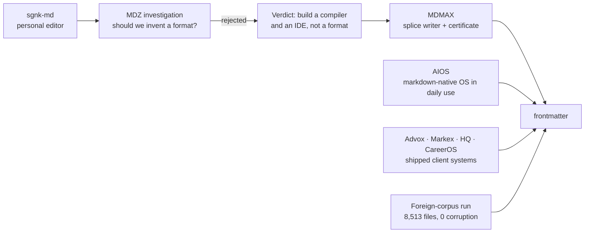
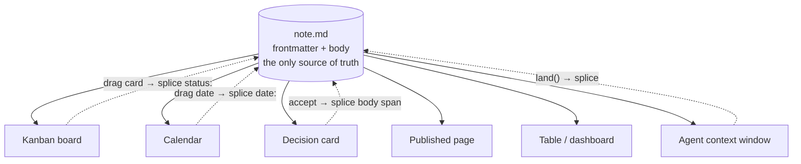
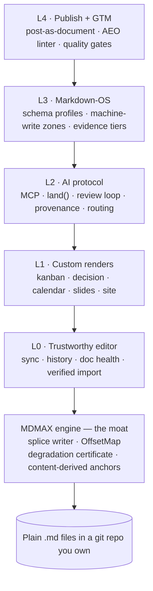
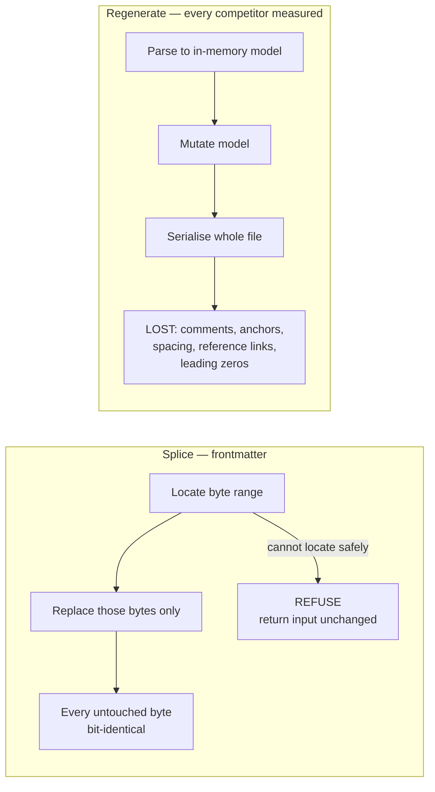

# frontmatter — Product Requirements Document

**v2.0 · 2026-08-29 · Zephyrus Studio · owner: Sagnik Mitra**

**Supersedes** `FRONTMATTER-PRD-2026-08-29.md` (v1.1), `FRONTMATTER-BUILD-PLAN-2026-08-29.md`, and `FRONTMATTER-DECISIONS-2026-08-29.md`. Those three are now historical; this is the single governing document.

**Status: pre-development.** This is the input to the build, not a report on it.

---

## 0. How to read this document

**What it is.** The complete product record: where the idea came from, what it solves, what the market cannot do, what we will build, how it is written on disk, how it is priced and sold, what it costs to run, what can kill it, and what must be decided before anyone writes code. It consolidates **twelve research rounds, 105 reports, 374,866 words**, plus the engineering record of this repository.

**Audience.** The build team. §1–5 for why · §6–10 for the substrate · §11–20 for the product · §21–27 for the business · §28–49 for the build · §50–60 for operating and deciding.

### 0.1 Evidence tags — the difference between a fact and a lead

Every factual claim carries one. This is not decoration; §57 exists because we once did not.

| Tag | Means | Publishable as fact |
|---|---|---|
| `[measured]` | Executed on this machine against live code or a real corpus | Yes |
| `[fetched]` | Primary source opened and read | Yes |
| `[derived]` | Computed here; the arithmetic is shown | Yes, with the arithmetic |
| `[SS]` | Search summary — nobody opened the page | **No. Verify or omit** |
| `[inference]` | Reasoning from the above | Labelled as judgement |

### 0.2 Settled verdicts — do not re-litigate

Each cost weeks and survived every round since.

| # | Verdict | Cost of reopening |
|---|---|---|
| 1 | **No new markdown format.** Every extension is a profile over valid CommonMark that degrades to readable text in a dumb renderer | Settled 2026-07-29. A formally-specified markdown successor launched Aug 2026 sits at 2 stars `[fetched]` |
| 2 | **MDMAX is a library subordinate to the editor**, not a compiler product with its own destiny | — |
| 3 | **Never a tree-of-record.** No feature may introduce a parse tree as the source of truth | `blocksToMarkdownLossy()` is a real API name in a shipping framework — the market's own confession `[SS]` |
| 4 | **Sync is git-merge + a splice journal + compare-and-swap. Never a CRDT** | §31.1 gives three independent disqualifications |
| 5 | **The render carrier is a blockquote callout for prose and a fenced code block for opaque data** | §8.2. This corrects PRD v1.1 §9 |
| 6 | **The eval lane is refused** — no arbitrary client-side code execution | §9.2 |
| 7 | **Not a Notion-style project-management tool** | Founder boundary |

### 0.3 Three rules that govern the build

1. **Red proof before green.** A test on a rare fault proves nothing until it fails against the unfixed code. If you cannot make it fail, the test does not cover the bug — say so rather than reporting a pass.
2. **Agents propose, the founder merges.** Capture `git rev-parse HEAD` before and after every agent run and reconcile. The instruction not to commit is advisory; the reconciliation is the gate.
3. **Re-derive every number at write time.** §57 is a list of twenty numbers that went stale because we did not.

### 0.4 How this document is executed

Through `specs/`, not through prose. A lane is done when its spec reaches `state: verified`, which the harness writes only after every `verify:` command exits 0 **and** a red proof exists.

```bash
npm run spec      # the contract gate
npm run corpus    # the fidelity corpus, 8,513 files, byte-pinned
npm run verify    # typecheck → lint → test → build → arch → spec
```

---

## 1. Where the idea came from

**In one line:** we tried to invent a better markdown, proved that was the wrong move, and were left holding the two pieces that turned out to be the product.



| Stage | What happened | What it left behind |
|---|---|---|
| sgnk-md | Personal Obsidian alternative, live at md.sgnk.ai. 416 commits, frozen since 2026-07-17 `[measured]` | The editor chassis: four view modes, tree, tabs, slash commands, vim keys, wikilinks, KaTeX, Mermaid, PWA, Tauri |
| MDZ investigation | Asked whether a markdown successor was the play | **Rejected.** "Build a compiler and an IDE, not a format" |
| MDMAX | The compiler half, built instead | 13 files, 3,614 lines: splice writer, OffsetMap, degradation certificate, construct detectors `[measured]` |
| AIOS | An orchestrator running this studio entirely on markdown | 124 SKILL.md automations, an 892-line self-amending constitution, 5,014 trace rows, 24,539 gate decisions `[measured]` |
| Client systems | Advox, Markex, HQ, CareerOS | Reusable spines: entitlements, pooled-RLS tenancy, fail-closed verifiers, publish queues |
| Foreign-corpus run | Ran the writer against seven strangers' vaults | **8,513 files, 0 corruption, 0 throws** `[measured]` |

**The insight that closed it.** The two things MDMAX shipped — a writer that provably cannot corrupt, and a certificate that proves how a file degrades — are exactly the enforcement mechanism for a much bigger idea than a format: **the file can be the only source of truth, and every app-like view can be disposable.** We built the enforcement before we named the law.

---

## 2. The problem

| # | Problem | Evidence | Answered in |
|---|---|---|---|
| 1 | **AI work evaporates.** An hour of thinking ends as a chat log. ChatGPT's only exit is an account ZIP emailed with a 24h link; NotebookLM did not persist chats until Jan 2026; an exporter-extension economy exists (one at 400,000+ installs) and all of it ends in a stale one-shot dump | `[SS/fetched]` | §12 |
| 2 | **Sync silently destroys data.** The single most-cited pain: 561 of 3,220 HN comments. Fresh, not historical — the Obsidian forum in the last six weeks carries a file showing "fully synced" while missing its final Korean characters | `[SS]` + `[fetched]` | §31 |
| 3 | **Editors rewrite bytes you never touched.** Architectural, not a library choice — three teardowns, three codebases, one identical failure | `[measured]` | §7.1, §19 |
| 4 | **Nobody can tell you what the AI changed.** Word, Docs, Cursor, Grammarly and Lex all show AI edits before accept and lose the distinction forever after | `[SS]` | §11 |
| 5 | **Everything you own is trapped in a view.** Coda export returns disconnected strings with formulas stripped; Notion formulas cannot aggregate across rows; under 4% of GitHub notebooks reproduce | `[SS]` | §5 |
| 6 | **The review loop does not exist on files you own.** Google's public API **cannot create suggestions at all**; Lex's track-changes is "in development"; OpenKnowledge comments are machine-local and never committed | `[fetched]` | §13 |
| 7 | **Import is a lie.** The #1 failure class is not broken formatting — it is **reports claiming success while losing files**. Obsidian has posted a $500 bounty for a detailed import log and $5,000 for Notion database conversion | `[fetched]` | §20 |
| 8 | **Price betrayal.** Notion cut free AI to 20 responses *for life* and raised Business ~20%; Microsoft's +43% Copilot bundling drew a CMA probe; Cursor apologised for an opaque reprice; Windsurf churned twice | `[SS]` | §24.8 |
| 9 | **Complexity fatigue.** Markdown tools overwhelm the people they are meant to serve | see note | §18 |

> **Note on problem 9.** The widely-repeated claim that *"most of Obsidian's million-plus downloaders never get past their first note"* is **unsourced** — it traces to an unattributed pull-quote in a 2025 author blog post with no Obsidian source, no methodology and no denominator `[fetched]`. **Do not cite it.** The complexity problem is real; that particular statistic is not evidence for it.

**The shape shared by problems 1, 2, 3, 4, 6 and 7:** the tool reports success while quietly losing something. *Sync said green and lied. Import said 47 succeeded and lost 4. The editor said it preserved comments and deleted them.*

> **Product thesis: be the tool that does not lie about what it did to your file — and can prove it.**

---

## 3. The market

### 3.1 Category map

| Category | Players | What they own | Why they cannot take our position |
|---|---|---|---|
| Office suites | Word, Google Docs, LibreOffice | Track changes, 40 years of review UX | Not file-native; Google's API cannot create suggestions `[fetched]` |
| Workspace / blocks | Notion, Coda, Craft, Airtable | Databases-as-views | The view IS the data; export lossy by architecture `[SS]` |
| Markdown PKM | Obsidian, Logseq, Bear, Ulysses, iA Writer, Typora | Local files, plugins | Single-player by design; no review loop, no provenance, no fidelity proof |
| Markdown collab | HackMD, Hubble, OpenKnowledge, GitBook, Mintlify | Team markdown, docs sites | All regenerate the file; OpenKnowledge needs a running daemon `[measured]` |
| AI editors | Cursor, Windsurf, Lex, Grammarly | Inline AI, diff review | Provenance evaporates at accept; not markdown-native `[SS]` |
| Chat-to-artifact | Claude Artifacts, Canvas, v0, Bolt, Perplexity Pages | Generation, versioning | The artifact lives in their store. OpenAI **removed** Canvas in May 2026 `[SS]` |
| Agent memory | mem0, claude-mem | Facts for agents | Atomises the journey; the finished document is not first-class |
| **Free self-hosted** | AppFlowy 76,040★ · AFFiNE 71,976★ · SiYuan 46,023★ · Logseq 44,669★ · Outline 40,362★ · Trilium 37,624★ · Docmost 21,501★ — all pushed within 24h `[fetched]` | Zero cost, file-native, active | **This is the price floor.** $5–8/seat must be justified against $0 |

### 3.2 The gap map

| Gap | Evidence of absence | Window |
|---|---|---|
| Byte-exact structured editing on **both** halves of the file | All three teardowns regenerate; the two strongest each solved fidelity only on the half their editor does not model `[measured]` | Frontmatter-splice claim durable; general claim erodes |
| Fidelity **without a running daemon** | OpenKnowledge's byte contract exists only inside a live CRDT server — agent edits error out without it `[measured]` | Durable — architectural |
| **O(edit)** not O(document) | Their own source comment: full serialize+parse per edit, *"unbounded by doc size"*, and fixing it *"needs a real incremental parser"* they lack `[fetched]` | Durable |
| Render-fidelity certification | Nobody certifies cross-engine degradation. Litmus at $500/mo proves the *testing* layer monetises while the *data* layer stays free `[SS]` | 6–12 months. **Publish the dataset before the design** |
| The review loop on files you own | Google's API cannot create suggestions `[fetched]`; Lex "in development" `[SS]`; OK comments never committed `[fetched]` | 6–12 months |
| Byte-anchored, portable, reader-visible AI provenance | Absence check precise: admin telemetry (Cursor), cloud report (Grammarly), repo sidecar (Agent Trace). Writing editors have nothing `[SS]` | Open |
| The rendered, evolving AI-output document | Memory tools store facts; consumer apps store sources; exporters store dumps | Open — **the category to name** |
| Session interchange between AI tools | No standard. OpenAI and Claude exports are mutually unreadable; every parser is reverse-engineered `[fetched]` | Open — whoever publishes the open shape becomes default |
| A file-native home screen | Obsidian's Homepage plugin: **1,294,057 downloads**, ~20× every bespoke dashboard plugin `[fetched]`. No product ships it natively | Open |
| Claim-level method + confidence | Across OKF, SKILL.md, llms.txt v2, MyST, .prompty — no spec claims it; OKF argues *against* stored scores `[fetched]` | Open; a renderer is the right shape |
| ~~"An agent can read and write my markdown"~~ | **Commodity.** Bear, Craft, Notion, MDflow, GitBook ship it; obsidian agent-skills 47,418★; the skills CLI did 9.3M downloads in one week `[fetched]` | **0 months — do not position here** |

### 3.3 The window

- **Now:** generic agent-markdown is commodity.
- **3–6 months:** "markdown editor with an agent harness" crowds. OpenKnowledge ships ~100 releases/week; 3,239 → 3,673 stars in 27 days `[fetched]`.
- **6–12 months:** fidelity, the review loop and the Obsidian-power-user lane stay open, because every incumbent's incentives point elsewhere — Notion toward blocks, OpenAI toward artifacts-as-output, Google toward Docs, OpenKnowledge toward the team wiki.
- **Structural hedge:** OpenAI removed Canvas. If "delegate, don't edit" wins, the durable asset is the verification layer, not editor chrome. **The roadmap keeps weight on the engine.**

> **Sequencing law: the differentiation tracks (R0, T2, T3 — §28) must land inside the 6–12 month window.**

---

## 4. Is the idea good? The honest verdict

**Yes, with two conditions: ship fidelity and the review loop inside the window, and do not position on the commodity sentence.**

| Question | Answer | Confidence |
|---|---|---|
| Is the problem real? | Yes. Nine problems with public complaint evidence; three verified by executing competitors' code | High `[measured]` |
| Is anyone else solving it? | Partially, each capped by an architectural choice they cannot cheaply reverse | High `[measured]` |
| Do we have an unfair advantage? | Yes — a byte-preserving writer and a certificate that already pass on strangers' data | High `[measured]` |
| Will people pay? | **Unproven. Zero paying users.** And developers are the hardest freemium audience: median dev-focused free-to-paid is **5%, half the non-dev rate** `[fetched]` | Low |
| Can one person build it? | The v1 scope yes. Teams, SSO and compliance no — §53 | Medium |
| Is the timing right? | Yes, and tight | High `[fetched]` |

**Proven `[measured]`:** the engine does not corrupt foreign data (8,513 files, 7 authors); competitors do (three executed teardowns); the internal markdown-OS substrate works at scale (24,539 gate decisions, 124 automations); the campaign pipeline produces multi-surface output from one file (10 episodes in ~1 week).

**Assumed — must be tested early:** that anyone pays; that the review loop is a purchase trigger rather than a nice-to-have; that India is viable top-of-funnel; that funnel 2 exists at all. **Every conversion, churn, ticket-rate, storage and CPU figure in §23–26 is an assumption stated explicitly so it can be replaced by measurement.**

**Refuted — do not repeat:** "serve markdown to agents and get cited"; "first AI attribution" (Cursor and Grammarly exist — the defensible claim is narrower, §11); the Obsidian first-note statistic (§2).

**The single biggest risk is not technical.** It is that a fidelity guarantee is a thing engineers admire and nobody buys. GitBook's lost-work complaints prove the pain exists; they do not prove anyone pays a premium to avoid it. §21 and §27 are the mitigation.

---

## 5. The core concept

> **The file is the only source of truth. Every app-like thing — the board, the calendar, the decision card, the dashboard, the published site, and every AI edit — is a deterministic, reversible projection of that file, owning no state of its own.**



**Why this is a law, not a slogan.** It separates the tools that survived twenty years from the tools that became traps.

| Survivors — the view is computed, stored nowhere | Traps — the view ate the data |
|---|---|
| org-mode's agenda, running since 2003, computed on the fly from date tags in plain text `[SS]` | Coda's export loses formulas, buttons, canvas properties `[SS]` |
| Obsidian Bases (2025): the `.base` file saves only how you want to look `[SS]` | Notion formulas cannot aggregate across rows `[SS]` |
| Potluck (Ink & Switch): *"a clear separation between text and annotations… the original text freely editable"* `[fetched]` | Jupyter: meaning lives in invisible kernel state; under 4% of GitHub notebooks reproduce `[SS]` |

**What is new is making it the explicit product primitive.** Everyone else rediscovered it as a side effect. And its two hardest requirements are already built here: write-back must be provably reversible (the splice writer) and any view must strip back to portable markdown (the certificate).

**The category sentence:**

> Notion made the app the source of truth and trapped your data inside it. frontmatter makes the **file** the source of truth and lets every app be a disposable lens over it — provably, byte for byte, reversibly.

**It composes with the AI story rather than sitting beside it.** If every view is a projection, an AI edit is a projection running backwards: a splice with its byte range recorded, reviewable and reversible. The AI gets the same path as a human dragging a card, and the same guarantee.

**Prior art to respect:** Potluck is the near-exact precedent and is unmaintained; Obsidian Bases is market validation that the demand is real. Neither claims the law as a product primitive; neither can prove reversibility.

---

## 6. Principles and non-goals

### 6.1 Principles

1. **The file is the truth; views are disposable.**
2. **Refusal is a first-class outcome.** Cannot do it safely → return the input unchanged and say why. Never guess.
3. **Never lie about what happened.** Every count is re-derived from disk, never from the loop that did the work.
4. **Degrade, never break.** Every extension is valid CommonMark.
5. **The model gets a data slot, never a canvas.**
6. **One grammar for every change** — human suggestion, AI edit, sync conflict.
7. **Measure the document, not the user.** Implicit feedback only.
8. **Gates, not scores.** Named binary checks.

### 6.2 Non-goals

The expensive mistakes are all additions.

| Never | Why |
|---|---|
| A new format, sigil, or dialect | Settled 2026-07-29 |
| A tree-of-record, even once | `blocksToMarkdownLossy()` is a real API name `[SS]` |
| A plugin marketplace | VS Code's own wiki names extensions the #1 performance suspect; Typora's most-requested feature (251 votes) sits against a product loved *because* it has none `[SS]` |
| **The eval lane** — arbitrary client-side code | It ends the corruption guarantee **and** converts every prompt injection into remote code execution on infrastructure holding every customer's documents and API keys (§9.2, §51) |
| Block IDs in files, columns-in-markdown, synced-block bytes | Pollutes the text |
| Likert writing scores | Schema-rejected internally; Grammarly's opaque score is the anti-pattern |
| Ambient AI buttons, un-disableable AI | Notion users write ad-blocker rules against AI buttons `[SS]` |
| Silent auto-landing into a curated vault | Auto-capture only into an inbox lane |
| Opaque credit repricing | Cursor apologised; Windsurf churned twice; Notion got roasted |
| Streaks, badges, soundscapes, format-on-save default | Noise |
| A bespoke canvas as centre of gravity | Spatial state is not linear text |
| **Notion-style project management** | Founder boundary. A markdown editor with deep AI, not a PM tool |
| AIOS internal machinery as consumer UI | §15.4 |
| Graph-view investment, the mother-markdown container | Zero of 89 feature requests mentioned graph view; 45 transclusions in 25 MB of our own vault were all documentation of the feature, never use `[measured]` |
| Any "first" or "only" claim without one more verification round | We already caught one |

---

## 7. Architecture and current state



### 7.1 The engine

**The splice contract.** Locate the byte range, replace exactly those bytes, leave every other byte bit-identical. Never regenerate from a parse tree. If the range cannot be located unambiguously, **refuse** and return the input unchanged. Grounded in lens theory (Foster et al., TOPLAS 2007).



**MDMAX: 13 files, 3,614 lines, 10 tests** `[measured]`.

| File | Lines | Capability, with its measured numbers |
|---|---|---|
| `domain/constructs.ts` | 618 | **19 constructs** detected; returns UTF-8 byte ranges; conservative detectors behind a skip mask |
| `infrastructure/bench.ts` | 538 | **7 engines**: remark-app, react-markdown, marked, markdown-it, markdown-it-html-true, commonmark, kramdown-jekyll. `benchId` = sha256 over the full option set. **A missing engine is a hard refusal** |
| `domain/fold.ts` | 430 | `mdmax/fold@1` versioned equivalence fold. Prototype **705/1613 strict vs 69/1613 folded (43.71% → 4.28%)** over 40 files × 6 engines — **explicitly not attachable to `fold@1` until re-measured** |
| `domain/verdict.ts` | 411 | `![[Some Note]]` → VOID on marked 16.4.2 **and** commonmark 0.31.2; **21 of 24** `{#id}` leak; front matter LEAKs in **23 of 24** bench configurations |
| `application/certify.ts` | 375 | Layer-2 inventory + layer-3 differential; never throws |
| `domain/offsets.ts` | 315 | Branded U16Offset / ByteOffset / GraphemeIndex. **Only 67 of 1,080 corpus files have bytes == UTF-16 units (93.8% diverge); 103 of 2,314 contain non-BMP** |
| `domain/shape-gate.ts` | 174 | `MAX_BYTES 4MB`, `MAX_LINES 200,000`. Measured quadratics: `WIKILINK_RE` **k=1.98, 36,865 ms on 320 KB**; `mdast-util-from-markdown` **12,429 ms vs micromark 1,207 ms (10.3×)**. Strict UTF-8 decode, refuse never repair |
| `domain/cert-contract.ts` | 168 | 4 verdicts PASS / STRIP / CORRUPT / VOID; 3 classes LEAK / DESTROY / MUTATE. **The artifact is a JSON sidecar, never written into the `.md`** |
| `domain/placement.ts` | 154 | Setext defect: `"Heading\n---"` → h2; **blank-line isolation does not fix it** → refuse, never repair |
| `domain/targets.ts` | 133 | **15 targets**; **7 of ~12 surfaces unprobeable**; Slack and Discord modelled as lossy sinks |
| `domain/frontmatter-prepass.ts` | 121 | **170 of 907** home frontmatter blocks are invalid YAML = **18.74%**. Never writes, never throws |
| `domain/slug.ts` | 115 | Over 393 anchors: github-slugger **21.88%**, dash-collapsing **95.42%**, either **98.73%** — caveat, **85.2% come from one file** |
| `domain/normalize.ts` | 62 | **99.627%** re-anchoring across **384 configurations** |

### 7.2 Current state — verified

| Metric | Value `[measured]` |
|---|---|
| Modules under `src/modules/` | 14 — **175 files** |
| TypeScript files in `src/` | 226 · **25,407 lines** |
| Test files | **98** · **1,575 tests passing** |
| App routes | 30 |
| Commits on branch | 40+ (`engine/plan-and-diagnostics`) |
| `npm run verify` | **Green** — typecheck, lint, 98/98 test files, build compiled, arch `"violations": []`, specs 4 scanned 0 errors |
| **CI** | **None. `.github/` does not exist** |

**Stack:** Next 16.2.6 · React 19.2.6 · CodeMirror 6 · unified/remark/rehype · gray-matter · yaml · mermaid 11 · minisearch · zustand · zod · next-auth v5 · AI SDK v6 with five providers · Tauri v2 · puppeteer-core.

### 7.3 The MDMAX wiring plan — four ordered seams

Currently **one symbol from one of thirteen files** is used in product code: `decodeStrict`, imported by `get-snapshot.ts` and `search-index.ts` `[measured]`. The other twelve files have zero product importers.

| # | Seam | Call site | Contract | Blocked by |
|---|---|---|---|---|
| 1 | **Ingress gate** | live | `decodeStrict` refuses, never repairs | done |
| 2 | **Write gate** | `commit-changes.ts`, `share-writer.ts` | every write passes shape-gate + placement before a blob is created; a refusal is a 4xx with a reason, never a silent pass | NF-1, NF-3 |
| 3 | **Splice engine** | replaces `splice-frontmatter.ts`'s single-key scanner | one implementation for kanban drag, calendar drag, `land()` and share | NF-4 design |
| 4 | **Certificate** | background job → JSON sidecar in R2, surfaced in Doc Health | `certify.ts` never throws; the artifact never enters the `.md` | §38 jobs |

**The boundary rule:** MDMAX exports pure functions over bytes and imports nothing from `src/modules/*`. `eslint-plugin-boundaries` plus the arch report (with a minimum-files-scanned floor so the gate cannot pass by going blind) enforce the direction `[measured]`.

> **Do not wire seam 2 before NF-1 and NF-3 land.** At the measured refusal rate the write gate would reject 83% of foreign vaults' publishes — an availability incident wearing a correctness costume.

### 7.4 Three known truths that contradict our own older docs

1. **`docs/mdmax/PLAN.md` says MDMAX "shipped".** It is implemented and unit-tested; twelve of thirteen files are unreached by product code.
2. **There is no CI**, in a product that intends to sell document CI.
3. **The shipped design system is not our design system.** `src/app/globals.css` is byte-identical to sgnk-md's, self-labels *"Linear-style modern SaaS"*, and ships `--accent: #18181b` with 6/8/12px radii — neither the canonical `#1a5cff` accent nor the square-corner rule. A `body-faint` token at **2.14:1 fails WCAG AA** while being in the shipped set `[measured]`.

---
