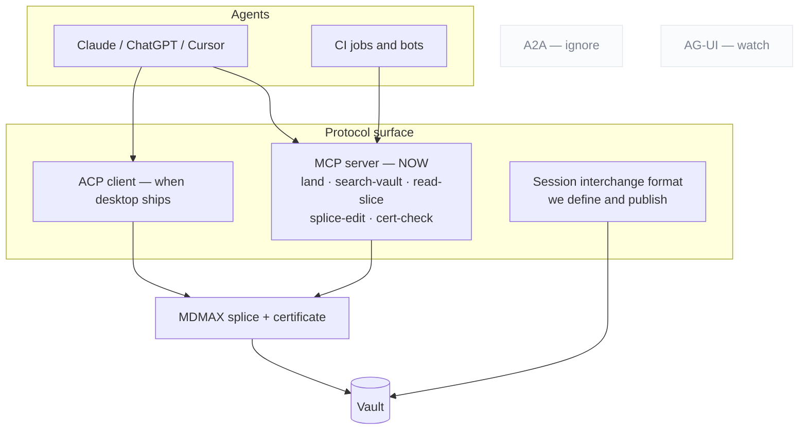
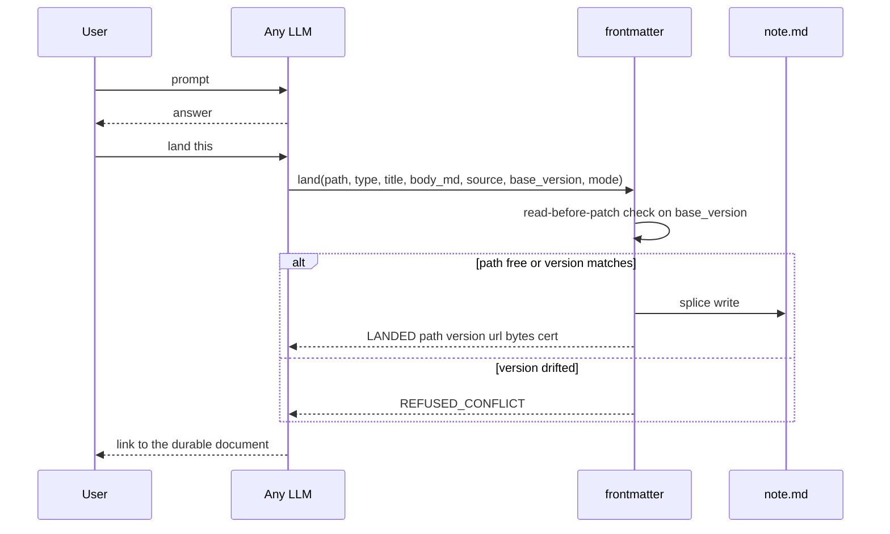
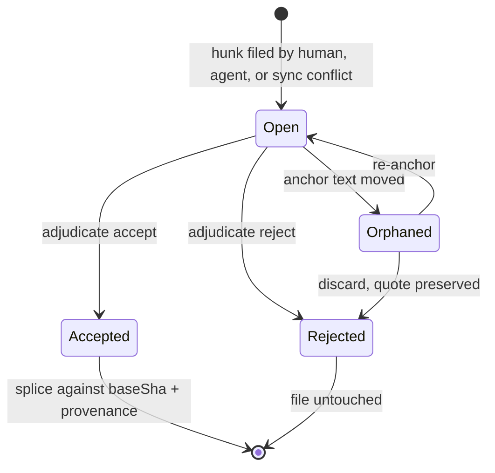
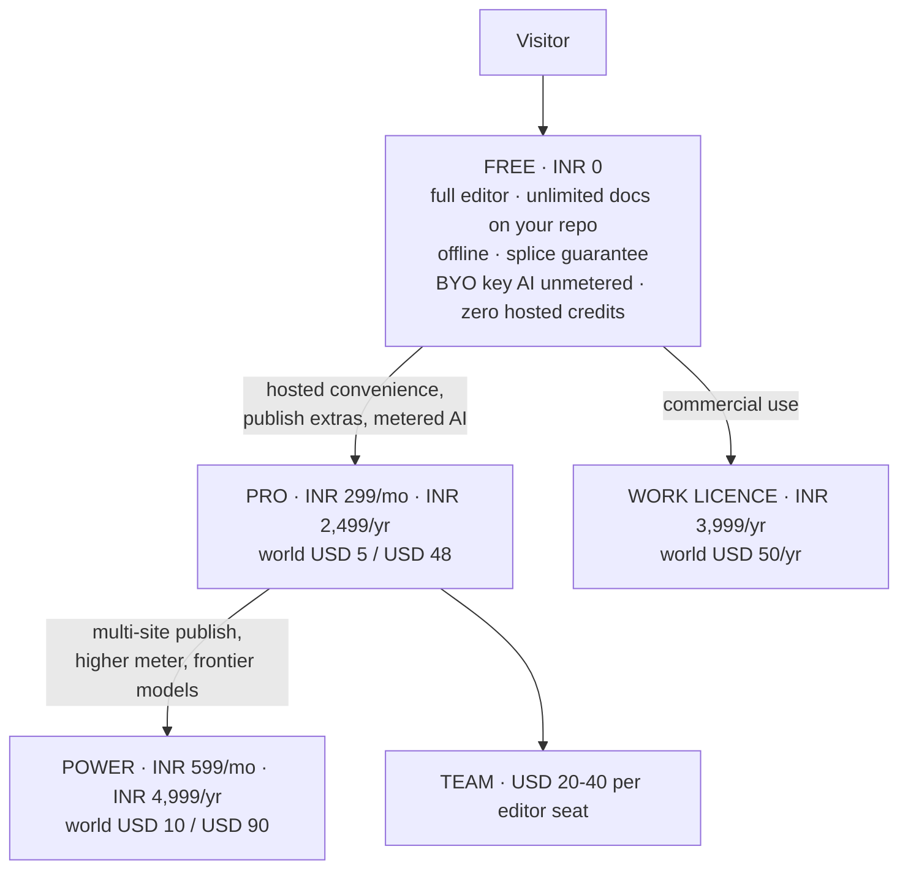
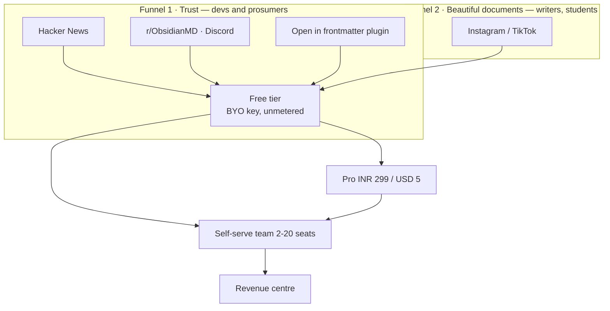

## 10. Formats, protocols and interoperability



### 10.1 Format posture

| Posture | Formats | Rationale |
|---|---|---|
| **READ** | OKF bundles (v0.2, own Google repo, 356 adopter repos, +24%/27d `[fetched]`) · SKILL.md folders · MyST keys · textbundle | Zero parser cost; recognise `sources / generated / verified / status / stale_after` and derive trust tiers |
| **EMIT** | llms.txt v2 + markdown twins + `rel="alternate" type="text/markdown"` (Chrome Lighthouse audits for it `[fetched]`) · OKF export · **Skill export** — a curated collection becomes a SKILL.md folder consumable by 41+ agents | "The journey becomes a reusable capability" is the strongest interop story found |
| **BUILD** | **Session interchange format** — markdown-native, open, documented | No standard exists; the absence is the opening `[fetched]` |
| **WATCH** | .prompty · AG-UI | Not load-bearing yet |
| **IGNORE** | Promptfile (dead) · langchain-hub (archived) · A2A and server-cards as document formats | Dead or wrong layer |

### 10.2 Protocol posture

| Protocol | Posture | Reason |
|---|---|---|
| **MCP** | **Ship now**, tools-first | The July 2026 revision went stateless and deprecated Roots, Sampling and Logging — tools are the lowest common denominator `[fetched]`. Hard-cap under 20 tools; verdict-first responses; refusals that name the rule and give a corrected example |
| **ACP** | Client, when a desktop surface exists | 40 registered agents including an Anthropic-co-authored Claude adapter; `session/load\|resume\|list` is the only shipped multi-vendor session-continuity semantics anywhere `[fetched]`. ACP agents are local subprocesses over stdio |
| **A2A** | Ignore | Wrong layer for a document tool |
| **Session interchange** | **Build and publish ours** | §10.1 |

**The plumbing is table stakes. The pitch is what rides on it: every agent edit goes through the splice writer, so the agent cannot corrupt what it edits.**

### 10.3 The open territory

Claim-level method and confidence is claimed by no spec, and OKF explicitly argues *against* stored scores. The compatible design is **signals, not scores, derived at render time** — which is a renderer's game, and therefore ours.

---

## 12. The capture loop



```
land({ path?, type, title, body_md,
       source: { tool, model, conversation_url, session_id },
       base_version?, mode: create | patch | rewrite })
  → { LANDED | VERSIONED | REFUSED_CONFLICT | NEEDS_TARGET,
      path, version, url, bytes_written, cert }
```

| Rule | Why — each from a documented failure |
|---|---|
| **Identity is the path**, explicit in every call | On claude.ai, where identity is inferred from phrasing, *"it made a new artifact instead of updating mine"* is the #1 documented failure |
| **Two edit sizes are protocol modes**, not prompt etiquette | `patch` vs `rewrite` — otherwise the model guesses |
| **`base_version` enforces read-before-patch** | Structurally kills the drift bug where the user hand-edits and the model keeps talking about the version it remembers. Bolt's own system prompt: always edit the latest content `[fetched]`. **The file is the memory; the model's memory of the file is a cache to invalidate** |
| **Counts re-derived from disk** | The anti-lying-report rule |
| **Typed at capture** | `type:` picks schema, render and home grouping. Granola: $1.5B valuation on template-typed capture with per-line provenance `[SS]` |
| **Users see the nouns, never "artifact"** | Bolt's system prompt literally forbids the word `[fetched]` |
| **Auto-land only into an inbox lane** | Never silently into the curated vault |

**Distribution:** an MCP server for MCP-capable tools · a **chat-side skill** for everything else ("land this" → typed fenced block → one-paste inbox) · ZIP importers for ChatGPT and Claude where **the verification report is the demo** · retro-capture parsing one conversation into *several* typed documents.

**The promotion loop is what makes it a home rather than a filing cabinet:** landed documents become retrievable, citation-gated context — `draft → active → source-of-truth → superseded`.

---

## 13. The review surface

**One grammar for every change: human suggestions, AI edits and sync conflicts all arrive as hunks.** The deepest single extraction of the research — 40 years of office software, sourced to the Google Docs API discovery document and pandoc's docx reader `[fetched]`.



| Rule | Detail |
|---|---|
| Suggesting is a **mode** | Edit / Suggest / View dial. The suggester role has **no byte-writing code path** |
| Hunks coalesce at **word grain** | Git's line grain is the wrong resolution for prose |
| Markup / Final / Original are **pure render projections** | The OnlyOffice save-in-preview-deleted-changes bug is the negative spec |
| The adjudication ladder | per hunk → per suggestion → **all-shown-under-filter** (filter by author, *including AI agents*), with accept-and-advance and preview-before-bulk |
| **Resolution is an authored thread event** | `replies.action ∈ {resolve, reopen}` — never a silent boolean |
| Anchors are quote-preserving with **visible orphaning** | Word silently deletes orphaned comments; Docs orphans opaquely. We badge, preserve the quote, offer re-anchor |
| Accept = splice against `baseSha` | Plus a `Co-authored-by` trailer |
| Governance via branch-protection semantics | **No document freezes** |
| Interchange | CriticMarkup + pandoc `--track-changes` spans, both directions |

**The two moves that beat the incumbents:** **programmatic and AI suggestion authorship** — Google's public API cannot create suggestions at all `[fetched]`, while ours is a plain sidecar schema any CI job or agent can file into — and **durable provenance through accept**, where theirs evaporates.

**Anchoring implementation:** Hypothesis's `match-quote.ts` + `approx-string-match` (BSD-2 / MIT) is the mechanism that lets an AI target survive human edits.

> **Treat the review surface as a breaking-API contract.** Cursor and Windsurf both regressed per-hunk control and both got publicly burned. Per-hunk accept is the single most-demanded feature in AI editors `[fetched]`.

---

## 19. Competitor teardowns — executed, not read

The most load-bearing evidence in this document. We ran their write paths.

| Product | Scale | What happened | Verdict |
|---|---|---|---|
| **Front Matter CMS** | **80,527 installs** `[fetched]`, VS Code, since 2019, owns our name | Edited one title field → deleted YAML comments, resolved anchors, stripped leading zeros. Its own source comments *"Do our own parsing to keep the comments"* — then builds the comment-preserving Document object **and throws it away**. Output differs warm vs cold | `[measured]` The bolt-on was tried and shipped broken |
| **Hubble.md** | Markdown collab | Body fully regenerated on any edit; **reference links deleted along with their visible text**; the round trip is not even a fixed point; the properties panel silently drops valid keys containing colons | `[measured]` |
| **OpenKnowledge** | Most serious competitor; ~100 releases/week; 3,239 → 3,673★ in 27 days `[fetched]` | **Body path is byte-perfect — respect it.** But frontmatter permanently drifts (`tags: [alpha, beta]` → `tags: [ alpha, beta ]`, never restored); requires a running CRDT daemon; O(document) per edit *by their own docblock*; comments machine-local, never committed; GPL + CLA dual-licensing | `[measured on their shipped build]` |

**Joint verdict: the failure is architectural — lossy in-memory models — not a library choice.**

**Say this publicly.** OpenKnowledge is not careless. Their body path is genuinely byte-perfect. They chose an architecture that caps them where we are not capped. Overstating this is the kind of claim that gets refuted in public.

**Editor frameworks — every mainstream rich-text framework is lossy by design `[fetched]`:**

| Framework | Loss mechanism |
|---|---|
| ProseMirror | Fixed CommonMark schema; serialise is per-node functions writing fresh syntax. **Reference links normalised away by construction** |
| `@tiptap/markdown` v3.30.5 | Explicitly **beta**. Documents that comments *"may be lost"* and that table cells allow *"only one child node per cell as the Markdown syntax can't represent multiple child nodes"* |
| Milkdown | Autolink backslashes **double every round trip, exponentially** (open); inline `<br>` silently deleted (open) |
| Lexical | Transformers over EditorState — helpers, not storage |
| BlockNote | Exposes `blocksToMarkdownLossy()` |

**This is why we use CodeMirror over a syntax tree and never a document model.**

---

## 21. Market segments and ICPs

**Two motions, one substrate.** Acquisition is D2C-shaped; monetisation is B2B-shaped. By month 24 the median solo **B2B** founder's revenue is more than **4×** the median solo B2C founder's `[SS]` — but through *self-serve* teams of 2–20 paying by card, not procurement.

| # | ICP | Hook documents | Why them | Price anchor |
|---|---|---|---|---|
| 1 | **Dev-tool / API startups, 2–20** — the beachhead | Docs site, changelog, status page, runbooks, **ADRs (no commercial tool exists)** | They already live in this substrate: `gray-matter` does **35,782,970 npm downloads/month**, `front-matter` **18.41M**, `js-yaml` **1,228,031,655** `[fetched]` | $20–40/editor seat, or $150–300/team |
| 2 | **Agencies and studios, 2–15** | One file per client rendering as a client-facing status dashboard, agent-updated from work logs | Zephyrus's own shape — we can dogfood it honestly | Flat $29–49/mo, or $9–19/seat |
| 3 | **Support-heavy SMBs** | Knowledge base, help centre | Cleanest ROI: deflection 18% median (40–60% with AI), a SaaS ticket costs $25–35 `[SS]`. Fierce incumbents — land **after** the substrate story is proven | $99–249 per knowledge base |
| 4 | **SMB internal ops** | Wiki, SOPs, runbooks | Broad, shallow | $8–15/internal seat |

**The consolidation wedge, at live prices `[derived]`:** Mintlify Pro **$450** + GitBook Premium **$65/site** + Statuspage Business **$399** + LaunchNotes Growth **$249** = **$1,163/mo**, plus 5 GitBook users × $12 = **$1,223/mo**. But the honest *light* version of the same stack — Mintlify Starter $0 + Statuspage Hobby $29 + Beamer $49 — is **$78/mo**. **Quote the range, never only the top.**

**Two framing corrections.**

1. **Do not lead with deflection or "structured data."** Intercom, Zendesk, Document360 and GitBook all sell exactly that. It is our *proof* after a team is inside, not the opening line. **The wedge is one non-corrupting file that is editor, AI workspace, rendered surface and audit trail at once.**
2. **The audit trail is what incumbents cannot copy quickly.** Because the splice attributes changes at byte level, **the file is its own audit log**. One vendor's case study cut a sales cycle from four months to six weeks; Vanta and Drata charge **$7,000–$30,000/yr** for continuous audit trails `[SS]`. We get a slice as a byproduct of *how we write files*. "The AI edited your ops file, here is cross-engine proof it corrupted zero bytes" is a governance claim no Notion or Confluence AI can make.

**Do not chase until there is a team or funding:** SSO, SCIM, SOC 2, the enterprise knowledge-base market.

---

## 23. Business model and unit economics

### 23.1 Revenue models compared

| Model | Fit | Risk | Support-load effect |
|---|---|---|---|
| **Subscription** (settled) | High — matches Obsidian Sync/Publish, HackMD, GitBook, Craft | Monthly churn; India monthly economics punished by flat fees; competes with subsidised India AI | **Highest per rupee** |
| **Flat perpetual licence** (Obsidian model) | High for the Work SKU. Obsidian: app free, Catalyst **$25 one-time**, Commercial **$50/user/yr and explicitly NOT required** `[fetched]` | No recurring floor | **Lowest** — buyer expectation is "supported, not serviced". **90.3% contribution** `[derived]` |
| **Usage / credits** | High for frontier AI; makes COGS ≤ revenue by construction. Mintlify charges **$0.01/credit** overage `[fetched]` | Meter anxiety suppresses the differentiating feature | Medium — "why was I charged" is the worst ticket category |
| **Seat-based B2B** | Medium-high | Pulls toward the SSO/SCIM/SOC-2 gauntlet | High and lumpy |
| **Marketplace / templates** | Medium | Requires a community that does not exist; **India's markdown community is greenfield** `[SS]` | Low direct, high indirect |
| **Services** | Low-medium | Non-scaling | **Extreme — services IS support** |

**Anti-recommendations:** do NOT bundle unlimited AI at any INR price · do NOT enter India's subsidised-AI price war · do NOT regional-price a future team tier · **if you sell publishing, price the site, not the seat** · do NOT build enterprise KB, SSO, SCIM or SOC 2 before there is a team or capital.

### 23.2 Unit economics per tier

INR prices are GST-inclusive; base = price ÷ 1.18, GST 18%. **Razorpay 2% + 18% GST on the fee = 2.36% effective** `[fetched]`. Infra $0.153/paid user/month at 1,000-user scale `[derived, §25]`.

| Tier | Gross | Rail | Fee | GST out | Net | Inference | Infra | **Contribution** | % gross |
|---|---|---|---|---|---|---|---|---|---|
| India Pro ₹299 | ₹299 | Razorpay | ₹7.06 | ₹45.61 | ₹246.33 | ₹38.16 | ₹14.62 | **₹193.55** | 64.7% |
| India Pro ₹299, cheap-model default | ₹299 | Razorpay | ₹7.06 | ₹45.61 | ₹246.33 | ₹14.31 | ₹14.62 | **₹217.40** | **72.7%** |
| India Power ₹599 | ₹599 | Razorpay | ₹14.14 | ₹91.37 | ₹493.49 | ₹95.40 | ₹14.62 | ₹383.47 | 64.0% |
| World Pro $5 | — | Paddle 5%+50¢ | $0.75 | MoR | $4.25 | $0.40 | $0.153 | **$3.697** | 73.9% |
| World Power $10 | — | Paddle | $1.00 | MoR | $9.00 | $1.00 | $0.153 | $7.847 | 78.5% |
| **Work $50/yr flat** | — | Paddle | $3.00/yr | MoR | $3.917/mo | $0 | $0.153 | **$3.764** | **90.3%** |
| **Free (BYO-key)** | ₹0 | — | ₹0 | — | ₹0 | **$0 by construction** | $0.0112 | −₹1.07 | — |

**Every INR tier clears 57–73% contribution. Margin was never the problem; volume is (§25.3).**

### 23.3 Inference cost — the real ceiling

One assist = 3,000 in + 700 out. All prices `[fetched 2026-08-29]`.

| Model (in/out per MTok) | $/assist | **Assists per $0.40** |
|---|---|---|
| DeepSeek V4-Flash **off-peak** $0.22/$0.66 | $0.001122 | **356** |
| Gemini 3.1 Flash-Lite $0.25/$1.50 | $0.001800 | 222 |
| DeepSeek V4-Flash **peak** $0.44/$1.32 | $0.002244 | 178 |
| Claude Haiku 4.5 $1/$5 | $0.006500 | 62 |
| Claude Sonnet 5 $2/$10 | $0.013000 | 31 |
| Claude Opus 5 $5/$25 | $0.032500 | 12 |

**Four corrections to earlier assumptions, all `[fetched]`:** Claude Sonnet 5 is **$2/$10, not $3/$15**, and the scheduled increase **will not occur** — our frontier assumption was 50% high. **No "Gemini 2.5 Flash $0.15/$0.60" SKU exists.** DeepSeek's $0.22/$0.66 is the **off-peak** rate; peak is 2×. **Gemini 3.7 Flash doubles on 2027-01-01** — meter in dollars, never in credits pegged to a model.

**Prompt caching is the single largest COGS lever**, because a document workspace re-sends the same file every turn. Cached heavy assist on Sonnet 5: **$0.025 vs $0.070 uncached — 2.8× more assists per rupee** `[fetched]`.

**Tokenizer tax:** Claude 4.7 and later produce approximately **30% more tokens** for the same text `[fetched]`. Any budget set on an earlier model understates cost by ~30%.

**Free-tier inference is genuinely $0 only under BYO-key.** Gemini's own free tier is free but *"content used to improve our products"* — **a fact the free tier must disclose, not hide.**

---

## 24. Pricing



### 24.1 The FX correction

The founder draft assumed ~₹83/$. Live: **₹95.39 and ₹95.59** from two independent sources `[fetched]`. So ₹299 = **$3.13** and ₹699 = **$7.33**, which sits above every India AI anchor (ChatGPT Go ₹399, Gemini AI Plus ₹199–399, Netflix Premium ₹649) and only 19–27% below a $9–10 global tier. **₹699 becomes ₹599.**

### 24.2 The tables

| India tier | Monthly | Annual (lead with this) | Contents |
|---|---|---|---|
| Free | ₹0 | ₹0 | Full editor, unlimited docs on your own repo, offline, splice guarantee, **BYO-key AI unmetered**, **zero hosted credits** |
| **Pro** | **₹299** (A/B ₹249 and ₹399) | **₹2,499** | Publish extras, live editing, hosted convenience, small metered AI on a cheap model with a visible meter |
| **Power** | **₹599** | **₹4,999** | Multi-site publish, higher meter incl. metered frontier, priority |
| Work | — | **₹3,999/yr flat** | Commercial-use licence — support and compliance, not more features |

| World tier | Monthly | Annual | Anchor `[fetched]` |
|---|---|---|---|
| Free | $0 | $0 | Obsidian free-forever, no sign-up |
| Pro | **$5** | **$48** | Obsidian Sync $4 annual/$5 monthly; HackMD Prime **$5/seat annual ($8 monthly)** |
| Power | **$10** | **$90** | Obsidian Publish **$8/site annual — per SITE, not per user** |
| Work | — | **$50/yr flat** | Obsidian Commercial parity |

### 24.3 Why ₹299 — and the counter-evidence

The anchor is **what Indians already pay for AI productivity**: ChatGPT Go ₹399; Gemini AI Plus ₹199→₹399; Netflix India ₹149/199/499/649; the Indian micro-SaaS starter band ₹299–499 `[SS]`.

**Confirmed `[fetched]`: Notion has no India pricing** — the page served to an India IP contains zero `₹` strings.

**Counter-evidence worth taking seriously `[fetched]`: Craft already India-prices Plus at ₹526.7–₹658.3/mo** — a direct competitor has decided the India individual price is **1.8–2.2× ₹299**. That validates INR pricing *and* raises whether ₹299 leaves money on the table. **Test ₹299 against ₹399 as well as ₹249.**

### 24.4 The rail, and the ₹15,000 constant

| Rail | Fee on ₹299/mo | Note |
|---|---|---|
| **Razorpay (India domestic)** | **2.36%** | 2% + 18% GST on the fee. **The flat-fee argument barely applies here** |
| Dodo, India domestic | 4% + **15¢** = 9.29% | The 15¢ flat is **4.79%** of ₹299 — not the 12.76% an earlier note computed using the **US** 40¢ rate |
| Paddle / Lemon Squeezy | 5% + 50¢ ≈ **15%** | Paddle's own comparison prices a non-MoR stack at "~7% and above" |

Annual still wins — ₹2,499/yr drops the Dodo fee to **5.07%** `[derived]` — but on Razorpay-domestic the annual argument is churn and convenience, not fees.

> **₹15,000 per transaction is an architectural constant, not a pricing input.** RBI's 2026 Framework allows recurring authorisation without additional-factor authentication up to ₹15,000; software is not in the ₹1,00,000 carve-out. Full consequences in §45.

### 24.5 Which market first

**Distribution India-first, revenue global-first.** India has 21.9M GitHub contributors, +5.2M in a year, and +35% YoY consumer app spend `[SS]`. Against: **zero category-specific willingness-to-pay evidence for markdown tools in India** `[SS]`; the AI price here is collapsing to zero; ₹299 nets **$2.58** against **$4.25** for the identical feature at $5; and **₹20L/mo needs 6,689 paying Indians versus 4,193 at $5 — 59.5% more paying humans for identical revenue** `[derived]`.

**What matters most is not the discount — it is that UPI exists at checkout.** International gateways without it lose 30–40% of Indian checkouts `[SS, vendor-sourced]`. Paddle and Lemon Squeezy do not support UPI.

### 24.6 Pricing policy — published, and treated as a promise

Free-forever editor · **dollars not credits** · BYO-key at every tier · one cheap surface unlimited · never auto-migrate plans · never reprice opaquely · commenters never bill.

---

## 25. Cost structure and funnel math

### 25.1 Infrastructure

Assumptions stated so they can be replaced by measurement: 4% free→paid · 9,000 requests/user/mo · 8 CPU-ms/request · 20 MB/free user, 250 MB/paid · hosted inference for paid only, capped $0.40 · support 0.02 tickets/free-user/mo, 0.10/paid, 12 min each. Rates `[fetched]`: Cloudflare Workers $5/mo minimum, then +$0.30/M requests and +$0.02/M CPU-ms; **R2 storage $0.015/GB-mo, Class A $4.50/M, Class B $0.36/M, egress FREE**.

| Line | 100 users (4 paid) | 1,000 (40 paid) | 10,000 (400 paid) |
|---|---|---|---|
| Workers | $5.00 | $5.84 | $42.80 |
| R2 | free tier | $0.29 | $69.03 |
| **Egress** | **$0.00** | **$0.00** | **$0.00** |
| Infra subtotal | $5.00 | $6.13 | **$111.83** |
| Hosted inference | $1.60 | $16.00 | $160.00 |
| **Total variable** | **$6.60** | **$22.13** | **$271.83** |
| Infra per paid user | $1.250 | **$0.153** | $0.280 |
| **Support load** | 2.3 tickets/mo | 23.2 | **232 = 46.4 founder-hours** |

**Three conclusions.** Egress-free R2 is the load-bearing architectural choice — a document workspace's dominant byte flow is reads. The $5/mo Workers minimum dominates below ~1,000 users, making infra per paid user **8.2× worse at 100 than at 1,000**. And **support, not compute, is the wall.**

### 25.2 Conversion benchmarks `[fetched]`

| Motion | Good | Great |
|---|---|---|
| Freemium self-serve | 3–5% | 6–8% |
| Freemium + sales-assist | 5–7% | 10–15% |
| Free trial | 8–12% | 15–25% |

> **"The median conversion rate for developer-focused companies was 5% — half that of companies that do not sell to developers."** `[fetched]` This governs us directly. **We chose the hard half deliberately.**

### 25.3 What each milestone requires `[derived]`

Gross ARPU mix A (70% India ₹299 / 30% World $5) = ₹352.40. Zero churn assumed.

| Milestone | Paid users | Free @5% (dev median) | Cumulative visitors @9% signup |
|---|---|---|---|
| **₹1L/mo** | 284 | **5,675** | 63,060 |
| **₹5L/mo** | 1,419 | **28,377** | 315,298 |
| **₹20L/mo** | 5,675 | **113,507** | **1,261,193** |

**₹1L/mo is reachable at typical rates. ₹5L/mo needs ~28,000 free signups. ₹20L/mo needs 113,507 signups and ~1.26M cumulative visitors — a distribution problem, not a pricing problem, and the point where the plan stops being solo-founder-shaped.**

---

## 26. Go-to-market



| | Funnel 1 — Trust | Funnel 2 — Beautiful documents |
|---|---|---|
| Line | *"The markdown source of truth AI can't corrupt"* | *"Beautiful documents from plain text"* |
| Channels | HN, r/ObsidianMD (~344,000), Discord (~195,000), X, YouTube | Instagram, TikTok |
| Content | Evidence-first: the corpus result, a 10-second demo diff against a competitor's shipped product | Custom renders in 15 seconds of vertical video |
| Confidence | **High.** Our campaign practice already manufactures exactly this `[measured]` | **Low.** No dev tool has grown Instagram-first, and our content pipeline mines the *system record*, so it would never surface aesthetic material on its own |

**The window is warm.** The review-loop wedge was independently validated twice in four weeks — Markleft (Show HN) and OzBrain (92 points), whose founder pitches *literally* "the diffing, versioning and audit log of what was changed, by what agent and why" as the paid product `[fetched]`. And "Serve Markdown to AI Agents with Accept Headers" hit **175 points, 108 comments on 2026-08-26** `[fetched]`.

**Channel discipline.** The Obsidian community's code of conduct means the only admissible framing in the biggest watering hole is *"integrates with your vault"*, never *"Obsidian competitor"* — break it and the launch is removed rather than debated. The **"Open in frontmatter" plugin is the distribution play**; Relay proved the path with 172,544 downloads of a commercial service's bridge plugin `[SS]`.

**Cadence, grounded in measured supply.** Three LinkedIn posts a week, a weekly canonical blog post, two Instagram carousels. The campaign system built 10 complete multi-surface episodes in about a week — **supply is not the constraint** `[measured]`. What is *not* proven is sustained cadence: **exactly two posts have ever shipped**, one with a visible defect since 2026-08-10, three more on editorial hold `[measured]`. So the survival mechanisms matter more than the plan: **never miss twice; queue depth ≥ 2; read no metrics before post 20.**

**A publishing constraint to design around `[measured]`:** LinkedIn cannot post a PDF document through the current integration — the publisher implements images and videos only, and one item cannot carry a PDF for LinkedIn and PNGs for Instagram. The Documents-API entitlement probe exists, is read-only, takes ~5 minutes, and **has still not been run.**

**Run the launch calendar inside frontmatter itself.** The GTM engine becomes a continuous product demo, and the content pipeline's biggest gap — a sustained capture habit — becomes a product feature.

**Never say "markdown editor."** Every Show HN with that name becomes a thread of free alternatives. The category winners renamed the category: Obsidian sold *ownership*, Notion a *workspace*, Linear *speed*.

---

## 27. Moat and defensibility

Ranked by hold-time, not by how good it feels.

| Rank | Moat | Holds | What erodes it |
|---|---|---|---|
| 1 | **Community / ecosystem** | Years, compounding | Nothing external — **but it does not exist yet**, is the slowest to build, and India is greenfield `[SS]` |
| 2 | **Byte-fidelity engine** | **18–36 months** | An incumbent shipping a byte-exact writer. The work is hard but finite and increasingly LLM-assistable. GitBook's dominant complaint cluster is *reliability and lost work* — the gap is real today `[SS]` |
| 3 | **Degradation certificate** | 12–24 months as an exclusive; longer as a standard | Commoditisation — which is also the win condition if we set the standard. **Zero defensibility if the certificate is not independently checkable** |
| 4 | **Provenance / byte attribution** | 12–24 months | Platform content credentials shipping natively |
| 5 | **Brand** | Slow to build, durable once built | Naming risk (§52). **"frontmatter" is the generic name of the substrate** — `gray-matter` alone does 35.78M downloads/month |
| 6 | **File-native data / no lock-in** | Structural but **non-exclusive** | Every markdown tool claims it; seven free self-hosted alternatives sit at 21K–76K stars (§3.1) |
| 7 | **Switching cost** | **Near zero, by design** | **This is the anti-moat.** The portability that earns trust removes lock-in. Retention must be earned every month by the product, not by hostage-taking |

**Honest summary: the moat is engineering depth in a narrow place, plus timing. It is not distribution, brand, or lock-in — and it never will be.** The go-to-market must convert engineering credibility into an outcome a buyer can name (§21).

---
