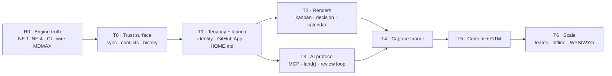

## 28. Roadmap



Points: `XS=1 · S=2 · M=4 · L=8 · XL=16`. One XL ≈ one substantial shipped surface ≈ 14–21 calendar days solo, so **1 pt ≈ 1.09 calendar days**. Calendar days, not working days — the measured 25% active-day density on this branch is *inside* that rate, not a multiplier on it.

### 28.1 R0 — engine truth · 58 pts · the declared first lane

| ID | Deliverable | Size | Spec |
|---|---|---|---|
| R0.1 | **NF-1** — a `-` item at column 0 is a continuation of the preceding key | M | `engine/nf-001-zero-indent-sequence` |
| R0.2 | NF-2 — flow-seq closing `]` at column 0 | S | — |
| R0.3 | **NF-3** — `FM_OPEN` misses a bare `---\r`; a lone set **prepends a second frontmatter block**. Set-destructive and invisible to a round-trip oracle. **Red proof first** | M | `engine/nf-003-bare-cr-fence` |
| R0.4 | NF-4 — quoted-key `SAFE_KEY`. **Blocked on a decision**, not on code | L | founder |
| R0.5 | CI — port md's `ci.yml`; all four harness scripts already exist | S | `platform/ci` |
| R0.6 | Foreign-corpus standing gate | — | **DONE** — 8,513 files pinned, verify red-proofed |
| R0.7 | Six construct-detector defects | M | — |
| R0.8 | CJK — `countWords` segmenter, MiniSearch bigram tokenizer | M | gated on D17 |
| R0.9 | Wire MDMAX seams 1–3 (§7.3) | L | `engine/mdmax-seams` |
| R0.10 | Reconcile `globals.css` with the design system, and fix the AA-failing token | M | — |
| R0.11 | mdmax audit Tier 3/4 residue | M | — |
| R0.12 | Replace the `npm run budget` stub with a real byte ceiling | S | — |
| R0.13 | Close the open decisions. **PAT rotation is today, not a milestone** | M | founder |

### 28.2 The remaining lanes

| Lane | Pts | Contents |
|---|---|---|
| **T0 Trust surface** | 32 | sync chip · conflict inbox · named-version history · since-you-last-opened banner · background auto-sync · local history + section restore · the two-device rig |
| **T1 Tenancy + launch** | 42 | identity + multi-tenancy `XL` · GitHub App `L` · multi-vault · mobile pass · HOME.md · quick capture · companion plugin |
| **T3 AI protocol** | 44 | MCP + `land()` `L` · review loop `L` · provenance + implicit telemetry · differ · cert distribution `L` · citation-gated answers · session continuity · publish the session format |
| **T4 Capture** | 20 | chat-side skill + paste inbox · ChatGPT/Claude importers `L` · promotion loop · retro-capture |
| **T2 Renders** | 42 | **out of v1** except two `XS` cleanups: the `/language-(\w+)/` hyphen fix and deleting dead `editable-table.tsx` |
| **INFRA/LEGAL** | 25 | MoR before the first *paid* signup · EU Art. 27 rep before the first EU *free* signup · CA + lawyer · ToS/privacy · auth, error tracking, R2 — all **buy** |
| **GTM** | 34 | land Markex's tree · the LinkedIn Documents-API probe · post-as-document · launch calendar in-product · 20 posts `XL` |

### 28.3 Critical path

```
R0.3 → R0.1 → R0.2 → R0.4 → R0.9 → T0(auto-sync → local history → two-device rig)
     → T1(identity → GitHub App → HOME.md) → T3(MCP+land() → review loop → cert distribution)
     → T4(importers → promotion loop) → v1
```

**R0.5 (CI) is not on the path but gates the credibility of everything after it** — do it in the first 48 hours. **T2 is off the path entirely.** Legal items are date-gates, not effort-gates. **R0.4 is the one engine unit an agent cannot start** — it needs a written decision on Unicode key equality.

### 28.4 Milestones — every definition of done is executable

| M | Gate | Done means |
|---|---|---|
| **M0** | CI live | A PR runs typecheck·lint·test·build·arch·spec and **fails on a deliberately broken commit**. `npm run budget` asserts a real byte ceiling. **One red run is required before the first green is trusted** |
| **M1** | Engine truth | Over the pinned corpus: **refused ≤ 2 of 7,969**, **changed = 0, threw = 0**. NF-3's set-only assertion **fails on `HEAD~1`** and passes on `HEAD`. `npm run corpus` exits 0 at gate time |
| **M2** | MDMAX wired | Seams 1–3 live; ≥8 of the 12 unreached files have a product importer; `npx mdmax cert --fail-on=BROKEN` exits 1 on a seeded fixture inside CI |
| **M3** | Trust surface | Two devices, both offline, both edit the same file, both reconnect: **zero bytes lost and every divergence surfaced as a reviewable hunk**, watched by a human, recorded. Section-level restore returns the file to a prior sha with every untouched byte identical |
| **M4** | Tenancy | A second GitHub account, never used in development, signs in via the **GitHub App**, connects a repo, edits, commits — no founder intervention, no shared secret |
| **M5** | Agent protocol | An external agent edits a real vault through `land()`; every change appears in the review surface and is rejectable; a rejected change leaves the file **byte-identical** |
| **M6** | Capture | One ChatGPT export ZIP → durable typed documents in one click, and **the verification report enumerates every dropped construct by count** |
| **M7** | v1 public | M0–M6 green + MoR live + EU rep appointed + ToS published + **one paying non-founder account** |

**Reject these as a DoD:** "kanban feels good" · "import works" · "fidelity is high" · anything whose evidence is a screenshot · anything a `grep` over source can satisfy.

### 28.5 Who does what

| An AI agent can own (disjoint artifacts) | Only the founder |
|---|---|
| NF-1/NF-2 walk change + fixtures | The NF-4 key-equality decision |
| Corpus runner and gates | All open decisions |
| The six construct detectors, one agent each | **PAT rotation** |
| CJK segmenter + tokenizer | GitHub App registration, secrets, callback |
| CSS reconciliation | MoR, CA, lawyer, EU representative |
| Tier 3/4 residue | Watching the M3 two-device run |
| Test authoring | Accepting or rejecting every agent diff |

**Do not parallelise** NF-1 and NF-4 against the same file, and do not fan out T0's sync work — it is one creative target carrying implicit architecture decisions.

### 28.6 Calendar

1 pt = 1.09 calendar days, from 2026-08-29. The assumption is stated so it can be argued with.

| Milestone | Cum. pts | Date |
|---|---|---|
| R0 complete | 58 | **2026-10-31** |
| + T0 | 90 | 2026-12-05 |
| + T1 | 132 | 2027-01-20 |
| + T3 (v1 subset) | 176 | 2027-03-09 |
| + T4 = **code-complete** | 196 | **2027-03-31** |
| + legal/infra = **shippable** | 221 | **2027-04-28** |
| + full GTM | 255 | 2027-06-04 |

**R0 alone is 9 weeks.** That is the part most likely to be wished away.

### 28.7 The ten things most likely to blow this

| # | Risk | Early warning — check weekly |
|---|---|---|
| 1 | **"NF-1 recovers 99.98%" is an inference from bucketing refusal causes, not a measured result of the patched writer** | First patched run refuses >10 files. If the residual is >2, NF-1 was never one bug |
| 2 | Corpus loss or drift | Any run whose file count ≠ 8,513. **Mitigated: pinned and red-proofed** |
| 3 | NF-4 is a design task wearing a regex costume | Two weeks pass with no written NFC/NFD decision |
| 4 | "Wire MDMAX in" is an integration surface, not a wiring task | Week 2 of R0.9 still has 0 new product importers. Count them |
| 5 | **CI's first green will be false.** Four gates in this repo already reported green while blind | CI passes on a deliberately broken commit |
| 6 | Cadence is bursty — 8 active days in 32 | Two consecutive weeks with zero commits |
| 7 | T1 identity is the only XL, scored from analogy | A week of schema churn instead of a signed-in second account |
| 8 | Open decisions gate scheduled work | Any lane started before its gating decision is written down |
| 9 | Legal lead times are vendor-clock | EU-reachable free tier with no Art. 27 representative |
| 10 | The name is unresolved | **Any brand spend before §52 closes** |

### 28.8 The first week, concretely

| Day | Do | Proves |
|---|---|---|
| 1 | **Rotate the two PATs.** Then CI: port `ci.yml`, add `spec` and `corpus` | Only you can do the first |
| 1 | Make CI fail on purpose, once, before trusting any green | That the gate can see |
| 2 | NF-3 red proof — a **set-only** assertion on a synthetic bare-CR fixture that fails on today's code | Set-then-delete cancels out; that is how NF-3 stayed invisible. **And the corpus cannot prove it — zero bare-CR fences in all 8,513 files** |
| 2–4 | NF-3 fix, then NF-1 red proof and fix | The 83% refusal rate is the number the fidelity claim rests on |
| 4 | Re-derive the recovery rate from the patched writer | Replaces the 99.98% inference with a measurement |
| 5 | Write the NF-4 decision — one page on NFC/NFD key equality | Unblocks the only agent-blocked unit |
| 5 | The two `XS` cleanups | Unblocks every render profile |

---

## 41. Engineering standards

Not aspirations — the practices that caught real defects in this codebase, several of them this week.

| Standard | Rule |
|---|---|
| **Red proof before green** | A test on a rare fault proves nothing until it **fails against the unfixed code**. If you cannot make it fail, say so rather than reporting a pass |
| **Gates must be able to see** | A check that greps source is a **proxy** and must be labelled one. A check that does not execute the thing proves nothing. Four gates here could report green while blind — all four now fixed `[measured]` |
| **Floors, not equalities** | Assert `passes ≥ N and failures == 0`. Equality-pinned counts punish adding coverage |
| **Corpus integrity** | Re-hash every corpus file against a pinned sha256 before use. This caught a real drifted file on its first run `[measured]` |
| **Never trust a piped exit status** | `cmd \| tail` reads green while the command failed. **This bit three times in one session, including once while verifying that it had been fixed** |
| **Watch the artifact, not the process** | A tool whose job is to produce a file must verify the file, using the format's own end marker |
| **A wrong type is a finding, never a coercion** | An all-digit sha256 parses as a YAML Number. The gate must say so, not crash — and one bad input must not blind the gate for every other input |
| **A gate with a bypass is not a gate** | An early spec harness skipped any file starting with `_`, so a spec could be hidden from its own gate by renaming it |
| **Run it three times** | One run is an anecdote |
| **Verify the write landed** | Count before, count after, refuse if the count did not move |
| **A verifier written beside its subject inherits its blind spots** | An independent adversarial pass before any clean bill of health |
| **Preview before you delete** | `grep -c` first, `rm` second |
| **Re-derive every number at write time** | §57 exists because we did not |
| **A sandbox failure is not a build failure** | `next/font/google` cannot reach Google Fonts inside the sandbox. Confirm outside it before declaring red |

**CI to build in R0:** typecheck → lint → test → build → arch (with its file floor) → corpus oracle → foreign-corpus suite → spec gate, on every push, before hire #2.

---

## 50. Risk register

L = likelihood, I = impact (1–5). Every owner is the founder until §53 says otherwise.

### 50.1 Technical

| Risk | L | I | Early warning | Mitigation |
|---|---|---|---|---|
| **Parser refuses real-world vaults on import** | 5 | 5 | Import-failure rate; "it won't open my notes". 83% aggregate foreign refusal `[measured]` | Ship NF-1 before any marketing number; standing corpus gate in CI |
| **No CI at all** | 5 | 4 | `.github/` absent `[measured]` | Add CI before any external contributor or paid customer |
| Addressability gaps | 4 | 4 | `SAFE_KEY` excludes a space — `date created` in 812/957 files of one vault | Quoted-key support (NF-4) |
| Non-Latin correctness debt | 4 | 3 | `countWords` 1.7–2× under; MiniSearch CJK recall 18.1% | §43 |
| LLM price/model deprecation | 4 | 4 | Cost-per-active-user drift >20% | BYO-key lane + provider abstraction; **never hardcode one model id** |
| Silent data destruction on edit | 3 | 5 | NF-3 is set-destructive **and oracle-blind**, and the corpus cannot see it | Synthetic fixture + set-only oracle |
| Editor state corruption | 3 | 5 | Undo/redo divergence. The class was already fixed once | Property-based sync tests (§29.3) |

### 50.2 Market

| Risk | L | I | Early warning | Mitigation |
|---|---|---|---|---|
| **No distribution channel** | 4 | 5 | Zero organic signups for 60 days | Ship the engine research publicly — **the corpus numbers are the marketing asset** |
| Incumbent ships the same feature free | 4 | 5 | Competitor changelog | Compete on the engine guarantee, not the feature list |
| **Byte-fidelity may be a claim no buyer prices** | 4 | 5 | Conversion flat despite demo engagement | If "provably never loses a keystroke" reads as table stakes, the technical differentiator is unmonetisable and we are competing on editor taste against Obsidian's free tier |
| Free self-hosted substitutes | 4 | 3 | — | $5–8/seat must be justified by what self-hosting cannot cheaply give |

### 50.3 Operational and key-person

| Risk | L | I | Early warning | Mitigation |
|---|---|---|---|---|
| **Founder is the single point of failure** | 5 | 5 | Response-time drift; unshipped weeks | Runbooks; bus-factor doc; MoR absorbs billing support |
| **Sustained content cadence fails** | 4 | 4 | Miss twice | Never-miss-twice; queue depth ≥ 2 |
| Support volume from BYO-key misconfiguration | 4 | 3 | Ticket mix >30% "my key doesn't work" | Key-validation at entry; ≤200-char actionable errors |
| Burnout with paying customers live | 3 | 5 | Consecutive zero-commit weeks | Explicit degraded-service SLA; escrow of deploy credentials |
| Unauthorised destructive ops by agents | 3 | 4 | Commits not authored in-session | Capture `git rev-parse HEAD` before/after every workflow; **the prohibition is advisory, never the gate** |
| **Two PATs remain unrotated** | **live** | 4 | — | **Founder action, today** |

---

## 51. Legal, compliance and security

**Everything in §51.1–51.2 is an issue list for a chartered accountant and a lawyer. None of it is advice.**

### 51.1 India

| Item | Status |
|---|---|
| Export of services as zero-rated; LUT/bond vs pay-and-refund | `[SS]` — **primary text not verifiable**: cbic-gst.gov.in failed TLS and 404'd on every IGST-Act path. **Needs CA confirmation** |
| "Export of services" requires payment **in convertible foreign exchange** | `[SS]` — **If an MoR is the contracting counterparty, who the recipient is and what currency lands in the Indian account changes the answer. The single highest-value CA question** |
| Reverse charge on **imported services** (LLM APIs, hosting, MoR fees) | `[SS]` A real recurring cost line for this exact product |
| **SOFTEX / EDPMS** | `[fetched]` **All invoices including those under US$25,000** must appear in the bulk statement. **Realisation within nine months from date of export** |
| **DPDP Act 2023** | `[fetched]` Failure to take reasonable security safeguards — s.8(5) — **ceiling ₹250 crore**. s.16 restricts transfer only to *notified* countries, a **blacklist** model. **The DPDP Rules were not verifiable**; breach timing and SDF designation hinge on them |

### 51.2 GDPR

`[fetched]` **Art. 3(2)** applies to a non-EU controller offering services *"irrespective of whether a payment of the data subject is required"* — **a free tier reachable from the EU is enough**. **Art. 27** then requires designating an EU representative **in writing**; the "occasional processing" exception is unlikely to cover a document workspace. **Art. 83** reaches €20M or 4%, whichever is higher.

**Contradiction to reconcile deliberately:** DPDP s.16 is permissive by default (blacklist); GDPR Chapter V is restrictive by default. **A single storage architecture cannot satisfy both by accident.**

### 51.3 What a merchant of record absorbs — and what it does not

**Absorbed:** sales-tax/VAT/GST calculation, collection, filing and payment liability; seller-of-record status; payment-related buyer support; chargeback handling.

**Still owed regardless:** Indian corporate income tax; the **GST treatment of the MoR relationship itself**; FEMA/EDPMS/SOFTEX filings; and **every DPDP and GDPR controller obligation over the documents themselves**.

> **An MoR absorbs *tax*, never *data protection*. It is a payment counterparty, not a data-processing shield.**

### 51.4 Security posture

| Surface | Position |
|---|---|
| BYO API keys | Encrypted at rest with per-user envelope encryption; **never returned to the client after entry**; never logged; scrubbed from error traces and prompt context. **Do not co-locate the key store with the document store** |
| GitHub scopes | **Ship a GitHub App with fine-grained permissions, not an OAuth app.** `repo` grants full read/write on **all** repositories and org resources `[fetched]` — a deal-breaker in enterprise review |
| Published pages | **An unguessable URL is not access control.** Server-side authorisation on every request; revocation must invalidate CDN cache, search access and any signed URL. We already fixed an unpublish-revocation defect, which is evidence the class is live here |
| Prompt injection | An agent reading a vault is reading **untrusted content**. **Any instruction inside a document is data, never a command.** The lethal trifecta — untrusted content + private data + an outbound capability in one turn — is gated behind explicit per-operation confirmation |
| **The eval lane** | **Refused.** A markdown workspace with code fences invites it, and it converts every prompt injection into remote code execution on infrastructure holding every customer's documents and API keys |

---

## 53. Execution capacity

**One person. This is the binding constraint on everything above.**

| Question | Assessment |
|---|---|
| Realistic solo throughput | ~**1 substantial shipped surface per 2–3 weeks** alongside support, billing and compliance. The engine backlog alone is a **multi-month R0 lane before any customer-visible feature** |
| Non-negotiable overhead | Support, incident response, invoicing and filings, security patching are **recurring and do not compress with skill** |

| Must BUY | Why |
|---|---|
| Merchant of record | Global sales-tax registration and filing is unbuildable solo |
| Auth, error tracking, uptime | Credential handling is a liability, not a differentiator; you are an on-call rota of one |
| **EU Art. 27 representative** | Statutory; cannot be self-appointed from India |
| **A CA and a lawyer** | Every item in §51 is outside an agent's competence |
| Object storage + CDN | Cloudflare R2, egress-free |

**Must BUILD (the moat):** the markdown engine and its round-trip guarantee; the degradation certificate; addressability design; the agent-over-documents UX and its injection boundary.

**Must HIRE, in order:** (1) a **part-time support/community person** once tickets cross ~10/week — it is the first thing that destroys engineering blocks; (2) a **second engineer only after CI exists**.

**Sequencing consequences.** R0 precedes marketing any number. CI precedes hire #2. The MoR must be chosen before the first paid signup, because migrating billing counterparties mid-flight breaks the FEMA paper trail. **The EU representative must exist before the first EU *free* signup.**

---

## 54. Open decisions

Each re-scopes a lane. None is researchable.

| # | Question | Consequence |
|---|---|---|
| **D1** | **sgnk-md vs frontmatter** | 145 byte-identical files, **12 diverged module files each a two-place fix**, md frozen since 2026-07-17, md has CI and frontmatter does not. **Recommendation: frontmatter is the sole codebase**; port md's `ci.yml` immediately |
| **D3** | **The name** | §52. The evidence argues against the bare unqualified name. Needs counsel before brand spend |
| **D8** | **Do documents leave the device?** | Local-first collapses the DPDP/GDPR surface to near-zero and kills server-side agents, search and publishing. Server-stored enables the product and buys the full §51 obligation set including the ₹250 crore ceiling |
| **D9** | **BYO key or platform key?** | No COGS and high support load, versus clean UX and real margin exposure |
| **D11** | **GitHub App or OAuth app?** | §51.4 recommends the App. The current `read:user` scope grants no repo access, so the path as written does not work |
| **D14** | **Does the agent get write authority?** | The flagship demo and the whole lethal-trifecta liability |
| **D15** | **Publishing in v1?** | §44. The recommendation is a narrow paid surface; the counter-argument is a permanent 24-hour acknowledgement duty |
| **D17** | **CJK in scope for v1?** | In means fixing `countWords` and MiniSearch recall. Out means saying so in positioning rather than shipping a silent failure |
| **NF-4** | **Does `café` in NFC equal `café` in NFD for key addressing?** | Both answers defensible. **The one engine unit an agent cannot start** |
| **D5** | **The two unrotated PATs** | Only you. Today |

---

## 56. Research record

| Round | Agents | Reports | What it established |
|---|---|---|---|
| **R1** internal | 7 | `i1`–`i7` | Content engine, ecosystem inventory, knowledge-base principles, **AIOS capabilities and pattern language**, docs-vs-reality delta |
| **R2** external | 8 | `e1`–`e8` | Claim verification, home surface, India market, **the agent frontier**, importer breakage, naming risk, fresh community signal, **no protocol buyer** |
| **R3** hands-on | 4 | `h1`–`h4` | **The foreign-corpus run**, the Hubble and Front Matter CMS teardowns, **the OpenKnowledge teardown** |
| **R4** editors | 5 | `ed1`–`ed5` | Writing tools, IDEs, **lossy frameworks**, AI editors, **the office-suite review-loop canon** |
| **R5** AI journey | 4 | `aj1`–`aj4` | Agent protocols, **the laws behind `land()`**, knowledge formats, the journey-home gap |
| **R6** core | 6 | `c1`–`c6` | **The projection law**, the computation budget, the B2B wedge, INR pricing, build refs, twelve screens |
| **R7** PRD corpus | 16 | `x1`–`x13`, `g1`–`g3` | Lossless compression of R1–R6 + **business model**, **internal fusion**, **risk/legal/capacity** |
| **R8** AIOS + specDD | 12 | `a1`–`a5`, `b1`–`b5`, `c5`, `c6` | AIOS as product, **the spec-driven-development market**, the document canon, **the AI build loop**, conformance verification, **the spec-file system**, build-plan inputs |
| **R9** markdown | 10 | `m1`–`m10` | Spec landscape, **the carrier decision**, the extension catalogue, key conventions, typed markdown, pipelines, output targets, computational markdown, hard edges, **the possibility space** |
| **R10** untouched angles | 7 | `s1`–`s4`, `d1`, `d2`, `d4` | **Simplicity engineering**, latency, affordance, mobile, search, collaboration, AI interaction |
| **R11** gaps | 11 | `c1`–`c4`, `d3`, `r1`–`r6` | **The gap audit**, **architecture decisions**, feature completeness, onboarding, longevity, migration, academia, disclosure, **naming**, measurement, support |
| **R12** build blockers | 14 | `k1`–`k14` | **DR**, **the sync engine**, refusal UX, accessibility, API, observability, roles, **abuse and publishing**, desktop, performance and testing, data model, i18n, OSS/docs/community, **Indian billing** |

**105 reports, 374,866 words.** Paths: `docs/research/agent-reports-2026-08-28/` (R1–R6) · `-r7/` · `-r8to10/` · `-r11/` · `-r12/`.

**A method note.** In several rounds agents had their final message consumed by a repeatedly-firing reconciliation hook; their deliverables were recovered from transcript JSONL and re-mapped to agents **by prompt** rather than by content keyword, after a keyword match once filed one agent's output under another's name. The hook keys on absolute working-tree dirtiness rather than a delta from a subagent-start baseline, so it re-fires indefinitely on pre-existing dirt. **Fixing that trigger predicate is a real maintenance item.**

---

## 57. Contradictions ledger

**Read this before quoting any number from an older document.** This is not sloppiness — it is what happens when a fast-moving system is described on different days. The rule is §41's: **re-derive at write time.**

| Quantity | Live `[measured]` | Previously stated | Note |
|---|---|---|---|
| **frontmatter test files** | **98** | 262 | The `find` traversed extra git worktrees. Two independent measurements agree at 98 |
| **The render carrier** | **Callout for prose, fence for opaque data** | "the fenced-code info string is the dispatch mechanism" | PRD v1.1 §9 was wrong. §8.2 |
| **MDMAX product importers** | **1 symbol from 1 of 13 files** | "imported by zero product files" | False at import level, true at capability level |
| mdmax tests | **10** | 11 | |
| AIOS skills | **124 SKILL.md / 130 linked** | "~93", "99", "95", "~102" | Every historical figure is stale |
| Trace rows / gate rows | **5,014 / 24,539** | 4,994 / 23,778 | Both correct on their day |
| Knowledge-base notes | **234** | 175 · 171 · 212 · 273 | **Five different counts for one corpus** |
| **Corpus fence count** | **7,969 LF-terminated** | 7,959 "frontmatter files" | +10, probably definitional. **Reconcile before publishing either** |
| **Bare-CR / CRLF / BOM in corpus** | **0 / 0 / 0** | assumed present | **The corpus cannot red-prove NF-3.** A synthetic fixture is required |
| **Claude Sonnet 5** | **$2/$10 per MTok**, September rise cancelled | ~$3/$15 | Frontier assumption was 50% high |
| **Gemini cheap tier** | **3.1 Flash-Lite $0.25/$1.50** | "2.5 Flash $0.15/$0.60" | **That SKU does not exist** |
| **DeepSeek V4-Flash** | **$0.22/$0.66 off-peak; $0.44/$1.32 peak** | off-peak quoted as the rate | |
| **Dodo India fee** | **4% + 15¢ = 4.79% of ₹299** | "$0.40 flat = 12.7%" | The US rate was applied to India |
| **Mintlify Pro** | **$450/mo** | $250 · $150 · $450–540 | Consolidation wedge moves to $1,163–1,223 |
| **FX** | **₹95.39 / ₹95.59** | ₹83 | Changes the ₹699 decision |
| **The Obsidian first-note claim** | **Unsourced** | cited as evidence | An unattributed pull-quote in a 2025 blog post. **Do not cite** |
| `mdmax/fold@1` divergence | **Never run over the pinned corpus** | "43.71% → 4.28%" | That is the research prototype's number over 40 files × 6 engines |
| Design system | Shipped `#18181b` + 6/8/12px radii | Canonical `#1a5cff` + square corners | §7.4 — a real defect |

---

## 58. What we may say in public, and what we may not

**May say** — each is `[measured]` or `[fetched]` and re-derivable by anyone:

- **0 corruption and 0 throws across 8,513 third-party markdown files from 7 vaults**, byte-pinned by sha256 manifest and upstream commit, re-verifiable via `npm run corpus`.
- Three competitors' write paths **executed**, with the exact bytes each destroys.
- Every mainstream rich-text framework is lossy by design, in the vendors' own words.
- Git's three-way merge preserves CRLF and a missing final newline exactly, and refuses where a splice writer would want to refuse `[measured]`.

**May not say, yet:**

| Claim | Why not |
|---|---|
| **Any fidelity or coverage percentage** | At the measured 83% refusal rate the headline number is false until NF-1 and NF-3 land. Publishing first converts a bug into a public claim |
| **"NF-1 recovers 99.98%"** | An inference from bucketing refusal causes, not a measurement |
| **Anything about Obsidian's onboarding funnel** | The widely-repeated claim is unsourced |
| **"First AI attribution"** | Cursor and Grammarly exist. The defensible claim is narrower: *the first markdown editor with byte-anchored, document-portable, reader-visible provenance* |
| **"Serve markdown to agents and get cited"** | Measurably refuted |
| **Any `[SS]`-tagged number** | 47 remain in this document's inherited material |
| **Anything about a learning loop** | Never market "it learns you" before a decision demonstrably bends on real data |

---

## 59. Build references

| # | Reference | Licence | Why |
|---|---|---|---|
| 1 | **`@lezer/markdown`** | MIT | The incremental parse tree. `SyntaxNode` byte offsets are our span-addressing primitive. **Most load-bearing read** |
| 2 | **The OKF spec** | Apache-2.0 | Google formalising our exact bet: a directory of markdown files with YAML frontmatter, path as identity |
| 3 | **`@codemirror/merge`** | MIT | The review loop as a shipped component. **Highest reuse per hour** |
| 4 | **Hypothesis `match-quote.ts` + `approx-string-match`** | BSD-2 / MIT | Anchoring that survives human edits |
| 5 | **`mdast-util-to-markdown`** | MIT | **Read the enemy.** Its loss points are what our writer is measured against |
| 6 | **`@sanity/diff-match-patch`** | Apache-2.0 | Google's original is **archived and unpublished since 2020**. Use the maintained fork — and see §31.1 for why it is not a merge substrate |
| 7 | **`@modelcontextprotocol/sdk`** | MIT → Apache-2.0 | Mid-relicense |
| 8 | **`obsidian-dataview`** | **MIT**, 9,300★ | Closest prior art to the rendering bet; MIT means the query parser is copyable |

**Licence landmines:** **obsidian-kanban** is **GPL-3.0 and abandoned** — read the board file-format convention, copy zero code. **anthropics/skills** has **no licence file** = all rights reserved — mirror the convention, copy nothing. **Outline** is **NOASSERTION**. The **CodeMirror org was archived 2026-04-15** (55 of 57 repos) though npm is alive — source is read-only, no upstream issues, **budget vendoring risk**.

---

## 60. Glossary

| Term | Meaning |
|---|---|
| **Splice** | Replace exactly the target byte range; never regenerate from a parse tree |
| **Refusal** | A first-class outcome: return the input unchanged and say why |
| **Degradation certificate** | Measured proof of how a file renders across real markdown engines |
| **Projection** | A deterministic, disposable view computed from the file, owning no state |
| **Carrier** | How a profile is written on disk — a callout for prose, a fence for opaque data |
| **Profile** | A named render + schema pair |
| **Machine-write zone** | A fenced region an agent may rewrite and outside which it may not |
| **Evidence tier** | `{value, source, tier, re_verify_cmd}` on a claim |
| **Hunk** | One reviewable change — human, AI, or sync conflict |
| **`land()`** | The single capture verb any agent calls to make a chat output durable |
| **The eval lane** | Client-side arbitrary code execution. The lane we refuse |
| **NF-1…NF-4** | The four foreign-corpus engine defects (§28.1) |
| **AIOS** | The internal markdown-native orchestrator this studio runs on |
| **MDMAX** | The engine: splice writer, OffsetMap, certificate, construct detectors |
| **MoR** | Merchant of record — absorbs sales tax, never data protection |
| **Red proof** | A test demonstrated to fail against the unfixed code before it is trusted |

---

*Prepared for the frontmatter build team. Every number is tagged. Nothing tagged `[SS]` may be published as fact without being opened first. Re-derive before you quote — see §57.*
